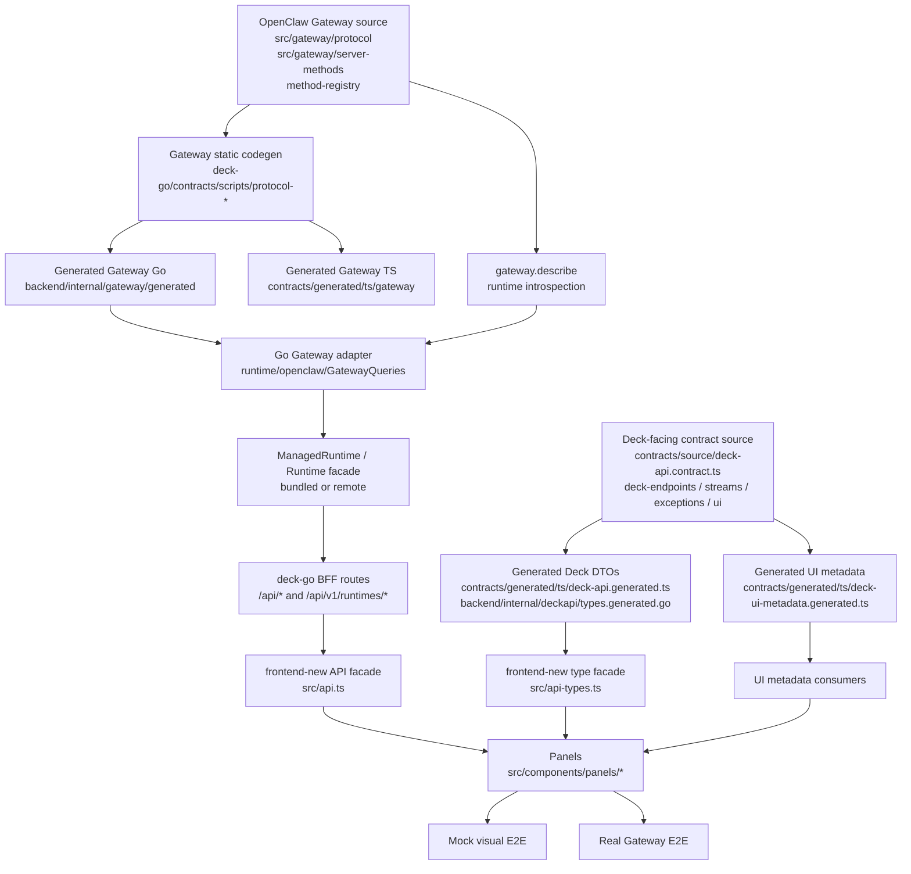
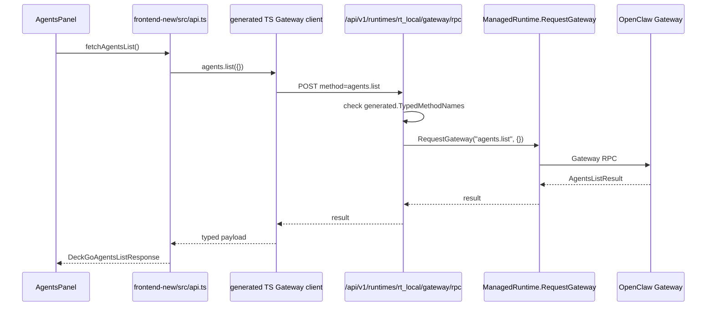

# deck-go 契约链条导读

> [!important] 代码真相优先
> 这份文档是给人读的地图，不是最终真相。只要它和源码、契约源文件、生成产物、测试结果冲突，一切以代码和验证结果为准。发现漂移时，先修源头，再更新文档。

## 先记住一句话

deck-go 是 OpenClaw Gateway 的 control 端。它不是普通的前端页面拼接口，而是把 Gateway 的协议能力整理成一条可审计的链：

```text
Gateway 协议源头
  -> deck-go 生成 Gateway TS/Go 绑定
  -> Go 后端用 runtime adapter / BFF 路由适配
  -> deck-go 自己定义浏览器可见 DTO / Endpoint / Stream / UI metadata
  -> frontend-new 通过 api-types.ts / api.ts 消费
  -> 面板 UI + mock E2E + real E2E 验证
```

如果某个页面效果很好，但链条上没有对应契约或真实 Gateway 能力，它仍然只是原型想法；如果链条完整，即使 UI 还粗糙，它也已经有可继续打磨的工程基础。

## 读这份文档的方式

> [!summary] 建议阅读顺序
> 先读 [[#1 Gateway 是源头]]，再读 [[#2 deck-go 为什么还要再做一层契约]]，最后读 [[#5 如何审计一个模块能力]]。不要一开始就跳到前端组件，否则很容易把“页面想展示什么”和“系统真实支持什么”混在一起。

这份文档尽量把你当成刚接触这个项目的程序员来讲。你只需要先理解三个问题：

1. Gateway 到底提供了什么协议/API。
2. deck-go 后端如何把 Gateway 能力变成浏览器能安全使用的能力。
3. frontend-new 页面应该看哪些文件，才能避免写出只在 mock 里成立的 UI。

## 0. 术语表

| 词                 | 在本项目里的意思                                                                     | 典型文件                                                                      |
| ------------------ | ------------------------------------------------------------------------------------ | ----------------------------------------------------------------------------- |
| Gateway            | OpenClaw 的核心控制平面，负责 WebSocket RPC、事件、agent/session/channel/node 等能力 | `src/gateway/`                                                                |
| Protocol           | Gateway WebSocket 帧格式、方法名、参数、结果、事件载荷等规则                         | `docs/gateway/protocol.md`, `src/gateway/protocol/`                           |
| API                | 某一层对外提供的调用入口。Gateway 有 RPC API，deck-go 有 REST/SSE BFF API            | `src/gateway/server-methods/`, `deck-go/backend/internal/server/`             |
| Schema             | 对数据形状的机器可读定义。Gateway 主要用 TypeBox schema                              | `src/gateway/protocol/schema/`, `src/gateway/server-methods/*`                |
| DTO                | Data Transfer Object，前后端传输的数据结构                                           | `deck-go/contracts/source/deck-api.contract.ts`                               |
| Generated artifact | 从契约源文件生成的代码，不能手改                                                     | `deck-go/contracts/generated/`, `deck-go/backend/internal/gateway/generated/` |
| Adapter            | 把一层的数据/协议适配到另一层的代码                                                  | `deck-go/backend/internal/runtime/openclaw/`                                  |
| BFF                | Backend For Frontend，专门给前端使用的后端边界                                       | `deck-go/backend/internal/server/`, `deck-go/backend/internal/api/http/`      |
| Facade             | 前端统一 API 包装层，隐藏 endpoint 字符串和传输细节                                  | `deck-go/frontend-new/src/api.ts`, `deck-go/frontend-new/src/api-types.ts`    |
| Mock E2E           | 用 mock Gateway 验证页面视觉、交互、空态、错误态                                     | `deck-go/test/e2e/*-visual.spec.ts`                                           |
| Real E2E           | 用真实 Gateway 验证能力链是否真的工作                                                | `deck-go/test/e2e/*-real-gateway.spec.ts`                                     |

## 1. Gateway 是源头

### 1.1 Gateway 的协议形状

Gateway 的核心传输是 WebSocket。文档里把三种帧讲得很清楚：

```text
Request:  { type: "req", id, method, params }
Response: { type: "res", id, ok, payload | error }
Event:    { type: "event", event, payload, seq?, stateVersion? }
```

入口文档：

- `docs/gateway/protocol.md`
- `docs/concepts/architecture.md`
- `src/gateway/protocol/AGENTS.md`

这意味着 Gateway 的“API”不是 REST 路由，而是 RPC 方法名，例如：

- `agents.list`
- `sessions.send`
- `gateway.describe`
- `deck.routing.list`
- `usage.cost`

### 1.2 Gateway 如何知道有哪些方法

Gateway 的方法元数据由 method registry 管理。关键类型在 `src/gateway/method-registry.ts`：

```ts
export interface MethodDefinition {
  handler: GatewayRequestHandler;
  params?: TSchema;
  result?: TSchema;
  scope: OperatorScope | "node" | "public";
  since?: number;
  bffEligible?: boolean;
  controlPlaneWrite?: boolean;
}
```

对初学者来说，先抓住四个字段：

| 字段      | 说明                                        |
| --------- | ------------------------------------------- |
| `handler` | 真正执行方法的函数                          |
| `params`  | 请求参数 schema；没有就说明参数未完整类型化 |
| `result`  | 返回结果 schema；没有就说明结果未完整类型化 |
| `scope`   | 调这个方法需要什么权限                      |

Gateway 判断一个方法是否“typed”的规则很直接：只要有 `params` 或 `result` schema，就会进入 typed 集合；两者都没有，就进入 `untyped` 集合。

### 1.3 `gateway.describe` 是运行时自描述

`gateway.describe` 是 Gateway 自己暴露的 introspection RPC。它返回：

- `protocol`
- `schemaVersion`
- `methods`
- `events`
- `untyped`

源头在 `src/gateway/server-methods/describe.ts`。deck-go 可以用它知道当前 Gateway 运行时真实暴露了哪些 typed/untyped 方法。

> [!note] 静态生成和运行时 describe 是两类证据
> 静态生成产物告诉我们“源码里应该有哪些协议类型”；`gateway.describe` 告诉我们“当前跑起来的 Gateway 真的暴露了什么”。real E2E 需要关注后者，契约生成需要关注前者。

## 2. deck-go 为什么还要再做一层契约

Gateway 是底层事实来源，但 deck-go 是企业 control 端。control 端不应该把底层 RPC 原封不动全部丢给页面，因为页面需要：

- 更适合人操作的 DTO。
- 更安全的写操作边界。
- 统一的错误、鉴权、runtime mode、SSE、空态、刷新策略。
- 能解释哪些能力是 Gateway 原生支持，哪些是 deck-go 派生或本地增值。

所以 deck-go 有两条互相配合的契约链：

1. **Gateway 协议链**：从 OpenClaw Gateway schema/method metadata 生成 TS/Go Gateway typed client。
2. **Deck-facing 契约链**：deck-go 自己定义浏览器可见 DTO、endpoint 分类、stream 事件、UI metadata、异常清单。

## 3. 总架构图



读图时不要把箭头理解成“所有请求都按一条线跑”。它表达的是权威关系：

- Gateway schema/method metadata 是 Gateway 协议权威。
- `contracts/source/*` 是 deck-go 浏览器边界权威。
- generated 文件是输出，不是修改入口。
- `frontend-new/src/api.ts` 是页面消费入口，不是数据结构权威。

## 4. 契约类型

### 4.1 Gateway method / event contract

这是最底层的 Gateway API 真相。

| 内容              | 源头                                                                  | 生成产物                                                                                                    | 说明                                        |
| ----------------- | --------------------------------------------------------------------- | ----------------------------------------------------------------------------------------------------------- | ------------------------------------------- |
| 方法参数/结果     | `src/gateway/server-methods/*`, `src/gateway/method-registry-data.ts` | `deck-go/contracts/generated/ts/gateway/protocol.ts`, `deck-go/backend/internal/gateway/generated/types.go` | 例如 `agents.list` 的 params/result         |
| Gateway TS client | 同上                                                                  | `deck-go/contracts/generated/ts/gateway/client.ts`                                                          | 前端可用 `createGatewayClient`              |
| Gateway Go client | 同上                                                                  | `deck-go/backend/internal/gateway/generated/methods.go`                                                     | Go 后端用 `generated.TypedClient`           |
| 方法 allowlist    | 同上                                                                  | `deck-go/backend/internal/gateway/generated/allowlist.go`                                                   | BFF RPC/batch 会拒绝不在 typed 集合里的方法 |
| 事件 payload      | `src/gateway/method-registry-data.ts`                                 | `deck-go/backend/internal/gateway/generated/events.go`                                                      | SSE / WS 事件的底层类型                     |

关键命令：

```bash
cd deck-go
make protocol-update
make protocol-check
```

### 4.2 Deck-facing DTO contract

这是浏览器更常消费的数据结构。源头是：

```text
deck-go/contracts/source/deck-api.contract.ts
```

它生成：

```text
deck-go/contracts/generated/ts/deck-api.generated.ts
deck-go/backend/internal/deckapi/types.generated.go
```

例子：

- `DeckGoAgentsListResponse`
- `DeckGoAgentDetailResponse`
- `DeckGoBudgetRule`
- `DeckGoSessionDetailResponse`
- `DeckGoGatewayDescribeResponse`

> [!warning] frontend-new 不应该自己发明稳定 DTO
> `frontend-new/src/api-types.ts` 可以做 facade 和临时兼容，但新的稳定 `DeckGo*` 类型应该先进入 `contracts/source/deck-api.contract.ts`，再生成 TS/Go。

### 4.3 Browser endpoint classification

源头：

```text
deck-go/contracts/source/deck-endpoints.contract.json
```

它回答一个问题：浏览器看到的 endpoint 到底属于哪类？

| 分类                       | 含义                                                | 示例                                       |
| -------------------------- | --------------------------------------------------- | ------------------------------------------ |
| `gateway-protocol-adapter` | 这个 endpoint 是 Gateway typed RPC 的适配层         | `/api/v1/runtimes/{runtimeId}/gateway/rpc` |
| `deck-go-bff`              | 这个 endpoint 是 deck-go 自己为前端设计的 BFF route | `/api/usage/budget`                        |
| `stream-binary-upload`     | SSE、上传、下载、iframe、二进制等非普通 JSON DTO    | `/api/stream`, `/api/logs/stream`          |
| `documented-exception`     | 已知动态或暂时例外，需要有原因和退出条件            | 见 exceptions                              |

### 4.4 Dynamic / untyped exception contract

源头：

```text
deck-go/contracts/source/deck-exceptions.contract.json
deck-go/docs/gateway-untyped-exceptions.md
```

当前有 8 个 Gateway 上游缺 schema 的方法，Go 代码里必须带 inline allow marker，registry 里也必须有记录：

| Method                 | 原因摘要                                   |
| ---------------------- | ------------------------------------------ |
| `tools.catalog`        | 工具目录结果仍缺上游 result schema         |
| `tools.effective`      | effective tools 结果仍缺上游 result schema |
| `exec.approval.list`   | approval list payload 还未类型化           |
| `plugin.approval.list` | plugin approval list payload 还未类型化    |
| `logs.tail`            | 日志 tail 结果仍是动态结构                 |
| `commands.list`        | 命令发现结果仍是动态结构                   |
| `node.invoke`          | node action payload/result 动态            |
| `node.pending.enqueue` | node pending work payload/result 动态      |

这些不是“随便写 any”的许可证。它们是债务清单，每条都要有 owner、reason、exit criteria。

### 4.5 Stream contract

源头：

```text
deck-go/contracts/source/deck-streams.contract.json
deck-go/docs/deck-stream-contract.md
```

目前主要有两类 SSE：

| Endpoint               | 类型     | 说明                                               |
| ---------------------- | -------- | -------------------------------------------------- |
| `GET /api/stream`      | 主事件流 | session、activity、agent status、runtime status 等 |
| `GET /api/logs/stream` | 日志流   | `log.batch` / `log.reset`，仍有动态叶子            |

前端消费入口：

```text
deck-go/frontend-new/src/api.ts
streamEvents()
streamLogEvents()
```

### 4.6 UI metadata contract

源头：

```text
deck-go/contracts/source/deck-ui.contract.json
```

它生成：

```text
deck-go/contracts/generated/ts/deck-ui-metadata.generated.ts
deck-go/docs/deck-ui-contract-metadata.md
```

它不是视觉稿，而是 UI 和契约之间的桥，例如：

- domain 属于哪个产品区域。
- 这个 domain 覆盖哪些 DTO、endpoint、action。
- 空态怎么解释。
- 刷新策略是什么。
- 字段语义是 status、secret、duration、url 还是 identifier。

## 5. 数据流例子

### 5.1 typed Gateway 直通适配：Agents list



这个例子里，底层事实是 Gateway 的 `agents.list`。前端不直接拼 `fetch("/api/v1/...")`，而是走 `createDeckGatewayClient()`。

关键文件：

- `deck-go/frontend-new/src/api.ts`
- `deck-go/frontend-new/src/lib/gateway-client.ts`
- `deck-go/backend/internal/api/http/runtimes.go`
- `deck-go/backend/internal/runtime/openclaw/managed_runtime.go`
- `deck-go/backend/internal/gateway/generated/methods.go`

### 5.2 Deck-shaped BFF：Agent detail / agent 配置动作

Agents list 可以比较直接地用 Gateway typed RPC，但 agent detail、skills、subagents、event streams、file preview 等更像 control 产品视图。它们会走 deck-go BFF：

```text
Panel
  -> frontend-new/src/api.ts
  -> /api/deck/agents
  -> backend/internal/server/inventory.go
  -> ManagedRuntime / GatewayQueries
  -> Gateway typed methods such as deck.agents.detail
  -> DeckGoAgentDetailResponse
```

这里 deck-go 可以聚合、清洗、补字段、处理空态，而不是把 Gateway 内部结构暴露给页面。

### 5.3 deck-local + deck-derived：Budget

Budget 是很好的例子，因为它不是纯 Gateway 能力。

```mermaid
flowchart LR
    A[Budget rules<br/>deck-go localstore] --> C[Budget evaluation]
    B[Gateway usage.cost] --> C
    C --> D[/api/usage/budget/evaluate]
    D --> E[BudgetPanel]
```

规则本身由 deck-go 本地保存，属于 `deck-local`；评估时读取 Gateway 的 usage 成本数据，属于 `deck-derived`。所以产品设计时不能说“Gateway 原生支持预算规则”，更准确的说法是：

> deck-go 在本地维护预算规则，并用 Gateway usage 数据计算状态。

### 5.4 deck-derived：Activity / Monitor

Activity 和 monitor 数据主要来自 deck-go 的 event bus / projection：

```text
Gateway/runtime events
  -> deck-go events.Bus
  -> runtime/projection
  -> /api/activity, /api/monitor/runs, /api/monitor/stats
  -> Activity / Gateway / Usage panels
```

这类能力是 `deck-derived`：不是 Gateway 单个 RPC 直接返回一个完整页面，而是 deck-go 根据 Gateway/runtime 事件整理出来的 control-plane 视图。

### 5.5 documented exception：Logs tail

`logs.tail` 当前缺上游 result schema，所以 Go 代码用 explicit untyped call：

```text
GatewayQueries.LogsTail()
  -> requester.Request(ctx, "logs.tail", params)
  -> gateway:allow-untyped marker
  -> exception registry record
```

这类能力可以被 UI 使用，但必须记住它不是完整 typed chain。要提升它，需要给 `logs.tail` 定义 upstream result schema，或定义清晰的 Deck-facing log DTO。

## 6. 能力分类

后续做 contract-chain audit matrix 时，每个模块能力都应该落到这四类之一：

| 分类                         | 判断标准                                          | 例子                                                        |
| ---------------------------- | ------------------------------------------------- | ----------------------------------------------------------- |
| `gateway-backed`             | Gateway 是事实或执行源头，有明确 RPC/schema/event | `agents.list`, `sessions.send`, `gateway.describe`          |
| `deck-derived`               | deck-go 从 Gateway/runtime/event 数据派生产品视图 | activity timeline, monitor stats                            |
| `deck-local`                 | 状态由 deck-go 自己保存或管理                     | budget rules, alerts, webhooks                              |
| `unsupported-needs-contract` | 原型想展示，但 Gateway/deck-go 契约还不能支撑     | 未定义的 webhook retry history、未定义的 node action schema |

> [!tip] 一个模块可以同时包含多类能力
> 例如 Budget：规则 CRUD 是 `deck-local`，evaluate 依赖 Gateway usage，是 `deck-derived`。不要强行把整个模块归成一类。

## 7. 前端开发时应该看哪些文件

### 7.1 正常做页面

优先看：

```text
deck-go/frontend-new/src/api-types.ts
deck-go/frontend-new/src/api.ts
deck-go/contracts/source/deck-ui.contract.json
deck-go/contracts/generated/ts/deck-ui-metadata.generated.ts
deck-go/frontend-new/src/components/panels/<module>/
```

原则：

- panel 组件不要散落 endpoint 字符串。
- panel 组件优先 import `api-types.ts` 暴露的 `DeckGo*` 类型。
- 真实请求优先封装在 `api.ts`。
- 如果需要新稳定字段，不要只改 mock；先检查 `deck-api.contract.ts` 是否需要新增/调整 DTO。

### 7.2 需要改契约

按源头改：

```text
deck-go/contracts/source/deck-api.contract.ts
deck-go/contracts/source/deck-endpoints.contract.json
deck-go/contracts/source/deck-streams.contract.json
deck-go/contracts/source/deck-exceptions.contract.json
deck-go/contracts/source/deck-ui.contract.json
```

然后运行对应生成/检查命令。不要手改 generated 文件。

### 7.3 需要确认 Gateway 是否真的支持

看：

```text
src/gateway/method-registry.ts
src/gateway/method-registry-data.ts
src/gateway/server-methods/
src/gateway/protocol/schema/
deck-go/contracts/generated/ts/gateway/protocol.ts
deck-go/backend/internal/gateway/generated/allowlist.go
deck-go/docs/gateway-untyped-exceptions.md
```

再用 real E2E 或 `gateway.describe` 确认运行时事实。

## 8. 如何审计一个模块能力

> [!question] 审计一个能力时问这 10 个问题
> 这 10 个问题比“页面上有没有按钮”更重要。只要有一个回答不清楚，就说明契约链还有洞。

| 问题                                            | 要找的证据                                                            |
| ----------------------------------------------- | --------------------------------------------------------------------- |
| 1. 这个能力的事实源头在哪里？                   | Gateway RPC/event、deck-go localstore、event projection、还是原型想法 |
| 2. 如果是 Gateway 能力，method/event 名是什么？ | `src/gateway/server-methods/*`, `gateway.describe`                    |
| 3. 这个 method/event typed 吗？                 | `params/result/payload` schema、generated allowlist                   |
| 4. Go 后端通过什么 adapter 调它？               | `GatewayQueries`, `ManagedRuntime`, `legacy_*`, `views/*`             |
| 5. 浏览器 endpoint 是什么？                     | `backend/internal/server/*`, `backend/internal/api/http/runtimes.go`  |
| 6. endpoint 是否已分类？                        | `contracts/source/deck-endpoints.contract.json`                       |
| 7. 响应 DTO 在哪里定义？                        | `contracts/source/deck-api.contract.ts`                               |
| 8. 前端 facade 是哪个函数？                     | `frontend-new/src/api.ts`                                             |
| 9. UI metadata 是否覆盖？                       | `contracts/source/deck-ui.contract.json`                              |
| 10. mock 和 real evidence 怎么证明？            | `test/e2e/*-visual.spec.ts`, `test/e2e/*-real-gateway.spec.ts`        |

建议 matrix 字段：

```text
module
capability
classification
gateway_or_deck_source
go_adapter
bff_endpoint
contract_source
generated_artifact
frontend_facade
panel_surface
mock_e2e
real_e2e
status
gap
follow_up
```

这个字段集已经进入 head OpenSpec 提案：

```text
openspec/changes/deck-go-contract-chain-audit-and-real-e2e-foundation/
```

## 9. 常见漂移

| 漂移                                 | 表现                                    | 正确处理                                 |
| ------------------------------------ | --------------------------------------- | ---------------------------------------- |
| Generated 文件被手改                 | 下一次生成覆盖，或者 contract-gate 失败 | 改 source contract 或 generator          |
| frontend mock 多了字段               | UI 看起来成立，真实 Gateway 没数据      | 追 `deck-api.contract.ts` 和 real E2E    |
| endpoint 没分类                      | 前端能请求，但治理不知道它属于哪类      | 补 `deck-endpoints.contract.json`        |
| Gateway method 缺 result schema      | Go/TS 无法强类型，容易 `any` 扩散       | 加 upstream schema 或登记 exception      |
| 文档说 frontend，代码用 frontend-new | 人按老入口读错                          | 更新导航文档                             |
| UI metadata stale                    | 字段、endpoint、action 指向不存在的东西 | 跑 `make ui-metadata-check`              |
| runtime describe 和静态生成不一致    | 代码以为可用，真实 Gateway 不暴露       | real E2E 记录 degraded / handoff-blocked |

## 10. 当前已确认的事实快照

> [!info] 这是 2026-05-04 的探索结论
> 这里只记录本次 explore 看到的事实。后续如果代码变化，以最新 contract inventory、generated artifacts、tests 为准。

- Gateway method registry 支持 `params`、`result`、`scope`、`bffEligible`、`controlPlaneWrite` 等元数据。
- `gateway.describe` 能返回 typed methods、events 和 untyped 方法列表。
- deck-go 从 `src/gateway/method-registry-data.ts` 生成 TS/Go Gateway artifacts。
- Go 后端的 typed Gateway client 在 `deck-go/backend/internal/gateway/generated/methods.go`。
- 前端 typed Gateway client 在 `deck-go/contracts/generated/ts/gateway/client.ts`。
- 前端通用 Gateway transport 在 `deck-go/frontend-new/src/lib/gateway-client.ts`。
- BFF typed RPC route 会检查 `generated.TypedMethodNames`，拒绝不在 generated typed 集合里的 method；这只能证明该 method 至少有 params 或 result schema，不等于 result 已经完整类型化。
- 当前 contract inventory 显示 frontend exported DeckGo types 和 generated DTO aliases 都是 210，missing contract types 为 0。
- 当前还有 8 个 Gateway untyped exceptions。
- 当前 UI metadata domains 为 8，其中 migrated domains 为 2，partial domains 为 6。

## 11. 后续讨论入口

这份文档只讲“链条是什么”。真正要做决策时，建议按这几个主题继续：

1. **完整 audit matrix**：把每个模块每个能力按 [[#8 如何审计一个模块能力]] 填表。
2. **P0 contract hardening**：优先处理 typed/untyped、describe drift、动态 envelope、配置写安全。
3. **platform-control product contract**：审计历史、订阅、分页、搜索、过滤、批量、安全 mutation evidence 是否要成为 deck-go 平台能力。
4. **module follow-up proposals**：webhooks retry、budget forecast、channel throughput、node command schema、docs search、sessions cursor/live refresh、threads mutation 等。
5. **real E2E foundation**：先用隔离配置/workspace + `cpa` + `main` agent 建立可重复的真实验证环境。

## 12. 命令速查

```bash
cd deck-go

# Gateway 协议生成/检查
make protocol-update
make protocol-check

# Deck-facing DTO 生成/检查
make contracts-sync
make contracts-check

# endpoint / exception / stream / UI metadata 治理
make endpoint-classification-check
make contract-exceptions-check
make stream-contract-check
make ui-metadata-check

# 总契约门禁
make contract-gate

# 生成/查看契约 inventory
make contract-inventory
```

> [!done] 初级程序员的安全规则
> 如果你不知道某个文件是不是能手改，先问它是不是 generated。凡是 generated，默认不能手改；凡是 source contract，改完要跑对应 sync/check；凡是 frontend panel，只能消费契约，不要自己发明稳定数据真相。
