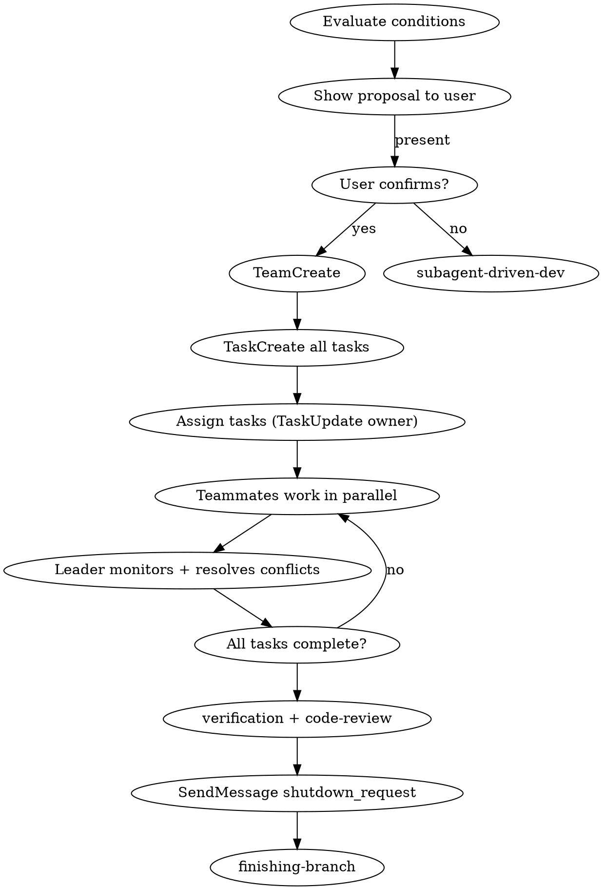

# Team-Driven Development

Guides when and how to use Claude Code Agent Teams for parallel multi-domain task execution.

> **⚠️ 关键区分：Agent Team vs. Subagent-Driven**
>
> | 维度         | Agent Team（本 skill）                    | Subagent-Driven            |
> | ------------ | ----------------------------------------- | -------------------------- |
> | **创建方式** | `TeamCreate` + `TaskCreate`               | `Agent` 工具               |
> | **并行性**   | **真正并行**（各 teammate 独立 worktree） | 串行（同会话逐个派发）     |
> | **通信**     | `SendMessage`（跨会话）                   | Agent 调用返回值（会话内） |
> | **生命周期** | 持久团队，显式 shutdown                   | 临时 subagent，用完即销    |
> | **协调**     | Leader 监控 + 冲突解决                    | 无协调机制                 |
>
> **自检规则：如果你在用 `Agent` 工具而不是 `TeamCreate`，你走错了路径。**

## 前置条件

本 skill 由 `dev-workflow` 的 G2 关卡调用。**调用前 G2 已完成以下检查**（本 skill 不重复验证）：

- 3+ 不同域标签 ✅
- 2+ 可并行任务 ✅
- 总任务数 ≥ 5 ✅
- 文件独立性评估通过 ✅

**本 skill 的唯一前置责任：向用户提案并获得确认。**

## Team Lifecycle



### Step 1: Propose Team to User

Before creating any team, present:

```
Detected tasks across N domains ([frontend] x M, [backend] x K, ...),
recommend starting Agent Team:
  - frontend-dev: responsible for M frontend tasks
  - backend-dev: responsible for K backend tasks
  ...

Start Team?
```

User can: **agree** / **adjust roles** / **decline** (falls back to subagent-driven-dev).

### Step 2: Create Team and Tasks

```
TeamCreate(team_name="feature-name")

TaskCreate for each task, including in description:
  - Full task description from plan
  - "Use skills: [skill-1], [skill-2]" (from Skill routing table)
  - Verification commands
  - Dependencies (TaskUpdate addBlockedBy)

TaskUpdate(owner="frontend-dev") for each task assignment
```

### Step 3: Teammates Execute

Each teammate:

1. Checks TaskList for assigned tasks
2. Works on tasks following TDD cycle
3. Marks completed via TaskUpdate(status="completed")
4. Reports blockers via SendMessage to Leader

### Step 4: Leader Monitors and Coordinates

**Conflict detection:**

| Conflict Type                            | Detection                   | Resolution                                                       |
| ---------------------------------------- | --------------------------- | ---------------------------------------------------------------- |
| Same file modified by multiple teammates | Check git diff before merge | Leader assigns one teammate to resolve                           |
| Interface mismatch                       | Full test suite failure     | Leader coordinates, plan's interface definition is authoritative |
| Dependency not ready                     | Teammate reports blocker    | Leader adjusts priority, complete blocking task first            |

**Cross-agent coordination via SendMessage:**

```
SendMessage(type="message", recipient="backend-dev",
  content="frontend-dev needs the API types. Please finish Task 3 first.",
  summary="Prioritize API types task")
```

### Step 5: Completion

After all tasks complete:

1. Run full verification (verification-before-completion)
2. Check for cross-teammate conflicts (git diff, test suite)
3. Request code-review (requesting-code-review)
4. Handle review feedback — assign fixes to relevant teammates
5. When all clear: `SendMessage(type="shutdown_request")` to each teammate
6. finishing-a-development-branch

## Role Templates

Select roles based on actual domain label distribution (never all 4 by default):

| Role          | subagent_type   | Domain Labels          | Skill Prompt                                |
| ------------- | --------------- | ---------------------- | ------------------------------------------- |
| frontend-dev  | general-purpose | `[frontend]`           | frontend-design, ui-ux-pro-max              |
| backend-dev   | general-purpose | `[backend]`            | project-specific backend skills             |
| test-engineer | general-purpose | `[test]`, `[test:e2e]` | qa-testing-strategy, e2e-testing-automation |
| reviewer      | general-purpose | `[review]`             | pr-review-toolkit agents                    |

**Only create roles that match your task labels.** 2 labels = 2 teammates.

## Skill Prompt Template for Teammates

When spawning teammates via Task tool:

```
## Role
You are {role-name} on team "{team-name}".

## Your Tasks
Check TaskList for tasks assigned to you.

## Recommended Skills
Use skills: {skill-1}, {skill-2}
Invoke via: Skill tool when you need domain knowledge.

## Quality Requirements
- Follow TDD: write tests first, then implement
- Run verification commands after completing each task
- Mark tasks completed via TaskUpdate
- Report blockers to Leader via SendMessage
```

## Common Mistakes

| Mistake                               | Fix                                                                            |
| ------------------------------------- | ------------------------------------------------------------------------------ |
| Starting Team for single-domain tasks | Check decision matrix — all 3 conditions required                              |
| Creating all 4 roles regardless       | Only create roles matching actual domain labels                                |
| Skipping user confirmation            | Always present Team proposal and wait for approval                             |
| Not setting task dependencies         | Use TaskUpdate addBlockedBy to express dependencies                            |
| Using `status="blocked"`              | No such status. Use addBlockedBy to express blocking; task stays `in_progress` |
| Leader doing implementation work      | Leader coordinates; teammates implement                                        |
| Forgetting to shutdown teammates      | SendMessage shutdown_request after all work complete                           |
| Not running full verification         | After all teammates complete, Leader runs full test suite                      |
