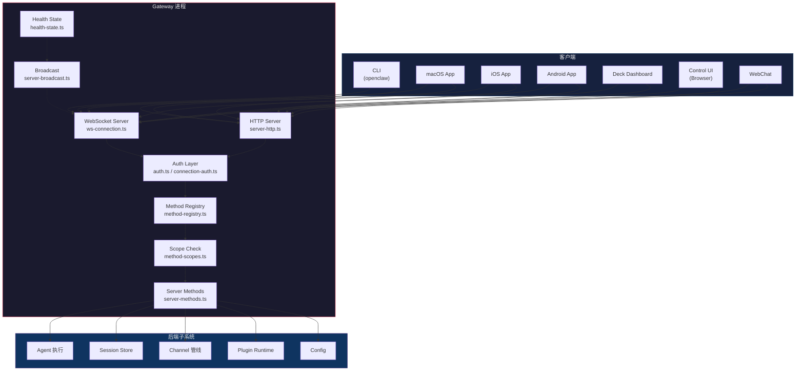
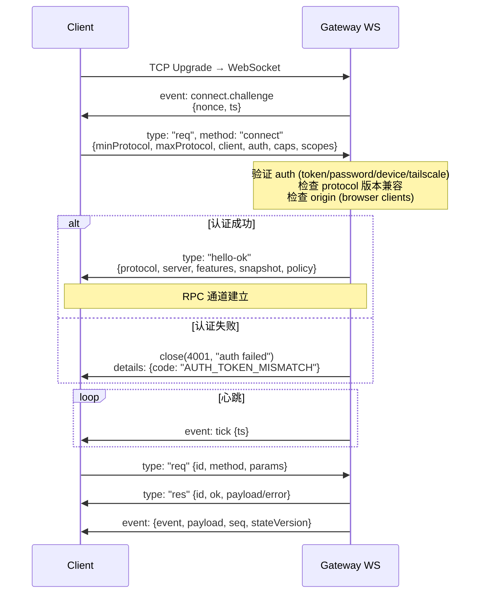

# OC-01 Gateway 核心与协议

> [!abstract] 模块定位
> OpenClaw Gateway 是整个系统的==中枢服务==，负责 WebSocket 连接管理、HTTP 路由、RPC 协议分发、方法注册与权限管控、以及运行时状态快照。所有客户端（CLI、macOS/iOS/Android App、Web Dashboard/Deck、Browser Control UI）均通过 Gateway 的 WebSocket RPC 通道与后端通信。

**源码根目录**: `src/gateway/`

**关联文档**:

- [[OpenClaw Gateway MOC]] — 全局索引
- [[OC-02 RPC API 接口总览]] — 全部 RPC 方法分组详解
- [[OC-06 Session 与状态管理]] — Session Store 与生命周期

---

## 1. 架构概览

Gateway 在 OpenClaw 架构中处于核心位置：所有客户端均以 WebSocket 或 HTTP 方式连接到同一进程，由 Method Registry 统一分发到对应 handler。



---

## 2. WebSocket 连接管理

### 2.1 连接生命周期

连接从 TCP upgrade 到 WebSocket 开始，经过 challenge-response 握手、认证校验、能力协商，最终建立 typed RPC 通道。



**关键源文件**:

- `src/gateway/server/ws-connection.ts` — 连接建立入口 (`attachGatewayWsConnectionHandler`)
- `src/gateway/server/ws-connection/message-handler.ts` — 消息处理、帧校验
- `src/gateway/server/ws-connection/auth-context.ts` — 认证上下文解析
- `src/gateway/server/ws-connection/connect-policy.ts` — 连接策略执行

### 2.2 GatewayWsClient 类型

每个已建立的 WebSocket 连接在服务端表示为 `GatewayWsClient`：

```typescript
// src/gateway/server/ws-types.ts
type GatewayWsClient = {
  socket: WebSocket;
  connect: ConnectParams; // 客户端发来的 connect 帧
  connId: string; // UUID，唯一标识此连接
  presenceKey?: string; // 在线状态标识
  clientIp?: string; // 客户端 IP
  canvasHostUrl?: string; // Canvas host URL（如启用）
  canvasCapability?: string;
  canvasCapabilityExpiresAtMs?: number;
};
```

### 2.3 握手超时与限制

| 常量                           | 值         | 描述                                                    | 源文件                |
| :----------------------------- | :--------- | :------------------------------------------------------ | :-------------------- |
| `DEFAULT_HANDSHAKE_TIMEOUT_MS` | 10,000 ms  | 握手超时（可通过 `OPENCLAW_HANDSHAKE_TIMEOUT_MS` 覆盖） | `server-constants.ts` |
| `MAX_PAYLOAD_BYTES`            | 25 MB      | 单帧最大载荷                                            | `server-constants.ts` |
| `MAX_BUFFERED_BYTES`           | 50 MB      | 每连接发送缓冲上限 (2x max payload)                     | `server-constants.ts` |
| `MAX_PREAUTH_PAYLOAD_BYTES`    | 64 KB      | 认证前最大帧大小                                        | `server-constants.ts` |
| `TICK_INTERVAL_MS`             | 30,000 ms  | 心跳间隔                                                | `server-constants.ts` |
| `HEALTH_REFRESH_INTERVAL_MS`   | 60,000 ms  | 健康快照刷新间隔                                        | `server-constants.ts` |
| `DEDUPE_TTL_MS`                | 300,000 ms | 请求去重 TTL                                            | `server-constants.ts` |
| `DEDUPE_MAX`                   | 1,000      | 去重缓存最大条目                                        | `server-constants.ts` |

### 2.4 Client 标识体系

Gateway 使用结构化的 Client ID 和 Mode 识别不同客户端类型：

```typescript
// src/gateway/protocol/client-info.ts
const GATEWAY_CLIENT_IDS = {
  WEBCHAT_UI: "webchat-ui",
  CONTROL_UI: "openclaw-control-ui",
  WEBCHAT: "webchat",
  CLI: "cli",
  GATEWAY_CLIENT: "gateway-client",
  MACOS_APP: "openclaw-macos",
  IOS_APP: "openclaw-ios",
  ANDROID_APP: "openclaw-android",
  NODE_HOST: "node-host",
  TEST: "test",
  FINGERPRINT: "fingerprint",
  PROBE: "openclaw-probe",
} as const;

const GATEWAY_CLIENT_MODES = {
  WEBCHAT: "webchat",
  CLI: "cli",
  UI: "ui",
  BACKEND: "backend",
  NODE: "node",
  PROBE: "probe",
  TEST: "test",
} as const;
```

> [!note] Client Capabilities
> 客户端通过 `caps` 数组声明能力。当前唯一定义的 capability 为 `"tool-events"`，用于控制是否向客户端推送工具执行事件。

---

## 3. HTTP 服务层

### 3.1 服务器启动

Gateway HTTP 服务器创建于 `server-http.ts`，支持 HTTP 和 HTTPS（TLS）两种模式。

```typescript
// src/gateway/server-http.ts（简化）
import { createServer as createHttpServer } from "node:http";
import { createServer as createHttpsServer } from "node:https";
// 根据 TLS 配置选择 createHttpServer 或 createHttpsServer
```

**端口绑定** (`src/gateway/server/http-listen.ts`)：

- 默认端口 `18789`
- EADDRINUSE 自动重试：最多 4 次，间隔 500ms
- 绑定失败抛出 `GatewayLockError`

```typescript
// src/gateway/server/http-listen.ts
async function listenGatewayHttpServer(params: {
  httpServer: HttpServer;
  bindHost: string; // "127.0.0.1" | "0.0.0.0" | Tailscale IP
  port: number; // default 18789
}): Promise<void>;
```

### 3.2 绑定模式 (GatewayServerOptions)

```typescript
// src/gateway/server.impl.ts
type GatewayServerOptions = {
  bind?: "loopback" | "lan" | "tailnet" | "auto";
  host?: string; // 精确覆盖 bind 地址
  controlUiEnabled?: boolean; // 是否提供 Control UI
  openAiChatCompletionsEnabled?: boolean; // POST /v1/chat/completions
  openResponsesEnabled?: boolean; // POST /v1/responses
  auth?: GatewayAuthConfig;
  tailscale?: GatewayTailscaleConfig;
  allowCanvasHostInTests?: boolean;
};
```

| Bind 模式  | 地址                          | 场景             |
| :--------- | :---------------------------- | :--------------- |
| `loopback` | `127.0.0.1`                   | 本地开发（默认） |
| `lan`      | `0.0.0.0`                     | 局域网共享       |
| `tailnet`  | Tailscale VPN IP (100.64.x.x) | 远程安全访问     |
| `auto`     | 优先 loopback，否则 LAN       | 自动检测         |

### 3.3 TLS 配置

```typescript
// src/gateway/server/tls.ts
async function loadGatewayTlsRuntime(
  cfg: GatewayTlsConfig | undefined,
  log?: { info?: (msg: string) => void; warn?: (msg: string) => void },
): Promise<GatewayTlsRuntime>;
```

> [!tip] TLS 配置
> TLS 证书和密钥通过 `gateway.tls` 配置项指定，实际加载逻辑在 `src/infra/tls/gateway.ts`。配置为空时走普通 HTTP。

### 3.4 HTTP 路由端点

Gateway HTTP 层处理以下端点类别：

| 路径前缀               | 处理器                     | 说明                              |
| :--------------------- | :------------------------- | :-------------------------------- |
| `/v1/chat/completions` | `openai-http.ts`           | OpenAI 兼容 Chat Completions API  |
| `/v1/responses`        | `openresponses-http.ts`    | OpenResponses API                 |
| `/api/hooks/*`         | `server-http.ts` (hooks)   | Webhook 入口（外部触发 agent）    |
| `/plugin/*`            | `plugins-http.ts`          | 插件 HTTP 路由                    |
| `/control-ui/*`        | `control-ui.ts`            | Browser Control UI 静态资源与 API |
| `/sessions/*`          | `sessions-history-http.ts` | Session 历史 HTTP 查询            |
| `/tools/invoke`        | `tools-invoke-http.ts`     | 工具执行 HTTP 端点                |
| `/session/kill`        | `session-kill-http.ts`     | Session 终止                      |
| `/canvas/*`            | `a2ui.ts`                  | Canvas Host (A2UI)                |
| `/avatar/*`            | `control-ui.ts`            | Agent 头像                        |
| Slack events           | `slack/api.ts`             | Slack HTTP Events                 |

### 3.5 Plugin HTTP 路由

插件可以注册 HTTP handler，通过 `PluginHttpRequestHandler` 接入 Gateway HTTP 管线：

```typescript
// src/gateway/server/plugins-http.ts
type PluginHttpRequestHandler = (
  req: IncomingMessage,
  res: ServerResponse,
  pathContext?: PluginRoutePathContext,
  dispatchContext?: { gatewayAuthSatisfied?: boolean },
) => Promise<boolean>;
```

---

## 4. 认证体系

### 4.1 认证模式

Gateway 支持四种认证模式，通过配置或运行时自动检测确定：

| 模式          | 值                | 说明                         |
| :------------ | :---------------- | :--------------------------- |
| 无认证        | `"none"`          | 仅限 loopback 绑定时安全     |
| Token         | `"token"`         | 共享密钥（Bearer token）     |
| Password      | `"password"`      | 密码认证                     |
| Trusted Proxy | `"trusted-proxy"` | 信任上游代理（Tailscale 等） |

```typescript
// src/gateway/auth.ts
type ResolvedGatewayAuth = {
  mode: "none" | "token" | "password" | "trusted-proxy";
  modeSource?: "override" | "config" | "password" | "token" | "default";
  token?: string;
  password?: string;
  allowTailscale: boolean;
  trustedProxy?: GatewayTrustedProxyConfig;
};
```

### 4.2 认证结果

```typescript
type GatewayAuthResult = {
  ok: boolean;
  method?:
    | "none"
    | "token"
    | "password"
    | "tailscale"
    | "device-token"
    | "bootstrap-token"
    | "trusted-proxy";
  user?: string;
  reason?: string;
  rateLimited?: boolean;
  retryAfterMs?: number;
};
```

### 4.3 连接认证错误码

当连接认证失败时，Gateway 返回结构化的错误详情，帮助客户端区分失败原因并决定恢复策略：

```typescript
// src/gateway/protocol/connect-error-details.ts
const ConnectErrorDetailCodes = {
  AUTH_REQUIRED: "AUTH_REQUIRED",
  AUTH_UNAUTHORIZED: "AUTH_UNAUTHORIZED",
  AUTH_TOKEN_MISSING: "AUTH_TOKEN_MISSING",
  AUTH_TOKEN_MISMATCH: "AUTH_TOKEN_MISMATCH",
  AUTH_TOKEN_NOT_CONFIGURED: "AUTH_TOKEN_NOT_CONFIGURED",
  AUTH_PASSWORD_MISSING: "AUTH_PASSWORD_MISSING",
  AUTH_PASSWORD_MISMATCH: "AUTH_PASSWORD_MISMATCH",
  AUTH_PASSWORD_NOT_CONFIGURED: "AUTH_PASSWORD_NOT_CONFIGURED",
  AUTH_BOOTSTRAP_TOKEN_INVALID: "AUTH_BOOTSTRAP_TOKEN_INVALID",
  AUTH_DEVICE_TOKEN_MISMATCH: "AUTH_DEVICE_TOKEN_MISMATCH",
  AUTH_RATE_LIMITED: "AUTH_RATE_LIMITED",
  AUTH_TAILSCALE_IDENTITY_MISSING: "AUTH_TAILSCALE_IDENTITY_MISSING",
  AUTH_TAILSCALE_PROXY_MISSING: "AUTH_TAILSCALE_PROXY_MISSING",
  AUTH_TAILSCALE_WHOIS_FAILED: "AUTH_TAILSCALE_WHOIS_FAILED",
  AUTH_TAILSCALE_IDENTITY_MISMATCH: "AUTH_TAILSCALE_IDENTITY_MISMATCH",
  CONTROL_UI_ORIGIN_NOT_ALLOWED: "CONTROL_UI_ORIGIN_NOT_ALLOWED",
  CONTROL_UI_DEVICE_IDENTITY_REQUIRED: "CONTROL_UI_DEVICE_IDENTITY_REQUIRED",
  DEVICE_IDENTITY_REQUIRED: "DEVICE_IDENTITY_REQUIRED",
  DEVICE_AUTH_INVALID: "DEVICE_AUTH_INVALID",
  DEVICE_AUTH_DEVICE_ID_MISMATCH: "DEVICE_AUTH_DEVICE_ID_MISMATCH",
  DEVICE_AUTH_SIGNATURE_EXPIRED: "DEVICE_AUTH_SIGNATURE_EXPIRED",
  DEVICE_AUTH_NONCE_REQUIRED: "DEVICE_AUTH_NONCE_REQUIRED",
  DEVICE_AUTH_NONCE_MISMATCH: "DEVICE_AUTH_NONCE_MISMATCH",
  DEVICE_AUTH_SIGNATURE_INVALID: "DEVICE_AUTH_SIGNATURE_INVALID",
  DEVICE_AUTH_PUBLIC_KEY_INVALID: "DEVICE_AUTH_PUBLIC_KEY_INVALID",
  PAIRING_REQUIRED: "PAIRING_REQUIRED",
} as const;
```

**Recovery Advice**：客户端收到错误后可根据 `recommendedNextStep` 字段决定恢复路径：

| Next Step                   | 含义                           |
| :-------------------------- | :----------------------------- |
| `retry_with_device_token`   | 使用已保存的 device token 重试 |
| `update_auth_configuration` | 需要更新本地认证配置           |
| `update_auth_credentials`   | 凭据过期/错误，需重新获取      |
| `wait_then_retry`           | 被限流，等待后重试             |
| `review_auth_configuration` | 认证模式配置不匹配             |

### 4.4 Rate Limiting

认证层集成了速率限制器 (`AuthRateLimiter`)，对暴力破解场景提供保护：

- Webhook Hook 认证：20 次失败 / 60 秒窗口
- WebSocket 连接认证和浏览器 Origin 校验均有独立限流器

---

## 5. 协议定义

### 5.1 协议版本

```typescript
// src/gateway/protocol/schema/protocol-schemas.ts
export const PROTOCOL_VERSION = 3 as const;
```

> [!important] 协议版本兼容
> 客户端通过 `connect` 帧的 `minProtocol` / `maxProtocol` 声明支持的版本范围。Gateway 在协商阶段取交集，当前服务端固定 `PROTOCOL_VERSION = 3`。

### 5.2 帧格式

所有通信基于 JSON 帧，分三种类型：

#### Request Frame（客户端 → 服务端）

```typescript
// src/gateway/protocol/schema/frames.ts
const RequestFrameSchema = Type.Object({
  type: Type.Literal("req"),
  id: NonEmptyString, // 请求 ID，用于关联响应
  method: NonEmptyString, // RPC 方法名
  params: Type.Optional(Type.Unknown()),
});
```

#### Response Frame（服务端 → 客户端）

```typescript
const ResponseFrameSchema = Type.Object({
  type: Type.Literal("res"),
  id: NonEmptyString, // 对应请求 ID
  ok: Type.Boolean(), // 是否成功
  payload: Type.Optional(Type.Unknown()),
  error: Type.Optional(ErrorShapeSchema),
});
```

#### Event Frame（服务端 → 客户端，推送）

```typescript
const EventFrameSchema = Type.Object({
  type: Type.Literal("event"),
  event: NonEmptyString, // 事件名称
  payload: Type.Optional(Type.Unknown()),
  seq: Type.Optional(Type.Integer({ minimum: 0 })),
  stateVersion: Type.Optional(StateVersionSchema),
});
```

> [!note] 帧类型区分
> 顶层通过 `type` 字段进行 discriminated union：`"req"` / `"res"` / `"event"`。codegen 工具（quicktype）依赖此 discriminator 生成更紧凑的类型。

### 5.3 Connect 帧（握手）

```typescript
const ConnectParamsSchema = Type.Object({
  minProtocol: Type.Integer({ minimum: 1 }),
  maxProtocol: Type.Integer({ minimum: 1 }),
  client: Type.Object({
    id: GatewayClientIdSchema, // 客户端标识
    displayName: Type.Optional(NonEmptyString),
    version: NonEmptyString, // 客户端版本
    platform: NonEmptyString, // "darwin" | "linux" | "win32" | ...
    deviceFamily: Type.Optional(NonEmptyString),
    modelIdentifier: Type.Optional(NonEmptyString),
    mode: GatewayClientModeSchema, // "cli" | "ui" | "webchat" | ...
    instanceId: Type.Optional(NonEmptyString),
  }),
  caps: Type.Optional(Type.Array(NonEmptyString)), // 客户端能力
  commands: Type.Optional(Type.Array(NonEmptyString)), // 注册的命令
  permissions: Type.Optional(Type.Record(NonEmptyString, Type.Boolean())),
  pathEnv: Type.Optional(Type.String()),
  role: Type.Optional(NonEmptyString), // "operator" | "node"
  scopes: Type.Optional(Type.Array(NonEmptyString)), // 权限范围
  device: Type.Optional(
    Type.Object({
      // 设备认证
      id: NonEmptyString,
      publicKey: NonEmptyString,
      signature: NonEmptyString,
      signedAt: Type.Integer({ minimum: 0 }),
      nonce: NonEmptyString,
    }),
  ),
  auth: Type.Optional(
    Type.Object({
      // 凭据
      token: Type.Optional(Type.String()),
      bootstrapToken: Type.Optional(Type.String()),
      deviceToken: Type.Optional(Type.String()),
      password: Type.Optional(Type.String()),
    }),
  ),
  locale: Type.Optional(Type.String()),
  userAgent: Type.Optional(Type.String()),
});
```

### 5.4 HelloOk 响应

握手成功后 Gateway 返回的 `hello-ok` 帧：

```typescript
const HelloOkSchema = Type.Object({
  type: Type.Literal("hello-ok"),
  protocol: Type.Integer({ minimum: 1 }), // 协商后的协议版本
  server: Type.Object({
    version: NonEmptyString, // Gateway 版本
    connId: NonEmptyString, // 连接 ID
  }),
  features: Type.Object({
    methods: Type.Array(NonEmptyString), // 可用 RPC 方法列表
    events: Type.Array(NonEmptyString), // 可用事件列表
    schemaVersion: Type.Optional(NonEmptyString), // schema 指纹
  }),
  snapshot: SnapshotSchema, // 当前状态快照
  canvasHostUrl: Type.Optional(NonEmptyString),
  auth: Type.Optional(
    Type.Object({
      // 颁发的认证信息
      deviceToken: NonEmptyString,
      role: NonEmptyString,
      scopes: Type.Array(NonEmptyString),
      issuedAtMs: Type.Optional(Type.Integer({ minimum: 0 })),
    }),
  ),
  policy: Type.Object({
    // 连接策略参数
    maxPayload: Type.Integer({ minimum: 1 }), // 25 MB
    maxBufferedBytes: Type.Integer({ minimum: 1 }), // 50 MB
    tickIntervalMs: Type.Integer({ minimum: 1 }), // 30s
  }),
});
```

### 5.5 Error Shape

```typescript
const ErrorShapeSchema = Type.Object({
  code: NonEmptyString, // 错误码
  message: NonEmptyString, // 人类可读消息
  details: Type.Optional(Type.Unknown()), // 额外细节
  retryable: Type.Optional(Type.Boolean()), // 是否可重试
  retryAfterMs: Type.Optional(Type.Integer({ minimum: 0 })),
});
```

### 5.6 错误码

```typescript
// src/gateway/protocol/schema/error-codes.ts
const ErrorCodes = {
  NOT_LINKED: "NOT_LINKED",
  NOT_PAIRED: "NOT_PAIRED",
  NOT_FOUND: "NOT_FOUND",
  AGENT_TIMEOUT: "AGENT_TIMEOUT",
  INVALID_REQUEST: "INVALID_REQUEST",
  UNAVAILABLE: "UNAVAILABLE",
} as const;
```

### 5.7 Schema 模块组织

协议 Schema 使用 ==TypeBox== (`@sinclair/typebox`) 定义，按领域拆分为独立文件：

| 文件                             | 内容                                        |
| :------------------------------- | :------------------------------------------ |
| `schema/frames.ts`               | Connect/HelloOk/Request/Response/Event 帧   |
| `schema/agent.ts`                | Agent 相关参数和事件                        |
| `schema/agents-models-skills.ts` | Agents/Models/Skills/Tools CRUD             |
| `schema/channels.ts`             | Channel 状态/Talk/WebLogin                  |
| `schema/config.ts`               | Config Get/Set/Apply/Patch/Schema           |
| `schema/cron.ts`                 | Cron Job CRUD                               |
| `schema/deck.ts`                 | Deck Dashboard 专属 RPC                     |
| `schema/devices.ts`              | Device Pairing                              |
| `schema/error-codes.ts`          | 错误码定义                                  |
| `schema/exec-approvals.ts`       | 执行审批                                    |
| `schema/logs-chat.ts`            | 日志和 Chat                                 |
| `schema/nodes.ts`                | Node 管理                                   |
| `schema/protocol-schemas.ts`     | ProtocolSchemas 聚合导出 + PROTOCOL_VERSION |
| `schema/push.ts`                 | Push 通知测试                               |
| `schema/secrets.ts`              | Secrets 管理                                |
| `schema/sessions.ts`             | Session CRUD                                |
| `schema/snapshot.ts`             | 状态快照/Presence                           |
| `schema/transcript.ts`           | Transcript 消息格式                         |
| `schema/usage-result-schemas.ts` | 用量统计结果                                |
| `schema/wizard.ts`               | Setup Wizard                                |
| `schema/primitives.ts`           | 基础类型（NonEmptyString 等）               |

所有 schema 在 `protocol-schemas.ts` 中汇总为 `ProtocolSchemas` 对象导出：

```typescript
export const ProtocolSchemas = {
  ConnectParams: ConnectParamsSchema,
  HelloOk: HelloOkSchema,
  // ... 200+ 个 schema
} satisfies Record<string, TSchema>;
```

### 5.8 验证器

协议层在 `protocol/index.ts` 中使用 ==AJV== 为每个参数 schema 编译出验证函数：

```typescript
// src/gateway/protocol/index.ts
const ajv = new Ajv({ allErrors: true, strict: false, removeAdditional: false });

export const validateConnectParams = ajv.compile<ConnectParams>(ConnectParamsSchema);
export const validateRequestFrame = ajv.compile<RequestFrame>(RequestFrameSchema);
// ... 80+ 个验证器
```

---

## 6. 方法注册与权限系统

### 6.1 MethodRegistry 核心接口

```typescript
// src/gateway/method-registry.ts
interface MethodDefinition {
  handler: GatewayRequestHandler;
  params?: TSchema; // TypeBox 参数 schema
  result?: TSchema; // TypeBox 返回值 schema
  scope: OperatorScope | "node" | "public";
  since?: number; // 引入版本
  deprecated?: boolean;
}

interface MethodRegistry {
  methods: ReadonlyMap<string, MethodDefinition>;
  events: ReadonlyMap<string, EventDefinition>;
  listMethods(): string[];
  listEvents(): string[];
  getDefinition(method: string): MethodDefinition | undefined;
  getEventDefinition(event: string): EventDefinition | undefined;
  getScopeForMethod(method: string): OperatorScope | "node" | "public" | undefined;
  describe(opts?: {
    filter?: "all" | "typed" | "untyped";
    includeSchemas?: boolean;
  }): GatewayDescribePayload;
}
```

### 6.2 Registry 构建流程

```typescript
function buildMethodRegistry(
  handlers: GatewayRequestHandlers, // method → handler 映射
  metadataSets: Array<Record<string, MethodMetadata>>, // methodDefs 元数据集
  eventDefs?: Record<string, EventDefinition>, // 事件定义
): MethodRegistry;
```

**构建过程**：

1. 合并所有 `metadataSets` 为统一的 `method → MethodMetadata` 映射
2. 检查每个 metadatas 引用的 method 必须有对应 handler（否则 throw）
3. 为每个 handler 构建 `MethodDefinition`（无 metadata 的默认 `scope: "public"`）
4. 使用所有 method 和 event 的 schema 计算 ==schemaVersion== 指纹（djb2 hash + protocol version）

### 6.3 Schema 版本计算

```typescript
// 格式: "{PROTOCOL_VERSION}.{hash36}"
// 例如: "3.abc123"
function computeSchemaVersion(
  methods: ReadonlyMap<string, MethodDefinition>,
  events: ReadonlyMap<string, EventDefinition>,
): string;
```

> [!info] Schema Version 用途
> `schemaVersion` 随 `hello-ok` 帧和 `gateway.describe` 响应下发。Deck Dashboard 可以缓存 schema 并用版本号判断是否需要刷新 typed client。

### 6.4 MethodDefs 元数据注册

每个 handler 文件旁边导出并行的 `methodDefs`，汇总到 `method-registry-data.ts`：

```typescript
// src/gateway/method-registry-data.ts
export const allMethodDefs: Record<string, MethodMetadata> = {
  ...chatMethodDefs,
  ...configMethodDefs,
  ...controlPlaneMethodDefs,
  ...sessionsMethodDefs,
  ...agentMethodDefs,
  ...agentsMethodDefs,
  ...channelsMethodDefs,
  ...modelsMethodDefs,
  ...logsMethodDefs,
  ...deckMethodDefs,
  ...deckAuthMethodDefs,
  ...describeMethodDefs,
  ...toolsCatalogMethodDefs,
  ...toolsEffectiveMethodDefs,
};
```

> [!important] 无副作用导入
> `method-registry-data.ts` **不得**在模块顶层导入有副作用的模块。这是 codegen 脚本 (`scripts/protocol-gen-ts.ts`) 的硬性要求：`bun -e 'import("./src/gateway/method-registry-data.ts")'` 必须能干净执行。

### 6.5 Operator Scope 权限模型

Gateway 使用五级 Operator Scope 控制方法访问权限：

```typescript
// src/gateway/method-scopes.ts
const ADMIN_SCOPE = "operator.admin" as const;
const READ_SCOPE = "operator.read" as const;
const WRITE_SCOPE = "operator.write" as const;
const APPROVALS_SCOPE = "operator.approvals" as const;
const PAIRING_SCOPE = "operator.pairing" as const;
```

**权限层级关系**：

- `operator.admin` — 超级权限，自动包含所有其他 scope
- `operator.write` — 写操作，自动包含 `operator.read`
- `operator.read` — 只读查询
- `operator.approvals` — 执行审批专用
- `operator.pairing` — 设备配对专用

**CLI 默认权限**：CLI 连接默认获得全部五个 scope。

### 6.6 Scope 分组

| Scope                | 方法示例（部分）                                                                                                                                    |
| :------------------- | :-------------------------------------------------------------------------------------------------------------------------------------------------- |
| `operator.read`      | `health`, `status`, `channels.status`, `sessions.list`, `models.list`, `config.get`, `gateway.describe`, `deck.auth.overview`, `deck.routing.list`  |
| `operator.write`     | `send`, `chat.send`, `sessions.create`, `sessions.send`, `deck.auth.probe`, `node.pending.enqueue`                                                  |
| `operator.admin`     | `agents.create`, `agents.delete`, `sessions.reset`, `sessions.delete`, `config.*`, `wizard.*`, `update.*`, `deck.routing.add`, `deck.identity.link` |
| `operator.approvals` | `exec.approval.request`, `exec.approval.waitDecision`, `exec.approval.resolve`                                                                      |
| `operator.pairing`   | `node.pair.*`, `device.pair.*`, `device.token.*`, `node.rename`                                                                                     |
| `node` (特殊)        | `node.invoke.result`, `node.event`, `node.pending.drain/pull/ack`, `skills.bins`                                                                    |

**Admin 前缀匹配规则**：以 `exec.approvals.`、`config.`、`wizard.`、`update.` 开头的方法自动归入 `operator.admin`。

### 6.7 权限校验函数

```typescript
// 核心授权函数
function authorizeOperatorScopesForMethod(
  method: string,
  scopes: readonly string[],
): { allowed: true } | { allowed: false; missingScope: OperatorScope };
```

**校验规则**：

1. 持有 `operator.admin` → 任何方法都允许
2. 持有 `operator.read` 或 `operator.write` → `read` scope 的方法允许
3. 持有精确匹配的 scope → 对应方法允许
4. 未分类的方法默认需要 `operator.admin`

---

## 7. 事件系统

### 7.1 事件定义

Gateway 广播的事件通过 `EventDefinition` 描述：

```typescript
interface EventDefinition {
  payload?: TSchema; // TypeBox schema
  since?: number;
}
```

### 7.2 已注册事件

| 事件名                    | Payload Schema                      | 说明             |
| :------------------------ | :---------------------------------- | :--------------- |
| `connect.challenge`       | `{nonce, ts}`                       | 连接挑战（握手） |
| `agent`                   | `AgentEventSchema`                  | Agent 执行事件   |
| `chat`                    | `ChatEventSchema`                   | Chat 消息事件    |
| `session.message`         | `SessionMessageEventPayloadSchema`  | Session 消息更新 |
| `session.tool`            | `SessionToolEventPayloadSchema`     | 工具执行事件     |
| `sessions.changed`        | `SessionsChangedEventPayloadSchema` | Session 列表变更 |
| `presence`                | (PresenceEntry 数组)                | 在线状态变更     |
| `tick`                    | `{ts}`                              | 心跳 (30s)       |
| `talk.mode`               | —                                   | 语音模式变更     |
| `shutdown`                | `{reason, restartExpectedMs?}`      | 服务关闭通知     |
| `health`                  | (HealthSummary)                     | 健康状态变更     |
| `heartbeat`               | —                                   | Agent 心跳       |
| `cron`                    | —                                   | Cron 执行通知    |
| `node.pair.requested`     | `DevicePairRequestedEventSchema`    | Node 配对请求    |
| `node.pair.resolved`      | `DevicePairResolvedEventSchema`     | Node 配对结果    |
| `node.invoke.request`     | `NodeInvokeRequestEventSchema`      | Node 调用请求    |
| `device.pair.requested`   | `DevicePairRequestedEventSchema`    | 设备配对请求     |
| `device.pair.resolved`    | `DevicePairResolvedEventSchema`     | 设备配对结果     |
| `voicewake.changed`       | —                                   | 语音唤醒配置变更 |
| `exec.approval.requested` | —                                   | 执行审批请求     |
| `exec.approval.resolved`  | —                                   | 执行审批结果     |
| `update.available`        | —                                   | 版本更新可用     |

### 7.3 广播机制

`server-broadcast.ts` 负责将事件帧分发到所有已连接的 WebSocket 客户端。广播支持：

- `dropIfSlow: true` — 如果客户端发送缓冲区过大则跳过此事件
- `stateVersion` — 附带 presence/health 版本号，客户端可用于增量同步

---

## 8. Introspection RPC (gateway.describe)

Gateway 提供==自省能力==，客户端可以查询所有已注册方法和事件的元信息。

```typescript
// src/gateway/server-methods/describe.ts
const GatewayDescribeParamsSchema = Type.Object({
  filter: Type.Optional(
    Type.Unsafe<"all" | "typed" | "untyped">({
      type: "string",
      enum: ["all", "typed", "untyped"],
    }),
  ),
  includeSchemas: Type.Optional(Type.Boolean()),
});

const GatewayDescribeResultSchema = Type.Object({
  protocol: Type.Number(),
  schemaVersion: Type.String(),
  methods: Type.Record(
    Type.String(),
    Type.Object({
      params: Type.Optional(JsonObjectSchema),
      result: Type.Optional(JsonObjectSchema),
      scope: Type.String(),
      since: Type.Optional(Type.Number()),
    }),
  ),
  events: Type.Record(
    Type.String(),
    Type.Object({
      payload: Type.Optional(JsonObjectSchema),
      since: Type.Optional(Type.Number()),
    }),
  ),
  untyped: Type.Array(Type.String()), // 没有 typed schema 的方法列表
});
```

**用法**：

- `filter: "typed"` — 仅返回有 params/result schema 的方法
- `filter: "untyped"` — 仅返回没有 schema 的旧方法
- `includeSchemas: true` — 在响应中内嵌完整的 JSON Schema

> [!tip] Deck Dashboard 集成
> Deck 的 codegen 脚本 (`scripts/protocol-gen-ts.ts`) 通过读取 `allMethodDefs` 生成 typed client。`gateway.describe` RPC 也可在运行时用于 API 发现。

---

## 9. 状态快照 (Snapshot)

Gateway 在 `hello-ok` 帧中向客户端下发当前状态快照：

```typescript
// src/gateway/protocol/schema/snapshot.ts
const SnapshotSchema = Type.Object({
  presence: Type.Array(PresenceEntrySchema), // 在线设备/客户端列表
  health: HealthSnapshotSchema, // 健康检查结果
  stateVersion: StateVersionSchema, // {presence, health} 版本号
  uptimeMs: Type.Integer({ minimum: 0 }), // Gateway 运行时长
  configPath: Type.Optional(NonEmptyString), // 配置文件路径
  stateDir: Type.Optional(NonEmptyString), // 状态目录路径
  sessionDefaults: Type.Optional(
    Type.Object({
      defaultAgentId: NonEmptyString,
      mainKey: NonEmptyString,
      mainSessionKey: NonEmptyString,
      scope: Type.Optional(NonEmptyString), // "per-sender" 等
    }),
  ),
  authMode: Type.Optional(
    Type.Union([
      // 当前认证模式
      Type.Literal("none"),
      Type.Literal("token"),
      Type.Literal("password"),
      Type.Literal("trusted-proxy"),
    ]),
  ),
  updateAvailable: Type.Optional(
    Type.Object({
      // 可用更新信息
      currentVersion: NonEmptyString,
      latestVersion: NonEmptyString,
      channel: NonEmptyString,
    }),
  ),
});
```

### 9.1 StateVersion 增量同步

```typescript
const StateVersionSchema = Type.Object({
  presence: Type.Integer({ minimum: 0 }), // 单调递增
  health: Type.Integer({ minimum: 0 }), // 单调递增
});
```

每次 presence 变更时 `presenceVersion++`；每次 health 刷新时 `healthVersion++`。客户端可以比较事件帧携带的 `stateVersion` 与本地缓存版本，决定是否需要请求完整快照。

### 9.2 Presence Entry

```typescript
const PresenceEntrySchema = Type.Object({
  host: Type.Optional(NonEmptyString),
  ip: Type.Optional(NonEmptyString),
  version: Type.Optional(NonEmptyString),
  platform: Type.Optional(NonEmptyString),
  deviceFamily: Type.Optional(NonEmptyString),
  modelIdentifier: Type.Optional(NonEmptyString),
  mode: Type.Optional(NonEmptyString),
  lastInputSeconds: Type.Optional(Type.Integer({ minimum: 0 })),
  reason: Type.Optional(NonEmptyString),
  tags: Type.Optional(Type.Array(NonEmptyString)),
  text: Type.Optional(Type.String()),
  ts: Type.Integer({ minimum: 0 }),
  deviceId: Type.Optional(NonEmptyString),
  roles: Type.Optional(Type.Array(NonEmptyString)),
  scopes: Type.Optional(Type.Array(NonEmptyString)),
  instanceId: Type.Optional(NonEmptyString),
});
```

---

## 10. 方法全景列表

Gateway 当前注册了 ==155+ 个 RPC 方法==和 ==21 个事件==。以下是按领域分组的完整方法列表：

### 10.1 核心基础

| 方法                   | Scope | 说明         |
| :--------------------- | :---- | :----------- |
| `health`               | read  | 健康检查     |
| `status`               | read  | 系统状态     |
| `doctor.memory.status` | read  | 内存诊断     |
| `system-presence`      | read  | 在线列表     |
| `last-heartbeat`       | read  | 上次心跳     |
| `set-heartbeats`       | admin | 设置心跳     |
| `system-event`         | admin | 系统事件     |
| `gateway.identity.get` | read  | Gateway 身份 |
| `gateway.describe`     | read  | API 自省     |

### 10.2 Agent 执行

| 方法                 | Scope | 说明            |
| :------------------- | :---- | :-------------- |
| `send`               | write | 发送消息        |
| `agent`              | write | Agent 交互      |
| `agent.wait`         | write | 等待 Agent 完成 |
| `agent.identity.get` | read  | Agent 身份      |
| `wake`               | write | 唤醒 Agent      |
| `browser.request`    | write | 浏览器请求      |

### 10.3 Agents CRUD

| 方法                                  | Scope               |
| :------------------------------------ | :------------------ |
| `agents.list`                         | read                |
| `agents.create`                       | admin               |
| `agents.update`                       | admin               |
| `agents.delete`                       | admin               |
| `agents.files.list` / `.get` / `.set` | read / read / admin |

### 10.4 Chat/Sessions（部分）

| 方法                                                            | Scope                 |
| :-------------------------------------------------------------- | :-------------------- |
| `chat.send` / `.abort` / `.history`                             | write / write / read  |
| `chat.inject`                                                   | admin                 |
| `sessions.list` / `.preview` / `.create`                        | read / read / write   |
| `sessions.send` / `.abort` / `.steer`                           | write / write / write |
| `sessions.patch` / `.reset` / `.clear` / `.delete` / `.compact` | admin 系列            |
| `sessions.subscribe` / `.unsubscribe`                           | read                  |
| `sessions.usage` / `.usage.timeseries` / `.usage.logs`          | read                  |

### 10.5 Deck Dashboard 专属

| 方法前缀           | Scope      | 数量 |
| :----------------- | :--------- | :--: |
| `deck.auth.*`      | read/write |  2   |
| `deck.commands.*`  | read       |  1   |
| `deck.routing.*`   | read/admin |  5   |
| `deck.agents.*`    | read/admin |  9   |
| `deck.subagents.*` | read/admin |  4   |
| `deck.identity.*`  | read/admin |  3   |
| `deck.threads.*`   | read       |  1   |

### 10.6 其他领域

- **Config**: `config.get/set/apply/patch/schema/schema.lookup`
- **Models**: `models.list`, `models.configured`, `models.catalog.providers`
- **Channels**: `channels.status`, `channels.logout`
- **Skills**: `skills.status/bins/install/update`
- **Tools**: `tools.catalog`, `tools.effective`
- **Cron**: `cron.list/status/add/update/remove/run/runs`
- **TTS/Talk**: `tts.*/talk.*`
- **Wizard**: `wizard.start/next/cancel/status`
- **Node**: `node.pair.*/node.list/node.describe/node.invoke/node.pending.*`
- **Device**: `device.pair.*/device.token.*`
- **Exec Approval**: `exec.approval.*/exec.approvals.*`
- **Secrets**: `secrets.reload/resolve`

---

## 11. 配置项速查

| 配置路径                                         | 类型                                  | 默认值         | 说明                |
| :----------------------------------------------- | :------------------------------------ | :------------- | :------------------ |
| `gateway.auth.mode`                              | `"none"` \| `"token"` \| `"password"` | 自动检测       | 认证模式            |
| `gateway.auth.token`                             | string                                | —              | 共享 token          |
| `gateway.auth.password`                          | string                                | —              | 密码                |
| `gateway.auth.allowTailscale`                    | boolean                               | false          | 允许 Tailscale 认证 |
| `gateway.tls.cert`                               | string                                | —              | TLS 证书路径        |
| `gateway.tls.key`                                | string                                | —              | TLS 私钥路径        |
| `gateway.controlUi.enabled`                      | boolean                               | true           | 启用 Control UI     |
| `gateway.http.endpoints.chatCompletions.enabled` | boolean                               | false          | OpenAI 兼容端点     |
| `gateway.http.endpoints.responses.enabled`       | boolean                               | false          | OpenResponses 端点  |
| `session.mainKey`                                | string                                | —              | 主 Session Key      |
| `session.scope`                                  | string                                | `"per-sender"` | Session 隔离范围    |

> [!info] 环境变量
>
> - `OPENCLAW_GATEWAY_PORT` — Gateway 端口
> - `OPENCLAW_HANDSHAKE_TIMEOUT_MS` — 握手超时覆盖
> - `OPENCLAW_RAW_STREAM` — 启用原始流日志
> - `OPENCLAW_RAW_STREAM_PATH` — 原始流日志路径

---

## 12. 关键文件索引

| 文件                                                  | 职责                                             |
| :---------------------------------------------------- | :----------------------------------------------- |
| `src/gateway/server.ts`                               | 对外导出入口 (`startGatewayServer`)              |
| `src/gateway/server.impl.ts`                          | Gateway 启动实现（端口绑定、子系统初始化）       |
| `src/gateway/server-http.ts`                          | HTTP 路由分发（hooks/openai/plugins/control-ui） |
| `src/gateway/server-ws-runtime.ts`                    | WebSocket 运行时桥接                             |
| `src/gateway/server/ws-connection.ts`                 | WebSocket 连接生命周期管理                       |
| `src/gateway/server/ws-connection/message-handler.ts` | 消息解析与 RPC 分发                              |
| `src/gateway/server/http-listen.ts`                   | HTTP 端口绑定（含重试）                          |
| `src/gateway/server/tls.ts`                           | TLS 加载                                         |
| `src/gateway/server/health-state.ts`                  | 健康快照与版本管理                               |
| `src/gateway/server/close-reason.ts`                  | WebSocket 关闭原因截断                           |
| `src/gateway/server/plugins-http.ts`                  | 插件 HTTP 路由注册                               |
| `src/gateway/server/readiness.ts`                     | 就绪检查                                         |
| `src/gateway/server/presence-events.ts`               | Presence 事件广播                                |
| `src/gateway/protocol/index.ts`                       | 协议 schema 聚合 + AJV 验证器                    |
| `src/gateway/protocol/schema.ts`                      | Schema 重导出 barrel                             |
| `src/gateway/protocol/schema/frames.ts`               | 帧格式定义                                       |
| `src/gateway/protocol/schema/protocol-schemas.ts`     | ProtocolSchemas 聚合 + PROTOCOL_VERSION          |
| `src/gateway/protocol/schema/snapshot.ts`             | Snapshot/Presence/StateVersion                   |
| `src/gateway/protocol/schema/error-codes.ts`          | 错误码                                           |
| `src/gateway/protocol/client-info.ts`                 | Client ID/Mode/Caps 定义                         |
| `src/gateway/protocol/connect-error-details.ts`       | 连接错误详情码 + 恢复建议                        |
| `src/gateway/method-registry.ts`                      | MethodRegistry 核心（构建 + describe）           |
| `src/gateway/method-registry-data.ts`                 | 全部 methodDefs + eventDefs 聚合（codegen 安全） |
| `src/gateway/method-scopes.ts`                        | Operator Scope 定义 + 权限校验函数               |
| `src/gateway/event-defs.ts`                           | 事件定义注册                                     |
| `src/gateway/server-methods-list.ts`                  | 方法名列表 + 事件名列表                          |
| `src/gateway/server-methods.ts`                       | 核心 handler 聚合                                |
| `src/gateway/server-methods/describe.ts`              | gateway.describe 自省 RPC                        |
| `src/gateway/server-constants.ts`                     | 常量（payload/timeout/interval）                 |
| `src/gateway/auth.ts`                                 | 认证解析与校验                                   |
| `src/gateway/connection-auth.ts`                      | 连接认证凭据解析                                 |
| `src/gateway/server-broadcast.ts`                     | 事件广播                                         |
| `src/gateway/session-utils.types.ts`                  | Session 相关类型定义                             |
| `src/gateway/session-lifecycle-state.ts`              | Session 生命周期状态机                           |
| `src/gateway/session-reset-service.ts`                | Session 重置服务                                 |

---

_文档基于 OpenClaw Gateway 源码分析生成 | 2026-04-07 | Protocol Version 3_
