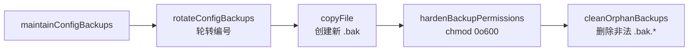

# OC-03 配置系统

> [!abstract] 概述
> OpenClaw 配置系统负责从磁盘读取 `openclaw.json`（JSON5 格式），经过 **include 解析 → 环境变量替换 → Zod schema 校验 → 默认值填充 → 运行时覆盖** 等多阶段管线，产出类型安全的 `OpenClawConfig` 对象。系统同时管理配置文件的备份轮转、内存缓存、运行时快照，以及与 Plugin 系统的校验集成。

**上游依赖**: 无（作为系统底层被全体模块消费）
**下游消费者**: [[OC-01 Gateway 核心与协议]]、[[OC-04 Agent 执行系统]]、[[OC-06 Session 与状态管理]]、[[OC-07 Channel 渠道框架]]、[[OC-08 路由引擎]]

---

## 1. Config 加载流程

```mermaid
flowchart TD
    START([loadConfig 调用]) --> CACHE{运行时快照<br>runtimeConfigSnapshot?}
    CACHE -->|有| RETURN_SNAP[返回快照]
    CACHE -->|无| IO[createConfigIO]
    IO --> FIND[定位配置文件<br>resolveDefaultConfigCandidates]
    FIND --> EXISTS{文件存在?}
    EXISTS -->|否| EMPTY[返回空 Config {}]
    EXISTS -->|是| READ[fs.readFileSync + JSON5.parse]
    READ --> INCLUDE[$include 递归解析<br>resolveConfigIncludes]
    INCLUDE --> ENV_SUB[环境变量替换<br>resolveConfigEnvVars]
    ENV_SUB --> LEGACY[旧版 Config 迁移检查<br>findLegacyConfigIssues]
    LEGACY --> ZOD[Zod Schema 校验<br>OpenClawSchema.safeParse]
    ZOD --> PLUGIN_V[Plugin 扩展校验<br>validateConfigObjectWithPlugins]
    PLUGIN_V --> VALID{校验通过?}
    VALID -->|否| THROW[抛出 INVALID_CONFIG 错误]
    VALID -->|是| DEFAULTS[默认值填充管线<br>applyMessageDefaults → applyLoggingDefaults<br>→ applySessionDefaults → applyAgentDefaults<br>→ applyContextPruningDefaults<br>→ applyCompactionDefaults<br>→ applyModelDefaults<br>→ applyTalkConfigNormalization]
    DEFAULTS --> NORMALIZE[路径规范化<br>normalizeConfigPaths<br>normalizeExecSafeBinProfiles]
    NORMALIZE --> ENV_VARS[进程环境变量应用<br>applyConfigEnvVars]
    ENV_VARS --> OVERRIDE[运行时覆盖<br>applyConfigOverrides]
    OVERRIDE --> RETURN[返回 OpenClawConfig]

    style START fill:#e1f5fe
    style RETURN fill:#c8e6c9
    style THROW fill:#ffcdd2
```

> [!info] 关键路径
> `src/config/io.ts` 的 `createConfigIO().loadConfig()` 是整个管线的入口。配置文件路径通过 `resolveDefaultConfigCandidates()` 依序查找 `~/.openclaw/openclaw.json`，兼容历史目录名 `.clawdbot`、`.moldbot`。

---

## 2. 配置文件格式 (openclaw.json)

配置文件使用 **JSON5** 格式（支持注释、尾逗号），根对象为 `OpenClawConfig`。

```json5
{
  // 模块化配置：$include 支持单文件或数组
  $include: ["./base.json5", "./channels.json5"],

  // Agent 列表
  agents: {
    defaults: {
      /* ... */
    },
    list: [
      { id: "main", model: "sonnet-4.6", default: true },
      { id: "helper", model: "haiku-3.5" },
    ],
  },

  // 路由绑定
  bindings: [
    { type: "route", channel: "telegram", agentId: "main" },
    { type: "acp", channel: "slack", agentId: "helper" },
  ],

  // 渠道配置
  channels: {
    telegram: { capabilities: ["inlineButtons"] },
    slack: { accounts: { "workspace-1": { capabilities: ["threads"] } } },
  },

  // 模型提供商
  models: {
    providers: {
      anthropic: { apiKey: "${ANTHROPIC_API_KEY}" },
    },
  },

  // 环境变量引用：${VAR_NAME}，转义用 $${VAR_NAME}
  gateway: { mode: "local", bind: "loopback", port: 18789 },
  session: { scope: "per-sender", idle: { minutes: 30 } },
  plugins: { allow: ["memory-qmd", "voice-call"] },
}
```

### 2.1 $include 指令

| 特性     | 说明                                                         |
| :------- | :----------------------------------------------------------- |
| 文件     | `src/config/includes.ts`                                     |
| 语法     | `"$include": "./path.json5"` 或数组 `["a.json5", "b.json5"]` |
| 合并策略 | 数组拼接，对象递归合并，原始值 source 覆盖 target            |
| 深度限制 | `MAX_INCLUDE_DEPTH = 10`                                     |
| 文件大小 | `MAX_INCLUDE_FILE_BYTES = 2MB`                               |
| 安全     | 路径遍历检测（CWE-22）+ 符号链接验证 + Boundary File Open    |
| 循环检测 | 维护 `visited` 集合，抛出 `CircularIncludeError`             |

### 2.2 环境变量替换

| 特性     | 说明                                                                       |
| :------- | :------------------------------------------------------------------------- |
| 文件     | `src/config/env-substitution.ts`                                           |
| 语法     | `${VAR_NAME}`（仅匹配 `[A-Z_][A-Z0-9_]*`）                                 |
| 转义     | `$${VAR}` → 输出字面量 `${VAR}`                                            |
| 缺失行为 | 默认抛出 `MissingEnvVarError`；可通过 `onMissing` 回调收集警告并保留占位符 |
| 写回保护 | `env-preserve.ts` 在写入时恢复未修改路径的原始 `${VAR}` 引用               |

---

## 3. Schema 校验

### 3.1 Zod Schema 层

```
OpenClawSchema (zod-schema.ts)
├── AgentsSchema         (agents.defaults + agents.list)
├── ChannelsSchema       (各渠道配置)
├── ModelsConfigSchema   (providers + routing)
├── SessionSchema        (scope, idle, maintenance)
├── MessagesSchema       (inbound, outbound, templates)
├── BindingsSchema       (route + acp bindings)
├── ToolsSchema          (agent runtime tools)
├── PluginsSchema        (allow, deny, entries, slots)
├── HooksSchema          (internal + external hooks)
├── ApprovalsSchema      (tool approval flows)
├── SecretsConfigSchema  (secret references)
└── GatewaySchema        (bind, port, tailscale, ...)
```

> [!tip] 校验入口
>
> - `validateConfigObjectRaw()` — 原始校验，不填充默认值（用于写回文件）
> - `validateConfigObject()` — 校验 + 默认值填充
> - `validateConfigObjectWithPlugins()` — 完整校验（含 Plugin manifest 校验、channel id 验证、heartbeat target 验证等）

### 3.2 Plugin 扩展校验

Plugin 校验在 `validation.ts` 中实现，主要逻辑：

1. **Channel ID 验证** — 检查 `channels.*` 下的 key 是否为已注册 channel（含 plugin 渠道）
2. **Plugin entries 验证** — 检查 `plugins.entries.*` 中的 plugin id 是否存在于 manifest registry
3. **Plugin config schema 验证** — 对每个 enabled plugin 调用 `validateJsonSchemaValue()` 校验其 `config` 块
4. **Memory slot 验证** — 检查 `plugins.slots.memory` 指向的 plugin 是否存在
5. **Heartbeat target 验证** — 检查 heartbeat 目标渠道是否合法

---

## 4. Agent Config

Agent 配置通过 `agents.defaults` 和 `agents.list[]` 定义。

```typescript
// src/config/types.agents.ts
type AgentEntry = {
  id: string; // Agent ID（规范化为小写）
  default?: boolean; // 标记默认 agent
  model?: AgentModelConfig; // 主模型 + fallbacks
  agentDir?: string; // 自定义状态目录
  heartbeat?: { target: string; interval?: string };
  identity?: { name?: string; avatar?: string };
  // ... 更多字段
};

type AgentModelConfig =
  | string
  | {
      primary?: string;
      fallbacks?: string[];
    };
```

### 4.1 Agent 模型解析

`model-input.ts` 提供统一的模型配置解析：

- `resolveAgentModelPrimaryValue(model)` — 提取主模型名
- `resolveAgentModelFallbackValues(model)` — 提取 fallback 模型列表
- `toAgentModelListLike(model)` — 统一为 `{ primary, fallbacks }` 结构

### 4.2 Agent 目录唯一性校验

`agent-dirs.ts` 中的 `findDuplicateAgentDirs()` 在加载时检查所有 agent 的 agentDir 是否唯一。路径在 macOS/Windows 上大小写不敏感比较。重复会抛出 `DuplicateAgentDirError`，因为共享 agentDir 会导致 auth/session 状态冲突。

---

## 5. Channel Config

渠道配置通过两层结构组织：

```json5
{
  channels: {
    telegram: {
      capabilities: ["inlineButtons"],
      accounts: {
        "bot-1": { capabilities: ["threads"] },
      },
    },
  },
}
```

`channel-capabilities.ts` 的 `resolveChannelCapabilities()` 实现了 **account → channel → global** 三级 fallback 逻辑：

1. 如果 `accounts[accountId].capabilities` 存在 → 使用它
2. 否则回退到 channel 级 `capabilities`
3. 不同渠道有特定的 capabilities schema（如 `TelegramCapabilitiesConfig`、`SlackCapabilitiesConfig`）

---

## 6. Routing Bindings Config

`bindings.ts` 定义了消息路由绑定规则：

```typescript
type AgentRouteBinding = { type: "route"; channel: string; agentId: string /* ... */ };
type AgentAcpBinding = { type: "acp"; channel: string; agentId: string /* ... */ };
type AgentBinding = AgentRouteBinding | AgentAcpBinding;
```

| 函数                                    | 作用                |
| :-------------------------------------- | :------------------ |
| `listConfiguredBindings(cfg)`           | 返回所有绑定规则    |
| `listRouteBindings(cfg)`                | 筛选 route 类型绑定 |
| `listAcpBindings(cfg)`                  | 筛选 ACP 类型绑定   |
| `isRouteBinding(b)` / `isAcpBinding(b)` | 类型守卫            |

> [!note] 与路由引擎的关系
> Bindings 是静态配置层。运行时路由评估在 [[OC-08 路由引擎]] 中完成，bindings 仅提供初始规则输入。

---

## 7. 备份轮转

`backup-rotation.ts` 实现了配置文件的滚动备份机制：

```
openclaw.json.bak    ← 最新备份
openclaw.json.bak.1  ← 上一次
openclaw.json.bak.2  ← 再上一次
openclaw.json.bak.3  ← ...
openclaw.json.bak.4  ← 最旧（CONFIG_BACKUP_COUNT=5 时）
```

### 7.1 备份维护流程



| 函数                        | 作用                                                            |
| :-------------------------- | :-------------------------------------------------------------- |
| `rotateConfigBackups()`     | 将 `.bak` → `.bak.1`，`.bak.1` → `.bak.2`，删除最旧             |
| `hardenBackupPermissions()` | 对所有 `.bak*` 文件设置 `0o600` 权限                            |
| `cleanOrphanBackups()`      | 清理不在轮转环中的孤儿备份（如 `openclaw.json.bak.1772352289`） |
| `maintainConfigBackups()`   | 组合以上三步 + `copyFile`                                       |

> [!warning] 所有操作均为 best-effort
> 每个步骤的错误都被静默捕获，确保备份失败不阻塞配置写入。

---

## 8. 缓存机制

### 8.1 配置加载缓存

`loadConfig()` 内置两级缓存：

1. **运行时快照** (`runtimeConfigSnapshot`) — Gateway 运行期间设置，所有后续 `loadConfig()` 调用直接返回快照，无需重读磁盘。通过 `setRuntimeConfigSnapshot()` / `clearRuntimeConfigSnapshot()` 控制。
2. **文件缓存** (`configCache`) — TTL 驱动的短期缓存，默认周期由 `OPENCLAW_CONFIG_CACHE_MS` 环境变量控制。缓存键为 `configPath + expiresAt`。

### 8.2 通用过期 Map 缓存

`cache-utils.ts` 提供了通用的 `ExpiringMapCache<TKey, TValue>`：

```typescript
type ExpiringMapCache<TKey, TValue> = {
  get: (key: TKey) => TValue | undefined;
  set: (key: TKey, value: TValue) => void;
  delete: (key: TKey) => void;
  clear: () => void;
  pruneExpired: () => void;
  // ...
};
```

| 特性     | 说明                                                                   |
| :------- | :--------------------------------------------------------------------- |
| TTL      | 支持静态数字或动态函数 `() => number`                                  |
| 清理策略 | 在 `get`/`set` 时按 `pruneIntervalMs` 周期惰性清理过期条目             |
| 文件快照 | `getFileStatSnapshot()` 返回 `{ mtimeMs, sizeBytes }` 用于缓存失效判断 |

此缓存被 Session Store（见 [[OC-06 Session 与状态管理]]）等子系统复用。

---

## 9. 运行时覆盖

`runtime-overrides.ts` 提供命令行 `/set` 命令驱动的运行时配置覆盖：

```typescript
setConfigOverride("agents.defaults.model", "gpt-5.4"); // 设置覆盖
unsetConfigOverride("agents.defaults.model"); // 取消覆盖
applyConfigOverrides(cfg); // 在 loadConfig 尾部应用
```

覆盖值存储在模块级 `overrides` 对象中，采用深度合并（非替换）策略。所有值在写入前经过 `sanitizeOverrideValue()` 防护（过滤 `__proto__`、`constructor` 等危险键、处理循环引用）。

---

## 10. 关键类型定义

### 10.1 OpenClawConfig

`src/config/types.ts` 是一个纯 re-export 桶文件，从 30+ 个子模块聚合类型：

| 子模块              | 涵盖                                  |
| :------------------ | :------------------------------------ |
| `types.base.ts`     | 根级字段（meta、env、session 等）     |
| `types.agents.ts`   | AgentEntry、AgentBinding              |
| `types.channels.ts` | 渠道通用类型                          |
| `types.models.ts`   | ModelsConfig、ProviderConfig          |
| `types.gateway.ts`  | Gateway 配置（bind、port、tailscale） |
| `types.hooks.ts`    | Hook 配置                             |
| `types.plugins.ts`  | Plugin allow/deny/entries/slots       |
| `types.queue.ts`    | 消息队列配置                          |
| `types.skills.ts`   | 技能配置                              |
| `types.sandbox.ts`  | 沙箱配置                              |
| `types.secrets.ts`  | 密钥引用                              |
| `types.tts.ts`      | TTS 配置                              |
| `types.mcp.ts`      | MCP 配置                              |

### 10.2 ConfigFileSnapshot

```typescript
type ConfigFileSnapshot = {
  path: string;
  exists: boolean;
  raw: string | null;
  parsed: unknown;
  resolved: unknown;
  valid: boolean;
  config: OpenClawConfig;
  hash: string;
  issues: ConfigValidationIssue[];
  warnings: ConfigValidationIssue[];
  legacyIssues: LegacyConfigIssue[];
};
```

### 10.3 ConfigValidationIssue

```typescript
type ConfigValidationIssue = {
  path: string; // 点分隔路径，如 "agents.list.0.model"
  message: string; // 人类可读错误信息
  allowedValues?: string[]; // 合法值列表（用于 CLI 提示）
  allowedValuesHiddenCount?: number; // 被截断的合法值数量
};
```

---

## 11. 辅助工具模块

| 文件                      | 职责                                                       |
| :------------------------ | :--------------------------------------------------------- |
| `config-paths.ts`         | 点分隔路径解析（`parseConfigPath`）、值的 get/set/unset    |
| `merge-patch.ts`          | RFC 7396 风格 JSON Merge Patch（支持按 `id` 合并对象数组） |
| `byte-size.ts`            | 解析 "2mb"、"512kb" 等人类可读字节大小                     |
| `allowed-values.ts`       | 校验错误中的合法值摘要（最多 12 项，超长截断）             |
| `prototype-keys.ts`       | 危险键阻止列表（`__proto__`、`constructor`、`prototype`）  |
| `legacy-migrate.ts`       | 旧版配置自动迁移                                           |
| `normalize-paths.ts`      | 路径中 `~` 展开为 home 目录                                |
| `env-preserve.ts`         | 写入时恢复 `${VAR}` 引用（避免将展开后的值写入磁盘）       |
| `plugins-allowlist.ts`    | Plugin allow/deny 列表管理                                 |
| `runtime-group-policy.ts` | Group DM Policy 运行时评估                                 |
| `issue-format.ts`         | 校验问题格式化                                             |

---

> [!seealso] 相关文档
>
> - [[OpenClaw Gateway MOC]] — 知识库总索引
> - [[OC-01 Gateway 核心与协议]] — Gateway 启动时的配置加载入口
> - [[OC-06 Session 与状态管理]] — Session 相关配置（scope、idle、maintenance）
> - [[OC-07 Channel 渠道框架]] — Channel 配置的消费者
> - [[OC-08 路由引擎]] — Bindings 配置的消费者
