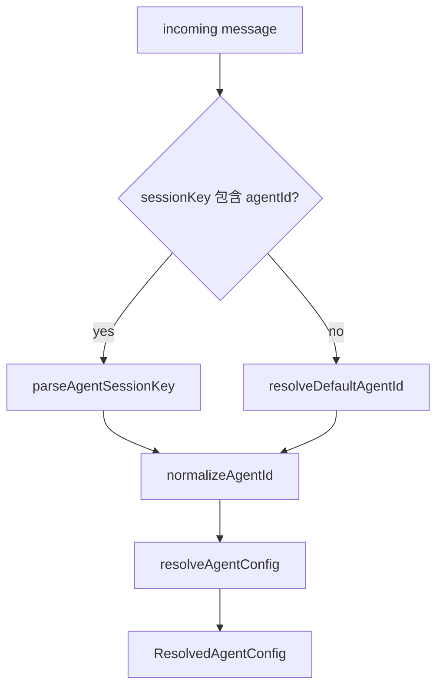
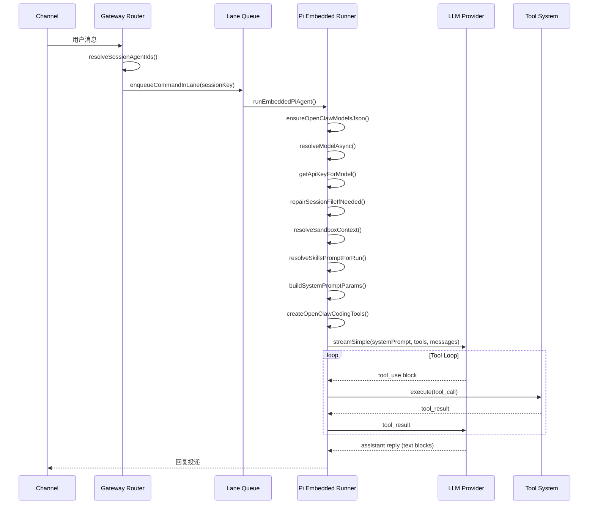
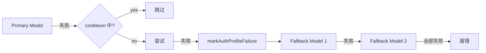
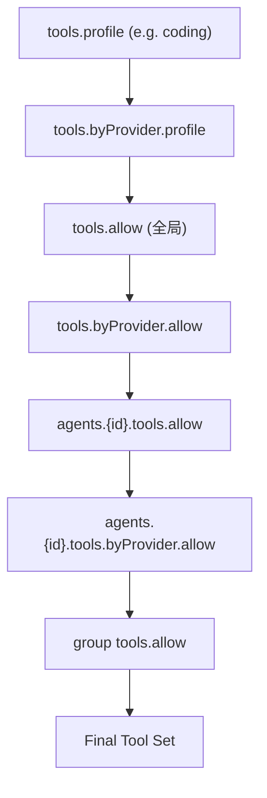
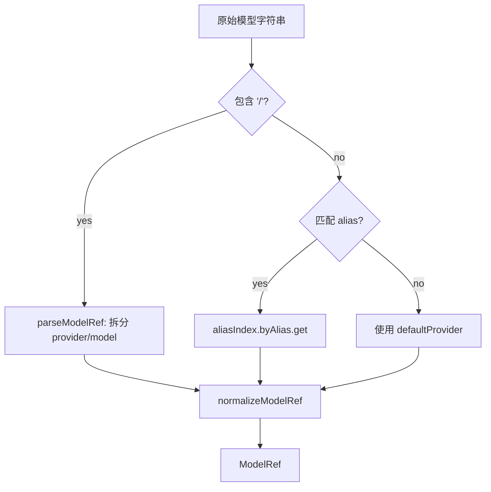
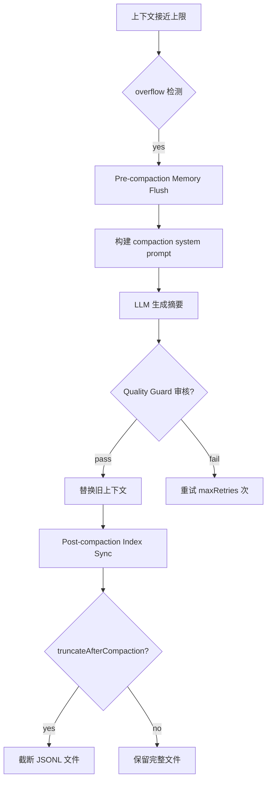

# OC-04 Agent 执行系统

> [!info] 模块定位
> Agent 是 OpenClaw Gateway 的核心执行单元。每个 Agent 拥有独立的身份、工具集、模型配置和沙箱隔离策略。Gateway 收到用户消息后，通过路由引擎将消息分发到目标 Agent，由 ==Pi Embedded Runner== 驱动 LLM 推理循环，产生最终回复。

本文档覆盖 Agent 子系统的完整生命周期：配置解析 -> 消息路由 -> 执行管线 -> 工具调用 -> 回复投递。

相关文档：

- [[OpenClaw Gateway MOC]] -- 顶层索引
- [[OC-05 SubAgent 与编排]] -- 子 Agent 生成与注册
- [[OC-06 Session 与状态管理]] -- 会话持久化与 compaction
- [[OC-08 路由引擎]] -- 消息到 Agent 的分发

---

## 1. 概述

OpenClaw 采用 ==多 Agent 架构==：一个 Gateway 实例可配置多个 Agent，每个 Agent 拥有独立的：

- **身份** (Identity) -- 名称、emoji、消息前缀
- **模型** (Model) -- 主模型 + 备选模型链
- **工具集** (Tools) -- allow/deny 策略、profile 预设
- **技能** (Skills) -- 工作区技能快照与 allowlist
- **沙箱** (Sandbox) -- Docker/SSH 隔离环境
- **超时** (Timeout) -- 执行时间上限
- **子 Agent** (SubAgents) -- spawn 权限与模型覆盖

默认 Agent ID 为 `"main"`（定义于 `src/routing/session-key.ts`）。

---

## 2. Agent 配置模型

### 2.1 AgentConfig -- 单个 Agent 定义

```typescript
// src/config/types.agents.ts
type AgentConfig = {
  id: string;
  default?: boolean; // 是否为默认 Agent
  name?: string; // 可读名称
  workspace?: string; // 工作目录
  agentDir?: string; // Agent 状态目录
  model?: AgentModelConfig; // 主模型 (string | { primary, fallbacks })
  thinkingDefault?: ThinkLevel;
  reasoningDefault?: "on" | "off" | "stream";
  fastModeDefault?: boolean;
  skills?: string[]; // 技能 allowlist (省略=全部; []=无)
  memorySearch?: MemorySearchConfig;
  humanDelay?: HumanDelayConfig;
  heartbeat?: HeartbeatConfig;
  identity?: IdentityConfig; // 名称/emoji/前缀
  groupChat?: GroupChatConfig;
  subagents?: {
    allowAgents?: string[]; // 可 spawn 的 agent id ("*" = 任意)
    model?: AgentModelConfig; // 子 Agent 默认模型
  };
  sandbox?: AgentSandboxConfig;
  params?: Record<string, unknown>; // 流式参数
  tools?: AgentToolsConfig;
  channels?: { eventStreams?: string[] };
  runtime?: AgentRuntimeConfig; // "embedded" | "acp"
};
```

### 2.2 AgentModelConfig

```typescript
// src/config/types.agents-shared.ts
type AgentModelConfig =
  | string // "anthropic/claude-sonnet-4-6"
  | {
      primary?: string; // 主模型
      fallbacks?: string[]; // 备选模型链
    };
```

### 2.3 AgentsConfig -- 顶层容器

```typescript
// src/config/types.agents.ts
type AgentsConfig = {
  defaults?: AgentDefaultsConfig; // 全局默认值
  list?: AgentConfig[]; // Agent 列表
};
```

### 2.4 AgentDefaultsConfig 关键字段

`AgentDefaultsConfig`（`src/config/types.agent-defaults.ts`）是所有 Agent 共享的默认配置层，包含：

| 字段              | 用途                           |
| ----------------- | ------------------------------ |
| `model`           | 全局默认主模型与 fallbacks     |
| `models`          | 模型目录（alias + 每模型参数） |
| `workspace`       | 全局默认工作目录               |
| `contextTokens`   | 上下文窗口 token 上限          |
| `thinkingDefault` | 全局思考级别                   |
| `timeoutSeconds`  | 全局超时                       |
| `sandbox`         | 全局沙箱配置                   |
| `compaction`      | Compaction 策略                |
| `subagents`       | 子 Agent 全局限制              |
| `maxConcurrent`   | 最大并发执行数                 |

---

## 3. Agent 解析与选择

### 3.1 解析链

Agent 解析的核心模块是 `src/agents/agent-scope.ts`，它提供了一系列从配置中解析 Agent 的函数。



### 3.2 ResolvedAgentConfig

```typescript
// src/agents/agent-scope.ts
type ResolvedAgentConfig = {
  name?: string;
  workspace?: string;
  agentDir?: string;
  model?: AgentModelConfig;
  thinkingDefault?: ThinkLevel;
  reasoningDefault?: "on" | "off" | "stream";
  fastModeDefault?: boolean;
  skills?: string[];
  memorySearch?: MemorySearchConfig;
  humanDelay?: HumanDelayConfig;
  heartbeat?: HeartbeatConfig;
  identity?: IdentityConfig;
  groupChat?: GroupChatConfig;
  subagents?: SubagentsConfig;
  sandbox?: AgentSandboxConfig;
  tools?: AgentToolsConfig;
  channels?: { eventStreams?: string[] };
};
```

### 3.3 默认 Agent 选择

```typescript
export function resolveDefaultAgentId(cfg: OpenClawConfig): string {
  const agents = listAgentEntries(cfg);
  if (agents.length === 0) return DEFAULT_AGENT_ID; // "main"
  const defaults = agents.filter((a) => a?.default);
  // 多个 default=true 时取第一个并 warn
  return normalizeAgentId((defaults[0] ?? agents[0])?.id || DEFAULT_AGENT_ID);
}
```

> [!note] 继承规则
> `resolveAgentConfig` 只返回该 Agent 的显式配置。实际使用时，上层代码负责将 `agents.defaults` 与 Agent 级配置合并（例如 `resolveAgentEffectiveModelPrimary` 先查 Agent 级，再回退到 defaults 级）。

### 3.4 工作区路径解析

Agent 工作区目录解析优先级：

1. Agent 配置的 `workspace` 字段
2. 若为默认 Agent：`agents.defaults.workspace`
3. 若为默认 Agent：环境变量默认目录
4. 非默认 Agent：`{stateDir}/workspace-{agentId}`

路径中的 null 字节会被 `stripNullBytes()` 清除以防止 `ENOTDIR` 错误。

### 3.5 按工作区路径反查 Agent

`resolveAgentIdsByWorkspacePath()` 支持根据文件系统路径反查匹配的 Agent ID 列表，按路径长度降序排列（最精确匹配优先）。

---

## 4. 执行管线

### 4.1 完整流程



### 4.2 Pi Embedded Runner

Pi Embedded Runner（`src/agents/pi-embedded-runner/`）是 Agent 的核心执行引擎，基于 `@mariozechner/pi-coding-agent` 和 `@mariozechner/pi-ai` 的 `streamSimple` API 实现。

关键入口：

| 函数                       | 文件                                | 作用                                         |
| -------------------------- | ----------------------------------- | -------------------------------------------- |
| `runEmbeddedPiAgent`       | `pi-embedded-runner/run.ts`         | 主入口，协调 model/auth/sandbox/tools/skills |
| `runEmbeddedAttempt`       | `pi-embedded-runner/run/attempt.ts` | 单次推理尝试（含 tool loop）                 |
| `compactEmbeddedPiSession` | `pi-embedded-runner/compact.ts`     | 上下文 compaction                            |

### 4.3 Lane 并发控制

执行通过 lane 排队以控制并发：

- **Global Lane**: 主 Agent 运行使用全局 lane，受 `maxConcurrent` 限制（默认 1）
- **Session Lane**: 同一 session 的消息串行执行
- **SubAgent Lane**: 子 Agent 有独立 lane（`"subagent"`），受 `subagents.maxConcurrent` 限制

### 4.4 Failover 与模型降级

当主模型失败时，Runner 自动尝试 fallback 模型链：



关键机制（`src/agents/model-fallback.ts`）：

- ==Auth Profile Cooldown==：失败的 provider/profile 进入冷却期，短时间内不再尝试
- ==Context Overflow 检测==：识别上下文超限错误，触发 compaction 而非简单 failover
- ==Overload Backoff==：对 rate limit 类错误使用指数退避

---

## 5. Sandbox 系统

### 5.1 隔离模型

```mermaid
flowchart TD
    subgraph Host
        A[Agent Process]
        W[Workspace Dir]
    end
    subgraph Sandbox["Sandbox Container"]
        B[Shell / Tools]
        SW[/workspace]
    end
    A -->|Docker/SSH| B
    W -.->|none/ro/rw mount| SW
```

### 5.2 Sandbox 配置结构

```typescript
// src/agents/sandbox/types.ts
type SandboxConfig = {
  mode: "off" | "non-main" | "all"; // 何时启用
  backend: SandboxBackendId; // "docker" | "ssh" | 自定义
  scope: SandboxScope; // "session" | "agent" | "shared"
  workspaceAccess: "none" | "ro" | "rw";
  workspaceRoot: string;
  docker: SandboxDockerConfig;
  ssh: SandboxSshConfig;
  browser: SandboxBrowserConfig;
  tools: SandboxToolPolicy;
  prune: SandboxPruneConfig;
};
```

### 5.3 Sandbox Scope

| Scope     | 隔离粒度              | 容器复用                     |
| --------- | --------------------- | ---------------------------- |
| `session` | 每个 session 独立容器 | 不复用                       |
| `agent`   | 每个 Agent 一个容器   | 同 Agent 的所有 session 共享 |
| `shared`  | 全局共享              | 所有 Agent 共享一个环境      |

### 5.4 Docker 安全默认值

Docker 沙箱默认配置（`src/agents/sandbox/constants.ts`）：

| 配置项         | 默认值                           |
| -------------- | -------------------------------- |
| `image`        | `openclaw-sandbox:bookworm-slim` |
| `network`      | `none` (无网络)                  |
| `readOnlyRoot` | `true`                           |
| `capDrop`      | `["ALL"]`                        |
| `tmpfs`        | `/tmp, /var/tmp, /run`           |
| `workdir`      | `/workspace`                     |

> [!important] 安全设计
> Sandbox 默认==禁止网络访问==、==只读根文件系统==、==丢弃所有 Linux capabilities==。需要网络的场景（如浏览器沙箱）有独立配置路径。

### 5.5 Sandbox Tool Policy

沙箱内的工具可见性由独立的 tool policy 控制：

**默认 Allow 列表**：

```
exec, process, read, write, edit, apply_patch, image,
sessions_list, sessions_history, sessions_send, sessions_spawn,
sessions_yield, subagents, session_status
```

**默认 Deny 列表**：

```
browser, canvas, nodes, cron, gateway, [所有 channel IDs]
```

> [!tip] 工具策略解析优先级
> Agent 级 > 全局级 > 默认值。`image` 工具始终注入 allow 列表（除非被显式 deny）。

### 5.6 浏览器沙箱

浏览器沙箱是独立于主沙箱的容器，默认使用 `openclaw-sandbox-browser:bookworm-slim` 镜像。它有独立的网络（`openclaw-sandbox-browser`）、CDP 端口（9222）和 VNC 端口（5900）。

---

## 6. 工具系统

### 6.1 工具目录 (Tool Catalog)

工具按==功能区域==组织，每个工具归属一个 section 和若干 profile：

```typescript
// src/agents/tool-catalog.ts
type ToolProfileId = "minimal" | "coding" | "messaging" | "full";

// Section 分类
const CORE_TOOL_SECTION_ORDER = [
  "fs", // read, write, edit, apply_patch
  "runtime", // exec, process
  "web", // web_search, web_fetch
  "memory", // memory_search, memory_get
  "sessions", // sessions_list/history/send/spawn/yield, subagents, session_status
  "ui", // browser, canvas
  "messaging", // message
  "automation", // cron, gateway
  "nodes", // nodes
  "agents", // agents_list
  "media", // image, image_generate, tts
];
```

### 6.2 Tool Profile 预设

| Profile     | 包含工具                                                |
| ----------- | ------------------------------------------------------- |
| `minimal`   | session_status                                          |
| `coding`    | fs + runtime + web + memory + sessions + cron + media   |
| `messaging` | sessions (list/history/send) + session_status + message |
| `full`      | 无限制（空 allow = 全部允许）                           |

### 6.3 Tool Policy Pipeline

工具策略通过多层 pipeline 合并（`src/agents/tool-policy-pipeline.ts`）：



每层都可以有 `allow` 和 `deny` 列表。工具名称通过 `normalizeToolName()` 规范化（例如 `bash` -> `exec`，`apply-patch` -> `apply_patch`）。

### 6.4 Tool Groups

工具可通过 group 引用批量操作：

- `group:openclaw` -- 大部分核心工具
- `group:fs` -- 文件系统工具
- `group:runtime` -- 运行时工具
- `group:plugins` -- 所有插件提供的工具
- `{pluginId}` -- 特定插件的工具

### 6.5 Owner-Only 工具

部分工具仅允许 owner 调用（`src/agents/tool-policy.ts`）：

```typescript
const OWNER_ONLY_TOOL_NAME_FALLBACKS = new Set(["whatsapp_login", "cron", "gateway", "nodes"]);
```

非 owner 发送者调用这些工具时，会抛出 `"Tool restricted to owner senders."` 错误。非 owner 的工具列表中这些工具会被完全过滤。

### 6.6 Channel Tools

Channel 工具（`src/agents/channel-tools.ts`）由==渠道插件==动态注入。每个渠道插件可声明 `agentTools` 和 `actions`：

- `listChannelAgentTools()` -- 聚合所有渠道插件的工具（如 login、pair 等）
- `listChannelSupportedActions()` -- 获取特定渠道支持的消息操作
- `resolveChannelMessageToolHints()` -- 获取渠道级消息工具提示

### 6.7 Tool Loop Detection

工具循环检测（`src/agents/tool-loop-detection.ts`）防止 Agent 陷入无效循环：

| 检测器                   | 作用                          |
| ------------------------ | ----------------------------- |
| `generic_repeat`         | 相同工具+参数重复 N 次        |
| `known_poll_no_progress` | 已知轮询模式无进展            |
| `ping_pong`              | 两个工具交替调用              |
| `global_circuit_breaker` | 全局调用次数上限 (默认 30 次) |

阈值配置：warning=10, critical=20, circuit breaker=30。

---

## 7. 技能系统

### 7.1 Skills 架构

技能（Skills）是 Agent 可以使用的==声明式能力模块==，以 Markdown 文件（`SKILL.md`）的形式存在于工作区。

```typescript
// src/agents/skills/types.ts
type SkillEntry = {
  skill: Skill; // 来自 pi-coding-agent
  frontmatter: ParsedSkillFrontmatter;
  metadata?: OpenClawSkillMetadata;
  invocation?: SkillInvocationPolicy;
};

type SkillSnapshot = {
  prompt: string; // 注入系统提示的技能描述
  skills: Array<{ name: string; primaryEnv?: string; requiredEnv?: string[] }>;
  skillFilter?: string[]; // Agent 级 allowlist
  resolvedSkills?: Skill[];
  version?: number;
};
```

### 7.2 技能来源

技能从以下目录加载（`src/agents/skills/workspace.ts`）：

1. **内置技能** -- `resolvedBundledSkillsDir()`
2. **工作区技能** -- Agent 工作目录下的技能文件
3. **插件技能** -- 已安装插件提供的技能
4. **Claude Bundle Commands** -- 插件命令转化的技能

### 7.3 技能过滤

Agent 可通过 `skills` 字段限制可用技能：

```yaml
agents:
  list:
    - id: focused-agent
      skills: ["web-search", "code-review"] # 只允许这两个
    - id: no-skills
      skills: [] # 禁用所有技能
    # 省略 skills 字段 = 允许所有技能
```

### 7.4 技能安装

技能安装偏好通过 `resolveSkillsInstallPreferences()` 解析：

```typescript
type SkillsInstallPreferences = {
  preferBrew: boolean; // 默认 true
  nodeManager: "npm" | "pnpm" | "yarn" | "bun"; // 默认 "npm"
};
```

安装方式支持：`brew`、`node`、`go`、`uv`、`download`。

### 7.5 技能路径压缩

`compactSkillPaths()` 将绝对路径中的 home 目录替换为 `~`，每个技能路径节省约 5-6 个 token。

---

## 8. 模型配置

### 8.1 ModelRef -- 模型引用

```typescript
// src/agents/model-selection.ts
type ModelRef = {
  provider: string; // e.g. "anthropic", "openai", "google"
  model: string; // e.g. "claude-sonnet-4-6", "gpt-5.4"
};
```

### 8.2 模型解析链



### 8.3 模型别名

通过 `agents.defaults.models` 配置模型别名：

```yaml
agents:
  defaults:
    models:
      anthropic/claude-sonnet-4-6:
        alias: "sonnet"
      openai/gpt-5.4:
        alias: "gpt"
```

`buildModelAliasIndex()` 构建双向索引：`byAlias`（别名 -> ModelRef）和 `byKey`（modelKey -> 别名列表）。

### 8.4 Anthropic 模型 ID 规范化

内置别名自动规范化：

| 输入         | 规范化结果          |
| ------------ | ------------------- |
| `opus-4.6`   | `claude-opus-4-6`   |
| `opus-4.5`   | `claude-opus-4-5`   |
| `sonnet-4.6` | `claude-sonnet-4-6` |
| `sonnet-4.5` | `claude-sonnet-4-5` |

Google、xAI 和 OpenRouter 模型同样有各自的规范化逻辑。

### 8.5 模型 Allowlist

`buildAllowedModelSet()` 基于 `agents.defaults.models` 构建允许使用的模型集合。当 allowlist 为空时，所有 catalog 中的模型都被允许。

### 8.6 Thinking 级别解析

```typescript
type ThinkLevel = "off" | "minimal" | "low" | "medium" | "high" | "xhigh" | "adaptive";
```

解析优先级：

1. 每模型 `params.thinking` 配置
2. `agents.defaults.thinkingDefault`
3. 模型目录中的默认值（`resolveThinkingDefaultForModel`）

### 8.7 Agent 级模型覆盖

`resolveDefaultModelForAgent()` 支持 Agent 级模型覆盖：

1. Agent 显式 `model` 配置
2. `agents.defaults.model`
3. 硬编码默认值 (`DEFAULT_PROVIDER/DEFAULT_MODEL`)

Fallback 模型链同样支持 Agent 级覆盖：显式空数组 `fallbacks: []` 可禁用全局 fallbacks。

---

## 9. 超时管理

超时管理（`src/agents/timeout.ts`）控制 Agent 单次执行的时间上限。

```typescript
const DEFAULT_AGENT_TIMEOUT_SECONDS = 48 * 60 * 60; // 48 小时
const MAX_SAFE_TIMEOUT_MS = 2_147_000_000; // ~24.9 天 (int32 安全上限)
```

### 9.1 resolveAgentTimeoutMs

```typescript
function resolveAgentTimeoutMs(opts: {
  cfg?: OpenClawConfig;
  overrideMs?: number | null; // 毫秒级覆盖
  overrideSeconds?: number | null; // 秒级覆盖
  minMs?: number; // 最小值
}): number;
```

优先级：

1. `overrideMs` (若为 0 表示"无超时"，使用 `MAX_SAFE_TIMEOUT_MS`)
2. `overrideSeconds`
3. `agents.defaults.timeoutSeconds`
4. 默认 48 小时

> [!note] 子 Agent 超时
> 子 Agent 的超时由 `subagents.runTimeoutSeconds` 独立控制，与主 Agent 超时互不影响。SubAgent Registry 使用 `resolveAgentTimeoutMs` 来设置子 Agent 的定时清理。

---

## 10. Compaction 与上下文管理

### 10.1 Session File Repair

会话文件修复（`src/agents/session-file-repair.ts`）在每次 run 前执行，处理损坏的 JSONL 行：

1. 逐行解析 session JSONL 文件
2. 丢弃无法解析的行
3. 验证第一行是合法的 session header（`type: "session"`）
4. 若有损坏行：备份原文件 -> 写入清理后内容 -> 原子替换

### 10.2 Compaction 流程

当上下文接近 token 上限时触发 compaction（`src/agents/pi-embedded-runner/compact.ts`）：



### 10.3 Compaction 配置

```typescript
type AgentCompactionConfig = {
  mode?: "default" | "safeguard";
  reserveTokens?: number;
  keepRecentTokens?: number;
  reserveTokensFloor?: number;
  maxHistoryShare?: number; // 0.1-0.9, 默认 0.5
  customInstructions?: string;
  recentTurnsPreserve?: number;
  identifierPolicy?: "strict" | "off" | "custom";
  qualityGuard?: { enabled?: boolean; maxRetries?: number };
  postIndexSync?: "off" | "async" | "await";
  memoryFlush?: MemoryFlushConfig;
  postCompactionSections?: string[]; // 默认 ["Session Startup", "Red Lines"]
  model?: string; // compaction 专用模型
  timeoutSeconds?: number; // 默认 900s
  truncateAfterCompaction?: boolean; // 截断 JSONL 文件
};
```

> [!tip] Safeguard 模式
> `mode: "safeguard"` 启用更激进的上下文修剪：按 `maxHistoryShare` 限制历史占比，确保新 turn 有足够的空间。

### 10.4 Context Window Guard

在 compaction 之前，`evaluateContextWindowGuard()` 检查上下文窗口状态：

- 低于 `CONTEXT_WINDOW_HARD_MIN_TOKENS` 时拒绝执行
- 低于 `CONTEXT_WINDOW_WARN_BELOW_TOKENS` 时发出警告

### 10.5 Tool Result Truncation

过大的工具执行结果会被 `truncateOversizedToolResultsInSession()` 自动截断，防止单次工具调用撑爆上下文窗口。

---

## 附录 A: SubAgent Registry

SubAgent Registry（`src/agents/subagent-registry.ts`）管理所有子 Agent 的生命周期。

```typescript
type SubagentRunRecord = {
  runId: string;
  childSessionKey: string;
  controllerSessionKey?: string;
  requesterSessionKey: string;
  task: string;
  cleanup: "delete" | "keep";
  model?: string;
  spawnMode?: SpawnSubagentMode;
  createdAt: number;
  startedAt?: number;
  endedAt?: number;
  outcome?: SubagentRunOutcome;
  // ... 更多生命周期字段
};
```

关键常量：

- `SUBAGENT_ANNOUNCE_TIMEOUT_MS`: 120s -- announce 投递超时
- `MAX_ANNOUNCE_RETRY_COUNT`: 3 -- 最大重试次数
- `ANNOUNCE_EXPIRY_MS`: 5min -- 非完成 announce 过期时间
- `ANNOUNCE_COMPLETION_HARD_EXPIRY_MS`: 30min -- 完成消息硬超时
- `LIFECYCLE_ERROR_RETRY_GRACE_MS`: 15s -- 错误重试宽限期

详见 [[OC-05 SubAgent 与编排]]。

---

## 附录 B: Agent Identity

Agent 身份系统（`src/agents/identity.ts`）控制 Agent 的对外表现：

- **ACK Reaction**: 收到消息时的确认 emoji（默认 `👀`）
  - 解析优先级：Channel Account > Channel > Global `messages.ackReaction` > Agent Identity Emoji > 默认
- **Message Prefix**: 消息前缀（默认 `[openclaw]`）
  - 当 `allowFrom` 存在时默认为空
- **Response Prefix**: 回复前缀
  - 支持 `"auto"` 模式自动使用 `[{agent.identity.name}]`
- **Human Delay**: 模拟人类打字延迟
  - Agent 级 > defaults 级合并

---

## 附录 C: 关键文件索引

| 模块                      | 文件路径                                                 |
| ------------------------- | -------------------------------------------------------- |
| Agent 配置类型            | `src/config/types.agents.ts`                             |
| Agent 默认配置            | `src/config/types.agent-defaults.ts`                     |
| Agent 解析                | `src/agents/agent-scope.ts`                              |
| Pi Embedded Runner 主入口 | `src/agents/pi-embedded-runner/run.ts`                   |
| 单次尝试                  | `src/agents/pi-embedded-runner/run/attempt.ts`           |
| Compaction                | `src/agents/pi-embedded-runner/compact.ts`               |
| 模型选择                  | `src/agents/model-selection.ts`                          |
| 模型 Fallback             | `src/agents/model-fallback.ts`                           |
| 工具策略                  | `src/agents/tool-policy.ts`                              |
| 工具目录                  | `src/agents/tool-catalog.ts`                             |
| 工具策略 Pipeline         | `src/agents/tool-policy-pipeline.ts`                     |
| Channel 工具              | `src/agents/channel-tools.ts`                            |
| 循环检测                  | `src/agents/tool-loop-detection.ts`                      |
| 技能系统                  | `src/agents/skills.ts`, `src/agents/skills/workspace.ts` |
| 沙箱配置                  | `src/agents/sandbox/config.ts`                           |
| 沙箱类型                  | `src/agents/sandbox/types.ts`                            |
| 沙箱工具策略              | `src/agents/sandbox/tool-policy.ts`                      |
| 沙箱常量                  | `src/agents/sandbox/constants.ts`                        |
| 超时管理                  | `src/agents/timeout.ts`                                  |
| Session 修复              | `src/agents/session-file-repair.ts`                      |
| SubAgent Registry         | `src/agents/subagent-registry.ts`                        |
| Agent 身份                | `src/agents/identity.ts`                                 |
| Content Blocks            | `src/agents/content-blocks.ts`                           |
