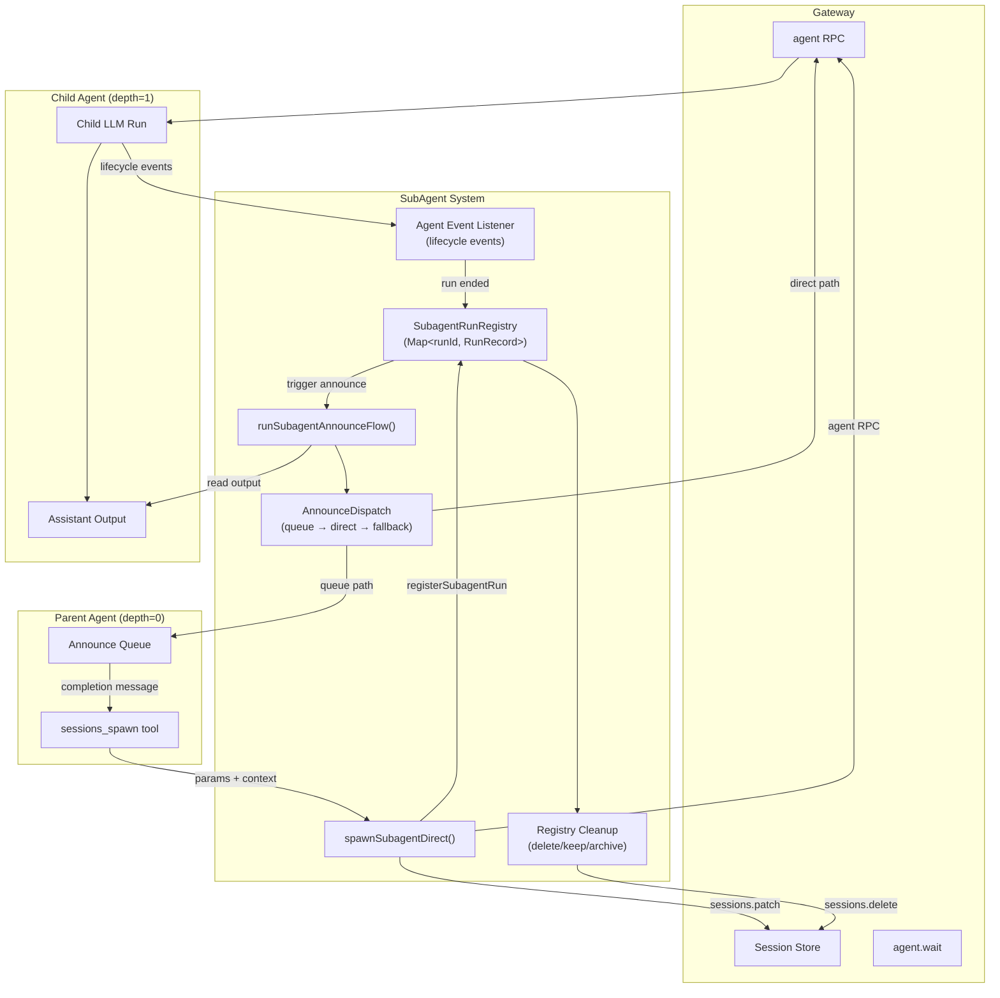
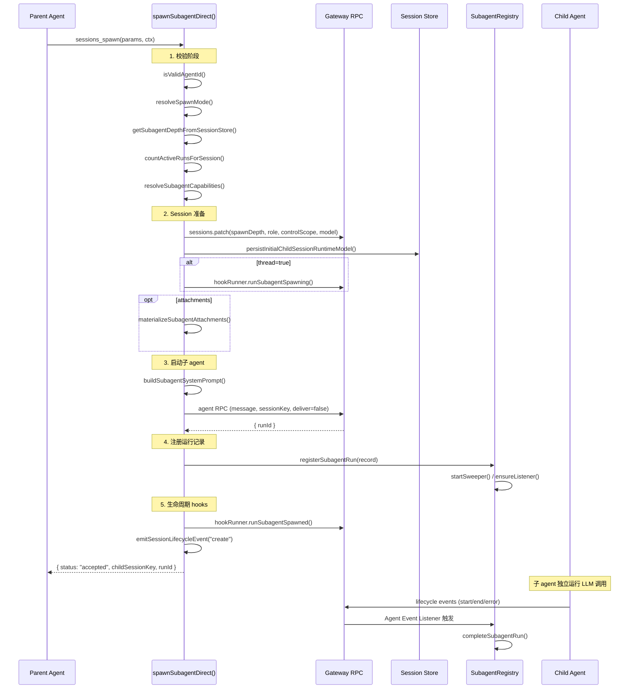
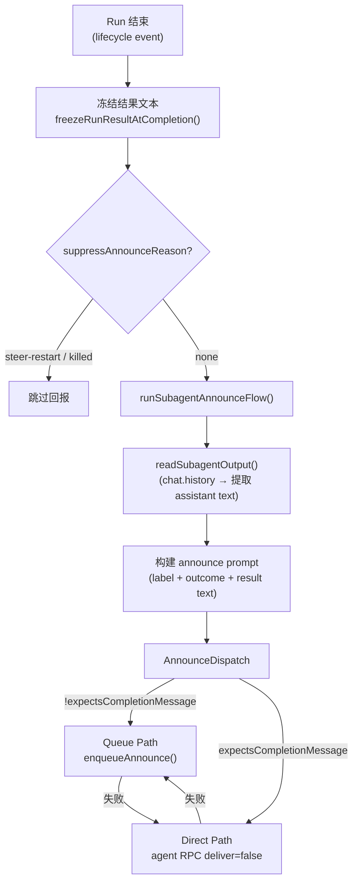

# OC-05 SubAgent 与编排

## 概述

OpenClaw 的 SubAgent 系统允许一个 agent session 在运行时 **spawn**（孵化）子 agent session，实现任务分解与并行编排。SubAgent 机制是 OpenClaw 多 agent 协作的核心基础设施，支持嵌套孵化、结果回报（announcement）、生命周期管理和自动清理。

核心模块位于 `src/agents/subagent-*.ts`，由以下关键组件构成：

| 模块                            | 职责                                                |
| ------------------------------- | --------------------------------------------------- |
| `subagent-spawn.ts`             | Spawn 参数校验、session 创建、Gateway 调用          |
| `subagent-registry.ts`          | 运行记录注册表（内存 Map + 磁盘持久化）             |
| `subagent-announce.ts`          | 结果读取、announce prompt 构建、交付                |
| `subagent-announce-dispatch.ts` | 交付路径选择（queue / direct / steered）            |
| `subagent-announce-queue.ts`    | 异步 announce 队列（debounce、collect、summarize）  |
| `subagent-control.ts`           | 父对子的控制操作（list / kill / steer / send）      |
| `subagent-capabilities.ts`      | 角色与权限（role / controlScope / canSpawn）        |
| `subagent-depth.ts`             | 嵌套深度解析（session store 递归查询）              |
| `subagent-registry-cleanup.ts`  | 延迟清理决策（retry / defer-descendants / give-up） |
| `subagent-lifecycle-events.ts`  | 生命周期事件常量与类型                              |
| `subagent-orphan-recovery.ts`   | Gateway 重启后孤儿 session 恢复                     |

## SubAgent 架构图



## Spawn 参数与模式

### SpawnSubagentParams

```typescript
type SpawnSubagentParams = {
  task: string; // 必填：子 agent 的任务描述
  label?: string; // 可选：显示标签
  agentId?: string; // 目标 agent ID（默认继承父 agent）
  model?: string; // 模型覆盖（支持 provider/model 格式）
  thinking?: string; // 思考级别覆盖
  runTimeoutSeconds?: number; // 运行超时
  thread?: boolean; // 是否绑定到消息线程
  mode?: "run" | "session"; // 运行模式
  cleanup?: "delete" | "keep"; // 完成后清理策略
  sandbox?: "inherit" | "require"; // 沙箱模式
  expectsCompletionMessage?: boolean; // 是否期望完成消息回报
  attachments?: Array<{
    // 文件附件
    name: string;
    content: string;
    encoding?: "utf8" | "base64";
    mimeType?: string;
  }>;
  attachMountPath?: string; // 附件挂载路径提示
};
```

### 运行模式对比

| 特性           | `run` 模式             | `session` 模式         |
| -------------- | ---------------------- | ---------------------- |
| 生命周期       | 一次性任务，完成即结束 | 持久化，可接收后续消息 |
| thread 要求    | 可选                   | **必须** `thread=true` |
| cleanup 默认值 | `keep`                 | 强制 `keep`            |
| 适用场景       | 独立子任务             | 持续对话的线程子 agent |

> [!note] 模式推断规则
> 如果未显式指定 mode：
>
> - `thread=true` → 默认 `session`
> - `thread=false` 或未设置 → 默认 `run`

## Spawn 流程详解



### 校验检查清单

Spawn 函数按顺序执行以下校验：

1. **agentId 格式** — 必须匹配 `[a-z0-9][a-z0-9_-]{0,63}`
2. **mode + thread 一致性** — `mode="session"` 必须搭配 `thread=true`
3. **嵌套深度** — `callerDepth >= maxSpawnDepth` 则 forbidden
4. **并发子 agent 数** — `activeChildren >= maxChildrenPerAgent`（默认 5）则 forbidden
5. **目标 agent 权限** — 跨 agent spawn 需在 `subagents.allowAgents` 列表中
6. **沙箱传播** — 沙箱 session 不能 spawn 非沙箱子 agent

## SubAgent Registry

Registry 是一个内存中的 `Map<string, SubagentRunRecord>`，通过 agent lifecycle events 监听器驱动状态流转。

### 核心 API

| 函数                                | 用途                                 |
| ----------------------------------- | ------------------------------------ |
| `registerSubagentRun()`             | 注册新 run 记录                      |
| `countActiveRunsForSession()`       | 统计某 session 的活跃子 run 数       |
| `listSubagentRunsForController()`   | 列出某 controller 的所有 run         |
| `getSubagentRunByChildSessionKey()` | 按 child session key 查找 run        |
| `markSubagentRunTerminated()`       | 标记 run 为终止（killed）            |
| `markSubagentRunForSteerRestart()`  | 标记 steer 重启（suppress announce） |
| `replaceSubagentRunAfterSteer()`    | steer 后替换 runId 并保留上下文      |
| `countPendingDescendantRuns()`      | 递归统计待完成的后代 run             |
| `persistSubagentRunsToDisk()`       | 持久化到磁盘                         |
| `restoreSubagentRunsFromDisk()`     | Gateway 重启后恢复                   |

### 持久化策略

- 每次状态变更后调用 `persistSubagentRuns()` 写入磁盘
- Gateway 重启时调用 `restoreSubagentRunsFromDisk()` 恢复
- 恢复后执行 `reconcileOrphanedRestoredRuns()` 清理无效记录

## 结果回报 (Announcement Flow)

SubAgent 完成后，其输出需要以 **user message** 的形式发送回 requester session。

### 回报流程



### 交付路径

| 路径      | 说明                                          |
| --------- | --------------------------------------------- |
| `queued`  | 通过 announce queue 异步排队交付              |
| `direct`  | 直接通过 `agent` RPC 发送到 requester session |
| `steered` | requester 正在运行中，通过 steer 机制注入     |
| `none`    | 交付失败                                      |

### Retry 策略

- **announce 级别重试**：最多 `MAX_ANNOUNCE_RETRY_COUNT = 3` 次
- **指数退避**：1s → 2s → 4s → 8s（上限 `MAX_ANNOUNCE_RETRY_DELAY_MS`）
- **过期清理**：
  - 普通 announce：5 分钟后强制过期（`ANNOUNCE_EXPIRY_MS`）
  - completion message：30 分钟硬上限（`ANNOUNCE_COMPLETION_HARD_EXPIRY_MS`）
- **transient 交付错误重试**（direct path）：5s → 10s → 20s，共 3 次
- 区分 transient vs permanent 错误（如 `ECONNRESET` vs `chat not found`）

### Frozen Result Text

为确保 announce 的可靠性，run 结束时会"冻结"输出文本：

- `frozenResultText`：首次 end 时捕获，后续 assistant turn 可刷新
- `fallbackFrozenResultText`：跨 wake continuation 保留的备份
- 最大 100KB（`FROZEN_RESULT_TEXT_MAX_BYTES`），超出截断

## 嵌套深度限制

```typescript
const DEFAULT_SUBAGENT_MAX_SPAWN_DEPTH = 1;
```

> [!important] 默认只允许 1 层嵌套
> 配置项 `agents.defaults.subagents.maxSpawnDepth` 可调整。

深度从 session store 递归解析：

```
depth = 0  →  main agent (非 subagent session)
depth = 1  →  subagent (可继续 spawn，视 maxSpawnDepth)
depth = 2  →  sub-subagent (默认配置下为 leaf，不可 spawn)
```

解析函数 `getSubagentDepthFromSessionStore()` 先查 `spawnDepth` 字段，若无则递归追踪 `spawnedBy` 链。

## 控制范围 (controlScope)

### 角色体系

```typescript
type SubagentSessionRole = "main" | "orchestrator" | "leaf";
type SubagentControlScope = "children" | "none";
```

| 角色           | 条件                        | controlScope | canSpawn |
| -------------- | --------------------------- | ------------ | -------- |
| `main`         | `depth == 0`                | `children`   | true     |
| `orchestrator` | `0 < depth < maxSpawnDepth` | `children`   | true     |
| `leaf`         | `depth >= maxSpawnDepth`    | `none`       | false    |

### 控制操作

通过 `subagent-control.ts` 提供的 API，controller 可以：

| 操作         | 函数                              | 说明                              |
| ------------ | --------------------------------- | --------------------------------- |
| **list**     | `buildSubagentList()`             | 列出活跃和近期 run                |
| **kill**     | `killControlledSubagentRun()`     | 终止指定 run（级联终止后代）      |
| **kill all** | `killAllControlledSubagentRuns()` | 终止所有受控 run                  |
| **steer**    | `steerControlledSubagentRun()`    | 中止当前 run 并发送新指令重启     |
| **send**     | `sendControlledSubagentMessage()` | 向 session mode 的子 agent 发消息 |

> [!warning] 所有权检查
> 控制操作严格检查 `controllerSessionKey` 匹配和 `controlScope !== "none"`。Leaf 节点不能控制任何 session。

### Steer 机制

Steer 是"中止 + 重启"的原子操作：

1. 中止当前 run（`abortEmbeddedPiRun` + `clearSessionQueues`）
2. 等待 run 结束（`agent.wait`，最多 5s）
3. 发送新消息重启子 agent
4. 替换 registry 中的 runId（`replaceSubagentRunAfterSteer`）
5. Rate limit：同一对 controller↔child 间隔 2s

## 清理策略 (Cleanup)

### cleanup 参数

| 值       | 行为                                   |
| -------- | -------------------------------------- |
| `delete` | Run 完成且 announce 成功后删除 session |
| `keep`   | 保留 session（session mode 强制此值）  |

### DeferredCleanupDecision

当 announce 交付失败时，清理系统做出延迟决策：

```typescript
type DeferredCleanupDecision =
  | { kind: "defer-descendants"; delayMs: number } // 等待后代完成
  | { kind: "give-up"; reason: "retry-limit" | "expiry" } // 放弃
  | { kind: "retry"; retryCount: number; resumeDelayMs?: number }; // 重试
```

### Archive 机制

- `run` mode + `delete` cleanup：完成后计算 `archiveAtMs`
- 超过 archive 时间后，sweeper 定时器执行实际清理
- `session` mode / `keep` cleanup：不设 archive（永久保留直到手动清理）

## SubagentRunRecord 完整字段

```typescript
type SubagentRunRecord = {
  // --- 身份 ---
  runId: string; // 唯一运行 ID
  childSessionKey: string; // 子 session key
  controllerSessionKey?: string; // 控制者 session key
  requesterSessionKey: string; // 请求者 session key
  requesterOrigin?: DeliveryContext; // 请求者消息来源
  requesterDisplayKey: string; // 显示用 session key

  // --- 任务 ---
  task: string; // 任务描述
  label?: string; // 显示标签
  model?: string; // 使用的模型
  workspaceDir?: string; // 工作目录
  spawnMode?: "run" | "session"; // 运行模式
  cleanup: "delete" | "keep"; // 清理策略

  // --- 时间 ---
  createdAt: number; // 创建时间
  startedAt?: number; // 当前 run 开始时间
  sessionStartedAt?: number; // session 首次开始时间（跨 run 稳定）
  accumulatedRuntimeMs?: number; // 累计运行时长
  endedAt?: number; // 结束时间
  runTimeoutSeconds?: number; // 运行超时秒数

  // --- 结果 ---
  outcome?: SubagentRunOutcome; // { status: "ok"|"error"|"timeout"|"unknown", error? }
  endedReason?: SubagentLifecycleEndedReason; // 终止原因

  // --- Announce ---
  expectsCompletionMessage?: boolean; // 是否期望 completion message
  announceRetryCount?: number; // announce 重试次数
  lastAnnounceRetryAt?: number; // 上次重试时间
  suppressAnnounceReason?: "steer-restart" | "killed"; // 抑制 announce 原因
  frozenResultText?: string | null; // 冻结的结果文本
  frozenResultCapturedAt?: number; // 冻结时间
  fallbackFrozenResultText?: string | null; // 备份冻结文本
  fallbackFrozenResultCapturedAt?: number; // 备份冻结时间
  wakeOnDescendantSettle?: boolean; // 等待后代完成后唤醒

  // --- 清理 ---
  archiveAtMs?: number; // 归档时间点
  cleanupCompletedAt?: number; // 清理完成时间
  cleanupHandled?: boolean; // 清理是否已处理
  endedHookEmittedAt?: number; // subagent_ended hook 是否已触发

  // --- 附件 ---
  attachmentsDir?: string; // 附件目录绝对路径
  attachmentsRootDir?: string; // 附件根目录
  retainAttachmentsOnKeep?: boolean; // keep 时保留附件
};
```

## 相关链接

- [[OC-08 路由引擎]] — Session key 生成规则
- [[OpenClaw Gateway MOC]] — 主索引
