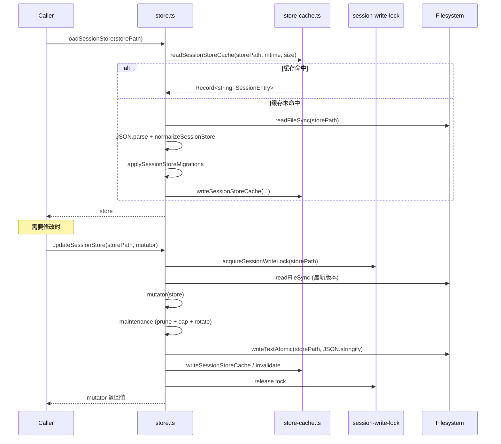
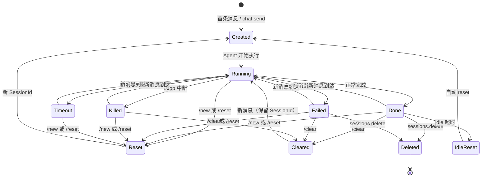
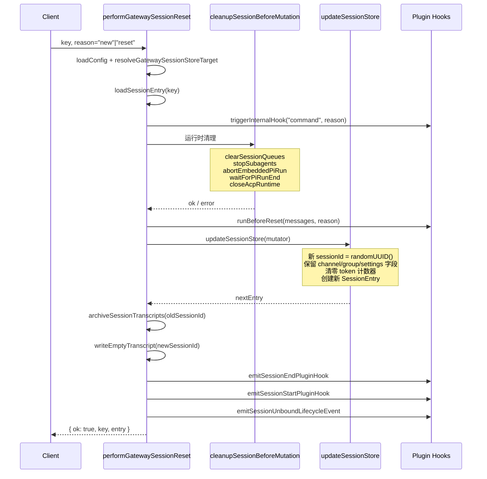
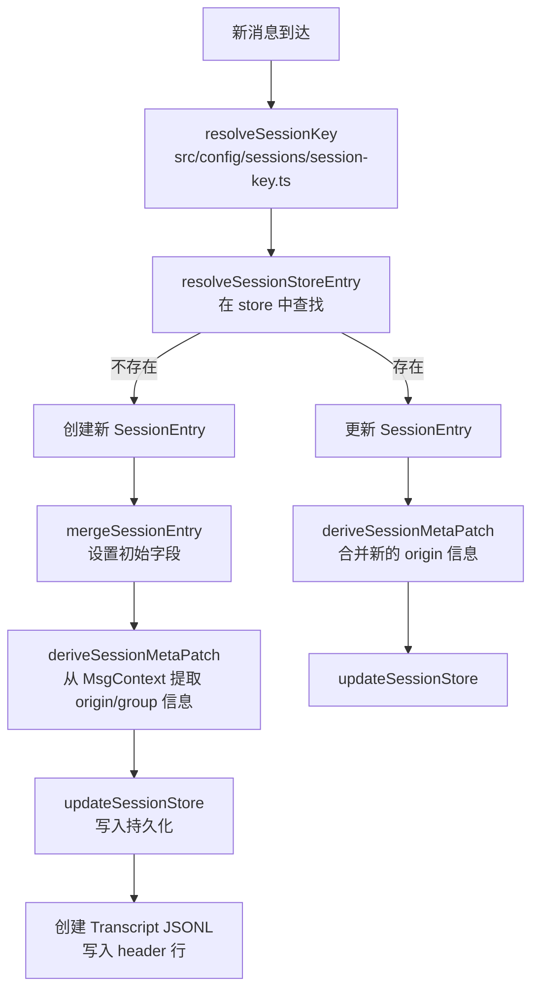

# OC-06 Session 与状态管理

> [!abstract] 概述
> Session 是 OpenClaw Gateway 中对话状态的核心载体。每个 Session 由一个 **SessionKey**（路由标识）+ **SessionEntry**（状态记录）+ **Transcript JSONL 文件**（对话历史）组成。系统通过 JSON 文件持久化 Session Store，支持并发写锁、内存缓存、磁盘预算控制、自动清理和生命周期事件。

**上游**: [[OC-03 配置系统]]（session 配置）、[[OC-08 路由引擎]]（SessionKey 生成）
**下游**: [[OC-04 Agent 执行系统]]（Pi 运行器消费 Session）、[[OC-09 Chat 消息调度]]（调度依赖 Session 状态）

---

## 1. Session 数据模型

### 1.1 SessionEntry 完整字段

`SessionEntry`（`src/config/sessions/types.ts`）是 Session Store 中每个条目的数据结构，包含 60+ 个字段：

#### 核心标识

| 字段          | 类型      | 说明                          |
| :------------ | :-------- | :---------------------------- |
| `sessionId`   | `string`  | UUID v4，每次 reset 重新生成  |
| `sessionFile` | `string?` | Transcript JSONL 文件绝对路径 |
| `updatedAt`   | `number`  | 最后活动时间戳 (epoch ms)     |

#### 运行状态

| 字段             | 类型                                                        | 说明                     |
| :--------------- | :---------------------------------------------------------- | :----------------------- |
| `systemSent`     | `boolean?`                                                  | system prompt 是否已发送 |
| `abortedLastRun` | `boolean?`                                                  | 上次运行是否被中断       |
| `status`         | `"running" \| "done" \| "failed" \| "killed" \| "timeout"?` | 运行状态                 |
| `startedAt`      | `number?`                                                   | 运行开始时间             |
| `endedAt`        | `number?`                                                   | 运行结束时间             |
| `runtimeMs`      | `number?`                                                   | 累计运行耗时             |

#### 模型与 Token

| 字段                       | 类型       | 说明                         |
| :------------------------- | :--------- | :--------------------------- |
| `model`                    | `string?`  | 当前使用的模型               |
| `modelProvider`            | `string?`  | 当前模型提供商               |
| `contextTokens`            | `number?`  | 上下文窗口 token 数          |
| `inputTokens`              | `number?`  | 累计输入 token               |
| `outputTokens`             | `number?`  | 累计输出 token               |
| `totalTokens`              | `number?`  | 总 token                     |
| `totalTokensFresh`         | `boolean?` | totalTokens 是否反映最新快照 |
| `estimatedCostUsd`         | `number?`  | 估算费用                     |
| `cacheRead` / `cacheWrite` | `number?`  | Prompt Cache 读/写 token     |
| `compactionCount`          | `number?`  | Compaction 执行次数          |

#### Session 覆盖

| 字段                                 | 类型                 | 说明            |
| :----------------------------------- | :------------------- | :-------------- |
| `thinkingLevel`                      | `string?`            | 思考级别覆盖    |
| `fastMode`                           | `boolean?`           | 快速模式        |
| `verboseLevel`                       | `string?`            | 详细输出级别    |
| `reasoningLevel` / `elevatedLevel`   | `string?`            | 推理级别        |
| `providerOverride` / `modelOverride` | `string?`            | 模型/提供商覆盖 |
| `authProfileOverride`                | `string?`            | 认证配置覆盖    |
| `sendPolicy`                         | `"allow" \| "deny"?` | 发送策略        |
| `queueMode`                          | `string?`            | 队列模式        |
| `ttsAuto`                            | `TtsAutoMode?`       | TTS 自动模式    |

#### 群组与路由

| 字段                                                        | 类型               | 说明                           |
| :---------------------------------------------------------- | :----------------- | :----------------------------- |
| `chatType`                                                  | `SessionChatType?` | "direct" / "group" / "channel" |
| `channel`                                                   | `string?`          | 关联渠道                       |
| `groupId`                                                   | `string?`          | 群组 ID                        |
| `subject` / `groupChannel` / `space`                        | `string?`          | 群组元数据                     |
| `displayName` / `label`                                     | `string?`          | 显示名称                       |
| `origin`                                                    | `SessionOrigin?`   | 来源元数据                     |
| `deliveryContext`                                           | `DeliveryContext?` | 投递路由上下文                 |
| `lastChannel` / `lastTo` / `lastAccountId` / `lastThreadId` | 各类               | 最近一次投递记录               |

#### SubAgent 关系

| 字段                   | 类型                        | 说明                       |
| :--------------------- | :-------------------------- | :------------------------- |
| `spawnedBy`            | `string?`                   | 父 session key             |
| `spawnedWorkspaceDir`  | `string?`                   | 继承的工作目录             |
| `parentSessionKey`     | `string?`                   | Dashboard 创建的父 session |
| `forkedFromParent`     | `boolean?`                  | 是否已从父 transcript fork |
| `spawnDepth`           | `number?`                   | spawn 深度 (0=main)        |
| `subagentRole`         | `"orchestrator" \| "leaf"?` | 子 agent 角色              |
| `subagentControlScope` | `"children" \| "none"?`     | 控制范围                   |

#### ACP 状态

| 字段  | 类型              | 说明                                                   |
| :---- | :---------------- | :----------------------------------------------------- |
| `acp` | `SessionAcpMeta?` | ACP session 元数据（backend、agent、runtime state 等） |

#### 其他

| 字段                                        | 类型                         | 说明                             |
| :------------------------------------------ | :--------------------------- | :------------------------------- |
| `skillsSnapshot`                            | `SessionSkillSnapshot?`      | 技能快照（prompt + skills 列表） |
| `systemPromptReport`                        | `SessionSystemPromptReport?` | System Prompt 构建报告           |
| `cliSessionIds` / `claudeCliSessionId`      | 各类                         | CLI session 绑定                 |
| `lastHeartbeatText` / `lastHeartbeatSentAt` | 各类                         | 心跳去重                         |

---

## 2. SessionKey vs SessionId

> [!important] 核心区别
> **SessionKey** 是路由层的逻辑标识，**SessionId** 是单次对话的物理标识。

```mermaid
flowchart LR
    SK["SessionKey<br><code>agent:main:telegram:group:12345</code>"] -->|1:N| SID1["SessionId (UUID)<br>当前活跃对话"]
    SK -->|历史| SID2["SessionId (旧)<br>reset 前的对话"]
    SK -->|历史| SID3["SessionId (更旧)<br>...]
    SID1 --> TF1[Transcript JSONL]
    SID2 --> TF2[Archived Transcript]
```

### 2.1 SessionKey 格式

由 `src/config/sessions/session-key.ts` 和 `src/routing/session-key.ts` 共同管理：

| 模式       | 示例                                | 说明                        |
| :--------- | :---------------------------------- | :-------------------------- |
| 主 session | `agent:main:main`                   | 默认直聊                    |
| 群组       | `agent:main:telegram:group:12345`   | Telegram 群组               |
| Channel    | `agent:main:slack:channel:#general` | Slack channel               |
| Global     | `global`                            | 全局共享（scope=global 时） |
| SubAgent   | `agent:main:subagent:helper:uuid`   | 子 agent                    |

核心函数：

- `deriveSessionKey(scope, ctx)` — 根据 scope 和消息上下文派生原始 key
- `resolveSessionKey(scope, ctx, mainKey)` — 规范化为 canonical key（含 agent 前缀）
- `normalizeStoreSessionKey(key)` — `trim().toLowerCase()` 用于 store 查找

### 2.2 SessionId 生命周期

```
创建: randomUUID() → 写入 SessionEntry.sessionId + 创建 Transcript JSONL
Reset: 旧 SessionId 的 transcript 归档 → 新 randomUUID() → 新 transcript
Clear: 保留 SessionId → 归档当前 transcript → 写空 transcript
Delete: 从 store 中移除条目 → 归档 transcript
```

---

## 3. Session Store 实现

### 3.1 持久化格式

Session Store 是一个 JSON 文件，路径为 `~/.openclaw/agents/{agentId}/sessions.json`，结构为 `Record<SessionKey, SessionEntry>`：

```json
{
  "agent:main:main": {
    "sessionId": "550e8400-e29b-41d4-a716-446655440000",
    "updatedAt": 1712400000000,
    "systemSent": true,
    "model": "sonnet-4.6",
    "modelProvider": "anthropic",
    "inputTokens": 15000,
    "outputTokens": 3000,
    "totalTokens": 18000
  },
  "agent:main:telegram:group:123": {
    "sessionId": "...",
    "chatType": "group",
    "channel": "telegram",
    "groupId": "123"
  }
}
```

### 3.2 读写流程



### 3.3 并发控制

- **写锁**: `acquireSessionWriteLock(storePath)` 提供进程内互斥锁，基于 Promise 链实现，确保同一 storePath 的写操作串行执行
- **缓存失效**: 写入后通过 `mtime + sizeBytes` 对比判断缓存是否过期
- **structuredClone**: 读缓存返回深拷贝，防止外部修改污染缓存

### 3.4 Session Store 缓存

`store-cache.ts` 实现了两级缓存：

| 缓存             | 类型                                                | TTL        | 说明                              |
| :--------------- | :-------------------------------------------------- | :--------- | :-------------------------------- |
| Object Cache     | `ExpiringMapCache<storePath, {store, mtime, size}>` | 45s (默认) | 解析后的 JS 对象                  |
| Serialized Cache | `Map<storePath, string>`                            | 无 TTL     | JSON 序列化字符串（用于快速比较） |

TTL 可通过 `OPENCLAW_SESSION_CACHE_TTL_MS` 环境变量覆盖。

---

## 4. Transcript JSONL 格式

每个 Session 对应一个 JSONL (JSON Lines) 文件，位于 `~/.openclaw/agents/{agentId}/sessions/{sessionId}.jsonl`。

### 4.1 文件结构

```jsonl
{"type":"session","version":"2","id":"550e8400-...","timestamp":"2026-04-07T10:00:00Z","cwd":"/Users/user/project"}
{"type":"message","id":"msg-001","parentId":null,"message":{"role":"user","content":"Hello","timestamp":1712400000000}}
{"type":"message","id":"msg-002","parentId":"msg-001","message":{"role":"assistant","content":"Hi!","usage":{"input":100,"output":20}}}
{"type":"message","id":"msg-003","parentId":"msg-002","message":{"role":"user","content":"Tell me about...","MediaPath":"/path/to/image.png"}}
```

### 4.2 关键特性

| 特性      | 说明                                                                             |
| :-------- | :------------------------------------------------------------------------------- |
| Header 行 | 第一行是 session 元数据（type=session, version, id, timestamp, cwd）             |
| DAG 结构  | 消息通过 `parentId` 链接形成有向无环图（非简单线性列表）                         |
| 追加写入  | 只追加不修改（append-only），通过 `SessionManager.appendMessage()` 写入          |
| 文件权限  | `mode: 0o600`（仅 owner 可读写）                                                 |
| Rewrite   | 特殊场景（如补充 media path）通过 `rewriteTranscriptEntriesInSessionFile()` 实现 |

> [!warning] 重要
> 绝不可通过原始 JSONL 写入追加 `type: "message"` 条目——缺少 `parentId` 会断裂叶子路径，破坏 compaction/history 读取。必须通过 `SessionManager.appendMessage()` 写入。

### 4.3 Transcript 归档

当 session reset/clear/delete 时，transcript 文件被归档：

```
sessions/{sessionId}.jsonl → sessions/archive/{sessionId}-{reason}-{timestamp}.jsonl
```

归档由 `session-archive.fs.ts` 的 `archiveSessionTranscripts()` 实现，支持按 retention 时间自动清理旧归档。

---

## 5. Session 生命周期



### 5.1 生命周期状态追踪

`session-lifecycle-state.ts` 负责将 agent 执行事件（start/end/error）映射为 Session 状态变更：

```typescript
function deriveGatewaySessionLifecycleSnapshot(params: {
  session?: Partial<LifecycleSessionShape>;
  event: LifecycleEventLike;
}): GatewaySessionLifecycleSnapshot;
```

| Phase                        | 产出 Status | 说明                                   |
| :--------------------------- | :---------- | :------------------------------------- |
| `start`                      | `"running"` | 清除 endedAt/runtimeMs，设置 startedAt |
| `end` + stopReason="aborted" | `"killed"`  | 用户主动 /stop                         |
| `end` + aborted=true         | `"timeout"` | 超时中断                               |
| `end` (正常)                 | `"done"`    | 正常完成                               |
| `error`                      | `"failed"`  | 执行出错                               |

---

## 6. Reset / Clear / Compact

### 6.1 performGatewaySessionReset

`session-reset-service.ts` 中的核心 reset 流程：



### 6.2 performGatewaySessionClear

Clear 与 Reset 的区别：

|              | Reset                          | Clear                        |
| :----------- | :----------------------------- | :--------------------------- |
| SessionId    | **重新生成**                   | **保留**                     |
| Transcript   | 归档旧的 + 创建新的            | 归档旧的 + 创建空的（同 id） |
| Session 设置 | 保留（model、queue、group 等） | 保留                         |
| Token 计数   | 清零                           | 清零                         |
| 运行时状态   | 清除（status、startedAt 等）   | 清除                         |

### 6.3 clearSessionConversationState

Reset 时保留的字段清单：

```
保留: sessionId, sessionFile, channel, groupId, subject, groupChannel, space,
      origin, deliveryContext, thinkingLevel, fastMode, verboseLevel,
      providerOverride, modelOverride, authProfileOverride, groupActivation,
      sendPolicy, queueMode, chatType, spawnedBy, parentSessionKey,
      label, displayName, ttsAuto, execHost, execSecurity, acp, ...

清除: status, startedAt, endedAt, runtimeMs, estimatedCostUsd,
      cacheRead, cacheWrite, contextTokens, compactionCount,
      memoryFlush*, fallbackNotice*, abortCutoff*, systemPromptReport,
      inputTokens → 0, outputTokens → 0, totalTokens → 0
```

---

## 7. Session 创建流程

当一条新消息到达一个不存在的 session key 时：



### 7.1 Session Origin 推导

`metadata.ts` 的 `deriveSessionOrigin(ctx)` 从消息上下文提取 origin 元数据：

```typescript
type SessionOrigin = {
  label?: string; // 对话标签（如群组名）
  provider?: string; // 渠道提供商（telegram、slack 等）
  surface?: string; // 原始 surface
  chatType?: string; // direct / group / channel
  from?: string; // 发送者
  to?: string; // 接收者
  accountId?: string; // 账号 ID
  threadId?: string | number; // 话题/线程 ID
};
```

Origin 字段采用 **合并策略**（merge，不覆盖已有值），确保群组名等元数据随消息逐渐丰富。

---

## 8. 并发控制与维护

### 8.1 Session Write Lock

`acquireSessionWriteLock(storePath)` 是一个基于 Promise 链的进程内互斥锁。同一 storePath 的写操作自动排队，确保 read-modify-write 原子性。这不是跨进程锁——Gateway 设计为单进程运行。

### 8.2 Store Maintenance

`store-maintenance.ts` 在每次 `updateSessionStore()` 时执行维护：

| 维护项            | 默认值          | 说明                                         |
| :---------------- | :-------------- | :------------------------------------------- |
| Stale Pruning     | 30 天           | 删除 `updatedAt` 超过 `pruneAfterMs` 的条目  |
| Entry Cap         | 500             | 超过 `maxEntries` 时删除最旧条目             |
| File Rotation     | 10 MB           | 当 sessions.json 超过 `rotateBytes` 时轮转   |
| Archive Retention | 等于 pruneAfter | 清理过期的归档 transcript                    |
| Disk Budget       | 无限制          | `maxDiskBytes` 设置后启用，high water 为 80% |

维护模式由 `session.maintenance.mode` 控制：

- `"warn"` (默认) — 仅在活跃 session 将被清理时发出警告
- `"auto"` — 自动执行清理
- `"off"` — 不执行维护

### 8.3 磁盘预算

`disk-budget.ts` 实现了基于总字节数的磁盘空间管理：

```typescript
type SessionDiskBudgetSweepResult = {
  totalBytesBefore: number;
  totalBytesAfter: number;
  removedFiles: number;
  removedEntries: number;
  freedBytes: number;
  maxBytes: number;
  highWaterBytes: number; // 默认 maxBytes * 0.8
  overBudget: boolean;
};
```

当总磁盘占用超过 `maxDiskBytes` 时，按 mtime 从旧到新删除归档 transcript 和 stale session 条目，直到降到 `highWaterBytes` 以下。

---

## 9. 关键文件索引

| 文件                                       | 职责                                                 |
| :----------------------------------------- | :--------------------------------------------------- |
| `src/config/sessions/types.ts`             | SessionEntry、SessionOrigin、SessionScope 等核心类型 |
| `src/config/sessions/store.ts`             | Session Store 读写、规范化、维护                     |
| `src/config/sessions/store-cache.ts`       | 两级缓存（Object + Serialized）                      |
| `src/config/sessions/store-maintenance.ts` | 自动清理（prune + cap + rotate）                     |
| `src/config/sessions/store-migrations.ts`  | Store 格式迁移                                       |
| `src/config/sessions/session-key.ts`       | SessionKey 推导和规范化                              |
| `src/config/sessions/metadata.ts`          | SessionOrigin / Group 元数据推导                     |
| `src/config/sessions/paths.ts`             | Session 文件路径解析                                 |
| `src/config/sessions/disk-budget.ts`       | 磁盘预算管理                                         |
| `src/config/sessions/targets.ts`           | Session target 解析                                  |
| `src/gateway/session-lifecycle-state.ts`   | 生命周期状态机                                       |
| `src/gateway/session-reset-service.ts`     | Reset / Clear / Delete 操作                          |
| `src/gateway/session-utils.ts`             | Session 工具函数（加载、消息读取等）                 |
| `src/gateway/session-utils.types.ts`       | GatewaySessionRow 等 API 类型                        |
| `src/gateway/session-archive.fs.ts`        | Transcript 归档与清理                                |
| `src/gateway/session-transcript-key.ts`    | Transcript key 管理                                  |
| `src/gateway/sessions-patch.ts`            | Session 属性修改 (PATCH)                             |
| `src/gateway/sessions-resolve.ts`          | Session key 解析与 store target                      |

---

> [!seealso] 相关文档
>
> - [[OpenClaw Gateway MOC]] — 知识库总索引
> - [[OC-03 配置系统]] — Session 配置项（scope、idle、maintenance）
> - [[OC-04 Agent 执行系统]] — Pi 运行器与 Session 的交互
> - [[OC-05 SubAgent 与编排]] — SubAgent 的 session spawn 机制
> - [[OC-08 路由引擎]] — SessionKey 的路由层生成逻辑
> - [[OC-09 Chat 消息调度]] — 消息调度对 Session 状态的依赖
