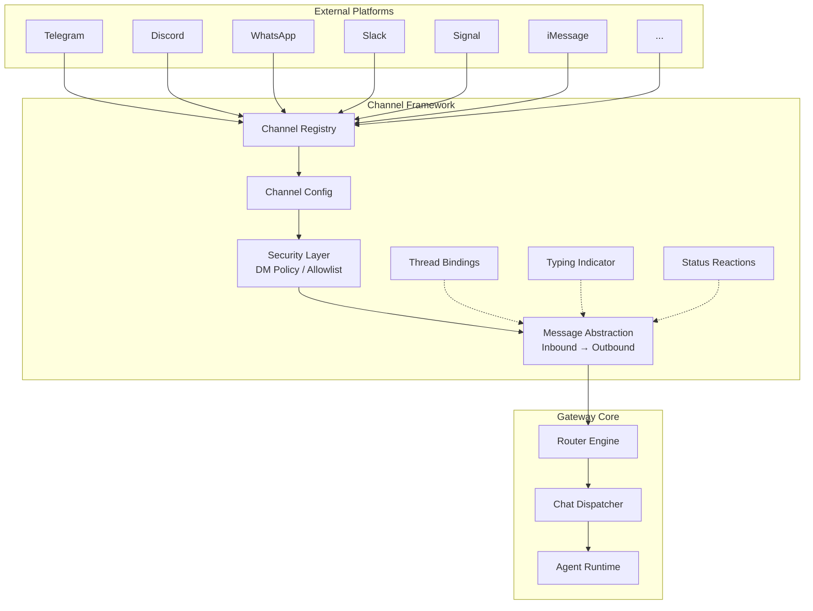
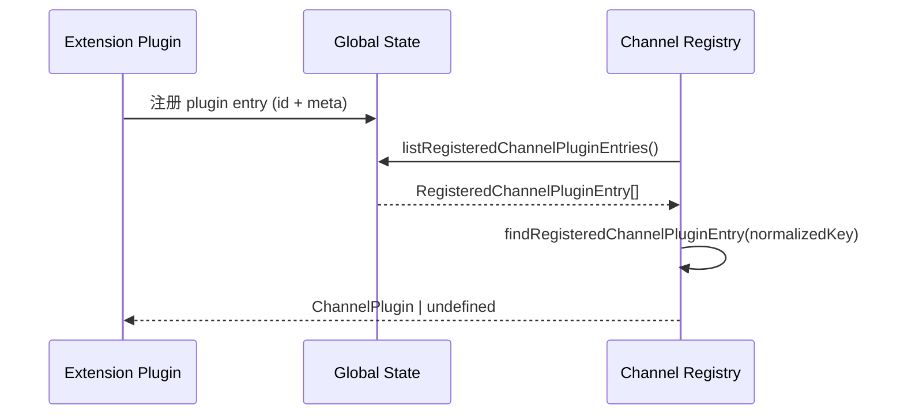
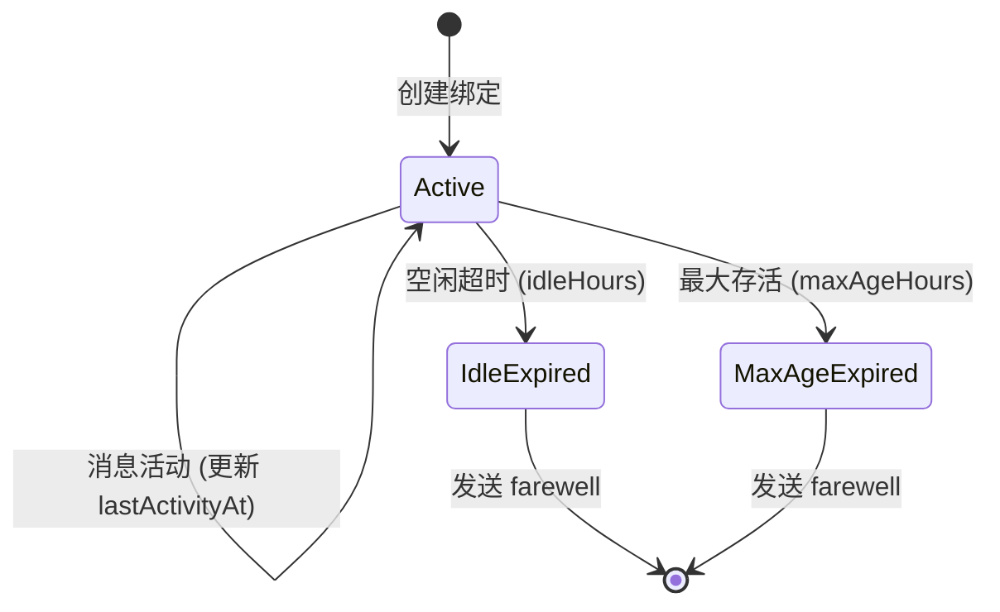

# OC-07 Channel 渠道框架

> [!info] 导航
> 本文档属于 [[OpenClaw Gateway MOC]] 系列。
> 相关文档：[[OC-08 路由引擎]] | [[OC-09 Chat 消息调度]] | [[OC-12 安全与审计系统]]

## 1. 概述

Channel（渠道）是 OpenClaw Gateway 与外部即时通讯平台之间的桥梁层。每个 Channel 封装了一个具体平台（Telegram、Discord、WhatsApp 等）的连接逻辑、消息收发协议和安全策略，通过统一的 `ChannelPlugin` 合约接入 Gateway 核心。

Channel 框架的设计目标：

- **统一抽象**：所有消息平台共享同一套类型接口和生命周期管理
- **插件化架构**：内置渠道和外部插件渠道使用同一套注册发现机制
- **安全优先**：DM Policy、Allowlist、Mention Gating 多层访问控制
- **可观测性**：Status Reaction、Account Snapshot、Health Probe 提供运行时反馈



## 2. Channel 注册与发现

### 2.1 内置 Channel ID 注册表

所有内置渠道 ID 定义在叶子模块 `src/channels/ids.ts` 中，确保共享代码可以引用 ID 而不拉入重量级插件运行时：

```typescript
// src/channels/ids.ts
export const CHAT_CHANNEL_ORDER = [
  "telegram",
  "whatsapp",
  "discord",
  "irc",
  "googlechat",
  "slack",
  "signal",
  "imessage",
  "line",
] as const;

export type ChatChannelId = (typeof CHAT_CHANNEL_ORDER)[number];
```

> [!important] 设计约束
> `CHAT_CHANNEL_ORDER` 定义了内置渠道的 ==默认排序== 和 ==枚举边界==。插件渠道通过 `meta.order` 字段控制排序位置（未指定时默认排在内置渠道之后）。

### 2.2 Channel 元数据注册表

`src/channels/registry.ts` 维护每个内置渠道的 UI 元数据（`CHAT_CHANNEL_META`），包含：

| 字段             | 类型     | 说明               |
| ---------------- | -------- | ------------------ |
| `id`             | `string` | 渠道唯一标识       |
| `label`          | `string` | 用户可见名称       |
| `selectionLabel` | `string` | 选择器中的完整标签 |
| `detailLabel`    | `string` | 详情页标签         |
| `docsPath`       | `string` | 文档路径           |
| `blurb`          | `string` | 一句话简介         |
| `systemImage`    | `string` | SF Symbol 图标名   |

别名机制：

```typescript
export const CHAT_CHANNEL_ALIASES: Record<string, ChatChannelId> = {
  imsg: "imessage",
  "internet-relay-chat": "irc",
  "google-chat": "googlechat",
  gchat: "googlechat",
};
```

### 2.3 Plugin Registry 发现机制

插件渠道通过全局 `Symbol.for("openclaw.pluginRegistryState")` 注册。注册表包含一个 `channels` 数组，每个条目携带 `plugin.id` 和 `plugin.meta.aliases`。



运行时查找使用 `src/channels/plugins/registry.ts` 的缓存策略：

```typescript
// src/channels/plugins/registry.ts
type CachedChannelPlugins = {
  registryVersion: number; // 跟踪 registry 版本
  sorted: ChannelPlugin[]; // 按 CHAT_CHANNEL_ORDER + meta.order 排序
  byId: Map<string, ChannelPlugin>;
};
```

`getChannelPlugin(id)` 和 `listChannelPlugins()` 通过版本号做缓存失效——当插件 registry 版本变化时自动重建。

### 2.4 Bundled Plugin 列表

`src/channels/plugins/bundled.ts` 导出了所有内置渠道插件：

```typescript
export const bundledChannelPlugins = [
  bluebubblesPlugin,
  discordPlugin,
  feishuPlugin,
  imessagePlugin,
  ircPlugin,
  linePlugin,
  mattermostPlugin,
  nextcloudTalkPlugin,
  signalPlugin,
  slackPlugin,
  synologyChatPlugin,
  telegramPlugin,
  zaloPlugin,
] as ChannelPlugin[];
```

## 3. Channel 配置模型

### 3.1 Channel Config 匹配策略

`src/channels/channel-config.ts` 实现了一套三级配置查找策略：


核心类型：

```typescript
export type ChannelMatchSource = "direct" | "parent" | "wildcard";

export type ChannelEntryMatch<T> = {
  entry?: T;
  key?: string;
  wildcardEntry?: T; // "*" 键对应的通配项
  parentEntry?: T; // 父级 key 回退项
  matchKey?: string; // 最终命中的 key
  matchSource?: ChannelMatchSource;
};
```

`resolveChannelEntryMatchWithFallback()` 先尝试精确匹配，再尝试 normalize 后匹配，然后 parent key 回退，最后 wildcard 兜底。支持可选的 `normalizeKey` 转换器（slug 化等）。

### 3.2 Per-Account 配置架构

Plugin SDK 提供三种配置适配器模式：

| 模式      | 适配器工厂                           | 适用场景                                               |
| --------- | ------------------------------------ | ------------------------------------------------------ |
| Scoped    | `createScopedChannelConfigAdapter`   | 多 account 渠道（Discord、Slack）                      |
| Top-Level | `createTopLevelChannelConfigAdapter` | 单 account 渠道（WhatsApp legacy）                     |
| Hybrid    | `createHybridChannelConfigAdapter`   | default account 在根级 + named accounts 在 accounts 下 |

所有适配器都实现 `ChannelConfigAdapter<ResolvedAccount>` 接口：

```typescript
export type ChannelConfigAdapter<ResolvedAccount> = {
  listAccountIds: (cfg: OpenClawConfig) => string[];
  resolveAccount: (cfg: OpenClawConfig, accountId?: string | null) => ResolvedAccount;
  defaultAccountId?: (cfg: OpenClawConfig) => string;
  setAccountEnabled?: (params) => OpenClawConfig;
  deleteAccount?: (params) => OpenClawConfig;
  isEnabled?: (account, cfg) => boolean;
  isConfigured?: (account, cfg) => boolean | Promise<boolean>;
  describeAccount?: (account, cfg) => ChannelAccountSnapshot;
  resolveAllowFrom?: (params) => Array<string | number> | undefined;
  formatAllowFrom?: (params) => string[];
  resolveDefaultTo?: (params) => string | undefined;
};
```

### 3.3 Config Presence 检测

`src/channels/config-presence.ts` 提供 `listPotentialConfiguredChannelIds()` 函数，综合检测：

1. YAML 配置文件中 `channels.*` 下的非空配置段
2. 环境变量前缀匹配（如 `TELEGRAM_*`、`DISCORD_*`）
3. WhatsApp OAuth 凭据目录存在性

```typescript
const CHANNEL_ENV_PREFIXES = [
  ["BLUEBUBBLES_", "bluebubbles"],
  ["DISCORD_", "discord"],
  ["TELEGRAM_", "telegram"],
  // ... 共 14 组
] as const;
```

## 4. 消息抽象层

### 4.1 ChannelPlugin 完整合约

`ChannelPlugin` 是每个渠道的核心契约类型，定义在 `src/channels/plugins/types.plugin.ts`：

```typescript
export type ChannelPlugin<ResolvedAccount = any, Probe = unknown, Audit = unknown> = {
  id: ChannelId;
  meta: ChannelMeta;
  capabilities: ChannelCapabilities;

  // 配置 & 生命周期
  config: ChannelConfigAdapter<ResolvedAccount>;
  setup?: ChannelSetupAdapter;
  lifecycle?: ChannelLifecycleAdapter;

  // 安全 & 访问控制
  security?: ChannelSecurityAdapter<ResolvedAccount>;
  pairing?: ChannelPairingAdapter;
  allowlist?: ChannelAllowlistAdapter;

  // 消息收发
  outbound?: ChannelOutboundAdapter;
  messaging?: ChannelMessagingAdapter;
  threading?: ChannelThreadingAdapter;
  streaming?: ChannelStreamingAdapter;
  actions?: ChannelMessageActionAdapter;

  // 群组 & 提及
  groups?: ChannelGroupAdapter;
  mentions?: ChannelMentionAdapter;

  // 状态 & 运维
  status?: ChannelStatusAdapter<ResolvedAccount, Probe, Audit>;
  gateway?: ChannelGatewayAdapter<ResolvedAccount>;
  heartbeat?: ChannelHeartbeatAdapter;
  auth?: ChannelAuthAdapter;
  directory?: ChannelDirectoryAdapter;

  // Agent 扩展
  agentPrompt?: ChannelAgentPromptAdapter;
  agentTools?: ChannelAgentToolFactory | ChannelAgentTool[];
  commands?: ChannelCommandAdapter;
  execApprovals?: ChannelExecApprovalAdapter;
  bindings?: ChannelConfiguredBindingProvider;
};
```

### 4.2 Channel Capabilities 声明

每个渠道声明其静态能力标志：

```typescript
export type ChannelCapabilities = {
  chatTypes: Array<ChatType | "thread">; // "direct" | "group" | "channel" | "thread"
  polls?: boolean;
  reactions?: boolean;
  edit?: boolean;
  unsend?: boolean;
  reply?: boolean;
  effects?: boolean;
  groupManagement?: boolean;
  threads?: boolean;
  media?: boolean;
  nativeCommands?: boolean;
  blockStreaming?: boolean; // 是否需要 block-coalesce streaming
};
```

### 4.3 出站适配器（Outbound Adapter）

`ChannelOutboundAdapter` 定义了消息发送的完整通道：

```typescript
export type ChannelOutboundAdapter = {
  deliveryMode: "direct" | "gateway" | "hybrid";
  chunker?: ((text: string, limit: number) => string[]) | null;
  chunkerMode?: "text" | "markdown";
  textChunkLimit?: number;
  pollMaxOptions?: number;

  resolveTarget?: (params) => { ok: true; to: string } | { ok: false; error: Error };
  sendPayload?: (ctx: ChannelOutboundPayloadContext) => Promise<OutboundDeliveryResult>;
  sendFormattedText?: (ctx) => Promise<OutboundDeliveryResult[]>;
  sendFormattedMedia?: (ctx) => Promise<OutboundDeliveryResult>;
  sendText?: (ctx) => Promise<OutboundDeliveryResult>;
  sendMedia?: (ctx) => Promise<OutboundDeliveryResult>;
  sendPoll?: (ctx: ChannelPollContext) => Promise<ChannelPollResult>;
};
```

> [!tip] deliveryMode 策略
>
> - `direct`：渠道插件自己直接调用平台 API（大多数内置渠道）
> - `gateway`：通过 Gateway RPC 代理发送
> - `hybrid`：根据场景选择

### 4.4 消息 Target 解析

`src/channels/targets.ts` 定义了统一的消息目标解析模型：

```typescript
export type MessagingTargetKind = "user" | "channel";

export type MessagingTarget = {
  kind: MessagingTargetKind;
  id: string;
  raw: string;
  normalized: string; // "user:123" 或 "channel:general"
};
```

解析链：`parseTargetMention` -> `parseTargetPrefixes` -> `parseAtUserTarget` -> `parseMentionPrefixOrAtUserTarget`。

### 4.5 ChatType 标准化

```typescript
// src/channels/chat-type.ts
export type ChatType = "direct" | "group" | "channel";
```

`normalizeChatType()` 将 `"dm"` 映射为 `"direct"`，其他原样通过。

## 5. DM Policy 与 Allow-From

### 5.1 DM Policy 机制

每个渠道通过 `ChannelSecurityAdapter.resolveDmPolicy()` 声明其 DM 访问策略：

```typescript
export type ChannelSecurityDmPolicy = {
  policy: string; // "open" | "allowlist" | "pairing"
  allowFrom?: Array<string | number> | null;
  policyPath?: string; // config 中策略字段的路径
  allowFromPath: string; // config 中 allowFrom 的路径
  approveHint: string; // 配对提示文本
  normalizeEntry?: (raw: string) => string;
};
```

### 5.2 Allow-From 合并策略

`src/channels/allow-from.ts` 负责合并多来源的 allowlist：

```typescript
export function mergeDmAllowFromSources(params: {
  allowFrom?: Array<string | number>; // config 中的静态列表
  storeAllowFrom?: Array<string | number>; // 运行时 pairing store 中的动态列表
  dmPolicy?: string; // 当 policy="allowlist" 时忽略 store
}): string[];
```

> [!warning] 策略区别
> 当 `dmPolicy === "allowlist"` 时，==只使用配置文件中的静态列表==；当 policy 为 `"pairing"` 或 `"open"` 时，动态 store 中通过配对添加的条目也生效。

Group allowFrom 有独立的解析逻辑：

```typescript
export function resolveGroupAllowFromSources(params: {
  allowFrom?: Array<string | number>;
  groupAllowFrom?: Array<string | number>;
  fallbackToAllowFrom?: boolean; // 无独立群组 allowlist 时是否回退到 DM 的
}): string[];
```

### 5.3 Allowlist 匹配引擎

`src/channels/allowlist-match.ts` 实现了多源候选匹配：

```typescript
export type AllowlistMatchSource =
  | "wildcard"
  | "id"
  | "name"
  | "tag"
  | "username"
  | "prefixed-id"
  | "prefixed-user"
  | "prefixed-name"
  | "slug"
  | "localpart";

export type CompiledAllowlist = {
  set: ReadonlySet<string>; // 预编译的 Set
  wildcard: boolean; // 是否包含 "*"
};
```

匹配优先级：`wildcard` > 精确 id > name 匹配（需 `allowNameMatching` 开启）。

### 5.4 Sender Identity 验证

`src/channels/sender-identity.ts` 在消息入站时验证发送者身份完整性：

```typescript
export function validateSenderIdentity(ctx: MsgContext): string[];
// 检查项：
// - 群组消息必须有 SenderId/SenderName/SenderUsername/SenderE164 之一
// - SenderE164 必须匹配 E.164 格式（+开头，至少 3 位数字）
// - SenderUsername 不应包含 @ 或空白
```

## 6. Thread Bindings

### 6.1 概念模型

Thread Binding 将一个平台线程（如 Discord thread、Matrix thread）绑定到一个 OpenClaw Session，使该线程内的所有消息直接路由到绑定的会话。



### 6.2 配置模型

`src/channels/thread-bindings-policy.ts` 定义了多层配置解析：

```
session.threadBindings.*            → 全局默认
channels.{channel}.threadBindings.* → 渠道级覆盖
channels.{channel}.accounts.{id}.threadBindings.* → Account 级覆盖
```

关键配置项：

| 配置项                  | 类型      | 默认值    | 说明                                |
| ----------------------- | --------- | --------- | ----------------------------------- |
| `enabled`               | `boolean` | `true`    | 是否启用线程绑定                    |
| `idleHours`             | `number`  | `24`      | 空闲超时（小时）                    |
| `maxAgeHours`           | `number`  | `0`(禁用) | 最大存活时间（小时）                |
| `spawnSubagentSessions` | `boolean` | 渠道相关  | 是否允许在绑定线程内 spawn 子 agent |
| `spawnAcpSessions`      | `boolean` | 渠道相关  | 是否允许 spawn ACP session          |

> [!note] Discord / Matrix 特殊处理
> Discord 和 Matrix 的 `spawnSubagentSessions` 和 `spawnAcpSessions` ==默认关闭==（`false`），其他渠道默认开启。这是因为 Discord/Matrix 的线程模型天然就是"一个线程 = 一个对话上下文"。

### 6.3 生命周期管理

```typescript
export type ThreadBindingSpawnKind = "subagent" | "acp";

export type ThreadBindingSpawnPolicy = {
  channel: string;
  accountId: string;
  enabled: boolean; // 是否允许创建绑定
  spawnEnabled: boolean; // 是否允许在绑定内 spawn 子会话
};
```

生命周期到期判定（`resolveThreadBindingLifecycle`）：

```typescript
// 返回最早到期的时间点和原因
{ expiresAt?: number; reason?: "idle-expired" | "max-age-expired" }
```

### 6.4 线程消息格式

`src/channels/thread-bindings-messages.ts` 提供线程绑定的 intro 和 farewell 消息模板：

- **Intro**：`"[agent] session active (idle auto-unfocus after 24h inactivity). Messages here go directly to this session."`
- **Farewell**：根据过期原因动态生成，如 `"Session ended automatically after 24h of inactivity."`
- **Thread Name**：限制在 100 字符内，格式为 `"🤖 [agent label]"`

### 6.5 Binding ID 解析

`src/channels/thread-binding-id.ts` 从 binding ID 中提取 conversation ID：

```typescript
// bindingId 格式: "{accountId}:{conversationId}"
resolveThreadBindingConversationIdFromBindingId({ accountId, bindingId });
```

## 7. Typing 指示器

### 7.1 架构

Typing 系统采用三层设计：

```mermaid
graph TB
    A[createTypingCallbacks] --> B[TypingStartGuard]
    A --> C[TypingKeepaliveLoop]
    A --> D[TTL Safety Timer]

    B -->|"连续失败 ≥ 2 次"| E[Trip: 停止 keepalive]
    C -->|"每 3s 一次"| F[Platform start() API]
    D -->|"60s 超时"| G[Auto-stop]
```

### 7.2 TypingCallbacks 主控制器

`src/channels/typing.ts` 是 typing 的统一入口：

```typescript
export type TypingCallbacks = {
  onReplyStart: () => Promise<void>; // Agent 开始生成回复时调用
  onIdle?: () => void; // Agent 空闲时停止 typing
  onCleanup?: () => void; // NO_REPLY 等场景清理
};

export type CreateTypingCallbacksParams = {
  start: () => Promise<void>; // 平台 API: 开始 typing
  stop?: () => Promise<void>; // 平台 API: 停止 typing
  onStartError: (err: unknown) => void;
  keepaliveIntervalMs?: number; // 默认 3000ms
  maxConsecutiveFailures?: number; // 默认 2
  maxDurationMs?: number; // TTL 安全上限, 默认 60000ms
};
```

### 7.3 Start Guard 断路器

`src/channels/typing-start-guard.ts` 实现断路器模式：

```typescript
export type TypingStartGuard = {
  run: (start) => Promise<"started" | "skipped" | "failed" | "tripped">;
  reset: () => void;
  isTripped: () => boolean;
};
```

当连续失败次数达到 `maxConsecutiveFailures` 时触发 trip，之后所有 typing 调用直接 skip。`reset()` 在每次新的 reply 开始时调用。

### 7.4 Keepalive Loop

`src/channels/typing-lifecycle.ts` 使用 `setInterval` 持续发送 typing 信号：

- 防重入：`tickInFlight` 标志位避免并发 tick
- 可控停止：`stop()` 清除 timer 并重置状态

## 8. Mention 触发

### 8.1 Mention Gating

`src/channels/mention-gating.ts` 决定群组消息是否需要 @ 提及才响应：

```typescript
export type MentionGateParams = {
  requireMention: boolean; // 群组配置是否要求 mention
  canDetectMention: boolean; // 渠道是否支持 mention 检测
  wasMentioned: boolean; // 本条消息是否被 mention
  implicitMention?: boolean; // 隐式 mention（如 reply 引用）
  shouldBypassMention?: boolean; // 控制命令绕过
};
```

**绕过条件**（`resolveMentionGatingWithBypass`）：在群组中，当 `requireMention=true` 但用户未 mention bot，如果用户发送了一个授权的控制命令（如 `/reset`），则绕过 mention 要求。

### 8.2 Mention 清理

每个渠道通过 `ChannelMentionAdapter` 提供 mention 文本清理逻辑：

```typescript
export type ChannelMentionAdapter = {
  stripRegexes?: (params) => RegExp[]; // 正则列表
  stripPatterns?: (params) => string[]; // 精确字符串列表
  stripMentions?: (params) => string; // 自定义清理函数
};
```

## 9. Status Reactions

### 9.1 概念

Status Reaction 通过消息 Emoji 反应向用户反馈 Agent 当前处理阶段。这是 OpenClaw 的特色 UX 设计——用户在发消息后可以通过表情变化实时了解 agent 状态。

### 9.2 状态阶段与 Emoji

```typescript
export const DEFAULT_EMOJIS: Required<StatusReactionEmojis> = {
  queued: "👀", // 排队中
  thinking: "🤔", // 思考中（LLM 推理）
  tool: "🔥", // 工具调用（通用）
  coding: "👨‍💻", // 代码执行工具
  web: "⚡", // 网络搜索/抓取
  done: "👍", // 完成
  error: "😱", // 出错
  stallSoft: "🥱", // 轻度卡顿 (10s)
  stallHard: "😨", // 严重卡顿 (30s)
  compacting: "✍", // 上下文压缩
};
```

### 9.3 控制器特性

`createStatusReactionController()` 提供：

- **Promise 串行化**：通过 chain promise 防止 API 竞态
- **去抖动**：中间状态（thinking/tool）带 ==700ms debounce==，终态（done/error）立即生效
- **Stall 检测**：10s 无进展切 `stallSoft`，30s 切 `stallHard`
- **终态保护**：done/error 之后忽略后续更新
- **工具 Emoji 路由**：

```typescript
// 根据工具名自动选择 emoji
export function resolveToolEmoji(toolName: string, emojis): string {
  if (WEB_TOOL_TOKENS.some((t) => normalized.includes(t))) return emojis.web;
  if (CODING_TOOL_TOKENS.some((t) => normalized.includes(t))) return emojis.coding;
  return emojis.tool;
}
```

### 9.4 Ack Reaction 系统

`src/channels/ack-reactions.ts` 管理收到消息后的确认反应：

```typescript
export type AckReactionScope =
  | "all" // 所有消息
  | "direct" // 仅 DM
  | "group-all" // 所有群组消息
  | "group-mentions" // 仅群组中被 mention 的消息
  | "off"
  | "none"; // 关闭
```

> [!note] 默认行为
> 默认 scope 为 `"group-mentions"`——只在群组中被明确 mention 时才做 ack reaction。

## 10. 模型覆盖

### 10.1 Per-Channel Model Override

`src/channels/model-overrides.ts` 允许按渠道、按群组覆盖 AI 模型：

```yaml
# config.yaml 示例
channels:
  modelByChannel:
    discord:
      "server-a:channel-general": "anthropic/sonnet-4.6"
      "*": "openai/gpt-5.4"
    telegram:
      "my-group-id": "anthropic/sonnet-4"
```

### 10.2 解析逻辑

```typescript
export type ChannelModelOverride = {
  channel: string;
  model: string;
  matchKey?: string;
  matchSource?: ChannelMatchSource; // "direct" | "parent" | "wildcard"
};
```

查找候选键生成（`buildChannelCandidates`）：

1. `groupId` 精确匹配
2. 父级 groupId（移除 `:thread:xxx` 后缀）
3. 从 parentSessionKey 提取的 groupId
4. `groupChannel` / `groupSubject`（原值、去 `#` 前缀、slug 化）

最终通过 `resolveChannelEntryMatchWithFallback` 在 `direct -> parent -> wildcard` 三级回退。

## 11. Account Snapshot

### 11.1 快照模型

`ChannelAccountSnapshot` 是渠道账户的运行时状态快照，用于 status 命令、Deck 仪表盘和健康检查：

```typescript
export type ChannelAccountSnapshot = {
  accountId: string;
  name?: string;
  enabled?: boolean;
  configured?: boolean;
  linked?: boolean; // 是否已链接/登录
  running?: boolean; // Gateway 运行中
  connected?: boolean; // 与平台连接正常
  reconnectAttempts?: number;
  lastInboundAt?: number; // 最后收到消息时间
  lastOutboundAt?: number; // 最后发出消息时间
  healthState?: string; // 健康状态标签
  busy?: boolean; // 当前有活跃 run
  activeRuns?: number; // 并发 run 数量
  lastRunActivityAt?: number;
  mode?: string;
  dmPolicy?: string;
  allowFrom?: string[];

  // Credential 状态
  tokenStatus?: string; // "available" | "configured_unavailable" | "missing"
  botTokenStatus?: string;
  appTokenStatus?: string;
  signingSecretStatus?: string;
  tokenSource?: string; // credential 来源标识

  // 平台特定
  probe?: unknown; // 平台探测结果
  audit?: unknown; // 审计结果
  application?: unknown; // Discord/Slack app info
  bot?: unknown; // bot profile
};
```

### 11.2 安全投影

`src/channels/account-snapshot-fields.ts` 提供安全的字段投影，确保只暴露非敏感字段：

- `projectSafeChannelAccountSnapshotFields()`：从原始 account 对象投影安全字段
- `projectCredentialSnapshotFields()`：只投影 credential ==状态== 和 ==来源==，不投影实际 credential 值
- URL 字段通过 `stripUrlUserInfo()` 清理 userinfo

### 11.3 Account Summary 构建

`src/channels/account-summary.ts` 组合快照构建流程：

```typescript
export function buildChannelAccountSnapshot(params: {
  plugin: ChannelPlugin;
  account: unknown;
  cfg: OpenClawConfig;
  accountId: string;
  enabled: boolean;
  configured: boolean;
}): ChannelAccountSnapshot;
```

该函数合并：安全投影字段 + plugin.config.describeAccount() 输出 + enabled/configured 状态。

### 11.4 Run State Machine

`src/channels/run-state-machine.ts` 管理渠道账户的 busy/idle 状态：

```typescript
const machine = createRunStateMachine({
  setStatus: (patch) => {
    /* 更新 account snapshot */
  },
  abortSignal,
  heartbeatMs: 60_000, // 活跃时每 60s 发一次心跳
});

machine.onRunStart(); // activeRuns++, busy=true
machine.onRunEnd(); // activeRuns--, 为 0 时 busy=false
```

## 12. 支持的 Channel 清单

### 12.1 内置渠道（Built-in）

| Channel     | ID           | 协议类型          | DM  | Group | Thread | 备注             |
| ----------- | ------------ | ----------------- | --- | ----- | ------ | ---------------- |
| Telegram    | `telegram`   | Bot API (polling) | Y   | Y     | N      | 最简单的入门渠道 |
| WhatsApp    | `whatsapp`   | QR Web Link       | Y   | Y     | N      | 推荐独立号码     |
| Discord     | `discord`    | Bot API (Gateway) | Y   | Y     | Y      | Thread Binding   |
| IRC         | `irc`        | Server + Nick     | Y   | Y     | N      | 经典 IRC 网络    |
| Google Chat | `googlechat` | Chat API (HTTP)   | Y   | Y     | N      | Workspace 集成   |
| Slack       | `slack`      | Socket Mode       | Y   | Y     | Y      | Thread Binding   |
| Signal      | `signal`     | signal-cli REST   | Y   | Y     | N      | 需 linked device |
| iMessage    | `imessage`   | BlueBubbles/imsg  | Y   | Y     | N      | macOS only WIP   |
| LINE        | `line`       | Messaging API     | Y   | Y     | N      | Webhook bot      |

### 12.2 Bundled 插件渠道

| Channel        | 插件 ID          | 备注              |
| -------------- | ---------------- | ----------------- |
| BlueBubbles    | `bluebubbles`    | iMessage 替代方案 |
| Feishu         | `feishu`         | 飞书              |
| Mattermost     | `mattermost`     | 自建 Slack 替代   |
| Nextcloud Talk | `nextcloud-talk` | Nextcloud 通讯    |
| Synology Chat  | `synology-chat`  | 群晖聊天          |
| Zalo           | `zalo`           | 越南社交平台      |

### 12.3 外部插件渠道（Extensions）

通过 `extensions/` 目录提供，用户可通过 npm 安装：

| Channel    | 扩展包                  | 备注             |
| ---------- | ----------------------- | ---------------- |
| MS Teams   | `extensions/msteams`    | Microsoft Teams  |
| Matrix     | `extensions/matrix`     | 去中心化聊天协议 |
| WeCom      | `extensions/wecom`      | 企业微信         |
| Zalo User  | `extensions/zalouser`   | Zalo 用户模式    |
| Voice Call | `extensions/voice-call` | 语音通话         |
| Nostr      | `extensions/nostr`      | Nostr 协议       |
| Twitch     | `extensions/twitch`     | Twitch 直播聊天  |
| QQ Bot     | `extensions/qqbot`      | QQ 机器人        |

### 12.4 辅助模块

| 模块                  | 路径                                      | 作用                           |
| --------------------- | ----------------------------------------- | ------------------------------ |
| Draft Stream Controls | `src/channels/draft-stream-controls.ts`   | 流式回复草稿管理               |
| Conversation Label    | `src/channels/conversation-label.ts`      | 会话标签解析                   |
| Location              | `src/channels/location.ts`                | 地理位置消息标准化             |
| Inbound Debounce      | `src/channels/inbound-debounce-policy.ts` | 入站消息去抖策略               |
| Reply Prefix          | `src/channels/reply-prefix.ts`            | 回复前缀模板（identity/model） |
| Command Gating        | `src/channels/command-gating.ts`          | 控制命令授权门控               |
| Sender Label          | `src/channels/sender-label.ts`            | 发送者显示名称解析             |
| Session Envelope      | `src/channels/session-envelope.ts`        | 入站消息信封上下文             |

---

> [!abstract] 要点总结
>
> - Channel 框架是 OpenClaw 的消息入口层，每个渠道通过 `ChannelPlugin` 合约注册
> - 配置模型支持三级匹配（direct / parent / wildcard）和三种 account 架构
> - 安全层提供 DM Policy、Allowlist、Mention Gating 三重防护
> - Thread Binding 支持会话级线程绑定，带空闲超时和最大存活控制
> - Status Reaction 系统提供实时 UX 反馈，含去抖、串行化和 stall 检测
> - 内置 9 个核心渠道 + 6 个 bundled 插件 + 8+ 个外部扩展插件
