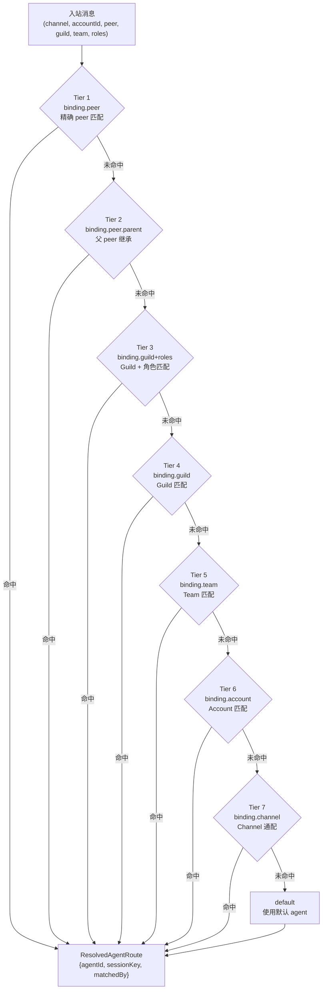

# OC-08 路由引擎

## 概述

路由引擎是 OpenClaw Gateway 的核心组件，负责将每条入站消息（来自 Telegram、Discord、Slack 等渠道）映射到一个具体的 **agent + session**。路由结果决定了：

1. 哪个 agent 处理此消息
2. 使用哪个 session key（进而决定对话上下文隔离）
3. session 相关的持久化存储路径

核心模块位于 `src/routing/`：

| 文件                          | 职责                                     |
| ----------------------------- | ---------------------------------------- |
| `resolve-route.ts`            | 路由主引擎：binding 评估、缓存、结果生成 |
| `session-key.ts`              | Session key 构建与解析、agent ID 规范化  |
| `account-id.ts`               | Account ID 规范化与缓存                  |
| `bindings.ts`                 | Binding 配置读取、account 枚举           |
| `account-lookup.ts`           | Account entry 模糊查找                   |
| `default-account-warnings.ts` | 默认 account 配置提示格式化              |

## 路由评估层级

路由引擎按 **7 层优先级**（tiers）顺序评估 binding 规则，首个匹配即返回：



### 各层详解

| Tier | matchedBy             | 条件                                    | 适用场景                        |
| ---- | --------------------- | --------------------------------------- | ------------------------------- |
| 1    | `binding.peer`        | peer 非空且匹配 binding 的 `match.peer` | 特定群组/频道绑定到专属 agent   |
| 2    | `binding.peer.parent` | 线程的父 peer 匹配（peer 本身未命中）   | 线程继承父频道的 agent 绑定     |
| 3    | `binding.guild+roles` | guildId 匹配且用户拥有指定角色之一      | Discord 服务器按角色路由        |
| 4    | `binding.guild`       | guildId 匹配（无角色约束）              | Discord 服务器级别路由          |
| 5    | `binding.team`        | teamId 匹配                             | Slack workspace / MS Teams 路由 |
| 6    | `binding.account`     | accountId 精确匹配（非 `*`）            | 特定 bot account 绑定           |
| 7    | `binding.channel`     | accountPattern 为 `*`                   | 整个渠道的默认 agent            |

### 评估输入

```typescript
type ResolveAgentRouteInput = {
  cfg: OpenClawConfig;
  channel: string; // 渠道标识：telegram, discord, slack, ...
  accountId?: string | null; // Bot account ID
  peer?: RoutePeer | null; // 对话对端 {kind: ChatType, id: string}
  parentPeer?: RoutePeer | null; // 线程父 peer（用于 Tier 2 继承）
  guildId?: string | null; // Discord guild ID / 平台组织 ID
  teamId?: string | null; // Slack team / MS Teams tenant
  memberRoleIds?: string[]; // Discord 角色 ID 列表
};
```

### 评估结果

```typescript
type ResolvedAgentRoute = {
  agentId: string; // 匹配到的 agent ID
  channel: string; // 规范化后的渠道
  accountId: string; // 规范化后的 account ID
  sessionKey: string; // 内部 session key（用于持久化+并发）
  mainSessionKey: string; // 主 session key（DM 折叠用）
  lastRoutePolicy: "main" | "session"; // 入站 last-route 更新目标
  matchedBy: string; // 命中的层级标识（调试用）
};
```

## RoutingRule Schema (AgentBindingMatch)

Binding 在 `config.bindings` 数组中定义：

```yaml
bindings:
  - agentId: support
    match:
      channel: telegram
      accountId: "123456789"
      peer:
        kind: group # direct | group | channel
        id: "-1001234567890"
      guildId: "987654321" # Discord guild
      teamId: "T0123456" # Slack team
      roles: # Discord 角色（any-of 匹配）
        - "1111111111"
        - "2222222222"
```

### 规范化规则

| 字段                 | 规范化                                                          |
| -------------------- | --------------------------------------------------------------- |
| `channel`            | `trim().toLowerCase()`                                          |
| `accountId`          | `normalizeAccountId()` → 小写，非法字符替换为 `-`，最长 64 字符 |
| `peer.kind`          | `normalizeChatType()` → `"direct"`, `"group"`, `"channel"`      |
| `peer.id`            | `trim()`，保留原始大小写                                        |
| `guildId` / `teamId` | `trim()`                                                        |
| `roles`              | 原样保留（字符串数组）                                          |

### Peer Kind 匹配

`group` 和 `channel` 被视为可互换（`peerKindMatches`）：

```
group ↔ channel  →  true
group ↔ direct   →  false
channel ↔ direct →  false
```

### Binding 索引结构

为避免对每条消息遍历所有 binding，引擎构建了多级索引：

```typescript
type EvaluatedBindingsIndex = {
  byPeer: Map<string, EvaluatedBinding[]>; // "group:123" → bindings
  byGuildWithRoles: Map<string, EvaluatedBinding[]>; // guildId → bindings
  byGuild: Map<string, EvaluatedBinding[]>; // guildId → bindings (no roles)
  byTeam: Map<string, EvaluatedBinding[]>; // teamId → bindings
  byAccount: EvaluatedBinding[]; // 精确 account 匹配
  byChannel: EvaluatedBinding[]; // 通配 account (*)
};
```

## Session Key 生成规则

Session key 是 OpenClaw 持久化和并发控制的核心标识。

### 基本格式

```
agent:<agentId>:<rest>
```

### 所有 Key 变体

| 场景                              | Key 格式                                                | 示例                                      |
| --------------------------------- | ------------------------------------------------------- | ----------------------------------------- |
| **Main session**                  | `agent:<agentId>:main`                                  | `agent:main:main`                         |
| **DM (main scope)**               | `agent:<agentId>:main`                                  | `agent:support:main`                      |
| **DM (per-peer)**                 | `agent:<agentId>:direct:<peerId>`                       | `agent:main:direct:user123`               |
| **DM (per-channel-peer)**         | `agent:<agentId>:<channel>:direct:<peerId>`             | `agent:main:telegram:direct:user123`      |
| **DM (per-account-channel-peer)** | `agent:<agentId>:<channel>:<accountId>:direct:<peerId>` | `agent:main:telegram:bot1:direct:user123` |
| **Group/Channel**                 | `agent:<agentId>:<channel>:<kind>:<peerId>`             | `agent:main:discord:group:123456`         |
| **Thread**                        | `<baseKey>:thread:<threadId>`                           | `agent:main:discord:group:123:thread:456` |
| **SubAgent**                      | `agent:<agentId>:subagent:<uuid>`                       | `agent:main:subagent:a1b2c3d4-...`        |
| **Cron**                          | `agent:<agentId>:cron:<cronId>`                         | `agent:ops:cron:daily-report`             |

### Agent ID 规范化

```typescript
function normalizeAgentId(value: string): string {
  // 合法: /^[a-z0-9][a-z0-9_-]{0,63}$/i → toLowerCase()
  // 非法: 替换非法字符为 "-"，去除首尾 "-"，截断 64 字符
  // 空值: 返回 DEFAULT_AGENT_ID = "main"
}
```

### Agent 解析

`pickFirstExistingAgentId(cfg, agentId)` 按以下优先级返回 agentId：

1. 在 `agents.list` 中找到匹配的（规范化后比较）→ 返回配置中的 ID
2. 未找到 → 返回 `resolveDefaultAgentId(cfg)`（即配置的默认 agent）

## DM Scope 配置

`session.dmScope` 控制 DM 消息的 session 隔离粒度：

| dmScope 值                 | Session Key 包含                       | 隔离效果                       |
| -------------------------- | -------------------------------------- | ------------------------------ |
| `main`（默认）             | 仅 agentId                             | 所有 DM 共享同一 session       |
| `per-peer`                 | agentId + peerId                       | 每个联系人独立 session         |
| `per-channel-peer`         | agentId + channel + peerId             | 同一人在不同渠道有独立 session |
| `per-account-channel-peer` | agentId + channel + accountId + peerId | 最细粒度隔离                   |

> [!tip] 选择建议
>
> - 个人使用：`main`（单一对话流）
> - 多用户服务：`per-peer` 或 `per-channel-peer`
> - 多 bot 多渠道：`per-account-channel-peer`

## Identity Links

Identity Links 允许将不同渠道的用户身份合并到同一 session。

### 配置

```yaml
session:
  dmScope: per-peer
  identityLinks:
    alice: # canonical name
      - "telegram:123" # channel-scoped ID
      - "456" # bare ID (matches any channel)
    bob:
      - "discord:789"
      - "slack:U0123"
```

### 解析逻辑

`resolveLinkedPeerId()` 的匹配过程：

1. 将 `peerId` 规范化为候选集：`[peerId, channel:peerId]`
2. 遍历 `identityLinks` 的所有条目
3. 如果某条目的 ID 列表中有候选匹配 → 返回该条目的 canonical name
4. canonical name 替代原始 peerId 用于 session key 生成

**效果**：同一物理用户在不同渠道的 DM 会路由到同一 session。

## Account ID 规范化

```typescript
// src/routing/account-id.ts
const DEFAULT_ACCOUNT_ID = "default";

function normalizeAccountId(value: string | null): string {
  // 空值 → "default"
  // 合法 ID: /^[a-z0-9][a-z0-9_-]{0,63}$/i → toLowerCase()
  // 非法字符: 替换为 "-"，去除首尾 "-"，截断 64 字符
  // prototype key 阻断: isBlockedObjectKey() → 返回 "default"
}
```

- 带 LRU 缓存（最大 512 条）
- Account lookup 支持大小写不敏感匹配（`resolveAccountEntry()`）

## Thread Binding 继承

线程消息的路由支持 **父 peer 继承**（Tier 2）：

```typescript
function resolveThreadSessionKeys(params: {
  baseSessionKey: string;
  threadId?: string | null;
  parentSessionKey?: string;
  useSuffix?: boolean;
  normalizeThreadId?: (threadId: string) => string;
}): { sessionKey: string; parentSessionKey?: string };
```

### 继承规则

1. 如果消息来自线程（`threadId` 非空）：
   - session key = `<baseSessionKey>:thread:<normalizedThreadId>`
   - parentSessionKey = 传入的父 session key
2. 如果 peer 本身无 binding 命中但 `parentPeer` 命中（Tier 2）：
   - 线程继承父频道的 agent 绑定
   - `matchedBy = "binding.peer.parent"`

> [!note] Discord 线程场景
> Discord 线程的 parentPeer 指向所属频道。如果频道绑定了 agent A，线程中的消息也会路由到 agent A。

## 评估缓存

路由引擎使用多层缓存避免重复计算：

### Binding 缓存

```typescript
// WeakMap<OpenClawConfig, EvaluatedBindingsCache>
type EvaluatedBindingsCache = {
  bindingsRef: OpenClawConfig["bindings"]; // 引用检测失效
  byChannel: Map<string, EvaluatedBindingsByChannel>;
  byChannelAccount: Map<string, EvaluatedBinding[]>;
  byChannelAccountIndex: Map<string, EvaluatedBindingsIndex>;
};
```

- 以 `channel\taccountId` 为 key
- 最大 2000 条，超出后全部清空
- 配置对象引用变化时自动失效

### Route 缓存

```typescript
// WeakMap<OpenClawConfig, resolvedRouteCache>
const MAX_RESOLVED_ROUTE_CACHE_KEYS = 4000;
```

- Cache key 包含所有路由输入维度：`channel\taccountId\tpeer\tparentPeer\tguildId\tteamId\troleIds\tdmScope`
- **禁用条件**：`shouldLogVerbose()` 或存在 `identityLinks`（identity links 引入外部状态依赖）
- 超出 4000 条后清空重建

### 路由模拟

> [!info] Gateway RPC
> Gateway 提供 `routing.simulate` RPC，可在不实际路由的情况下预览路由结果。此 RPC 用于 Deck dashboard 的路由调试面板。

## 相关链接

- [[OC-05 SubAgent 与编排]] — SubAgent session key 格式
- [[OpenClaw Gateway MOC]] — 主索引
- [[OpenClaw 渠道-路由-Agent-Session 架构全景图]] — 全景架构
