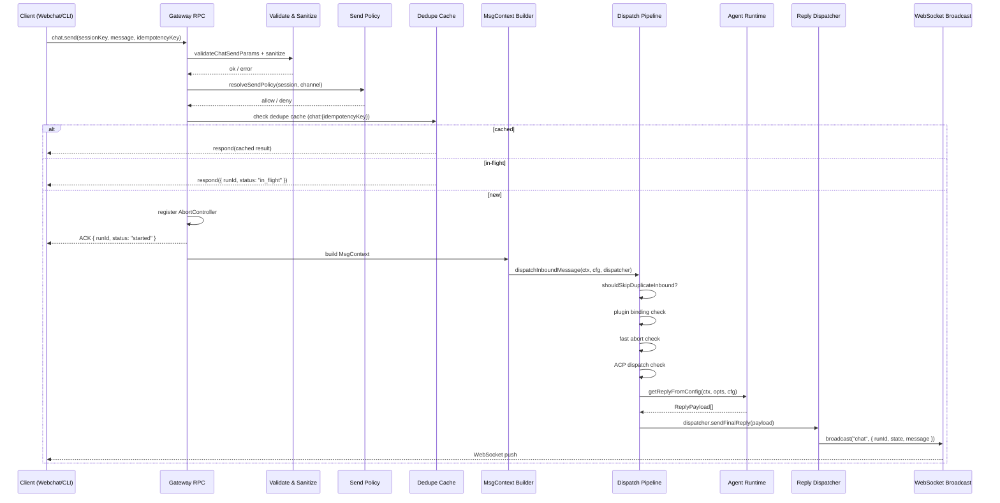
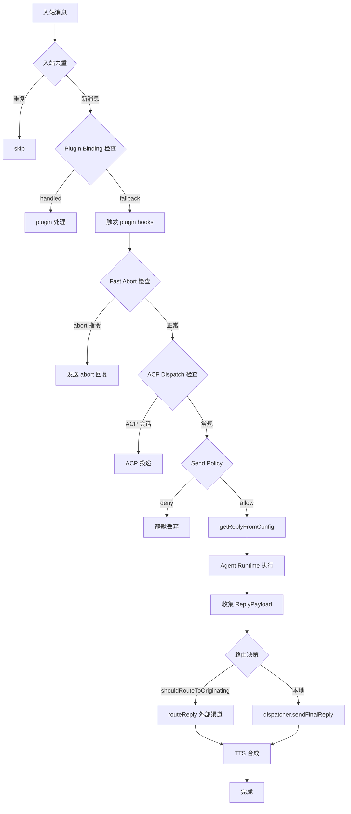
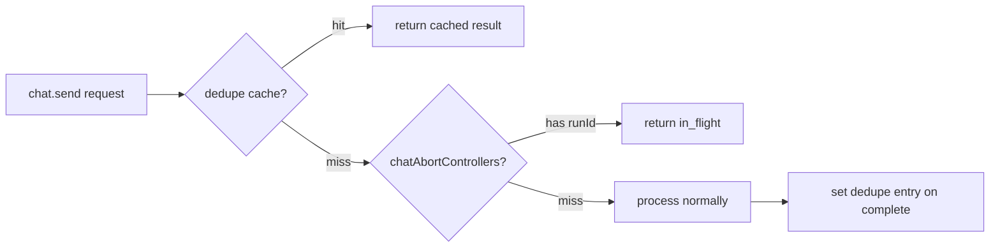

# OC-09 Chat 消息调度

> [!info] 导航
> 本文档属于 [[OpenClaw Gateway MOC]] 系列。
> 相关文档：[[OC-04 Agent 执行系统]] | [[OC-06 Session 与状态管理]] | [[OC-07 Channel 渠道框架]] | [[OC-08 路由引擎]]

## 1. 概述

消息调度是 OpenClaw Gateway 的==心脏==——它将来自不同来源（WebSocket Webchat、外部渠道、CLI、ACP Bridge）的入站消息转化为 Agent 可执行的上下文，驱动 AI 推理并将回复路由回正确的渠道。

整条管线覆盖：

- **RPC 入口** — `chat.send` / `send` 等 Gateway RPC 方法
- **MsgContext 构建** — 统一的入站消息上下文模型
- **Dispatch Pipeline** — 去重、策略检查、指令解析、Agent 调度
- **Reply Pipeline** — 回复归一化、分块投递、实时广播
- **Token 管理** — 静默令牌（`NO_REPLY`）、心跳令牌（`HEARTBEAT_OK`）

> [!tip] 关键设计原则
> 消息调度是 ==fire-and-forget== 模式：`chat.send` 立即返回 `{ runId, status: "started" }` ACK，实际 Agent 运行在后台进行，结果通过 WebSocket broadcast 异步推送。

## 2. chat.send 全流程



### 2.1 chat.send 阶段明细

| 阶段            | 文件                                   | 说明                                             |
| --------------- | -------------------------------------- | ------------------------------------------------ |
| 参数校验        | `server-methods/chat.ts`               | `validateChatSendParams` (TypeBox schema)        |
| 消息净化        | `chat.ts:sanitizeChatSendMessageInput` | NFC 归一化、null byte 检测、控制字符过滤         |
| 附件解析        | `chat-attachments.ts`                  | Base64 图片 / 文件 → 磁盘持久化                  |
| 策略检查        | `sessions/send-policy.ts`              | session-level allow/deny                         |
| Stop 命令       | `chat-abort.ts:isChatStopCommandText`  | 拦截 `/stop` 命令，中止当前 run                  |
| 去重            | `context.dedupe`                       | 基于 `chat:{idempotencyKey}` 的 WeakMap 缓存     |
| In-flight 检测  | `chatAbortControllers`                 | 同一 runId 已在执行则返回 `in_flight`            |
| 路由解析        | `resolveChatSendOriginatingRoute`      | 决定回复走内部 WebSocket 还是外部渠道            |
| MsgContext 组装 | 内联构建                               | 填充 Body / SessionKey / Provider / Media 等字段 |
| Dispatch        | `auto-reply/dispatch.ts`               | 将 MsgContext 传入 dispatch pipeline             |
| 广播            | `broadcastChatFinal`                   | 通过 `context.broadcast("chat", ...)` 推送结果   |

## 3. MsgContext 构建

`MsgContext` 是消息调度的==核心数据模型==，承载入站消息的全部上下文。定义在 `src/auto-reply/templating.ts`。

### 3.1 关键字段分组

**消息内容层**

| 字段                      | 类型                               | 说明                                       |
| ------------------------- | ---------------------------------- | ------------------------------------------ |
| `Body`                    | `string`                           | 原始消息体                                 |
| `BodyForAgent`            | `string`                           | Agent 视角的消息（含信封/历史/时间戳注入） |
| `BodyForCommands`         | `string`                           | 命令解析专用体（无历史/发送者上下文）      |
| `RawBody` / `CommandBody` | `string`                           | 旧版兼容别名                               |
| `InboundHistory`          | `Array<{sender, body, timestamp}>` | 近期聊天历史（不可信用户内容）             |

**路由层**

| 字段                   | 类型                                  | 说明                        |
| ---------------------- | ------------------------------------- | --------------------------- |
| `SessionKey`           | `string`                              | 会话键                      |
| `Provider` / `Surface` | `string`                              | 消息来源渠道标识            |
| `OriginatingChannel`   | `ChannelId \| InternalMessageChannel` | 回复路由目标渠道            |
| `OriginatingTo`        | `string`                              | 回复路由目标地址            |
| `ExplicitDeliverRoute` | `boolean`                             | 是否显式请求外部投递        |
| `AccountId`            | `string`                              | 多账号下的 provider 账号 ID |
| `MessageThreadId`      | `string \| number`                    | 线程/话题 ID                |

**发送者层**

| 字段                                         | 类型      | 说明                   |
| -------------------------------------------- | --------- | ---------------------- |
| `From` / `To`                                | `string`  | 发送者/接收者标识      |
| `SenderName` / `SenderId` / `SenderUsername` | `string`  | 发送者元数据           |
| `ChatType`                                   | `string`  | `"direct"` / `"group"` |
| `GroupSubject` / `GroupChannel`              | `string`  | 群聊元数据             |
| `CommandAuthorized`                          | `boolean` | 命令是否已授权         |
| `WasMentioned`                               | `boolean` | 是否被 @提及           |

**媒体层**

| 字段                       | 类型                         | 说明                |
| -------------------------- | ---------------------------- | ------------------- |
| `MediaPath` / `MediaPaths` | `string[]`                   | 本地媒体文件路径    |
| `MediaUrl` / `MediaUrls`   | `string[]`                   | 媒体 URL            |
| `MediaType` / `MediaTypes` | `string[]`                   | MIME 类型           |
| `Sticker`                  | `StickerMetadata`            | Telegram 贴纸元数据 |
| `Transcript`               | `string`                     | 语音转文字结果      |
| `MediaUnderstanding`       | `MediaUnderstandingOutput[]` | 媒体理解结果        |

### 3.2 FinalizedMsgContext

`finalizeInboundContext()` 将 `MsgContext` 转为 `FinalizedMsgContext`：

- `CommandAuthorized` 强制设为 `boolean`（默认 `false`，拒绝优先）
- `Body` / `RawBody` / `CommandBody` 经过系统标签清洗和换行符归一化
- `BodyForAgent` 自动回落到 `CommandBody → RawBody → Body`
- `MediaType` / `MediaTypes` 长度对齐到 `MediaPaths` / `MediaUrls`
- `ChatType` 归一化、`ConversationLabel` 解析

## 4. Auto-Reply Dispatch

### 4.1 Dispatch 入口

```
dispatchInboundMessage()          // 直接注入 dispatcher
dispatchInboundMessageWithBufferedDispatcher()  // 带 typing + buffering
dispatchInboundMessageWithDispatcher()          // 自动创建 dispatcher
```

三个入口最终都调用 `dispatchReplyFromConfig()`（`src/auto-reply/reply/dispatch-from-config.ts`）。

### 4.2 dispatchReplyFromConfig 管线



### 4.3 管线关键决策点

**Plugin Binding 路由**：当会话被某个 plugin 声明绑定时（`pluginOwnedBinding`），消息优先路由给该 plugin 的 `inboundClaim` handler。仅在 plugin 缺失或拒绝时回退到默认 Agent。

**Cross-Provider 路由**：当 `OriginatingChannel` 与当前 `Surface` 不同时，回复通过 `routeReply()` 路由到原始渠道而非当前 dispatcher。这支持跨平台共享会话场景（如 Telegram 消息被 Slack 会话处理后回复仍回到 Telegram）。

**ACP Dispatch**：ACP（Agent Code Platform）模式下，消息绕过本地 Agent 运行，直接通过 ACP 协议投递。

## 5. Reply Pipeline

### 5.1 ReplyDispatcher

`ReplyDispatcher`（`src/auto-reply/reply/reply-dispatcher.ts`）是回复投递的==串行化引擎==：

```typescript
type ReplyDispatcher = {
  sendToolResult: (payload: ReplyPayload) => boolean; // tool 执行结果
  sendBlockReply: (payload: ReplyPayload) => boolean; // 分块流式回复
  sendFinalReply: (payload: ReplyPayload) => boolean; // 最终回复
  waitForIdle: () => Promise<void>; // 等待所有投递完成
  getQueuedCounts: () => Record<ReplyDispatchKind, number>;
  markComplete: () => void; // 标记不再有新回复
};
```

> [!info] 串行化保证
> 所有回复（tool / block / final）通过 Promise 链（`sendChain`）串行投递，==保证顺序一致==。Dispatcher 使用 `pending` 计数器 + reservation 机制防止 Gateway 过早重启。

### 5.2 回复归一化

每个 `ReplyPayload` 在投递前经过 `normalizeReplyPayload()`：

1. **空内容检查** — 纯空白文本 + 无媒体 → 丢弃
2. **静默令牌匹配** — 精确匹配 `NO_REPLY` → 丢弃
3. **混合内容令牌剥离** — `"😄 NO_REPLY"` → 保留 `"😄"`
4. **心跳令牌剥离** — `HEARTBEAT_OK` → 根据策略丢弃或保留
5. **用户文本清洗** — `sanitizeUserFacingText()` 移除内部标记
6. **LINE / Slack 指令解析** — 从文本中提取平台特定结构化指令
7. **ResponsePrefix 注入** — 模板变量插值后添加前缀（如 `"🤖 Agent:"`)

### 5.3 Human Delay

在 block reply 之间可配置仿人类延迟，避免机器人式"瞬间回复"：

```typescript
humanDelay: { mode: "on" | "off" | "custom", minMs: 800, maxMs: 2500 }
```

第一个 block 无延迟，后续 block 在 `[minMs, maxMs]` 之间随机延迟。

### 5.4 Dispatcher 全局注册

每个活跃的 `ReplyDispatcher` 注册到 `dispatcher-registry.ts` 的全局 `activeDispatchers` 集合中。Gateway 重启时通过 `getTotalPendingReplies()` 检查是否还有未投递的回复，确保优雅关闭。

### 5.5 Provider Dispatcher

`provider-dispatcher.ts` 为外部渠道场景提供便捷封装：

- `dispatchReplyWithBufferedBlockDispatcher` — 带 typing 指示器的 buffered 模式
- `dispatchReplyWithDispatcher` — 直接 dispatcher 模式

## 6. 消息模板

模板系统定义在 `src/auto-reply/templating.ts`：

```typescript
applyTemplate("Hello {{SenderName}}, your session is {{SessionKey}}", ctx);
// → "Hello Alice, your session is main"
```

**模板语法**：`{{Placeholder}}`，占位符名称对应 `TemplateContext`（`MsgContext` 扩展）的字段。

`TemplateContext` 在 `MsgContext` 基础上增加：

| 字段           | 说明               |
| -------------- | ------------------ |
| `BodyStripped` | 去掉指令后的消息体 |
| `SessionId`    | 当前 session ID    |
| `IsNewSession` | 是否为新 session   |

**值格式化规则**：

- `string / number / boolean / bigint` → 直接转字符串
- `Array` → 有效元素用 `,` 拼接
- `null / undefined / object` → 空字符串

### 6.1 Envelope 格式

`envelope.ts` 负责为 Agent 构建带上下文的消息信封：

```
[Telegram Alice +3m Tue 2026-04-07 14:23:05] Hello, how are you?
```

信封包含：渠道标签、发送者、时间间隔、时间戳。时间戳支持 UTC / 本地 / IANA / 用户时区。信封的每个部分都经过 `sanitizeEnvelopeHeaderPart()` 清洗（移除方括号、折叠空白）以防注入。

## 7. Token 管理

### 7.1 静默回复令牌（NO_REPLY）

| 函数                            | 行为                                                            |
| ------------------------------- | --------------------------------------------------------------- |
| `isSilentReplyText(text)`       | ==精确匹配== `"NO_REPLY"`（含前后空白）→ `true`                 |
| `isSilentReplyPrefixText(text)` | 流式前缀匹配，`"NO"` → `true`（防止流式传输过程中泄露部分令牌） |
| `stripSilentToken(text)`        | 从混合内容中剥离尾部 `NO_REPLY`                                 |

> [!tip] 设计决策
> `isSilentReplyText` 仅匹配精确的 `NO_REPLY`，==不匹配== `"Thanks! NO_REPLY"` 这样的混合内容。这防止了有实质内容的回复被误判为静默（#19537）。混合内容通过 `stripSilentToken` 单独处理。

### 7.2 心跳令牌（HEARTBEAT_OK）

`HEARTBEAT_OK` 用于 Agent 心跳回复。当 Agent 判断无需采取行动时回复此令牌：

```
HEARTBEAT_OK → 根据 heartbeat visibility 配置，决定是否在 chat UI 中显示
```

心跳令牌的剥离和静默判断通过 `stripHeartbeatToken()` 处理，支持 `heartbeat` 和 `message` 两种模式。

## 8. 去重机制

### 8.1 RPC 级去重（idempotencyKey）

`chat.send` 的每次调用携带 `idempotencyKey`。Gateway 维护三层防护：



- **`context.dedupe`** — `WeakMap<GatewayRequestContext, Map<string, DedupeEntry>>`，缓存已完成的请求结果
- **`chatAbortControllers`** — `Map<string, ChatAbortControllerEntry>`，追踪正在执行的 run

### 8.2 入站消息去重

`inbound-dedupe.ts` 在 dispatch 层提供跨渠道的消息去重：

**去重键构成**：`provider | accountId | sessionScope | peerId | threadId | messageId`

- TTL：20 分钟
- 最大跟踪数：5000
- 缓存使用 `Symbol.for("openclaw.inboundDedupeCache")` 确保跨 bundle 共享

> [!info] Session Scope 归一化
> 同一物理消息不应对同一 Agent 运行两次，即使路由 bug 将其呈现在不同的 session key 下。因此 session scope 被归一化为 `agent:{agentId}`。

### 8.3 send RPC 去重

`send` 方法（`server-methods/send.ts`）维护独立的去重：

- **缓存检查** — `context.dedupe.get("send:{idempotencyKey}")`
- **In-flight 合并** — `WeakMap<GatewayRequestContext, Map<string, Promise>>` 防止并发重复投递
- **结果缓存** — 成功/失败结果都缓存到 `context.dedupe`

## 9. 广播与实时推送

### 9.1 WebSocket Broadcast 机制

`chat.send` 处理完成后通过 `context.broadcast()` 和 `context.nodeSendToSession()` 推送事件：

| 事件类型                    | payload                                              | 触发时机       |
| --------------------------- | ---------------------------------------------------- | -------------- |
| `"chat"` (state: `"final"`) | `{ runId, sessionKey, seq, state, message }`         | Agent 运行完成 |
| `"chat"` (state: `"error"`) | `{ runId, sessionKey, seq, state, errorMessage }`    | Agent 运行失败 |
| `"chat.side_result"`        | `{ kind: "btw", runId, sessionKey, question, text }` | BTW 侧问结果   |

### 9.2 Streaming Delta

Agent 执行过程中，流式 delta 通过 `server-chat.ts` 的机制推送：

- `ChatRunState.buffers` — 按 `runId` 累积文本
- `deltaSentAt` / `deltaLastBroadcastLen` — 防止重复广播
- 文本合并使用 `resolveMergedAssistantText()` 智能处理重叠 delta

### 9.3 Tool Events

支持 `TOOL_EVENTS` capability 的客户端可通过 `registerToolEventRecipient()` 注册接收工具执行事件。同一 session 的所有活跃 run 的 tool events 都会广播给已注册的连接。

### 9.4 Session Event Subscriptions

`SessionEventSubscriberRegistry` 和 `SessionMessageSubscriberRegistry` 提供细粒度的事件订阅：

- 全局 session 事件订阅（`subscribe(connId)`）
- 特定 session 消息订阅（`subscribe(connId, sessionKey)`）

### 9.5 Transcript Update Events

当 Agent 运行产生新的 transcript 条目时，`emitSessionTranscriptUpdate()` 触发 transcript 更新事件，驱动 UI 的消息列表实时刷新。

## 10. Inbound Debounce

`inbound-debounce.ts` 提供基于 session key 的消息防抖：

```typescript
const debouncer = createInboundDebouncer<Message>({
  debounceMs: 500,
  maxTrackedKeys: 2048,
  buildKey: (msg) => msg.sessionKey,
  shouldDebounce: (msg) => !msg.isCommand,
  onFlush: async (items) => {
    /* 合并处理 */
  },
});
```

**设计要点**：

- 按 key 维护独立的 buffer 和 timer
- 同一 key 的消息顺序通过 `keyChains`（Promise 链）严格保证
- 非 debounce 消息（如命令）会立即触发 pending buffer flush
- buffer 容量饱和时降级为 keyed-serial 立即执行
- timer 使用 `.unref()` 不阻止进程退出

## 11. 关键文件索引

| 文件                                           | 职责                                                                     |
| ---------------------------------------------- | ------------------------------------------------------------------------ |
| `src/gateway/server-methods/chat.ts`           | `chat.send` / `chat.history` / `chat.abort` / `chat.inject` RPC handlers |
| `src/gateway/server-methods/send.ts`           | `send` / `poll` 出站消息 RPC handlers                                    |
| `src/gateway/server-chat.ts`                   | Chat run state、streaming delta 合并、tool event 注册                    |
| `src/gateway/chat-abort.ts`                    | Agent run 中止控制（AbortController 管理）                               |
| `src/gateway/chat-attachments.ts`              | 附件解析（Base64 图片/文件）                                             |
| `src/auto-reply/dispatch.ts`                   | Dispatch 入口（`dispatchInboundMessage` 等）                             |
| `src/auto-reply/reply/dispatch-from-config.ts` | 核心 dispatch 管线（plugin binding / abort / ACP / agent dispatch）      |
| `src/auto-reply/reply/get-reply.ts`            | `getReplyFromConfig` — Agent 推理入口                                    |
| `src/auto-reply/reply/reply-dispatcher.ts`     | `ReplyDispatcher` 串行投递引擎                                           |
| `src/auto-reply/reply/dispatcher-registry.ts`  | Dispatcher 全局注册表（Gateway 优雅关闭协调）                            |
| `src/auto-reply/reply/normalize-reply.ts`      | 回复归一化（token 剥离、prefix 注入、指令解析）                          |
| `src/auto-reply/reply/provider-dispatcher.ts`  | 面向渠道的 dispatch 便捷封装                                             |
| `src/auto-reply/reply/route-reply.ts`          | Cross-provider 回复路由                                                  |
| `src/auto-reply/reply/block-reply-pipeline.ts` | Block streaming 管线（coalescing、timeout）                              |
| `src/auto-reply/reply/inbound-dedupe.ts`       | 入站消息去重（provider + session scope）                                 |
| `src/auto-reply/reply/inbound-context.ts`      | `finalizeInboundContext()` — MsgContext 归一化                           |
| `src/auto-reply/reply/origin-routing.ts`       | 来源路由解析辅助                                                         |
| `src/auto-reply/reply/typing-policy.ts`        | Typing indicator 策略控制                                                |
| `src/auto-reply/templating.ts`                 | MsgContext 类型定义 + `applyTemplate` 模板引擎                           |
| `src/auto-reply/envelope.ts`                   | Agent 消息信封格式化                                                     |
| `src/auto-reply/tokens.ts`                     | `NO_REPLY` / `HEARTBEAT_OK` 令牌处理                                     |
| `src/auto-reply/heartbeat.ts`                  | 心跳 prompt 和令牌剥离                                                   |
| `src/auto-reply/inbound-debounce.ts`           | 入站消息防抖器                                                           |
| `src/auto-reply/send-policy.ts`                | `/send` 命令解析和策略覆盖                                               |
| `src/auto-reply/types.ts`                      | `ReplyPayload` / `GetReplyOptions` 核心类型                              |
| `src/channels/reply-prefix.ts`                 | ResponsePrefix 上下文构建                                                |
