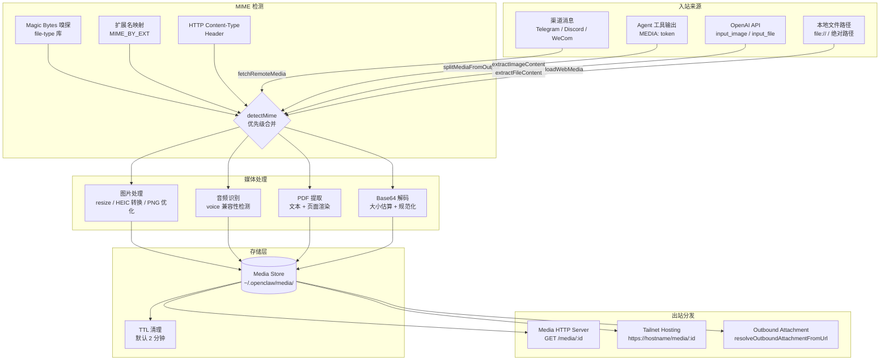
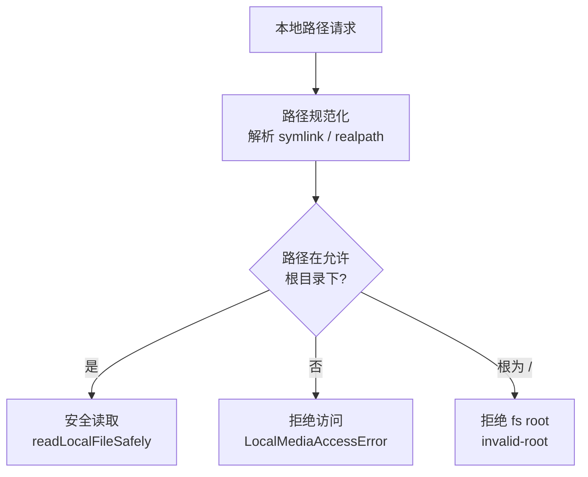

# OC-10 Media 媒体管线

> [!info] 模块定位
> `src/media/` 是 OpenClaw Gateway 的媒体处理核心，负责所有入站/出站媒体的获取、检测、转换、存储和分发。它被 Agent 执行系统、渠道运行时、插件 SDK 和 Gateway HTTP 层广泛引用，是跨渠道多媒体能力的基础设施。

相关文档：[[OpenClaw Gateway MOC]] | [[OC-04 Agent 执行系统]] | [[WeCom × OpenClaw Gateway 能力全景图]]

---

## 1. 概述

在 OpenClaw 中，媒体（图片、音频、视频、PDF、文档）在多个环节流转：

1. **入站**：用户通过渠道（Telegram、Discord、iMessage、WeCom 等）发送媒体，或 Agent 工具产出媒体文件
2. **存储**：媒体被写入本地 `~/.openclaw/media/` 临时目录，带有 TTL 自动清理
3. **处理**：根据类型进行 MIME 检测、图片压缩/格式转换、HEIC→JPEG、PDF 文本/图像提取、音频格式识别
4. **出站**：处理后的媒体通过 HTTP 服务端暴露给渠道消费，或直接作为 Buffer 传递给渠道发送函数

整个管线的设计强调**安全性**（SSRF 防护、路径沙箱、文件大小限制）和**跨平台兼容**（macOS sips 回退、Windows 路径处理）。

---

## 2. 媒体管线架构图



---

## 3. Media Store 存储模型

> [!note] 核心文件
> `src/media/store.ts`

### 3.1 存储路径

| 路径                          | 用途                                     |
| ----------------------------- | ---------------------------------------- |
| `~/.openclaw/media/`          | 顶层媒体目录，权限 `0o700`               |
| `~/.openclaw/media/inbound/`  | 入站媒体子目录（`saveMediaBuffer` 默认） |
| `~/.openclaw/media/outbound/` | 出站附件子目录                           |
| `~/.openclaw/media/*.tmp`     | 下载中间临时文件                         |

### 3.2 文件命名

文件名采用 `{sanitized_original}---{uuid}.{ext}` 格式：

- `sanitized_original`：原始文件名经过安全清洗（移除 Windows/SharePoint 不安全字符，保留 Unicode 字母数字、点、连字符、下划线，截断至 60 字符）
- `uuid`：`crypto.randomUUID()` 生成的唯一标识
- `ext`：从 MIME 检测结果推导的文件扩展名

`extractOriginalFilename()` 可从存储路径反向提取原始文件名。

### 3.3 文件权限

媒体文件权限为 `0o644`（非所有者可读），原因是 Docker 沙箱容器需要访问入站媒体。安全边界由上层目录 `0o700` 保证。

### 3.4 大小限制

`MEDIA_MAX_BYTES = 5MB`（store 层默认）。不同媒体类型的具体限制由 `constants.ts` 定义（见第 11 节）。

### 3.5 TTL 自动清理

`cleanOldMedia()` 按 mtime 清理过期文件，默认 TTL 为 **2 分钟**。支持递归清理和空目录修剪。清理在以下时机触发：

- `saveMediaSource()` 每次调用时（清理当前目录）
- Media HTTP Server 定时器（`setInterval`，周期等于 TTL）

### 3.6 核心 API

| 函数                                                                           | 说明                                      |
| ------------------------------------------------------------------------------ | ----------------------------------------- |
| `saveMediaSource(source, headers?, subdir?)`                                   | 从 URL 或本地路径保存媒体，自动 MIME 检测 |
| `saveMediaBuffer(buffer, contentType?, subdir?, maxBytes?, originalFilename?)` | 从 Buffer 保存媒体                        |
| `cleanOldMedia(ttlMs?, options?)`                                              | 清理过期媒体文件                          |
| `ensureMediaDir()`                                                             | 确保媒体目录存在                          |
| `extractOriginalFilename(filePath)`                                            | 从存储路径提取原始文件名                  |

---

## 4. MIME 类型检测

> [!note] 核心文件
> `src/media/mime.ts` | `src/media/sniff-mime-from-base64.ts`

### 4.1 检测链

`detectMime()` 采用多层级降级策略，按以下优先级返回 MIME 类型：

```
1. Magic Bytes 嗅探（file-type 库） ← 最高优先级
   └─ 若结果为通用容器类型（application/octet-stream, application/zip）
      且扩展名有更精确映射 → 降级到扩展名
2. 文件扩展名映射（MIME_BY_EXT）
3. HTTP Content-Type Header（排除通用类型）
4. 回退到嗅探/Header 的通用结果
5. undefined（无法判断）
```

### 4.2 扩展名双向映射

`EXT_BY_MIME`（MIME→扩展名）和 `MIME_BY_EXT`（扩展名→MIME）互为逆映射，后者还包含额外别名（如 `.jpeg`→`image/jpeg`）。

### 4.3 Base64 嗅探

`sniffMimeFromBase64()` 只解码前 256 字符（约 192 字节），足以覆盖常见格式的 magic bytes。

### 4.4 MediaKind 分类

`constants.ts` 中的 `mediaKindFromMime()` 将 MIME 映射为四种媒体类型：

| MediaKind  | MIME 前缀/值                                 |
| ---------- | -------------------------------------------- |
| `image`    | `image/*`                                    |
| `audio`    | `audio/*`                                    |
| `video`    | `video/*`                                    |
| `document` | `application/pdf`, `text/*`, `application/*` |

---

## 5. 图片处理

> [!note] 核心文件
> `src/media/image-ops.ts` | `src/media/png-encode.ts`

### 5.1 处理后端

图片处理支持两种后端，通过环境变量 `OPENCLAW_IMAGE_BACKEND` 控制：

| 后端      | 条件                                                           | 能力                                     |
| --------- | -------------------------------------------------------------- | ---------------------------------------- |
| **sharp** | 默认（Node.js 环境）                                           | 全功能：resize、EXIF 旋转、JPEG/PNG/WebP |
| **sips**  | macOS + Bun 环境（自动检测），或 `OPENCLAW_IMAGE_BACKEND=sips` | macOS 原生：resize、EXIF 旋转、格式转换  |

### 5.2 图片优化流程

`web-media.ts` 中的 `optimizeImageWithFallback()` 实现自适应优化：

```
1. 检测是否 PNG 且有 Alpha 通道
   ├─ 有 Alpha → 尝试 PNG 优化（保留透明度）
   │  └─ 仍超限 → 降级为 JPEG
   └─ 无 Alpha → 直接 JPEG 优化
```

**JPEG 优化网格**：尝试 5 种尺寸（2048, 1536, 1280, 1024, 800）× 5 种质量（80, 70, 60, 50, 40）的组合，找到第一个低于限制的结果。

**PNG 优化网格**：5 种尺寸 × 4 种压缩级别（6, 7, 8, 9）。

### 5.3 HEIC 转换

检测到 HEIC/HEIF 格式时自动转换为 JPEG：

- sips 后端：`/usr/bin/sips -s format jpeg`
- sharp 后端：`sharp(buffer).jpeg({ quality: 90, mozjpeg: true })`

### 5.4 EXIF 方向校正

`normalizeExifOrientation()` 处理 JPEG EXIF 方向标记（1-8），确保像素数据与视觉方向一致：

- sharp：`sharp(buffer).rotate()` 自动处理
- sips：手动解析 EXIF IFD0 的 0x0112 标签，映射到 sips 的 `-r`（旋转）和 `-f`（翻转）操作

### 5.5 PNG 编码器

`png-encode.ts` 提供无原生依赖的最小 PNG 编码器，用于 QR 码、存活探针等程序化图像生成：

- `encodePngRgba(buffer, width, height)` — RGBA 缓冲区编码为 PNG
- `fillPixel()` — 像素写入
- `crc32()` / `pngChunk()` — PNG 块构造

---

## 6. 音频处理

> [!note] 核心文件
> `src/media/audio.ts` | `src/media/audio-tags.ts` | `src/media/ffmpeg-exec.ts` | `src/media/ffmpeg-limits.ts`

### 6.1 语音兼容性检测

`isTelegramVoiceCompatibleAudio()` 判断音频是否可作为 Telegram 语音消息发送：

| 兼容 MIME                                                                                     | 兼容扩展名                                                               |
| --------------------------------------------------------------------------------------------- | ------------------------------------------------------------------------ |
| `audio/ogg`, `audio/opus`, `audio/mpeg`, `audio/mp3`, `audio/mp4`, `audio/x-m4a`, `audio/m4a` | `.aac`, `.caf`, `.flac`, `.m4a`, `.mp3`, `.oga`, `.ogg`, `.opus`, `.wav` |

`isVoiceCompatibleAudio()` 是向后兼容别名。

### 6.2 音频标签

`parseAudioTag()` 从文本中提取 `[[audio_as_voice]]` 指令标签，控制音频以语音气泡（而非文件附件）形式发送。

### 6.3 FFmpeg 集成

通过 `ffmpeg-exec.ts` 封装 `ffprobe` 和 `ffmpeg` 命令行调用：

| 常量                                   | 值    | 用途               |
| -------------------------------------- | ----- | ------------------ |
| `MEDIA_FFMPEG_MAX_BUFFER_BYTES`        | 10MB  | 子进程输出缓冲上限 |
| `MEDIA_FFPROBE_TIMEOUT_MS`             | 10s   | ffprobe 超时       |
| `MEDIA_FFMPEG_TIMEOUT_MS`              | 45s   | ffmpeg 超时        |
| `MEDIA_FFMPEG_MAX_AUDIO_DURATION_SECS` | 20min | 音频最大时长       |

`parseFfprobeCodecAndSampleRate()` 从 ffprobe CSV 输出中解析编解码器和采样率。

---

## 7. PDF 提取

> [!note] 核心文件
> `src/media/pdf-extract.ts`

### 7.1 提取策略

`extractPdfContent()` 采用**文本优先、图像回退**的双阶段策略：

```
1. 使用 pdfjs-dist 提取文本内容
   └─ 文本字符数 >= minTextChars → 返回纯文本（不提取图像）
2. 文本不足时，使用 @napi-rs/canvas 逐页渲染为 PNG 图像
   └─ 受 maxPixels 预算控制（按比例缩放）
```

### 7.2 默认限制

| 参数           | 默认值    | 说明             |
| -------------- | --------- | ---------------- |
| `maxPages`     | 4         | 最大处理页数     |
| `maxPixels`    | 4,000,000 | 每页渲染像素预算 |
| `minTextChars` | 200       | 纯文本充分阈值   |

### 7.3 依赖

两个可选依赖（按需动态导入）：

- **pdfjs-dist**（`pdfjs-dist/legacy/build/pdf.mjs`）— PDF 解析和文本提取
- **@napi-rs/canvas** — 页面渲染为 PNG

缺少依赖时优雅降级，通过 `onImageExtractionError` 回调通知上层。

---

## 8. 媒体获取

> [!note] 核心文件
> `src/media/fetch.ts` | `src/media/read-response-with-limit.ts` | `src/media/input-files.ts`

### 8.1 远程获取（fetchRemoteMedia）

`fetchRemoteMedia()` 是统一的远程媒体下载入口，具备多层安全保护：

| 安全机制       | 实现                                                   |
| -------------- | ------------------------------------------------------ |
| **SSRF 防护**  | 通过 `fetchWithSsrFGuard()` 强制执行，禁止私有网络访问 |
| **DNS 锁定**   | `resolvePinnedHostname()` 防止 DNS 重绑攻击            |
| **重定向限制** | 默认最多 5 次重定向，防止重定向环                      |
| **大小限制**   | 流式读取 + 提前终止，Content-Length 预检               |
| **空闲超时**   | `readIdleTimeoutMs` 防止慢速攻击（stalled download）   |
| **URL 脱敏**   | 日志中自动脱敏敏感 URL 参数                            |

### 8.2 多调度器尝试

支持 `dispatcherAttempts` 数组，允许多次尝试不同的网络策略（如先用 IPv4，再回退 IPv6），通过 `shouldRetryFetchError` 控制重试条件。

### 8.3 文件名解析

文件名按优先级从三个来源提取：

1. `Content-Disposition` Header（支持 `filename*=` RFC 5987 编码）
2. URL 路径的 basename
3. 调用方提供的 `filePathHint`

### 8.4 流式限制读取

`readResponseWithLimit()` 实现流式读取并强制大小上限：

- 按 chunk 累加，超限时立即取消流
- 支持 `chunkTimeoutMs`：如果单个 chunk 等待超时则中止（防御慢速攻击）
- `readResponseTextSnippet()` 用于读取错误响应的前 200 字符摘要

### 8.5 输入文件处理（input-files.ts）

为 OpenAI 兼容 API 提供 `extractImageContentFromSource()` 和 `extractFileContentFromSource()`：

- 支持 `base64` 和 `url` 两种输入源
- Base64 解码前先估算大小（`estimateBase64DecodedBytes`），避免内存爆炸
- HEIC 图片自动转换为 JPEG
- PDF 文件走 `extractPdfContent()` 流程
- 文本文件支持 charset 自动检测（`TextDecoder`）

---

## 9. 入站路径策略

> [!note] 核心文件
> `src/media/inbound-path-policy.ts` | `src/media/local-media-access.ts` | `src/media/local-roots.ts`

### 9.1 路径沙箱机制

本地媒体读取受到严格的目录白名单限制，防止文件泄露：



### 9.2 默认允许根目录

`getDefaultMediaLocalRoots()` 返回以下路径：

| 路径                   | 用途                          |
| ---------------------- | ----------------------------- |
| `{preferredTmpDir}`    | OpenClaw 临时目录（平台相关） |
| `{stateDir}/media`     | 媒体存储目录                  |
| `{stateDir}/workspace` | Agent 工作区                  |
| `{stateDir}/sandboxes` | 沙箱目录                      |

Agent 作用域模式下（`getAgentScopedMediaLocalRoots`），还会额外包含 Agent 专属工作区目录。

### 9.3 iMessage 附件根

`resolveIMessageAttachmentRoots()` 为 iMessage 渠道提供专用的附件白名单：

- 默认：`/Users/*/Library/Messages/Attachments`（通配符匹配任意用户名）
- 支持按账户配置 `attachmentRoots` 和 `remoteAttachmentRoots`
- 通配符 `*` 仅允许在完整路径段中使用

### 9.4 安全检查

| 检查项           | 说明                                           |
| ---------------- | ---------------------------------------------- |
| Windows 网络路径 | 拒绝 `\\server\share` 形式的 UNC 路径          |
| 文件系统根       | 拒绝 `/` 或 `C:\` 作为允许根                   |
| Symlink 追踪     | 通过 `fs.realpath` 解析实际路径后再检查        |
| Workspace 隔离   | 阻止 `workspace-*` 前缀目录的跨 workspace 访问 |
| `file://` URL    | 通过 `safeFileURLToPath()` 安全转换            |

---

## 10. 出站附件格式化

> [!note] 核心文件
> `src/media/outbound-attachment.ts` | `src/media/load-options.ts` | `src/media/file-context.ts`

### 10.1 出站附件解析

`resolveOutboundAttachmentFromUrl()` 将媒体 URL 转换为可供渠道发送的本地文件：

```
mediaUrl → loadWebMedia() → saveMediaBuffer("outbound") → { path, contentType }
```

`buildOutboundMediaLoadOptions()` 封装出站加载参数（maxBytes、localRoots、optimizeImages）。

### 10.2 文件上下文块

`renderFileContextBlock()` 生成 XML 格式的文件上下文块，用于向 LLM 传递附件内容：

```xml
<file name="report.pdf" mime="application/pdf">
...提取的文本内容...
</file>
```

- 文件名经过 XML 属性转义
- 内容中的 `<file>` / `</file>` 标签被转义，防止注入

### 10.3 MEDIA 令牌解析

`parse.ts` 中的 `splitMediaFromOutput()` 从 Agent 文本输出中提取 `MEDIA:` 令牌：

- 模式：`MEDIA: <url_or_path>` 或 `MEDIA: "<quoted path with spaces>"`
- 支持同一行多个 MEDIA 令牌
- 自动跳过代码围栏（\`\`\` / ~~~）内的令牌
- 识别 `[[audio_as_voice]]` 指令标签
- 清理后的文本移除 MEDIA 行和多余空白

---

## 11. 支持的格式完整清单

### 11.1 大小限制

| 类别            | 常量                            | 限制    |
| --------------- | ------------------------------- | ------- |
| 图片            | `MAX_IMAGE_BYTES`               | 6 MB    |
| 音频            | `MAX_AUDIO_BYTES`               | 16 MB   |
| 视频            | `MAX_VIDEO_BYTES`               | 16 MB   |
| 文档            | `MAX_DOCUMENT_BYTES`            | 100 MB  |
| Store 默认      | `MEDIA_MAX_BYTES`               | 5 MB    |
| 输入图片（API） | `DEFAULT_INPUT_IMAGE_MAX_BYTES` | 10 MB   |
| 输入文件（API） | `DEFAULT_INPUT_FILE_MAX_BYTES`  | 5 MB    |
| 输入文本字符    | `DEFAULT_INPUT_FILE_MAX_CHARS`  | 200,000 |

### 11.2 MIME 类型与扩展名映射

| 类别       | 扩展名           | MIME 类型                                                                   |
| ---------- | ---------------- | --------------------------------------------------------------------------- |
| **图片**   | `.jpg` / `.jpeg` | `image/jpeg`                                                                |
|            | `.png`           | `image/png`                                                                 |
|            | `.webp`          | `image/webp`                                                                |
|            | `.gif`           | `image/gif`                                                                 |
|            | `.heic`          | `image/heic`                                                                |
|            | `.heif`          | `image/heif`                                                                |
| **音频**   | `.mp3`           | `audio/mpeg`                                                                |
|            | `.ogg`           | `audio/ogg`                                                                 |
|            | `.wav`           | `audio/wav`                                                                 |
|            | `.flac`          | `audio/flac`                                                                |
|            | `.aac`           | `audio/aac`                                                                 |
|            | `.opus`          | `audio/opus`                                                                |
|            | `.m4a`           | `audio/x-m4a` / `audio/mp4`                                                 |
|            | `.amr`           | `audio/amr`                                                                 |
|            | `.speex`         | `audio/speex`                                                               |
| **视频**   | `.mp4`           | `video/mp4`                                                                 |
|            | `.mov`           | `video/quicktime`                                                           |
| **文档**   | `.pdf`           | `application/pdf`                                                           |
|            | `.json`          | `application/json`                                                          |
|            | `.txt`           | `text/plain`                                                                |
|            | `.md`            | `text/markdown`                                                             |
|            | `.csv`           | `text/csv`                                                                  |
| **Office** | `.doc`           | `application/msword`                                                        |
|            | `.xls`           | `application/vnd.ms-excel`                                                  |
|            | `.ppt`           | `application/vnd.ms-powerpoint`                                             |
|            | `.docx`          | `application/vnd.openxmlformats-officedocument.wordprocessingml.document`   |
|            | `.xlsx`          | `application/vnd.openxmlformats-officedocument.spreadsheetml.sheet`         |
|            | `.pptx`          | `application/vnd.openxmlformats-officedocument.presentationml.presentation` |
| **压缩**   | `.zip`           | `application/zip`                                                           |
|            | `.gz`            | `application/gzip`                                                          |
|            | `.tar`           | `application/x-tar`                                                         |
|            | `.7z`            | `application/x-7z-compressed`                                               |
|            | `.rar`           | `application/vnd.rar`                                                       |

### 11.3 输入文件默认允许 MIME

**图片输入**（`DEFAULT_INPUT_IMAGE_MIMES`）：
`image/jpeg`, `image/png`, `image/gif`, `image/webp`, `image/heic`, `image/heif`

**文件输入**（`DEFAULT_INPUT_FILE_MIMES`）：
`text/plain`, `text/markdown`, `text/html`, `text/csv`, `application/json`, `application/pdf`

---

## 12. 模块文件索引

> [!tip] 插件 SDK 暴露
> 媒体模块通过 `src/plugin-sdk/media-runtime.ts` 对外暴露大部分 API，插件可通过 `openclaw/plugin-sdk/media-runtime` 导入使用。

| 文件                          | 角色                                             |
| ----------------------------- | ------------------------------------------------ |
| `store.ts`                    | 媒体存储：保存、清理、路径管理                   |
| `mime.ts`                     | MIME 检测、扩展名映射、MediaKind 分类            |
| `image-ops.ts`                | 图片 resize、HEIC 转换、EXIF 校正、PNG/JPEG 优化 |
| `png-encode.ts`               | 无依赖 PNG 编码器（QR/探针用）                   |
| `audio.ts`                    | 语音兼容性检测（Telegram voice）                 |
| `audio-tags.ts`               | `[[audio_as_voice]]` 指令解析                    |
| `pdf-extract.ts`              | PDF 文本提取 + 页面渲染                          |
| `fetch.ts`                    | 远程媒体下载（SSRF 防护、重定向、限流）          |
| `read-response-with-limit.ts` | 流式限制读取（大小上限 + 空闲超时）              |
| `input-files.ts`              | OpenAI API 输入文件/图片处理                     |
| `web-media.ts`                | 统一媒体加载入口（远程 + 本地 + 优化）           |
| `inbound-path-policy.ts`      | 入站路径白名单策略（iMessage 附件根）            |
| `local-media-access.ts`       | 本地文件访问权限检查                             |
| `local-roots.ts`              | 默认 / Agent 作用域媒体根目录                    |
| `load-options.ts`             | 出站媒体加载选项构建                             |
| `outbound-attachment.ts`      | 出站附件 URL→本地文件解析                        |
| `file-context.ts`             | XML 文件上下文块渲染（给 LLM）                   |
| `parse.ts`                    | MEDIA 令牌从文本中提取                           |
| `base64.ts`                   | Base64 大小估算、规范化                          |
| `sniff-mime-from-base64.ts`   | Base64 前缀 MIME 嗅探                            |
| `constants.ts`                | 媒体类型常量、大小限制                           |
| `host.ts`                     | 媒体 HTTP 托管（Tailnet）                        |
| `server.ts`                   | Express 媒体服务端（GET /media/:id）             |
| `ffmpeg-exec.ts`              | FFmpeg/FFprobe 命令封装                          |
| `ffmpeg-limits.ts`            | FFmpeg 超时和缓冲常量                            |
| `temp-files.ts`               | 临时文件清理辅助                                 |
