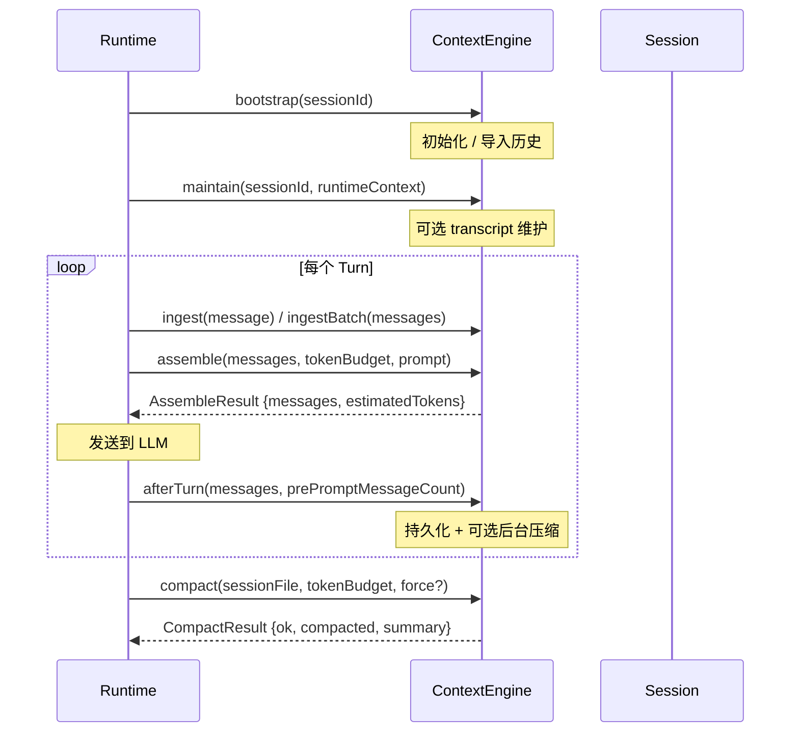
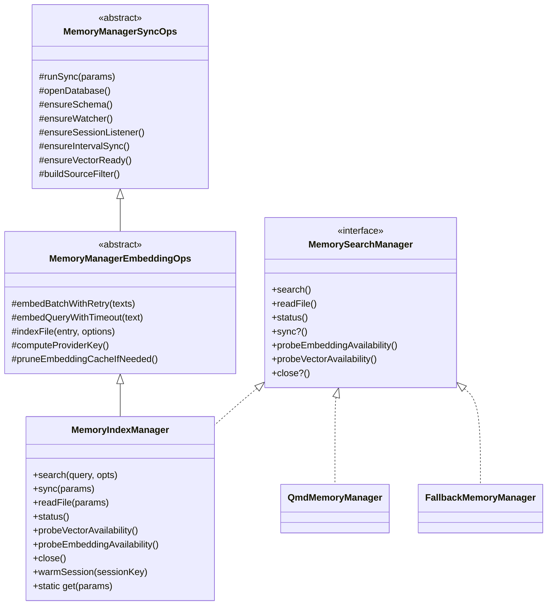

# OC-11 Memory 与 RAG

> [!abstract] 模块定位
> Memory 系统为 OpenClaw Agent 提供**长期记忆检索**能力，涵盖 Embedding 生成、向量/全文混合搜索、MMR 重排序、时间衰减等完整 RAG 管线。与 [[OC-04 Agent 执行系统]] 的工具层和 [[OC-06 Session 与状态管理]] 的会话层深度集成。
>
> 归属模块地图：[[OpenClaw Gateway MOC]]

---

## 1. 概述

OpenClaw Memory 系统解决的核心问题是：**Agent 如何在跨 Session 的对话中保持长期记忆**。它通过以下路径实现：

1. **写入**：Agent workspace 下的 Markdown 文件（`MEMORY.md`、`memory/` 目录）和 Session transcript（`.jsonl`）作为记忆源
2. **嵌入**：调用 Embedding Provider（OpenAI / Gemini / Voyage / Mistral / Ollama / 本地 GGUF 模型）将文本 chunk 转为向量
3. **存储**：SQLite 数据库（FTS5 全文索引 + `sqlite-vec` 向量索引）
4. **查询**：混合检索管线（Query Expansion → Hybrid Search → Temporal Decay → MMR Re-ranking）

系统支持两种后端（`builtin` 和 `qmd`），以及一个可插拔的 Context Engine 层用于管理对话上下文的组装和压缩。

---

## 2. 架构图

```mermaid
graph TD
    subgraph 写入路径
        A[Memory Files<br/>MEMORY.md / memory/*.md] -->|watch / interval| B[MemoryIndexManager.sync]
        S[Session Transcripts<br/>*.jsonl] -->|delta detect| B
        MM[Multimodal Files<br/>*.jpg / *.mp3] -->|extraPaths| B
    end

    subgraph Embedding 生成
        B --> C{Embedding Provider}
        C -->|auto / openai| D[OpenAI API]
        C -->|gemini| E[Gemini API]
        C -->|voyage| F[Voyage API]
        C -->|mistral| G[Mistral API]
        C -->|ollama| H[Ollama Local]
        C -->|local| I[node-llama-cpp<br/>GGUF Model]
        C -->|null| J[FTS-only Mode]
    end

    subgraph 存储层
        D & E & F & G & H & I --> K[Embedding Cache<br/>embedding_cache table]
        K --> L[chunks table<br/>id / path / text / embedding]
        L --> M[chunks_vec<br/>sqlite-vec virtual table]
        L --> N[chunks_fts<br/>FTS5 virtual table]
    end

    subgraph 查询管线
        Q[User Query] --> QE[Query Expansion<br/>extractKeywords]
        QE --> VS[Vector Search<br/>cosine distance]
        QE --> KS[Keyword Search<br/>BM25 via FTS5]
        VS & KS --> HM[Hybrid Merge<br/>weighted fusion]
        HM --> TD[Temporal Decay<br/>exponential decay]
        TD --> MR[MMR Re-ranking<br/>diversity-aware]
        MR --> R[MemorySearchResult[]]
    end

    style J fill:#f9f,stroke:#333
    style K fill:#ffa,stroke:#333
```

---

## 3. Embedding 生成

### 3.1 Provider 体系

Embedding provider 由 `createEmbeddingProvider()` 工厂函数创建，核心类型定义：

```typescript
// src/memory/embeddings.ts
type EmbeddingProvider = {
  id: string; // "openai" | "local" | "gemini" | "voyage" | "mistral" | "ollama"
  model: string; // e.g. "text-embedding-3-small"
  maxInputTokens?: number;
  embedQuery: (text: string) => Promise<number[]>;
  embedBatch: (texts: string[]) => Promise<number[][]>;
  embedBatchInputs?: (inputs: EmbeddingInput[]) => Promise<number[][]>; // multimodal
};

type EmbeddingProviderRequest = EmbeddingProviderId | "auto";
type EmbeddingProviderFallback = EmbeddingProviderId | "none";
```

> [!info] Auto 选择逻辑
> 当 `provider: "auto"` 时，选择顺序为：
>
> 1. 本地 GGUF 模型（仅当 `local.modelPath` 指向已存在的文件时）
> 2. 远程 provider 依次尝试：`openai` → `gemini` → `voyage` → `mistral`
> 3. 所有 provider 都因 API key 缺失失败时，降级为 **FTS-only 模式**（`provider: null`）
>
> Ollama 被刻意排除出 auto 选择，避免隐式依赖本地 Ollama 实例。

### 3.2 默认模型

| Provider | 默认模型                            | Max Input Tokens |
| -------- | ----------------------------------- | ---------------- |
| OpenAI   | `text-embedding-3-small`            | 8192             |
| Gemini   | `gemini-embedding-001`              | 2048             |
| Voyage   | `voyage-4-large`                    | 32000            |
| Mistral  | `mistral-embed`                     | -                |
| Ollama   | `nomic-embed-text`                  | -                |
| Local    | `embeddinggemma-300m-qat-Q8_0.gguf` | 2048             |

已知模型限制定义在 `src/memory/embedding-model-limits.ts`：

```typescript
const KNOWN_EMBEDDING_MAX_INPUT_TOKENS: Record<string, number> = {
  "openai:text-embedding-3-small": 8192,
  "openai:text-embedding-3-large": 8192,
  "gemini:text-embedding-004": 2048,
  "gemini:gemini-embedding-2-preview": 8192,
  "voyage:voyage-3": 32000,
  "voyage:voyage-3-lite": 16000,
  "voyage:voyage-code-3": 32000,
};
```

### 3.3 批处理

Embedding 批处理由 `MemoryManagerEmbeddingOps` 管理：

- **Batch 大小控制**：每批 `EMBEDDING_BATCH_MAX_TOKENS = 8000` 字节估算上限
- **并发度**：非 batch 模式下 `EMBEDDING_INDEX_CONCURRENCY = 4`
- **重试策略**：指数退避，最多 3 次，基础延迟 500ms，最大 8000ms
- **超时控制**：
  - Remote query: 60s / batch: 120s
  - Local query: 300s / batch: 600s
- **Batch API**（OpenAI / Gemini / Voyage）：异步 batch embedding 接口，带 poll 等待和 fallback
- **失败降级**：连续失败 `BATCH_FAILURE_LIMIT = 2` 次后自动禁用 batch，回退到逐批 embed

### 3.4 Embedding 缓存

```typescript
// embedding_cache table schema
CREATE TABLE embedding_cache (
  provider TEXT NOT NULL,
  model TEXT NOT NULL,
  provider_key TEXT NOT NULL,    -- provider 配置指纹（baseUrl + headers hash）
  hash TEXT NOT NULL,            -- chunk text 的 SHA-256
  embedding TEXT NOT NULL,       -- JSON 序列化的 float[]
  dims INTEGER,
  updated_at INTEGER NOT NULL,
  PRIMARY KEY (provider, model, provider_key, hash)
);
```

缓存通过 `provider_key` 区分不同配置的同一 provider（如不同 API endpoint），避免跨配置的 embedding 混用。超出 `maxEntries` 时按 `updated_at` 升序淘汰。

### 3.5 向量归一化

所有 embedding 在存储前经过 L2 归一化（`sanitizeAndNormalizeEmbedding`）：

```typescript
// src/memory/embedding-vectors.ts
function sanitizeAndNormalizeEmbedding(vec: number[]): number[] {
  const sanitized = vec.map((v) => (Number.isFinite(v) ? v : 0));
  const magnitude = Math.sqrt(sanitized.reduce((sum, v) => sum + v * v, 0));
  if (magnitude < 1e-10) return sanitized;
  return sanitized.map((v) => v / magnitude);
}
```

### 3.6 多模态 Embedding

> [!note] Gemini 专属
> 多模态 Embedding 目前仅 `gemini-embedding-2-preview` 模型支持。

支持的模态和文件类型（`src/memory/multimodal.ts`）：

| 模态  | 扩展名                                               |
| ----- | ---------------------------------------------------- |
| image | `.jpg` `.jpeg` `.png` `.webp` `.gif` `.heic` `.heif` |
| audio | `.mp3` `.wav` `.ogg` `.opus` `.m4a` `.aac` `.flac`   |

多模态文件通过 `EmbeddingInput.parts` 结构传递 inline base64 数据：

```typescript
type EmbeddingInput = {
  text: string; // 文本描述 label
  parts?: EmbeddingInputPart[]; // [text_part, inline_data_part]
};

type EmbeddingInputInlineDataPart = {
  type: "inline-data";
  mimeType: string; // e.g. "image/jpeg"
  data: string; // base64 encoded
};
```

最大文件大小限制：`DEFAULT_MEMORY_MULTIMODAL_MAX_FILE_BYTES = 10 MB`。

---

## 4. 向量存储后端

### 4.1 SQLite + sqlite-vec

存储层使用 Node.js 内置的 `node:sqlite`（`DatabaseSync`），搭配 `sqlite-vec` 扩展提供向量搜索能力。

> [!important] 双存储模式
>
> - **Vector 可用**：使用 `chunks_vec` 虚拟表的 `vec_distance_cosine()` 函数做近似最近邻搜索
> - **Vector 不可用**（扩展加载失败）：回退到内存中逐条计算 cosine similarity

```typescript
// sqlite-vec 加载 — src/memory/sqlite-vec.ts
async function loadSqliteVecExtension(params: {
  db: DatabaseSync;
  extensionPath?: string;
}): Promise<{ ok: boolean; extensionPath?: string; error?: string }>;
```

### 4.2 Backend Config

```typescript
// src/config/types.memory.ts
type MemoryBackend = "builtin" | "qmd";
```

- **`builtin`**（默认）：内置 SQLite 方案，`MemoryIndexManager` 全权管理
- **`qmd`**：外部 QMD 工具方案，通过 CLI 子进程或 mcporter MCP 服务器交互

QMD 后端的详细配置解析在 `src/memory/backend-config.ts`，包括：

- Collection 名称作用域化（`agent-id` 后缀）
- 搜索模式：`search`（默认，BM25）/ `vsearch`（向量）/ `query`（query expansion + rerank，较慢）
- Session 导出和保留策略
- 更新间隔、去抖动、超时配置

---

## 5. 搜索管线

完整搜索流程在 `MemoryIndexManager.search()` 中编排：

```mermaid
flowchart TD
    Q[query: string] --> CLEAN[trim & validate]
    CLEAN --> CHECK{provider available?}

    CHECK -->|No| FTS_ONLY[FTS-only Mode]
    CHECK -->|Yes| HYBRID_CHECK{hybrid enabled<br/>& FTS available?}

    FTS_ONLY --> EXPAND[extractKeywords<br/>多语言 stop word 过滤]
    EXPAND --> FTS_MULTI[per-keyword FTS search]
    FTS_MULTI --> DEDUP[merge & deduplicate<br/>keep highest score]
    DEDUP --> FILTER1[minScore filter]
    FILTER1 --> RESULT

    HYBRID_CHECK -->|hybrid disabled| VEC_ONLY[Vector-only Search]
    HYBRID_CHECK -->|hybrid enabled| PARA[Parallel Search]

    VEC_ONLY --> EMBED_Q[embedQuery with timeout]
    EMBED_Q --> VEC_SEARCH[searchVector<br/>cosine distance / fallback]
    VEC_SEARCH --> FILTER2[minScore filter]
    FILTER2 --> RESULT

    PARA --> VEC_PATH[Vector Search]
    PARA --> KW_PATH[Keyword Search<br/>BM25 via FTS5]
    VEC_PATH & KW_PATH --> MERGE[mergeHybridResults<br/>weighted fusion]
    MERGE --> DECAY[Temporal Decay]
    DECAY --> MMR[MMR Re-ranking]
    MMR --> FILTER3[minScore filter<br/>+ relaxed keyword fallback]
    FILTER3 --> RESULT[MemorySearchResult[]]
```

关键参数：

| 参数                  | 默认值 | 说明                              |
| --------------------- | ------ | --------------------------------- |
| `maxResults`          | 6      | 返回结果数上限                    |
| `minScore`            | 0.35   | 最低相关度阈值                    |
| `candidateMultiplier` | 4      | 候选集 = maxResults \* multiplier |
| `vectorWeight`        | 0.7    | 向量分数权重                      |
| `textWeight`          | 0.3    | 文本分数权重                      |

---

## 6. 混合搜索

混合搜索（`src/memory/hybrid.ts`）将 Vector Search 和 Keyword Search 的结果融合。

### 6.1 FTS 查询构建

```typescript
function buildFtsQuery(raw: string): string | null {
  // 提取 Unicode letter/number tokens，构建 AND 查询
  // e.g. "API design" → '"API" AND "design"'
  const tokens = raw
    .match(/[\p{L}\p{N}_]+/gu)
    ?.map((t) => t.trim())
    .filter(Boolean);
  return tokens?.map((t) => `"${t}"`).join(" AND ") ?? null;
}
```

### 6.2 BM25 分数转换

```typescript
function bm25RankToScore(rank: number): number {
  // FTS5 bm25() 返回负值（越小越相关）
  if (rank < 0) {
    const relevance = -rank;
    return relevance / (1 + relevance); // 映射到 (0, 1)
  }
  return 1 / (1 + rank);
}
```

### 6.3 加权融合

```typescript
// 按 chunk id 合并，线性加权
score = vectorWeight * vectorScore + textWeight * textScore;
```

融合后依次应用 Temporal Decay 和 MMR Re-ranking。

> [!tip] Relaxed Keyword Fallback
> 当 hybrid 的 `textWeight`（如 0.3）低于 `minScore`（如 0.35）时，纯关键词命中会被过滤掉。系统会用 `relaxedMinScore = min(minScore, textWeight)` 做二次筛选，保留有精确词法匹配的结果。

---

## 7. MMR 重排序

**Maximal Marginal Relevance**（`src/memory/mmr.ts`），平衡相关性与多样性。

### 7.1 算法

$$\text{MMR}(d_i) = \lambda \cdot \text{Relevance}(d_i) - (1 - \lambda) \cdot \max_{d_j \in S} \text{Similarity}(d_i, d_j)$$

其中 $S$ 是已选集合，$\lambda$ 控制相关性 vs 多样性的平衡。

```typescript
type MMRConfig = {
  enabled: boolean; // default: false (opt-in)
  lambda: number; // default: 0.7 (偏重相关性)
};
```

### 7.2 相似度计算

使用 **Jaccard Similarity** 基于 token 集合：

```typescript
function jaccardSimilarity(setA: Set<string>, setB: Set<string>): number {
  // |A ∩ B| / |A ∪ B|
  const intersectionSize = [...smaller].filter((t) => larger.has(t)).length;
  return intersectionSize / (setA.size + setB.size - intersectionSize);
}
```

### 7.3 迭代选择

1. 所有候选分数归一化到 `[0, 1]`
2. 预计算所有 token 集合（缓存）
3. 贪心迭代：每轮选 MMR 分最高的候选加入 selected
4. 原始分数作为 tiebreaker

---

## 8. 时间衰减

`src/memory/temporal-decay.ts` 实现指数衰减，让近期记忆获得更高权重。

### 8.1 衰减公式

$$\text{score}' = \text{score} \times e^{-\lambda \cdot \text{age\_days}}$$

其中 $\lambda = \frac{\ln 2}{\text{halfLifeDays}}$。

```typescript
type TemporalDecayConfig = {
  enabled: boolean; // default: false
  halfLifeDays: number; // default: 30
};
```

半衰期 30 天意味着 30 天前的记忆分数减半，60 天前减至 1/4。

### 8.2 时间戳提取策略

按优先级：

1. **路径日期**：`memory/2026-04-01.md` → `2026-04-01`
2. **文件 mtime**：通过 `fs.stat()` 获取
3. **豁免规则**：
   - `MEMORY.md` / `memory.md`（根级记忆文件）视为 **evergreen**，不衰减
   - `memory/` 下非日期命名的文件也视为 evergreen

```typescript
// 日期路径正则
const DATED_MEMORY_PATH_RE = /(?:^|\/)memory\/(\d{4})-(\d{2})-(\d{2})\.md$/;
```

---

## 9. Query Expansion

`src/memory/query-expansion.ts` 在 FTS-only 模式下尤为重要，将口语化查询转为有效关键词。

### 9.1 多语言 Stop Word

系统内置 **7 种语言**的 stop word 表：

| 语言      | 变量            | 示例                            |
| --------- | --------------- | ------------------------------- |
| English   | `STOP_WORDS_EN` | the, this, yesterday, something |
| 中文      | `STOP_WORDS_ZH` | 的、了、这个、什么、之前        |
| 日本語    | `STOP_WORDS_JA` | これ、する、です、なぜ          |
| 한국어    | `STOP_WORDS_KO` | 은/는、이/가、것、어제          |
| Espanol   | `STOP_WORDS_ES` | el, la, de, ayer                |
| Portugues | `STOP_WORDS_PT` | o, a, de, ontem                 |
| العربية   | `STOP_WORDS_AR` | ال، و، من، بالأمس               |

### 9.2 Tokenizer

```typescript
function tokenize(text: string): string[] {
  // 中文：字符 unigram + bigram
  // 日文：kanji/kana/ASCII 分段提取
  // 韩文：整词 + 去助词词干
  // 其他：空格+标点分割
}
```

韩文特殊处理：剥离尾缀助词（`KO_TRAILING_PARTICLES`，按长度降序匹配），保留有效词干（至少 2 个韩文音节）。

### 9.3 LLM 辅助扩展

```typescript
type LlmQueryExpander = (query: string) => Promise<string[]>;

async function expandQueryWithLlm(query: string, llmExpander?: LlmQueryExpander): Promise<string[]>;
// LLM 失败时 fallback 到本地 extractKeywords
```

---

## 10. Context Engine

Context Engine 是 OpenClaw 的**可插拔上下文管理层**，负责对话上下文的组装、压缩、摄入等生命周期管理。

### 10.1 接口定义

```typescript
// src/context-engine/types.ts
interface ContextEngine {
  readonly info: ContextEngineInfo;

  bootstrap?(params): Promise<BootstrapResult>;
  maintain?(params): Promise<ContextEngineMaintenanceResult>;
  ingest(params): Promise<IngestResult>;
  ingestBatch?(params): Promise<IngestBatchResult>;
  afterTurn?(params): Promise<void>;
  assemble(params): Promise<AssembleResult>;
  compact(params): Promise<CompactResult>;

  prepareSubagentSpawn?(params): Promise<SubagentSpawnPreparation | undefined>;
  onSubagentEnded?(params): Promise<void>;
  dispose?(): Promise<void>;
}
```

关键生命周期：



### 10.2 Registry

```typescript
// src/context-engine/registry.ts
function registerContextEngine(id: string, factory: ContextEngineFactory): RegistrationResult;
function resolveContextEngine(config?: OpenClawConfig): Promise<ContextEngine>;
```

解析顺序：

1. `config.plugins.slots.contextEngine`（显式 slot 覆盖）
2. 默认 slot 值 `"legacy"`

注册有两层权限：

- **`registerContextEngineForOwner`**：内部 core 使用，可刷新同 owner 注册
- **`registerContextEngine`**：公开 SDK 入口，不能声明 core-owned id

### 10.3 Legacy Engine

```typescript
// src/context-engine/legacy.ts
class LegacyContextEngine implements ContextEngine {
  // ingest: no-op（SessionManager 处理持久化）
  // assemble: pass-through（原有 sanitize/validate/limit pipeline 处理）
  // compact: 委托给 compactEmbeddedPiSessionDirect
}
```

### 10.4 Session Key 兼容层

Registry 通过 `Proxy` 自动为所有 ContextEngine 包装 **sessionKey 兼容层**：当第三方 engine 的方法不接受 `sessionKey` / `prompt` 参数时（Zod 校验报 `unrecognized_keys`），自动剥离这些字段并重试，实现对旧版和新版 engine API 的透明兼容。

---

## 11. Memory Schema

### 11.1 数据库 Schema

```sql
-- src/memory/memory-schema.ts

-- 元数据表
CREATE TABLE meta (
  key TEXT PRIMARY KEY,
  value TEXT NOT NULL
);

-- 文件索引
CREATE TABLE files (
  path TEXT PRIMARY KEY,
  source TEXT NOT NULL DEFAULT 'memory',  -- 'memory' | 'sessions'
  hash TEXT NOT NULL,
  mtime INTEGER NOT NULL,
  size INTEGER NOT NULL
);

-- 文本 chunk 存储
CREATE TABLE chunks (
  id TEXT PRIMARY KEY,           -- SHA-256(source:path:startLine:endLine:hash:model)
  path TEXT NOT NULL,
  source TEXT NOT NULL DEFAULT 'memory',
  start_line INTEGER NOT NULL,
  end_line INTEGER NOT NULL,
  hash TEXT NOT NULL,            -- chunk text 的 SHA-256
  model TEXT NOT NULL,           -- embedding model name
  text TEXT NOT NULL,
  embedding TEXT NOT NULL,       -- JSON float[]
  updated_at INTEGER NOT NULL
);

-- FTS5 全文索引（虚拟表）
CREATE VIRTUAL TABLE chunks_fts USING fts5(
  text,
  id UNINDEXED,
  path UNINDEXED,
  source UNINDEXED,
  model UNINDEXED,
  start_line UNINDEXED,
  end_line UNINDEXED
);

-- sqlite-vec 向量索引（虚拟表）
CREATE VIRTUAL TABLE chunks_vec USING vec0(
  id TEXT PRIMARY KEY,
  embedding float[N]             -- N = provider output dims
);
```

### 11.2 核心类型

```typescript
// src/memory/types.ts
type MemorySource = "memory" | "sessions";

type MemorySearchResult = {
  path: string;
  startLine: number;
  endLine: number;
  score: number;
  snippet: string;
  source: MemorySource;
  citation?: string;
};

interface MemorySearchManager {
  search(query, opts?): Promise<MemorySearchResult[]>;
  readFile(params): Promise<{ text: string; path: string }>;
  status(): MemoryProviderStatus;
  sync?(params?): Promise<void>;
  probeEmbeddingAvailability(): Promise<MemoryEmbeddingProbeResult>;
  probeVectorAvailability(): Promise<boolean>;
  close?(): Promise<void>;
}
```

### 11.3 Chunking 策略

```typescript
// src/memory/internal.ts — chunkMarkdown()
function chunkMarkdown(
  content: string,
  chunking: { tokens: number; overlap: number },
): MemoryChunk[];
```

- 默认 `tokens = 400`，`overlap = 80`
- 字符估算：`maxChars = tokens * 4`（保守估算，1 token <= 4 bytes）
- 超长单行自动二次分割
- Overlap 从尾部保留，确保上下文连续性
- Session JSONL 的 chunk 通过 `remapChunkLines()` 将内容行号映射回原始 JSONL 行号

---

## 12. Session Memory

### 12.1 Session 文件处理

```typescript
// src/memory/session-files.ts
type SessionFileEntry = {
  path: string; // "sessions/<name>.jsonl"
  absPath: string;
  mtimeMs: number;
  size: number;
  hash: string; // SHA-256(content + lineMap)
  content: string; // "User: ... \n Assistant: ..."
  lineMap: number[]; // content line → JSONL line mapping
};
```

Session transcript（`.jsonl`）解析流程：

1. 逐行 JSON.parse
2. 过滤 `type === "message"` 且 `role === "user" | "assistant"`
3. 提取文本内容（支持 `string` 和 `text` block 数组）
4. 敏感信息脱敏（`redactSensitiveText`）
5. 格式化为 `"User: ... \n Assistant: ..."` 文本

### 12.2 增量同步

Session memory 使用增量检测策略避免全量重索引：

| 参数                                | 默认值  | 说明                 |
| ----------------------------------- | ------- | -------------------- |
| `sync.sessions.deltaBytes`          | 100,000 | 文件增长字节阈值     |
| `sync.sessions.deltaMessages`       | 50      | 新增消息数阈值       |
| `sync.sessions.postCompactionForce` | false   | 压缩后是否强制重索引 |

### 12.3 来源过滤

```typescript
type MemorySource = "memory" | "sessions";

// 默认仅索引 memory 源
const DEFAULT_SOURCES: Array<"memory" | "sessions"> = ["memory"];

// 启用 session memory 需要配置
// agents.defaults.memorySearch.experimental.sessionMemory: true
// 或 agents.defaults.memorySearch.sources: ["memory", "sessions"]
```

---

## 13. Prompt Section

Memory 通过可插拔的 prompt section 机制向 Agent system prompt 注入检索指令：

```typescript
// src/memory/prompt-section.ts
type MemoryPromptSectionBuilder = (params: {
  availableTools: Set<string>;
  citationsMode?: MemoryCitationsMode; // "auto" | "on" | "off"
}) => string[];

// 注册（由 memory 插件调用）
registerMemoryPromptSection(builder);

// 消费（由 Agent runtime 调用）
buildMemoryPromptSection({ availableTools, citationsMode });
```

Citations 模式控制搜索结果是否在回复中附带引用标记。

---

## 14. Manager 层级结构



`FallbackMemoryManager`（`src/memory/search-manager.ts`）包装 QMD 为 primary、builtin 为 fallback，当 QMD 搜索首次失败时自动切换并驱逐缓存。

---

## 15. 配置项速查

> [!reference] 配置路径
> 所有配置位于 `agents.defaults.memorySearch.*` 或 per-agent `agents.<id>.memorySearch.*`。

### Embedding Provider

| 配置项                 | 类型        | 默认值      | 说明                                                                     |
| ---------------------- | ----------- | ----------- | ------------------------------------------------------------------------ |
| `provider`             | string      | `"auto"`    | `openai` / `gemini` / `voyage` / `mistral` / `ollama` / `local` / `auto` |
| `fallback`             | string      | `"none"`    | 主 provider 失败时的 fallback                                            |
| `model`                | string      | 按 provider | 自定义 embedding model                                                   |
| `outputDimensionality` | number      | -           | Gemini embedding-2 专用（768/1536/3072）                                 |
| `remote.baseUrl`       | string      | -           | 自定义 API endpoint                                                      |
| `remote.apiKey`        | SecretInput | -           | API key                                                                  |
| `remote.batch.enabled` | boolean     | -           | 启用 batch API                                                           |

### Storage

| 配置项                       | 类型    | 默认值                                 | 说明                       |
| ---------------------------- | ------- | -------------------------------------- | -------------------------- |
| `store.driver`               | string  | `"sqlite"`                             | 存储驱动                   |
| `store.path`                 | string  | `<stateDir>/agents/<id>/memory.sqlite` | 数据库路径                 |
| `store.vector.enabled`       | boolean | `true`                                 | 启用 sqlite-vec 向量搜索   |
| `store.vector.extensionPath` | string  | -                                      | 自定义 sqlite-vec 扩展路径 |

### Chunking

| 配置项             | 类型   | 默认值 |
| ------------------ | ------ | ------ |
| `chunking.tokens`  | number | 400    |
| `chunking.overlap` | number | 80     |

### Query / Hybrid Search

| 配置项                                    | 类型    | 默认值  |
| ----------------------------------------- | ------- | ------- |
| `query.maxResults`                        | number  | 6       |
| `query.minScore`                          | number  | 0.35    |
| `query.hybrid.enabled`                    | boolean | `true`  |
| `query.hybrid.vectorWeight`               | number  | 0.7     |
| `query.hybrid.textWeight`                 | number  | 0.3     |
| `query.hybrid.candidateMultiplier`        | number  | 4       |
| `query.hybrid.mmr.enabled`                | boolean | `false` |
| `query.hybrid.mmr.lambda`                 | number  | 0.7     |
| `query.hybrid.temporalDecay.enabled`      | boolean | `false` |
| `query.hybrid.temporalDecay.halfLifeDays` | number  | 30      |

### Sync

| 配置项                        | 类型    | 默认值 |
| ----------------------------- | ------- | ------ |
| `sync.onSessionStart`         | boolean | `true` |
| `sync.onSearch`               | boolean | `true` |
| `sync.watch`                  | boolean | `true` |
| `sync.watchDebounceMs`        | number  | 1500   |
| `sync.sessions.deltaBytes`    | number  | 100000 |
| `sync.sessions.deltaMessages` | number  | 50     |

### Sources

| 配置项                       | 类型     | 默认值               |
| ---------------------------- | -------- | -------------------- |
| `sources`                    | string[] | `["memory"]`         |
| `extraPaths`                 | string[] | `[]`                 |
| `experimental.sessionMemory` | boolean  | `false`              |
| `multimodal.enabled`         | boolean  | `false`              |
| `multimodal.modalities`      | string[] | `["image", "audio"]` |
| `multimodal.maxFileBytes`    | number   | 10485760 (10MB)      |

### Cache

| 配置项             | 类型    | 默认值 |
| ------------------ | ------- | ------ |
| `cache.enabled`    | boolean | `true` |
| `cache.maxEntries` | number  | -      |

### Memory Backend

| 配置项                        | 类型    | 默认值      |
| ----------------------------- | ------- | ----------- |
| `memory.backend`              | string  | `"builtin"` |
| `memory.citations`            | string  | `"auto"`    |
| `memory.qmd.command`          | string  | `"qmd"`     |
| `memory.qmd.searchMode`       | string  | `"search"`  |
| `memory.qmd.mcporter.enabled` | boolean | `false`     |

---

## 16. 关键文件索引

| 文件                                  | 角色                                    |
| ------------------------------------- | --------------------------------------- |
| `src/memory/manager.ts`               | MemoryIndexManager 主入口，搜索编排     |
| `src/memory/manager-embedding-ops.ts` | Embedding 批处理、缓存、索引写入        |
| `src/memory/manager-sync-ops.ts`      | 文件同步、watcher、session listener     |
| `src/memory/manager-search.ts`        | Vector / Keyword 搜索实现               |
| `src/memory/search-manager.ts`        | SearchManager 工厂 + FallbackManager    |
| `src/memory/embeddings.ts`            | Provider 工厂 + auto 选择               |
| `src/memory/hybrid.ts`                | 混合搜索融合逻辑                        |
| `src/memory/mmr.ts`                   | MMR 重排序算法                          |
| `src/memory/temporal-decay.ts`        | 时间衰减                                |
| `src/memory/query-expansion.ts`       | 多语言 Query Expansion                  |
| `src/memory/memory-schema.ts`         | SQLite schema 定义                      |
| `src/memory/internal.ts`              | chunking、cosine similarity、文件 entry |
| `src/memory/multimodal.ts`            | 多模态文件分类和处理                    |
| `src/memory/session-files.ts`         | Session JSONL 解析                      |
| `src/memory/backend-config.ts`        | QMD 后端配置解析                        |
| `src/memory/qmd-manager.ts`           | QMD MemorySearchManager 实现            |
| `src/memory/prompt-section.ts`        | 系统 prompt 注入                        |
| `src/memory/sqlite-vec.ts`            | sqlite-vec 扩展加载                     |
| `src/context-engine/types.ts`         | ContextEngine 接口定义                  |
| `src/context-engine/registry.ts`      | Engine 注册/解析/slot 系统              |
| `src/context-engine/legacy.ts`        | Legacy Engine 实现                      |
| `src/context-engine/delegate.ts`      | Compaction 委托桥接                     |
| `src/config/types.memory.ts`          | Memory 配置类型                         |
| `src/agents/memory-search.ts`         | ResolvedMemorySearchConfig              |
