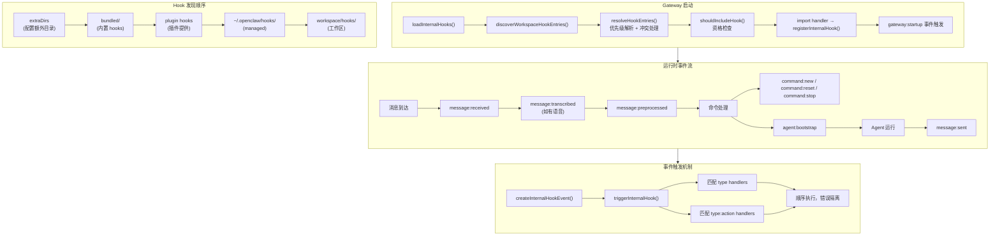
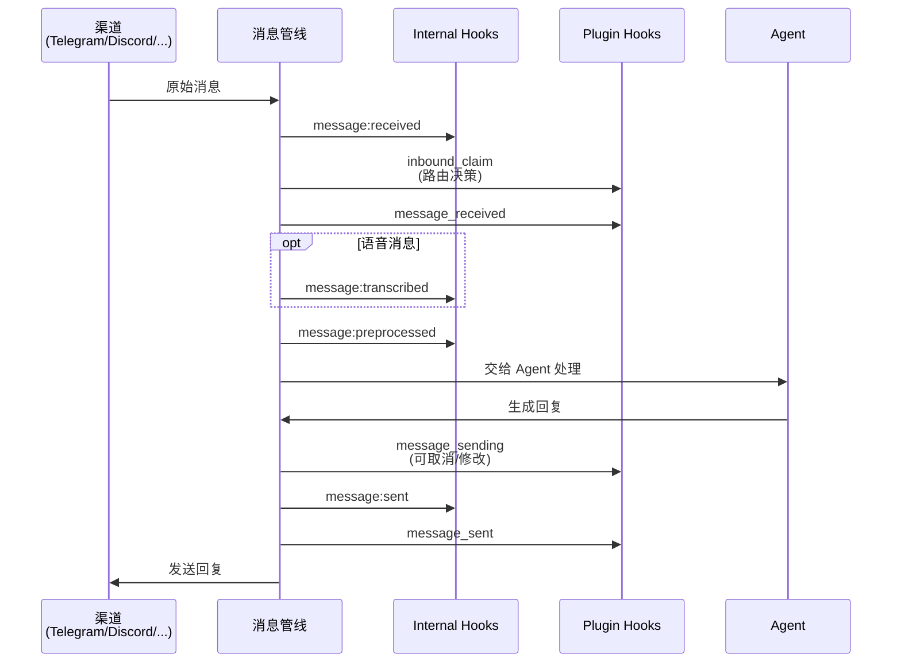
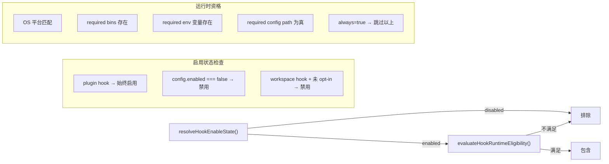
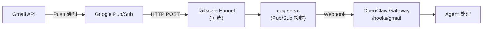

# OC-13 Hook 系统

## 1. 概述

OpenClaw 的 Hook 系统是一个**事件驱动的扩展架构**，允许在 Gateway 生命周期的关键节点注入自定义逻辑。它贯穿消息收发、命令处理、Agent 启动、Gateway 生命周期等核心流程，是 OpenClaw 可扩展性的基石。

Hook 系统由两个平行的事件层组成：

| 层级           | 名称             | 事件键格式                          | 来源                                |
| -------------- | ---------------- | ----------------------------------- | ----------------------------------- |
| Internal Hooks | 内部事件钩子     | `type:action`（如 `command:new`）   | 内置 + Workspace + Managed + Plugin |
| Plugin Hooks   | 插件生命周期钩子 | 命名常量（如 `before_agent_start`） | Plugin SDK `on()` API               |

Internal Hooks 面向系统级扩展（bundled hooks、workspace hooks、managed hooks），通过 `HOOK.md` + `handler.ts` 的目录约定注册。Plugin Hooks 面向插件开发者，通过 Plugin SDK 的 `ctx.on()` 方法注册。两层在消息流中通过 `message-hook-mappers.ts` 统一桥接。

> [!info] 核心设计原则
>
> - **Fire-and-forget 语义**：消息钩子异步触发，不阻塞主流程
> - **隔离安全**：Boundary file checks 防止路径逃逸，workspace hooks 默认关闭需 opt-in
> - **全局单例注册表**：使用 `Symbol.for()` + `globalThis` 确保 bundler 拆分后 handler 仍可见
> - **覆盖优先级**：bundled < plugin < managed < workspace（precedence 递增）

**关键文件索引**：

| 文件                                      | 职责                                      |
| ----------------------------------------- | ----------------------------------------- |
| `src/hooks/internal-hooks.ts`             | 核心事件注册/触发引擎                     |
| `src/hooks/loader.ts`                     | Hook 加载器（目录发现 + Legacy 配置）     |
| `src/hooks/workspace.ts`                  | Workspace/Bundled/Managed/Plugin 目录扫描 |
| `src/hooks/policy.ts`                     | 来源策略、优先级解析、冲突处理            |
| `src/hooks/config.ts`                     | 运行时资格检查（OS/bins/env/config）      |
| `src/hooks/frontmatter.ts`                | HOOK.md frontmatter 解析                  |
| `src/hooks/message-hook-mappers.ts`       | 消息上下文规范化 + Plugin/Internal 桥接   |
| `src/hooks/plugin-hooks.ts`               | 插件提供的 hook 目录解析                  |
| `src/hooks/fire-and-forget.ts`            | 非阻塞触发工具函数                        |
| `src/hooks/install.ts`                    | Hook 安装（npm/archive/path）             |
| `src/hooks/gmail.ts` / `gmail-watcher.ts` | Gmail 集成 hook                           |

## 2. Hook 生命周期图



## 3. Hook 注册与发现

### 3.1 目录约定

每个 Hook 是一个包含 `HOOK.md` 和 handler 文件的目录：

```
my-hook/
├── HOOK.md          # 元数据 + 文档（YAML frontmatter）
├── handler.ts       # 处理函数（default export）
└── package.json     # 可选：hook pack 时声明 openclaw.hooks
```

Handler 文件候选名（按优先级）：`handler.ts` → `handler.js` → `index.ts` → `index.js`

### 3.2 HOOK.md Frontmatter 格式

```yaml
---
name: session-memory
description: "Save session context to memory"
homepage: https://docs.openclaw.ai/automation/hooks#session-memory
metadata:
  {
    "openclaw":
      {
        "emoji": "💾",
        "events": ["command:new", "command:reset"],
        "hookKey": "session-memory",
        "export": "default",
        "always": false,
        "os": ["darwin", "linux"],
        "requires":
          {
            "bins": ["node"],
            "anyBins": ["bun", "node"],
            "env": ["SOME_API_KEY"],
            "config": ["workspace.dir"],
          },
        "install": [{ "id": "bundled", "kind": "bundled", "label": "Bundled with OpenClaw" }],
      },
  }
enabled: true
---
```

`frontmatter.ts` 中的 `resolveOpenClawMetadata()` 解析 `openclaw` 块，提取：

- **events**：监听的事件列表，是 Hook 的核心路由键
- **requires**：运行时依赖检查（二进制文件、环境变量、配置路径）
- **os**：平台限制
- **always**：是否跳过 requires 检查
- **install**：安装方式声明（`bundled` / `npm` / `git`）

### 3.3 发现流程

`discoverWorkspaceHookEntries()` 按以下顺序扫描：

```
1. extraDirs          — config.hooks.internal.load.extraDirs（用户自定义额外目录）
2. bundled/           — resolveBundledHooksDir()（内置 hooks）
3. plugin hooks       — resolvePluginHookDirs()（插件注册的 hook 目录）
4. ~/.openclaw/hooks/ — managed hooks（跨 workspace 共享）
5. <workspace>/hooks/ — workspace hooks（当前工作区专属）
```

> [!important] Hook Pack 模式
> 如果 Hook 目录内有 `package.json` 且包含 `openclaw.hooks` 字段，则按 Hook Pack 模式处理——`openclaw.hooks` 数组中的每个路径指向一个子 Hook 目录，支持单包多 Hook。

### 3.4 加载流程

`loader.ts` 的 `loadInternalHooks()` 执行两阶段加载：

**阶段 1：目录发现**（新系统）

1. 调用 `loadWorkspaceHookEntries()` 获取所有 HookEntry
2. `shouldIncludeHook()` 过滤不合格的 Hook
3. 对每个合格 Hook：
   - `openBoundaryFile()` 安全验证 handler 路径
   - `buildImportUrl()` 构建 import URL（bundled 不加 cache-bust，其余加 `?t=mtime&s=size`）
   - 动态 `import()` 加载模块
   - `resolveFunctionModuleExport()` 提取 handler 函数
   - `registerInternalHook()` 按 events 列表注册到全局 Map

**阶段 2：Legacy 配置**（向后兼容）

- 读取 `config.hooks.internal.handlers[]`
- 按 workspace-relative 路径加载模块
- 同样经过 boundary check 和安全验证

### 3.5 全局单例注册表

```typescript
// internal-hooks.ts
const INTERNAL_HOOK_HANDLERS_KEY = Symbol.for("openclaw.internalHookHandlers");
const handlers = resolveGlobalSingleton<Map<string, InternalHookHandler[]>>(
  INTERNAL_HOOK_HANDLERS_KEY,
  () => new Map(),
);
```

> [!warning] 为什么用 globalThis 单例？
> bundler 可能将此模块拆分到多个 chunk 中。如果用普通的模块级 Map，chunk A 注册的 handler 在 chunk B 调用 `triggerInternalHook` 时不可见，导致 hook 静默失败。`Symbol.for()` + `globalThis` 确保跨 chunk 共享同一个 Map。

## 4. 内部 Hook（Internal Hooks）

### 4.1 事件类型体系

```typescript
type InternalHookEventType = "command" | "session" | "agent" | "gateway" | "message";
```

每个事件由 `type` + `action` 组合标识，handler 可监听：

- **通配**：`registerInternalHook("command", handler)` — 所有 command 事件
- **精确**：`registerInternalHook("command:new", handler)` — 仅 `/new` 命令

### 4.2 InternalHookEvent 接口

```typescript
interface InternalHookEvent {
  type: InternalHookEventType;
  action: string;
  sessionKey: string;
  context: Record<string, unknown>;
  timestamp: Date;
  messages: string[]; // hook 可推送消息给用户
}
```

### 4.3 已定义的事件类型

| 事件键                 | 类型化 Context                   | 触发点                   |
| ---------------------- | -------------------------------- | ------------------------ |
| `gateway:startup`      | `GatewayStartupHookContext`      | Gateway 启动完成后 250ms |
| `agent:bootstrap`      | `AgentBootstrapHookContext`      | Agent prompt 组装前      |
| `command:new`          | 命令上下文                       | `/new` 命令              |
| `command:reset`        | 命令上下文                       | `/reset` 命令            |
| `command:stop`         | 命令上下文                       | `/stop` 命令             |
| `command`              | 命令上下文                       | 任意命令（通配）         |
| `message:received`     | `MessageReceivedHookContext`     | 消息到达                 |
| `message:sent`         | `MessageSentHookContext`         | 消息发送完成             |
| `message:transcribed`  | `MessageTranscribedHookContext`  | 语音转文字完成           |
| `message:preprocessed` | `MessagePreprocessedHookContext` | 消息预处理完成           |

### 4.4 事件触发机制

```typescript
async function triggerInternalHook(event: InternalHookEvent): Promise<void> {
  const typeHandlers = handlers.get(event.type) ?? [];
  const specificHandlers = handlers.get(`${event.type}:${event.action}`) ?? [];
  const allHandlers = [...typeHandlers, ...specificHandlers];

  for (const handler of allHandlers) {
    try {
      await handler(event);  // 顺序执行
    } catch (err) {
      log.error(...);  // 错误隔离，不影响后续 handler
    }
  }
}
```

### 4.5 类型守卫

`internal-hooks.ts` 为每种事件提供类型守卫函数，handler 内部使用：

- `isAgentBootstrapEvent(event)` → `AgentBootstrapHookEvent`
- `isGatewayStartupEvent(event)` → `GatewayStartupHookEvent`
- `isMessageReceivedEvent(event)` → `MessageReceivedHookEvent`
- `isMessageSentEvent(event)` → `MessageSentHookEvent`
- `isMessageTranscribedEvent(event)` → `MessageTranscribedHookEvent`
- `isMessagePreprocessedEvent(event)` → `MessagePreprocessedHookEvent`

## 5. 消息 Hook（Message Hooks）

### 5.1 消息事件流

消息从渠道到达后经过的 Hook 触发序列：



### 5.2 消息上下文规范化

`message-hook-mappers.ts` 定义了两个核心的规范化上下文类型：

**`CanonicalInboundMessageHookContext`** — 入站消息的统一表示：

- 从 `FinalizedMsgContext`（渠道适配层的模板上下文）派生
- 统一了 `from`、`to`、`channelId`、`conversationId` 等字段
- 处理了群组消息、Telegram topic、Discord channel/user 等特殊情况

**`CanonicalSentMessageHookContext`** — 出站消息的统一表示：

- 包含 `to`、`content`、`success`、`error` 等发送结果

### 5.3 上下文转换函数

从规范化上下文到各目标格式：

| 函数                                     | 目标                                 |
| ---------------------------------------- | ------------------------------------ |
| `toInternalMessageReceivedContext()`     | Internal Hook `message:received`     |
| `toInternalMessageTranscribedContext()`  | Internal Hook `message:transcribed`  |
| `toInternalMessagePreprocessedContext()` | Internal Hook `message:preprocessed` |
| `toInternalMessageSentContext()`         | Internal Hook `message:sent`         |
| `toPluginMessageReceivedEvent()`         | Plugin Hook `message_received`       |
| `toPluginMessageSentEvent()`             | Plugin Hook `message_sent`           |
| `toPluginInboundClaimEvent()`            | Plugin Hook `inbound_claim`          |
| `toPluginInboundClaimContext()`          | Plugin Hook `inbound_claim` ctx      |
| `toPluginMessageContext()`               | Plugin Hook 通用消息 ctx             |

### 5.4 对话 ID 解析逻辑

`deriveConversationId()` 根据渠道类型智能解析：

- **Discord**：从 `discord:channel:xxx` / `discord:user:xxx` 前缀中提取 `channel:xxx` / `user:xxx`
- **Telegram**：支持 topic 模式，生成 `chatId:topic:threadId` 格式
- **通用**：剥离 `channel:` / `chat:` / `user:` 等通用前缀

### 5.5 Fire-and-Forget 模式

消息相关的 Hook 使用非阻塞触发，不等待完成：

```typescript
// fire-and-forget.ts
export function fireAndForgetHook(task: Promise<unknown>, label: string): void {
  void task.catch((err) => {
    logger(`${label}: ${String(err)}`);
  });
}
```

在 `message-preprocess-hooks.ts` 中的实际使用：

```typescript
fireAndForgetHook(
  triggerInternalHook(createInternalHookEvent("message", "transcribed", sessionKey, ctx)),
  "get-reply: message:transcribed internal hook failed",
);
```

## 6. Plugin Hook（插件生命周期钩子）

### 6.1 Plugin Hook 名称表

Plugin SDK 通过 `ctx.on(hookName, handler)` 注册生命周期钩子，完整列表：

| Hook 名称                  | 阶段                   | 可返回值                                          |
| -------------------------- | ---------------------- | ------------------------------------------------- |
| `before_model_resolve`     | Agent 启动前           | `modelOverride`                                   |
| `before_prompt_build`      | Prompt 组装前          | `systemPrompt`, `prependContext`, `appendContext` |
| `before_agent_start`       | Agent 启动前（legacy） | 组合以上两者                                      |
| `llm_input`                | LLM 调用前             | -                                                 |
| `llm_output`               | LLM 输出后             | -                                                 |
| `agent_end`                | Agent 运行结束         | -                                                 |
| `before_compaction`        | 会话压缩前             | -                                                 |
| `after_compaction`         | 会话压缩后             | -                                                 |
| `before_reset`             | 会话重置前             | -                                                 |
| `inbound_claim`            | 入站消息路由决策       | `claim` / `skip` / 路由信息                       |
| `message_received`         | 消息接收后             | -                                                 |
| `message_sending`          | 消息发送前             | `content`（修改）, `cancel`                       |
| `message_sent`             | 消息发送后             | -                                                 |
| `before_tool_call`         | 工具调用前             | -                                                 |
| `after_tool_call`          | 工具调用后             | -                                                 |
| `tool_result_persist`      | 工具结果持久化         | -                                                 |
| `before_message_write`     | 消息写入前             | -                                                 |
| `session_start`            | 会话启动               | -                                                 |
| `session_end`              | 会话结束               | -                                                 |
| `subagent_spawning`        | 子 Agent 生成前        | -                                                 |
| `subagent_delivery_target` | 子 Agent 投递目标      | -                                                 |
| `subagent_spawned`         | 子 Agent 已生成        | -                                                 |
| `subagent_ended`           | 子 Agent 已结束        | -                                                 |
| `gateway_start`            | Gateway 启动           | -                                                 |
| `gateway_stop`             | Gateway 停止           | -                                                 |

### 6.2 Plugin 提供的 Internal Hook 目录

插件还可以通过 `openclaw.plugin.json` 的 `hooks` 字段声明 Internal Hook 目录：

```json
{
  "id": "my-plugin",
  "hooks": ["hooks/my-hook"]
}
```

`plugin-hooks.ts` 中的 `resolvePluginHookDirs()` 解析流程：

1. 加载插件 Manifest Registry
2. 过滤已启用的插件（考虑 memory slot 互斥）
3. 解析每个插件声明的 hook 路径
4. 验证路径在插件根目录内（`isPathInsideWithRealpath`）
5. 返回 `{ dir, pluginId }` 列表

## 7. Workspace Hook

### 7.1 Hook 来源与优先级

`policy.ts` 定义了四种来源的策略：

| 来源                 | Precedence | 默认启用            | 可覆盖                   | 可被覆盖        |
| -------------------- | ---------- | ------------------- | ------------------------ | --------------- |
| `openclaw-bundled`   | 10         | default-on          | 自身                     | managed, plugin |
| `openclaw-plugin`    | 20         | default-on          | bundled, plugin          | managed         |
| `openclaw-managed`   | 30         | default-on          | bundled, managed, plugin | managed         |
| `openclaw-workspace` | 40         | **explicit-opt-in** | 自身                     | 自身            |

> [!warning] Workspace Hook 默认关闭
> `openclaw-workspace` 来源的 Hook 默认不启用，必须在配置中显式 `"enabled": true`。这是安全考量——workspace hooks 是用户本地代码，Gateway 进程会直接执行。

### 7.2 冲突解析

`resolveHookEntries()` 按 precedence 升序处理。同名 Hook 时：

- 高优先级可覆盖低优先级（按 `canOverride` / `canBeOverriddenBy` 策略）
- 不可覆盖时记录警告并忽略低优先级的同名 Hook

### 7.3 Snapshot 构建

`buildWorkspaceHookSnapshot()` 生成当前 Hook 状态快照，用于 status 报告和 introspection：

```typescript
type HookSnapshot = {
  hooks: Array<{ name: string; events: string[] }>;
  resolvedHooks?: Hook[];
  version?: number;
};
```

## 8. Hook 配置

### 8.1 资格检查流程

`config.ts` 的 `shouldIncludeHook()` 执行三层检查：



### 8.2 Policy 配置

```typescript
type HookInvocationPolicy = {
  enabled: boolean;
};

type HookConfig = {
  enabled?: boolean;
  env?: Record<string, string>; // 虚拟环境变量
  [key: string]: unknown; // Hook 自定义配置
};
```

**hookKey 机制**：Hook 的配置键默认为 `hook.name`，可通过 metadata 的 `hookKey` 字段自定义。配置查找路径：`config.hooks.internal.entries[hookKey]`。

### 8.3 Fire-and-Forget 策略

消息类 Hook 使用 fire-and-forget 模式：

```typescript
fireAndForgetHook(
  triggerInternalHook(event),
  "label for error logging",
  logVerbose, // 可选 logger
);
```

错误被 catch 并记录，不影响主消息处理流程。

## 9. Gmail Hook

### 9.1 架构

Gmail Hook 通过 Google Pub/Sub 实现邮件推送通知，是 OpenClaw 最复杂的外部集成 Hook：



### 9.2 核心组件

| 文件                         | 职责                                      |
| ---------------------------- | ----------------------------------------- |
| `gmail.ts`                   | 配置解析、URL 构建、CLI 参数构建          |
| `gmail-ops.ts`               | 完整的 setup 和 run 操作（面向 CLI 命令） |
| `gmail-watcher.ts`           | 后台 watcher 服务（Gateway 自动启动）     |
| `gmail-watcher-lifecycle.ts` | watcher 启动/跳过的生命周期封装           |
| `gmail-watcher-errors.ts`    | 错误分类（如 `EADDRINUSE` 检测）          |
| `gmail-setup-utils.ts`       | GCP/Tailscale/gog 依赖检查和设置          |

### 9.3 运行时配置

```typescript
type GmailHookRuntimeConfig = {
  account: string; // Gmail 账号
  label: string; // 监听标签（默认 INBOX）
  topic: string; // Pub/Sub topic 路径
  subscription: string; // Pub/Sub subscription
  pushToken: string; // Pub/Sub 推送验证 token
  hookToken: string; // Gateway webhook 认证 token
  hookUrl: string; // Gateway webhook URL
  includeBody: boolean; // 是否包含邮件正文
  maxBytes: number; // 正文最大字节（默认 20KB）
  renewEveryMinutes: number; // watch 续期间隔（默认 720min）
  serve: { bind; port; path };
  tailscale: { mode; path; target };
};
```

### 9.4 Watcher 生命周期

`startGmailWatcher()` 在 Gateway 启动时自动调用：

1. 检查 `hooks.enabled` 和 `hooks.gmail.account`
2. 检查 `gog` 二进制是否可用
3. 设置 Tailscale endpoint（如配置）
4. `gog gmail watch start` 注册 Gmail API watch
5. `spawn("gog", args)` 启动 Pub/Sub serve 进程
6. 设置定时续期 interval
7. 进程退出时自动重启（5s 延迟），除非是 `EADDRINUSE`

> [!tip] 跳过 Gmail Watcher
> 设置 `OPENCLAW_SKIP_GMAIL_WATCHER=1` 可在 Gateway 启动时跳过 Gmail watcher。

## 10. 内置 Hook（Bundled Hooks）

### 10.1 session-memory

- **事件**：`command:new`, `command:reset`
- **功能**：会话重置时保存对话摘要到 `<workspace>/memory/YYYY-MM-DD-slug.md`
- **LLM 生成 slug**：通过 `llm-slug-generator.ts` 调用 Agent 的配置模型生成 1-2 词的文件名
- **Fallback**：LLM 不可用时使用 `HHMM` 时间戳
- **配置**：`hooks.internal.entries.session-memory.messages`（消息数，默认 15）

### 10.2 bootstrap-extra-files

- **事件**：`agent:bootstrap`
- **功能**：在 Agent prompt 组装时注入额外的 bootstrap 文件（如 monorepo 中的多个 `AGENTS.md`）
- **配置**：`hooks.internal.entries.bootstrap-extra-files.paths`（glob 模式数组）
- **安全**：文件必须在 workspace 内，且文件名必须是已知的 bootstrap 文件名

### 10.3 command-logger

- **事件**：`command`（所有命令）
- **功能**：将命令事件追加到 `~/.openclaw/logs/commands.log`（JSONL 格式）
- **字段**：`timestamp`, `action`, `sessionKey`, `senderId`, `source`
- **无依赖**：所有平台可用

### 10.4 boot-md

- **事件**：`gateway:startup`
- **功能**：Gateway 启动后为每个 Agent scope 执行 `BOOT.md`
- **依赖**：`config.workspace.dir` 必须设置
- **机制**：遍历所有 agentIds，对每个调用 `runBootOnce()`

## 11. Hook 安装与更新

### 11.1 安装来源

`install.ts` 支持三种安装方式：

| 方式    | 入口函数                    | 说明                         |
| ------- | --------------------------- | ---------------------------- |
| npm     | `installHooksFromNpmSpec()` | 从 npm registry 下载 tarball |
| Archive | `installHooksFromArchive()` | 从本地 `.tgz` 文件安装       |
| Path    | `installHooksFromPath()`    | 从本地目录或文件安装         |

安装目标目录：`~/.openclaw/hooks/<hookId>/`

### 11.2 安装验证

- Hook ID 校验：禁止 `.`、`..`、路径分隔符
- `ensureOpenClawHooks()`：验证 `package.json` 中的 `openclaw.hooks` 字段
- `validateHookDir()`：验证目标目录包含 `HOOK.md` + handler 文件
- 路径逃逸检测：`isPathInsideWithRealpath()`

### 11.3 更新流程

`update.ts` 的 `updateNpmInstalledHookPacks()` 处理 npm 安装的 hook 包更新：

1. 读取 `config.hooks.internal.installs` 中的安装记录
2. 对每个目标：比较当前版本和 npm 最新版本
3. 支持 `dryRun` 模式（仅检查，不安装）
4. 支持 integrity drift 检测和回调
5. 成功后通过 `recordHookInstall()` 更新配置中的安装记录

### 11.4 安装记录

```typescript
type HookInstallRecord = {
  source: "npm" | "path" | "archive";
  spec?: string; // npm spec
  installPath?: string; // 安装目录
  version?: string;
  resolvedName?: string;
  resolvedSpec?: string;
  integrity?: string; // npm tarball SHA 完整性
  hooks?: string[]; // 包含的 hook 名称列表
  installedAt?: string; // ISO 时间戳
};
```

## 12. 配置项速查

### 12.1 顶层 hooks 配置

```json
{
  "hooks": {
    "enabled": true,
    "path": "/hooks",
    "token": "hex-string",
    "defaultSessionKey": "hook:default",
    "allowRequestSessionKey": false,
    "allowedSessionKeyPrefixes": ["hook:"],
    "allowedAgentIds": ["main", "*"],
    "maxBodyBytes": 65536,
    "presets": ["gmail"],
    "transformsDir": "./transforms",
    "mappings": [
      {
        "match": { "path": "/github", "source": "github" },
        "action": "agent",
        "agentId": "github-bot",
        "messageTemplate": "New event: {{body}}",
        "channel": "telegram",
        "to": "+1234567890",
        "model": "anthropic/claude-3-5-sonnet",
        "thinking": "low",
        "timeoutSeconds": 30
      }
    ],
    "gmail": {
      "account": "user@gmail.com",
      "label": "INBOX",
      "topic": "projects/my-project/topics/gog-gmail-watch",
      "subscription": "gog-gmail-watch-push",
      "pushToken": "hex-string",
      "hookUrl": "http://127.0.0.1:18789/hooks/gmail",
      "includeBody": true,
      "maxBytes": 20000,
      "renewEveryMinutes": 720,
      "model": "anthropic/claude-3-5-sonnet",
      "thinking": "low",
      "serve": { "bind": "127.0.0.1", "port": 8788, "path": "/gmail-pubsub" },
      "tailscale": { "mode": "funnel", "path": "/gmail-pubsub" }
    },
    "internal": {
      "enabled": true,
      "handlers": [
        { "event": "command:new", "module": "./hooks/my-handler.ts", "export": "default" }
      ],
      "entries": {
        "session-memory": { "enabled": true, "messages": 25 },
        "boot-md": { "enabled": true },
        "command-logger": { "enabled": false },
        "bootstrap-extra-files": {
          "enabled": true,
          "paths": ["packages/*/AGENTS.md"]
        }
      },
      "load": {
        "extraDirs": ["/opt/openclaw-hooks"]
      },
      "installs": {
        "my-hook-pack": {
          "source": "npm",
          "spec": "@myorg/openclaw-hooks@latest",
          "installPath": "~/.openclaw/hooks/my-hook-pack",
          "version": "1.0.0"
        }
      }
    }
  }
}
```

### 12.2 CLI 命令速查

| 命令                            | 说明                 |
| ------------------------------- | -------------------- |
| `openclaw hooks list`           | 列出所有发现的 Hook  |
| `openclaw hooks info <name>`    | 显示 Hook 详情       |
| `openclaw hooks check`          | 检查 Hook 状态和依赖 |
| `openclaw hooks enable <name>`  | 启用 Hook            |
| `openclaw hooks disable <name>` | 禁用 Hook            |
| `openclaw webhooks gmail setup` | Gmail Hook 初始化    |
| `openclaw webhooks gmail run`   | 启动 Gmail Hook 服务 |

### 12.3 环境变量

| 变量                          | 说明                             |
| ----------------------------- | -------------------------------- |
| `OPENCLAW_BUNDLED_HOOKS_DIR`  | 覆盖 bundled hooks 目录位置      |
| `OPENCLAW_SKIP_GMAIL_WATCHER` | 设为 `1` 跳过 Gmail watcher 启动 |
| `OPENCLAW_TEST_FAST`          | 测试环境标记，跳过 LLM slug 生成 |

---

**相关文档**：[[OpenClaw Gateway MOC]] | [[OC-01 Gateway 架构概览]]
