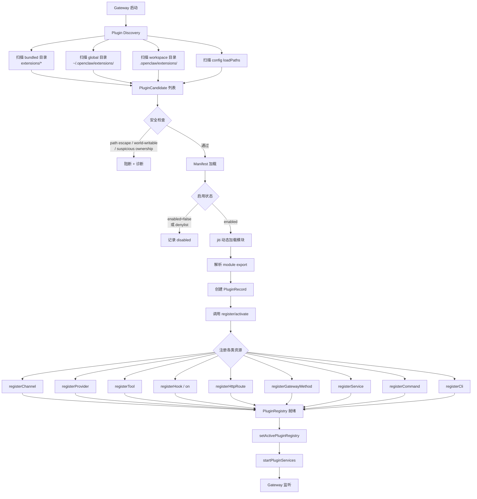
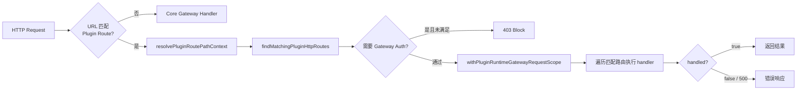

# OC-14 Plugin 系统

> [!info] 模块定位
> Plugin 系统是 OpenClaw Gateway 的扩展骨架，负责发现、加载、注册和运行所有插件。插件可以提供 **渠道 (channel)**、**模型提供者 (provider)**、**工具 (tool)**、**Hook**、**HTTP 路由**、**CLI 命令**、**服务 (service)**、**命令 (command)**、**语音 (speech)**、**媒体理解 (media understanding)**、**图像生成 (image generation)**、**Web 搜索 (web search)** 等能力。

核心代码位于 `src/plugins/`，插件实例位于 `extensions/`，SDK 接口层位于 `src/plugin-sdk/`（见 [[OC-15 Plugin SDK]]）。

---

## 1. 概述

OpenClaw 采用 **内置插件 + 外部插件** 统一架构。所有 80+ 个 `extensions/*` 目录下的渠道/提供者都是与外部第三方插件使用完全相同的注册 API 加载的内置 (bundled) 插件。

核心组件：

| 组件          | 文件                             | 职责                                             |
| ------------- | -------------------------------- | ------------------------------------------------ |
| Manifest      | `manifest.ts`                    | `openclaw.plugin.json` 解析与类型定义            |
| Discovery     | `discovery.ts`                   | 多源扫描：bundled / global / workspace / config  |
| Loader        | `loader.ts`                      | jiti 动态加载 + 注册 API 注入 + 缓存             |
| Registry      | `registry.ts`                    | 统一注册表：tools, hooks, channels, providers... |
| Runtime State | `runtime.ts`                     | 全局 `PluginRegistry` 单例管理（Symbol key）     |
| Hooks         | `hooks.ts`                       | 类型化 Hook 运行器（优先级排序 + merge）         |
| HTTP Handler  | `gateway/server/plugins-http.ts` | Plugin HTTP 路由分发到 Gateway HTTP 层           |
| Services      | `services.ts`                    | 插件 Service 生命周期 start/stop                 |
| Types         | `types.ts`                       | 全类型定义（~600 种插件接口类型）                |

---

## 2. Plugin 生命周期



### 加载模式

- **full**：完整注册所有资源（Gateway 启动默认模式）
- **setup-only**：仅注册 Channel Setup（延迟全量加载未配置的渠道插件以加速启动）
- **validate**：仅校验 manifest 和配置，不执行 register

---

## 3. Plugin Manifest (`openclaw.plugin.json`)

每个插件根目录必须有一个 `openclaw.plugin.json` 文件。

```json
{
  "id": "openai",
  "providers": ["openai", "openai-codex"],
  "providerAuthEnvVars": {
    "openai": ["OPENAI_API_KEY"]
  },
  "providerAuthChoices": [
    {
      "provider": "openai",
      "method": "api-key",
      "choiceId": "openai-api-key",
      "choiceLabel": "OpenAI API key",
      "groupId": "openai",
      "groupLabel": "OpenAI",
      "optionKey": "openaiApiKey",
      "cliFlag": "--openai-api-key",
      "cliOption": "--openai-api-key <key>",
      "cliDescription": "OpenAI API key"
    }
  ],
  "configSchema": {
    "type": "object",
    "additionalProperties": false,
    "properties": {}
  }
}
```

### Schema 字段一览

| 字段                  | 类型                                 | 说明                       |
| --------------------- | ------------------------------------ | -------------------------- |
| `id`                  | `string` (必填)                      | 插件唯一标识               |
| `configSchema`        | `object` (必填)                      | JSON Schema 格式的配置校验 |
| `name`                | `string`                             | 显示名称                   |
| `description`         | `string`                             | 描述                       |
| `version`             | `string`                             | 版本号                     |
| `kind`                | `"memory" \| "context-engine"`       | 特殊插件类型               |
| `enabledByDefault`    | `boolean`                            | 是否默认启用               |
| `channels`            | `string[]`                           | 注册的渠道 id 列表         |
| `providers`           | `string[]`                           | 注册的 Provider id 列表    |
| `providerAuthEnvVars` | `Record<string, string[]>`           | Provider 对应的环境变量    |
| `providerAuthChoices` | `ProviderManifestAuthChoice[]`       | 认证选项元数据             |
| `skills`              | `string[]`                           | 注册的技能列表             |
| `uiHints`             | `Record<string, PluginConfigUiHint>` | 配置 UI 提示               |

### `package.json` 中的 `openclaw` 字段

除了 `openclaw.plugin.json`，插件的 `package.json` 可以声明 `openclaw` 元数据：

```typescript
type OpenClawPackageManifest = {
  extensions?: string[]; // 入口文件路径列表
  setupEntry?: string; // 轻量 setup-only 入口
  channel?: PluginPackageChannel; // 渠道目录元数据
  install?: PluginPackageInstall; // npm 安装/本地安装选项
  startup?: {
    deferConfiguredChannelFullLoadUntilAfterListen?: boolean;
  };
};
```

---

## 4. Plugin 注册与发现

### 4.1 发现源 (Plugin Source Roots)

```typescript
// src/plugins/roots.ts
type PluginSourceRoots = {
  stock?: string; // 内置插件: extensions/
  global: string; // 全局插件: ~/.openclaw/extensions/
  workspace?: string; // 工作区插件: .openclaw/extensions/
};
```

扫描优先级：**config loadPaths > workspace > bundled > global**

### 4.2 安全检查

发现过程对每个候选路径执行安全验证：

| 检查项                      | 阻断条件                                          |
| --------------------------- | ------------------------------------------------- |
| `source_escapes_root`       | 入口文件 realpath 逃逸出插件根目录                |
| `path_world_writable`       | 路径有 world-writable 权限 (mode & 0o002)         |
| `path_suspicious_ownership` | 非 bundled 插件的路径 uid 不匹配当前用户且非 root |
| `path_stat_failed`          | 无法 stat 路径                                    |

> [!warning] bundled 插件的自动修复
> 内置插件目录如果 world-writable（npm 安装可能导致），系统会尝试 `chmod` 自动修复而非直接阻断。

### 4.3 发现缓存

`discoverOpenClawPlugins` 使用短期缓存（默认 1000ms）折叠启动阶段的重复扫描。可通过 `OPENCLAW_PLUGIN_DISCOVERY_CACHE_MS` 和 `OPENCLAW_DISABLE_PLUGIN_DISCOVERY_CACHE` 环境变量控制。

### 4.4 ID 派生策略

- 单入口包：使用 `package.json` 的 unscoped 包名（如 `@openclaw/voice-call` -> `voice-call`）
- 多入口包：`packageId/basename` 格式
- 有标准别名映射（`elevenlabs-speech` -> `elevenlabs`，`ollama-provider` -> `ollama` 等）

---

## 5. Plugin Runtime

### 5.1 全局 Registry 单例

```typescript
// src/plugins/runtime.ts
const REGISTRY_STATE = Symbol.for("openclaw.pluginRegistryState");

type RegistryState = {
  registry: PluginRegistry | null;
  httpRouteRegistry: PluginRegistry | null;
  httpRouteRegistryPinned: boolean;
  key: string | null;
  version: number;
};
```

`setActivePluginRegistry(registry)` 设置全局活跃注册表。支持 **HTTP Route Registry 独立钉定**——在插件热重载时保持 HTTP 路由稳定。

### 5.2 PluginRegistry 结构

```typescript
type PluginRegistry = {
  plugins: PluginRecord[];
  tools: PluginToolRegistration[];
  hooks: PluginHookRegistration[];
  typedHooks: TypedPluginHookRegistration[];
  channels: PluginChannelRegistration[];
  channelSetups: PluginChannelSetupRegistration[];
  providers: PluginProviderRegistration[];
  speechProviders: PluginSpeechProviderRegistration[];
  mediaUnderstandingProviders: PluginMediaUnderstandingProviderRegistration[];
  imageGenerationProviders: PluginImageGenerationProviderRegistration[];
  webSearchProviders: PluginWebSearchProviderRegistration[];
  gatewayHandlers: GatewayRequestHandlers;
  httpRoutes: PluginHttpRouteRegistration[];
  cliRegistrars: PluginCliRegistration[];
  services: PluginServiceRegistration[];
  commands: PluginCommandRegistration[];
  conversationBindingResolvedHandlers: [...];
  diagnostics: PluginDiagnostic[];
};
```

### 5.3 `OpenClawPluginApi` 注册 API

loader 为每个启用的插件创建一个 `OpenClawPluginApi` 实例，作为 `register(api)` 的参数传入：

| API 方法                                       | 注册目标                                   |
| ---------------------------------------------- | ------------------------------------------ |
| `registerTool(tool, opts)`                     | Agent 工具                                 |
| `registerChannel(plugin)`                      | 消息渠道                                   |
| `registerProvider(provider)`                   | 模型提供者                                 |
| `registerSpeechProvider(provider)`             | 语音合成提供者                             |
| `registerMediaUnderstandingProvider(provider)` | 媒体理解提供者                             |
| `registerImageGenerationProvider(provider)`    | 图像生成提供者                             |
| `registerWebSearchProvider(provider)`          | 网络搜索提供者                             |
| `registerHttpRoute(params)`                    | HTTP 路由                                  |
| `registerGatewayMethod(method, handler)`       | Gateway RPC 方法                           |
| `registerCli(registrar, opts)`                 | CLI 命令                                   |
| `registerService(service)`                     | 后台服务                                   |
| `registerCommand(command)`                     | 用户命令（slash command）                  |
| `registerHook(events, handler, opts)`          | 传统 Hook                                  |
| `on(hookName, handler, opts)`                  | 类型化 Hook                                |
| `registerInteractiveHandler(...)`              | 交互式处理器                               |
| `registerContextEngine(id, factory)`           | 上下文引擎                                 |
| `registerMemoryPromptSection(builder)`         | 记忆 Prompt 段（仅 `kind: "memory"` 插件） |
| `onConversationBindingResolved(handler)`       | 会话绑定解析回调                           |

每个方法内部都有去重检查和诊断日志。在 `setup-only` 模式下，大部分注册操作会变成 no-op。

### 5.4 PluginRuntime 注入

每个插件获得的 `api.runtime` 是一个隔离 Proxy，将 `subagent` 操作自动包装为 plugin-scoped：

```typescript
// registry.ts
const runtime = new Proxy(registryParams.runtime, {
  get(target, prop, receiver) {
    if (prop !== "subagent") {
      return Reflect.get(target, prop, receiver);
    }
    return {
      run: (params) => withPluginRuntimePluginIdScope(pluginId, () => subagent.run(params)),
      // ...
    };
  },
});
```

---

## 6. Plugin HTTP Handler

`src/gateway/server/plugins-http.ts` 将插件注册的 HTTP 路由桥接到 Gateway HTTP 服务器。



路由匹配支持两种模式：

- `exact`：精确路径匹配
- `prefix`：前缀匹配

认证模式：

- `gateway`：使用 Gateway 层面的 auth（继承 admin/approvals/pairing scope）
- `plugin`：由插件自行处理认证（仅获得 write scope）

> [!important] 路由安全
> 系统会检查 auth 类型不一致的重叠路由并阻断注册，防止认证降级攻击。

---

## 7. Provider Auth Context

Provider 插件通过 `ProviderAuthContext` 接收交互式认证上下文：

```typescript
type ProviderAuthContext = {
  config: OpenClawConfig;
  agentDir?: string;
  workspaceDir?: string;
  prompter: WizardPrompter; // CLI 交互式 prompt
  runtime: RuntimeEnv;
  opts?: ProviderAuthOptionBag; // --openai-api-key 等 CLI 参数
  secretInputMode?: SecretInput; // plaintext / env-ref / file-ref / exec-ref
  allowSecretRefPrompt?: boolean;
  isRemote: boolean;
  openUrl: (url: string) => Promise<void>;
  oauth: {
    createVpsAwareHandlers: typeof createVpsAwareOAuthHandlers;
  };
};
```

认证方法类型：`oauth | api_key | token | device_code | custom`

认证结果通过 `ProviderAuthResult` 返回，包含 credential profiles 和可选的 config patch。

---

## 8. Media Understanding Plugins

媒体理解插件实现 `MediaUnderstandingProviderPlugin` 接口：

```typescript
type MediaUnderstandingProviderPlugin = {
  id: string;
  label?: string;
  // ... 具体实现方法在 src/media-understanding/types.ts
};
```

通过 `api.registerMediaUnderstandingProvider(provider)` 注册。运行时通过 `PluginRuntime.mediaUnderstanding` 提供统一访问入口（`runFile`, `describeImageFile`, `describeVideoFile`, `transcribeAudioFile`）。

---

## 9. Speech Provider Plugins

语音合成插件实现 `SpeechProviderPlugin` 接口，提供 TTS 能力：

```typescript
type SpeechProviderPlugin = {
  id: SpeechProviderId;
  label?: string;
  synthesize?: (request: SpeechSynthesisRequest) => Promise<SpeechSynthesisResult>;
  synthesizeTelephony?: (
    request: SpeechTelephonySynthesisRequest,
  ) => Promise<SpeechTelephonySynthesisResult>;
  listVoices?: (request: SpeechListVoicesRequest) => Promise<SpeechVoiceOption[]>;
  isConfigured?: (ctx: SpeechProviderConfiguredContext) => boolean;
};
```

通过 `api.registerSpeechProvider(provider)` 注册。内置实现包括 ElevenLabs (`extensions/elevenlabs`) 和 Microsoft (`extensions/microsoft`) 等。

---

## 相关链接

- [[OC-15 Plugin SDK]] — 插件开发者使用的 SDK 层
- [[OpenClaw Gateway MOC]] — Gateway 总览
- `src/plugins/` — 插件系统核心
- `extensions/` — 80+ 内置插件
