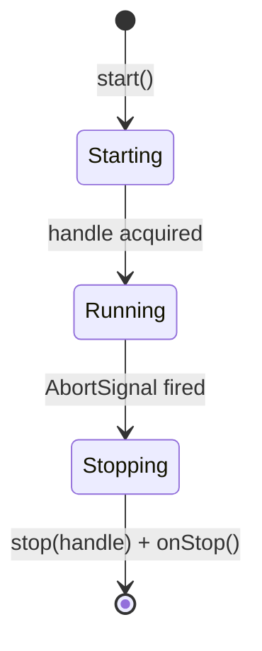
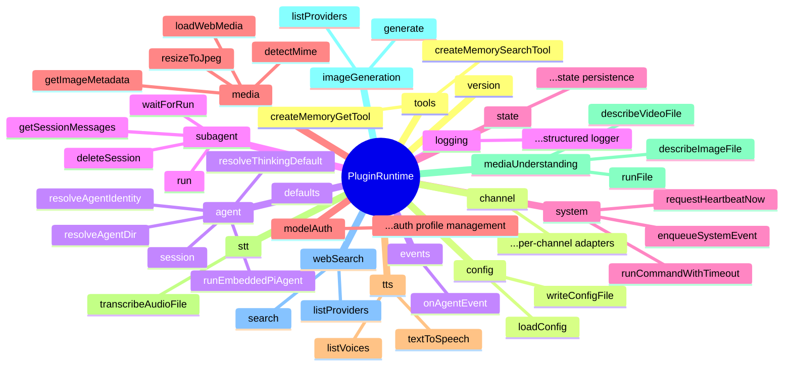

# OC-15 Plugin SDK

> [!info] 模块定位
> Plugin SDK (`src/plugin-sdk/`) 是 OpenClaw 暴露给插件的 **公共接口层**，负责隔离插件代码与 Gateway 核心内部实现。插件通过 `openclaw/plugin-sdk` 及其 40+ 子路径导入 SDK，而非直接 `import` 核心 `src/**` 模块。

设计文档见 `CLAUDE.md` 中的 **Import boundaries** 和 **Extension SDK self-import guardrail** 章节。

---

## 1. 概述

### 1.1 设计理念

Plugin SDK 遵循三个核心原则：

1. **隔离边界**：插件代码只能通过 `openclaw/plugin-sdk/*` 子路径访问核心能力，不允许直接导入 `src/**` 或其他插件的 `src/**`
2. **公共接口**：每个 SDK 子路径是一个 barrel 文件，精心选择需要暴露的 type 和 function，核心内部实现的重构不会破坏插件
3. **按需加载**：SDK 拆分为 ~160 个子路径模块，插件只导入需要的部分，避免加载整个核心

### 1.2 入口架构

```mermaid
flowchart TD
    subgraph "openclaw/plugin-sdk (root)"
        ROOT["index.ts<br>核心类型 + 基础 export"]
    end

    subgraph "Channel SDK"
        CL["channel-lifecycle.ts"]
        CC["channel-contract.ts"]
        CR["channel-reply-pipeline.ts"]
        CI["channel-inbound.ts"]
        CS["channel-setup.ts"]
        CT["channel-targets.ts"]
        CP["channel-pairing.ts"]
        CA["channel-actions.ts"]
        CF["channel-feedback.ts"]
        CST["channel-status.ts"]
        CCS["channel-config-schema.ts"]
        CCH["channel-config-helpers.ts"]
        CPO["channel-policy.ts"]
        CSR["channel-send-result.ts"]
        CORE["core.ts<br>defineChannelPluginEntry"]
    end

    subgraph "Runtime SDKs"
        AR["agent-runtime.ts"]
        GR["gateway-runtime.ts"]
        CLR["cli-runtime.ts"]
        ACP["acp-runtime.ts"]
        HR["hook-runtime.ts"]
        DR["directory-runtime.ts"]
        CNR["config-runtime.ts"]
    end

    subgraph "Provider SDK"
        PA["provider-auth.ts"]
        PE["provider-entry.ts"]
        PC["provider-catalog.ts"]
        PM["provider-models.ts"]
        PS["provider-setup.ts"]
        PU["provider-usage.ts"]
    end

    subgraph "Extension-Specific"
        WC["wecom.ts"]
        CPR["copilot-proxy.ts"]
        DF["diffs.ts"]
        GG["google.ts"]
        OT["diagnostics-otel.ts"]
        AX["acpx.ts"]
        LT["llm-task.ts"]
    end

    ROOT --> CL & AR & PA
    CORE --> CL
```



### 1.3 子路径发布机制

`src/plugin-sdk/entrypoints.ts` 从 `scripts/lib/plugin-sdk-entrypoints.json` 加载完整子路径列表，自动生成 `package.json` 的 `exports` map：

```typescript
// 运行时解析
"openclaw/plugin-sdk"        -> dist/plugin-sdk/index.js
"openclaw/plugin-sdk/core"   -> dist/plugin-sdk/core.js
"openclaw/plugin-sdk/wecom"  -> dist/plugin-sdk/wecom.js
// ...
```

SDK API 漂移通过 `pnpm plugin-sdk:api:gen` / `pnpm plugin-sdk:api:check` 检测。

---

## 2. Channel Lifecycle SDK

`channel-lifecycle.ts` 提供渠道插件的生命周期管理原语。

### 核心 API

| 函数/类型                            | 说明                                                           |
| ------------------------------------ | -------------------------------------------------------------- |
| `createAccountStatusSink(params)`    | 绑定固定 accountId 到状态写入器，简化部分状态更新              |
| `waitUntilAbort(signal?, onAbort?)`  | 返回一个 Promise，在 AbortSignal 触发时 resolve                |
| `runPassiveAccountLifecycle(params)` | 保持被动账户任务活跃直到 abort，然后执行清理                   |
| `keepHttpServerTaskAlive(params)`    | 保持 HTTP server 任务 pending 直到 server close                |
| `createRunStateMachine()`            | 渠道运行状态机（从 `channels/run-state-machine.js` re-export） |
| `createArmableStallWatchdog()`       | 可装备的 stall 看门狗，检测长时间无进展                        |

### 生命周期模型



**Draft Stream** 相关的 `createDraftStreamControls` 和 `createDraftStreamLoop` 也从此子路径 re-export，支持流式消息的草稿-更新-定稿模式。

---

## 3. Config Runtime

`config-runtime.ts` 为插件提供配置读写和运行时策略解析，无需直接导入 `src/config/**`。

### 核心能力分组

| 类别              | 关键导出                                                                                               |
| ----------------- | ------------------------------------------------------------------------------------------------------ |
| **配置 IO**       | `loadConfig`, `writeConfigFile`, `getRuntimeConfigSnapshot`, `readConfigFileSnapshotForWrite`          |
| **配置更新**      | `updateConfig`, `logConfigUpdated`                                                                     |
| **组策略**        | `resolveChannelGroupPolicy`, `resolveDefaultGroupPolicy`, `resolveAllowlistProviderRuntimeGroupPolicy` |
| **命令控制**      | `resolveNativeCommandsEnabled`, `resolveNativeSkillsEnabled`                                           |
| **流模式**        | `resolveSlackStreamingMode`, `resolveDiscordPreviewStreamMode`, `resolveTelegramPreviewStreamMode`     |
| **会话存储**      | `loadSessionStore`, `saveSessionStore`, `readSessionUpdatedAt`                                         |
| **Cron 存储**     | `loadCronStore`, `saveCronStore`, `resolveCronStorePath`                                               |
| **Secret 处理**   | `coerceSecretRef`                                                                                      |
| **模型覆盖**      | `applyModelOverrideToSessionEntry`                                                                     |
| **Telegram 命令** | `resolveTelegramCustomCommands`, `normalizeTelegramCommandName`                                        |
| **Talk**          | `resolveActiveTalkProviderConfig`                                                                      |

同时大量 re-export 配置相关的 TypeScript 类型（`OpenClawConfig`, `SlackAccountConfig`, `TelegramAccountConfig` 等）。

---

## 4. Reply Pipeline SDK

`channel-reply-pipeline.ts` 封装消息回复管线的构建。

```typescript
type ChannelReplyPipeline = ReplyPrefixOptions & {
  typingCallbacks?: TypingCallbacks;
};

function createChannelReplyPipeline(params: {
  cfg: OpenClawConfig; // 当前配置
  agentId: string; // Agent id
  channel?: string; // 渠道 id
  accountId?: string; // 账户 id
  typing?: CreateTypingCallbacksParams;
  typingCallbacks?: TypingCallbacks;
}): ChannelReplyPipeline;
```

管线整合两个核心能力：

1. **Reply Prefix**：根据配置决定回复是否添加 agent 名称前缀、mentions 等
2. **Typing Callbacks**："正在输入"指示器的启动/停止控制

---

## 5. Agent / Gateway / CLI / ACP / Hook / Directory Runtime

SDK 为不同运行上下文提供专用 barrel 文件，每个仅 re-export 该上下文所需的核心模块。

### 5.1 Agent Runtime (`agent-runtime.ts`)

最丰富的 runtime surface，为需要接入 agent 流程的插件提供：

| 能力域           | 关键导出                                                                                          |
| ---------------- | ------------------------------------------------------------------------------------------------- |
| **Agent 作用域** | `resolveAgentDir`, `resolveAgentWorkspaceDir`, `resolveAgentIdentity`                             |
| **模型选择**     | `resolveModelForAgent`, `resolveThinkingDefault`, `DEFAULT_MODEL`, `DEFAULT_PROVIDER`             |
| **模型认证**     | `upsertAuthProfile`, `loadAuthProfileStore`, `markAuthProfileCooldown`, `resolveApiKeyForProfile` |
| **模型目录**     | `ModelCatalogEntry`, `buildModelCatalog`                                                          |
| **工具**         | `AnyAgentTool`, `webGuardedFetch`                                                                 |
| **沙箱**         | `resolveAgentSandboxPaths`                                                                        |
| **TTS**          | `textToSpeech`, `textToSpeechTelephony`                                                           |
| **TypeBox**      | Schema 构建 helpers（用于定义 tool input schema）                                                 |

### 5.2 Gateway Runtime (`gateway-runtime.ts`)

轻量的 Gateway 客户端 surface：

```typescript
export { GatewayClient } from "../gateway/client.js";
export { createOperatorApprovalsGatewayClient } from "../gateway/operator-approvals-client.js";
export * from "../gateway/channel-status-patches.js";
export type { EventFrame } from "../gateway/protocol/index.js";
```

### 5.3 CLI Runtime (`cli-runtime.ts`)

CLI 输出格式化和工具：

```typescript
export * from "../cli/command-format.js";
export * from "../cli/parse-duration.js";
export * from "../cli/wait.js";
export { stylePromptTitle } from "../terminal/prompt-style.js";
export * from "../version.js";
```

### 5.4 ACP Runtime (`acp-runtime.ts`)

ACP (Agent Control Protocol) 集成：

- `getAcpSessionManager` / `registerAcpRuntimeBackend` / `unregisterAcpRuntimeBackend`
- `AcpRuntime`, `AcpRuntimeHandle`, `AcpRuntimeStatus` 等完整类型
- `readAcpSessionEntry` 会话元数据读取

### 5.5 Hook Runtime (`hook-runtime.ts`)

Hook 管线辅助：

```typescript
export * from "../hooks/fire-and-forget.js";
export * from "../hooks/internal-hooks.js";
export * from "../hooks/message-hook-mappers.js";
```

### 5.6 Directory Runtime (`directory-runtime.ts`)

渠道用户/组目录适配器：

- `createChannelDirectoryAdapter` / `createEmptyChannelDirectoryAdapter`
- `listDirectoryEntriesFromSources` / `listDirectoryGroupEntriesFromMapKeys`
- `inspectReadOnlyChannelAccount`
- `createRuntimeDirectoryLiveAdapter`

---

## 6. 其他 SDK 模块分类表

### 6.1 通用基础设施

| 模块                   | 说明                                         |
| ---------------------- | -------------------------------------------- |
| `fetch-auth.ts`        | Bearer token scope 回退的 HTTP fetch wrapper |
| `file-lock.ts`         | 进程级可重入文件锁（`.lock` sidecar 文件）   |
| `device-bootstrap.ts`  | 远程设备配对/引导 token 管理                 |
| `json-store.ts`        | 简单 JSON 文件持久化                         |
| `keyed-async-queue.ts` | 按 key 分组的异步任务队列                    |
| `persistent-dedupe.ts` | 持久化去重器                                 |
| `temp-path.ts`         | 临时路径管理                                 |
| `text-chunking.ts`     | 长文本分块工具                               |
| `windows-spawn.ts`     | Windows 进程启动辅助                         |
| `process-runtime.ts`   | 进程级运行时工具                             |
| `state-paths.ts`       | 状态文件路径解析                             |
| `ssrf-runtime.ts`      | SSRF 防护（pinned dispatcher + policy）      |
| `ssrf-policy.ts`       | SSRF 策略定义（私有网络断言等）              |

### 6.2 渠道扩展支持

| 模块                         | 说明                                     |
| ---------------------------- | ---------------------------------------- |
| `channel-inbound.ts`         | 入站消息处理                             |
| `channel-setup.ts`           | 渠道 setup wizard                        |
| `channel-targets.ts`         | 消息目标解析                             |
| `channel-pairing.ts`         | 配对适配器                               |
| `channel-actions.ts`         | 消息操作（反应、编辑等）                 |
| `channel-feedback.ts`        | 用户反馈处理                             |
| `channel-status.ts`          | 渠道状态报告                             |
| `channel-config-schema.ts`   | 渠道配置 schema 构建                     |
| `channel-config-helpers.ts`  | 渠道配置辅助（DM 策略、allowFrom 等）    |
| `channel-policy.ts`          | 渠道策略（群组访问控制等）               |
| `channel-send-result.ts`     | 发送结果适配器                           |
| `webhook-ingress.ts`         | Webhook 入口（限流、请求守卫、路由注册） |
| `webhook-targets.ts`         | Webhook 目标匹配与解析                   |
| `webhook-path.ts`            | Webhook 路径管理                         |
| `webhook-memory-guards.ts`   | Webhook 内存级异常追踪                   |
| `webhook-request-guards.ts`  | Webhook 请求体限制与安全检查             |
| `inbound-envelope.ts`        | 入站消息信封标准化                       |
| `inbound-reply-dispatch.ts`  | 入站回复分发                             |
| `outbound-runtime.ts`        | 出站消息运行时                           |
| `outbound-media.ts`          | 出站媒体处理                             |
| `thread-bindings-runtime.ts` | 线程绑定运行时                           |
| `thread-ownership.ts`        | 线程所有权管理                           |

### 6.3 Provider 支持

| 模块                            | 说明                                         |
| ------------------------------- | -------------------------------------------- |
| `provider-entry.ts`             | `defineSingleProviderPlugin` 便捷构建器      |
| `provider-auth.ts`              | Provider 认证方法构建                        |
| `provider-auth-api-key.ts`      | API Key 认证实现                             |
| `provider-auth-login.ts`        | OAuth/设备码登录流程                         |
| `provider-auth-result.ts`       | 认证结果处理                                 |
| `provider-catalog.ts`           | 模型目录构建                                 |
| `provider-models.ts`            | 模型定义辅助                                 |
| `provider-setup.ts`             | Provider setup wizard                        |
| `provider-onboard.ts`           | 新用户引导                                   |
| `provider-env-vars.ts`          | 环境变量解析                                 |
| `provider-usage.ts`             | 用量查询                                     |
| `provider-stream.ts`            | 流式响应 wrapper                             |
| `provider-tools.ts`             | Provider 工具集成                            |
| `provider-web-search.ts`        | Web 搜索 provider 构建                       |
| `self-hosted-provider-setup.ts` | 自托管 provider（Ollama/vLLM/SGLang）setup   |
| `ollama-setup.ts`               | Ollama 特定 setup                            |
| `provider-zai-endpoint.ts`      | ZAI 端点解析                                 |
| `provider-google.ts`            | Google 特定辅助                              |
| `secret-input.ts`               | Secret 输入处理（env-ref/file-ref/exec-ref） |
| `secret-input-runtime.ts`       | Secret 运行时解析                            |
| `secret-input-schema.ts`        | Secret 输入 schema                           |

### 6.4 媒体与图像

| 模块                             | 说明                                                       |
| -------------------------------- | ---------------------------------------------------------- |
| `image-generation.ts`            | 图像生成类型 + 内置 provider 构建器（Fal, Google, OpenAI） |
| `image-generation-core.ts`       | 图像生成核心逻辑                                           |
| `image-generation-runtime.ts`    | 图像生成运行时                                             |
| `media-runtime.ts`               | 媒体处理运行时                                             |
| `media-understanding.ts`         | 媒体理解类型                                               |
| `media-understanding-runtime.ts` | 媒体理解运行时                                             |
| `agent-media-payload.ts`         | Agent 媒体负载处理                                         |
| `web-media.ts`                   | Web 媒体加载                                               |
| `speech-core.ts`                 | 语音核心类型                                               |
| `speech-runtime.ts`              | 语音运行时                                                 |
| `speech.ts`                      | 语音 barrel                                                |
| `talk-voice.ts`                  | Talk voice 集成                                            |

### 6.5 安全与运行时环境

| 模块                       | 说明               |
| -------------------------- | ------------------ |
| `security-runtime.ts`      | 安全运行时辅助     |
| `sandbox.ts`               | 沙箱路径解析       |
| `oauth-utils.ts`           | OAuth 工具函数     |
| `command-auth.ts`          | 命令认证检查       |
| `pairing-access.ts`        | 配对访问控制       |
| `allow-from.ts`            | allowFrom 规则解析 |
| `allowlist-config-edit.ts` | allowlist 配置编辑 |
| `group-access.ts`          | 群组访问控制       |
| `direct-dm.ts`             | 直接 DM 策略       |
| `routing.ts`               | 消息路由辅助       |

### 6.6 Plugin 入口构建

| 模块                | 说明                                              |
| ------------------- | ------------------------------------------------- |
| `plugin-entry.ts`   | `definePluginEntry()` — 非渠道插件的标准入口      |
| `core.ts`           | `defineChannelPluginEntry()` — 渠道插件的标准入口 |
| `plugin-runtime.ts` | 插件命令/Hook/交互式处理器辅助                    |
| `compat.ts`         | 旧版兼容 shim                                     |
| `entrypoints.ts`    | SDK 子路径列表管理                                |

---

## 7. 扩展特定 SDK (Extension-Specific)

> [!note] 设计原则
> 扩展特定 SDK 文件为内置插件提供 **窄化的私有 surface**。每个文件仅暴露该插件实际使用的符号，避免跨插件依赖泄漏。外部第三方插件不应依赖这些子路径。

### 7.1 渠道特定 SDK

| 子路径                     | 对应插件       | 关键导出                           |
| -------------------------- | -------------- | ---------------------------------- |
| `discord.ts`               | Discord        | Discord 核心类型 + send + 渠道辅助 |
| `discord-core.ts`          | Discord        | Discord 核心底层                   |
| `discord-send.ts`          | Discord        | Discord 消息发送                   |
| `telegram.ts`              | Telegram       | Telegram 全量 SDK                  |
| `telegram-core.ts`         | Telegram       | Telegram 核心底层                  |
| `slack.ts`                 | Slack          | Slack 全量 SDK                     |
| `slack-core.ts`            | Slack          | Slack 核心底层                     |
| `slack-targets.ts`         | Slack          | Slack 目标解析                     |
| `signal.ts`                | Signal         | Signal 全量 SDK                    |
| `signal-core.ts`           | Signal         | Signal 核心底层                    |
| `whatsapp.ts`              | WhatsApp       | WhatsApp 全量 SDK                  |
| `whatsapp-core.ts`         | WhatsApp       | WhatsApp 核心底层                  |
| `whatsapp-shared.ts`       | WhatsApp       | WhatsApp 共享辅助                  |
| `imessage.ts`              | iMessage       | iMessage 全量 SDK                  |
| `imessage-core.ts`         | iMessage       | iMessage 核心底层                  |
| `imessage-targets.ts`      | iMessage       | iMessage 目标解析                  |
| `bluebubbles.ts`           | BlueBubbles    | BlueBubbles SDK                    |
| `matrix.ts`                | Matrix         | Matrix 全量 SDK                    |
| `matrix-runtime-shared.ts` | Matrix         | Matrix 共享运行时                  |
| `matrix-runtime-heavy.ts`  | Matrix         | Matrix 重量级运行时（E2EE 等）     |
| `msteams.ts`               | MS Teams       | MS Teams SDK                       |
| `wecom.ts`                 | WeCom          | WeCom 类型 + 配置                  |
| `feishu.ts`                | 飞书           | 飞书 SDK                           |
| `googlechat.ts`            | Google Chat    | Google Chat SDK                    |
| `line.ts`                  | LINE           | LINE 全量 SDK                      |
| `line-core.ts`             | LINE           | LINE 核心底层                      |
| `line-runtime.ts`          | LINE           | LINE 运行时                        |
| `mattermost.ts`            | Mattermost     | Mattermost SDK                     |
| `nextcloud-talk.ts`        | Nextcloud Talk | Nextcloud Talk SDK                 |
| `nostr.ts`                 | Nostr          | Nostr SDK                          |
| `irc.ts`                   | IRC            | IRC SDK                            |
| `twitch.ts`                | Twitch         | Twitch SDK                         |
| `tlon.ts`                  | Tlon           | Tlon SDK                           |
| `zalo.ts`                  | Zalo OA        | Zalo OA SDK                        |
| `zalouser.ts`              | Zalo User      | Zalo User SDK                      |
| `voice-call.ts`            | Voice Call     | Voice Call SDK                     |
| `lobster.ts`               | Lobster        | Lobster CLI palette 插件           |

### 7.2 工具/服务特定 SDK

| 子路径                | 对应插件      | 关键导出                                    |
| --------------------- | ------------- | ------------------------------------------- |
| `copilot-proxy.ts`    | Copilot Proxy | `definePluginEntry` + auth 类型             |
| `diffs.ts`            | Diffs         | `definePluginEntry` + tool 类型             |
| `llm-task.ts`         | LLM Task      | `definePluginEntry` + thinking 辅助         |
| `diagnostics-otel.ts` | OTEL          | diagnostic events + log transport           |
| `acpx.ts`             | ACPX          | ACP runtime backend 注册                    |
| `google.ts`           | Google        | `normalizeGoogleModelId` + Gemini auth 解析 |
| `open-prose.ts`       | Open Prose    | 开放散文处理                                |
| `phone-control.ts`    | Phone Control | 电话控制辅助                                |
| `zai.ts`              | ZAI           | ZAI 端点辅助                                |

### 7.3 示例：WeCom 插件 SDK surface

```typescript
// src/plugin-sdk/wecom.ts
// 仅暴露 wecom 插件实际需要的 8 个符号

export type { ChannelAccountSnapshot, ChannelGatewayContext } from "../channels/plugins/types.js";
export type { ChannelPlugin } from "../channels/plugins/types.plugin.js";
export type { OpenClawConfig } from "../config/config.js";
export { emptyPluginConfigSchema } from "../plugins/config-schema.js";
export type { PluginRuntime } from "../plugins/runtime/types.js";
export type { OpenClawPluginApi } from "../plugins/types.js";
export type { RuntimeEnv } from "../runtime.js";
export type { WizardPrompter } from "../wizard/prompts.js";
```

### 7.4 PluginRuntime 注入能力

所有插件通过 `api.runtime` 获得的 `PluginRuntime` 提供：



---

## 相关链接

- [[OC-14 Plugin 系统]] — 插件系统的发现、加载和注册机制
- [[OpenClaw Gateway MOC]] — Gateway 总览
- `src/plugin-sdk/` — SDK 源码（~160 个子路径模块）
- `scripts/lib/plugin-sdk-entrypoints.json` — 子路径注册表
- `pnpm plugin-sdk:api:gen` / `pnpm plugin-sdk:api:check` — API 漂移检测
