# OC-16 CLI 命令系统

## 概述

OpenClaw CLI 是 Gateway 的主要管理界面，基于 [Commander.js](https://github.com/tj/commander.js/) 构建。CLI 采用 **两级懒加载注册**架构：只有当前执行的命令（由 `argv` 推断）会被实际加载，其余命令以 placeholder 形式注册，首次调用时动态替换。

入口在 `src/cli/program.ts` → `buildProgram()`，核心注册逻辑在 `src/cli/program/command-registry.ts` 和 `src/cli/program/register.subclis.ts`。

### 架构

```mermaid
graph TB
    Entry["buildProgram()"]
    Ctx["ProgramContext<br/>(version, channel options)"]
    Help["configureProgramHelp()"]
    Hooks["registerPreActionHooks()"]
    CoreReg["registerCoreCliCommands()"]
    SubReg["registerSubCliCommands()"]

    Entry --> Ctx
    Entry --> Help
    Entry --> Hooks
    Entry --> CoreReg
    Entry --> SubReg

    subgraph "Core Commands (急加载组)"
        Setup["setup"]
        Onboard["onboard"]
        Configure["configure"]
        Config["config *"]
        Backup["backup *"]
        Doctor["doctor"]
        Dashboard["dashboard"]
        Reset["reset"]
        Uninstall["uninstall"]
        Message["message *"]
        Memory["memory *"]
        MCP["mcp *"]
        Agent["agent"]
        Agents["agents *"]
        Status["status"]
        Health["health"]
        Sessions["sessions *"]
        Browser["browser *"]
    end

    subgraph "Sub-CLI Commands (懒加载组)"
        Gateway["gateway *"]
        Daemon["daemon *"]
        Logs["logs"]
        System["system *"]
        Models["models *"]
        Approvals["approvals *"]
        Nodes["nodes *"]
        Devices["devices *"]
        Node["node *"]
        Sandbox["sandbox *"]
        Tui["tui"]
        Cron["cron *"]
        DNS["dns *"]
        Docs["docs"]
        HooksCli["hooks *"]
        Webhooks["webhooks *"]
        QR["qr"]
        Clawbot["clawbot *"]
        Pairing["pairing *"]
        Plugins["plugins *"]
        Channels["channels *"]
        Directory["directory *"]
        Security["security *"]
        Secrets["secrets *"]
        Skills["skills *"]
        Update["update *"]
        Completion["completion"]
    end

    CoreReg --> Setup & Onboard & Configure & Config & Backup
    CoreReg --> Doctor & Dashboard & Reset & Uninstall
    CoreReg --> Message & Memory & MCP
    CoreReg --> Agent & Agents
    CoreReg --> Status & Health & Sessions & Browser
    SubReg --> Gateway & Daemon & Logs & System & Models
    SubReg --> Approvals & Nodes & Devices & Node & Sandbox
    SubReg --> Tui & Cron & DNS & Docs & HooksCli
    SubReg --> Webhooks & QR & Clawbot & Pairing
    SubReg --> Plugins & Channels & Directory
    SubReg --> Security & Secrets & Skills & Update & Completion
```



> [!note] `*` 标记表示命令包含子命令

## 命令树总览

### Core Commands（核心命令组）

| 命令        | 子命令                                                                                                                                                 | 说明                                          |
| ----------- | ------------------------------------------------------------------------------------------------------------------------------------------------------ | --------------------------------------------- |
| `setup`     | -                                                                                                                                                      | 初始化本地配置和 agent workspace              |
| `onboard`   | -                                                                                                                                                      | 交互式引导：Gateway、workspace、skills        |
| `configure` | -                                                                                                                                                      | 交互式配置：凭证、渠道、Gateway、agent 默认值 |
| `config`    | `get`, `set`, `unset`, `file`, `validate`                                                                                                              | 非交互式配置工具                              |
| `backup`    | `create`, `verify`                                                                                                                                     | 创建和验证本地备份                            |
| `doctor`    | -                                                                                                                                                      | 健康检查 + 快速修复                           |
| `dashboard` | -                                                                                                                                                      | 用当前 token 打开控制 UI                      |
| `reset`     | -                                                                                                                                                      | 重置本地配置/状态（CLI 保留）                 |
| `uninstall` | -                                                                                                                                                      | 卸载 Gateway 服务 + 本地数据                  |
| `message`   | `send`, `broadcast`, `poll`, `react`, `read`, `edit`, `delete`, `pin`, `unpin`, `permissions`, `search`, `thread`, `emoji`, `sticker`, `discord-admin` | 消息的发送、读取和管理                        |
| `memory`    | `status`, `index`, `search`                                                                                                                            | 搜索和重建记忆索引                            |
| `mcp`       | `list`, ...                                                                                                                                            | 管理嵌入式 Pi MCP 服务器                      |
| `agent`     | -                                                                                                                                                      | 通过 Gateway 执行一次 agent turn              |
| `agents`    | `list`, `add`, `delete`, `bind`, `unbind`, `bindings`, `set-identity`, `config`, `providers`, `commands`                                               | 管理隔离 agent（workspace、auth、routing）    |
| `status`    | -                                                                                                                                                      | 显示渠道健康状态和近期 session 接收者         |
| `health`    | -                                                                                                                                                      | 从运行中的 Gateway 获取健康信息               |
| `sessions`  | `list`, `cleanup`, ...                                                                                                                                 | 列出和管理会话 session                        |
| `browser`   | `status`, `screenshot`, `snapshot`, `click`, `type`, `navigate`, `cookies`, `storage`, ...                                                             | 管理 OpenClaw 专用浏览器（Chrome/Chromium）   |

### Sub-CLI Commands（扩展命令组）

| 命令         | 子命令                                                                                          | 说明                                   |
| ------------ | ----------------------------------------------------------------------------------------------- | -------------------------------------- |
| `gateway`    | `run`, `call`, `usage-cost`, `health`, `probe`, `discover`                                      | 运行、检查和查询 WebSocket Gateway     |
| `daemon`     | `install`, `start`, `stop`, `restart`, `status`, `uninstall`                                    | Gateway 系统服务管理（legacy alias）   |
| `logs`       | -                                                                                               | 通过 RPC 尾部跟踪 Gateway 文件日志     |
| `system`     | 多个                                                                                            | 系统事件、心跳和 presence              |
| `models`     | `list`, `status`, `set`, `set-image`, `aliases`, `fallbacks`, `image-fallbacks`, `scan`, `auth` | 模型发现、扫描和配置                   |
| `approvals`  | `get`, `set`, `allowlist`                                                                       | 管理 exec 审批（Gateway 或 node host） |
| `nodes`      | `push`, `camera`, `location`, ...                                                               | 管理 Gateway 拥有的 node 配对和命令    |
| `devices`    | 多个                                                                                            | 设备配对 + token 管理                  |
| `node`       | `run`, `status`, `install`, `uninstall`, `stop`, `restart`                                      | 运行和管理 headless node host 服务     |
| `sandbox`    | `list`, `recreate`, `explain`                                                                   | 管理 Docker 沙箱容器（agent 隔离）     |
| `tui`        | -                                                                                               | 打开连接到 Gateway 的终端 UI           |
| `cron`       | 多个                                                                                            | 管理 cron 定时任务                     |
| `dns`        | 多个                                                                                            | DNS 辅助工具（Tailscale + CoreDNS）    |
| `docs`       | -                                                                                               | 搜索 OpenClaw 在线文档                 |
| `hooks`      | 多个                                                                                            | 管理内部 agent hooks                   |
| `webhooks`   | `gmail`                                                                                         | Webhook 集成（Gmail Pub/Sub）          |
| `qr`         | -                                                                                               | 生成 iOS 配对二维码/setup code         |
| `clawbot`    | 多个                                                                                            | Legacy clawbot 命令别名                |
| `pairing`    | 多个                                                                                            | 安全 DM 配对（审批入站请求）           |
| `plugins`    | `list`, `install`, `uninstall`, `enable`, `disable`, ...                                        | 管理 OpenClaw 插件和扩展               |
| `channels`   | `list`, `status`, `add`, `remove`, `login`, `logout`                                            | 管理连接的聊天渠道                     |
| `directory`  | 多个                                                                                            | 查找联系人和群组 ID                    |
| `security`   | `audit`, ...                                                                                    | 安全工具和本地配置审计                 |
| `secrets`    | 多个                                                                                            | Secrets 运行时重新加载控制             |
| `skills`     | `list`, `inspect`, ...                                                                          | 列出和检查可用 skills                  |
| `update`     | `status`, ...                                                                                   | 更新 OpenClaw 并检查更新通道状态       |
| `completion` | -                                                                                               | 生成 shell 自动补全脚本                |
| `acp`        | `client`, ...                                                                                   | Agent Control Protocol 工具            |

## 核心命令详解

### `gateway run`

启动 WebSocket Gateway（前台运行）。

```bash
openclaw gateway run [options]
```

| 选项            | 说明                                     | 默认值     |
| --------------- | ---------------------------------------- | ---------- |
| `--bind <mode>` | 绑定模式：`loopback`, `all`, `tailscale` | `loopback` |
| `--port <port>` | 监听端口                                 | `18789`    |
| `--force`       | 强制启动（即使端口已占用）               | `false`    |

> [!important] 增强 Fork 注意事项
> 增强 fork 必须使用 `pnpm openclaw gateway run` 从本地源码启动 Gateway，不得使用全局 `openclaw` 命令。

### `config set / get`

非交互式配置读写。

```bash
# 读取
openclaw config get <key>

# 写入
openclaw config set <key> <value>

# 删除
openclaw config unset <key>

# 查看配置文件路径
openclaw config file

# 验证配置
openclaw config validate
```

支持 dot-notation 路径，如 `agents.defaults.subagents.maxSpawnDepth`。

`config set` 在写入前支持 **dry-run** 模式（`--dry-run`），并有专门的输入解析器（`config-set-parser.ts`）处理 JSON/YAML/string 值类型推断。

### `channels status`

显示 Gateway 渠道健康状态。

```bash
openclaw channels status [options]
```

| 选项      | 说明             |
| --------- | ---------------- |
| `--probe` | 主动探测渠道凭证 |
| `--deep`  | 本地深度检查     |
| `--json`  | JSON 输出        |

### `plugins install`

安装 OpenClaw 插件。

```bash
openclaw plugins install <name-or-spec>
```

插件安装流程：

1. 解析 npm spec（`install-spec.ts`）
2. 在插件目录执行 `npm install --omit=dev`
3. 更新 `config.plugins` 配置
4. 重新注册插件 CLI 命令

### `agent`

通过 Gateway 执行一次 agent turn。

```bash
openclaw agent --message "Hello" [options]
```

| 选项                   | 说明                                             |
| ---------------------- | ------------------------------------------------ |
| `-m, --message <text>` | **必填**：消息内容                               |
| `-t, --to <number>`    | E.164 格式的接收者号码（用于推导 session key）   |
| `--session-id <id>`    | 显式指定 session ID                              |
| `--agent <id>`         | Agent ID（覆盖路由 bindings）                    |
| `--thinking <level>`   | 思考级别：off, minimal, low, medium, high, xhigh |
| `--channel <channel>`  | 交付渠道                                         |
| `--local`              | 本地嵌入式运行（需要 API key）                   |
| `--deliver`            | 将回复发送到选定渠道                             |
| `--json`               | JSON 格式输出                                    |
| `--timeout <seconds>`  | 超时（默认 600s）                                |

### `message send`

发送消息到指定目标。

```bash
openclaw message send --target <target> --message "text" [options]
```

支持附加媒体（`--media`）、选择渠道（`--channel`）、指定 account（`--account`）等。

### `login`

> [!note]
> `login` 功能通过 `channels login` 或 `configure` 的交互式流程实现，不是独立的顶级命令。
>
> Web provider 登录通过 `openclaw login` 完成（凭证存储在 `~/.openclaw/credentials/`）。

## 参数解析

### 懒加载机制

CLI 使用两阶段加载：

1. **Placeholder 注册**：所有命令以 `program.command(name).description(desc)` 形式注册
2. **动态替换**：当 placeholder 的 `action()` 被触发时：
   - 移除 placeholder
   - 动态 `import()` 对应模块
   - 调用实际注册函数
   - 通过 `reparseProgramFromActionArgs()` 重新解析参数

```typescript
// 来自 src/cli/program/command-registry.ts
function registerLazyCoreCommand(program, ctx, entry, command) {
  const placeholder = program.command(command.name).description(command.description);
  placeholder.allowUnknownOption(true);
  placeholder.allowExcessArguments(true);
  placeholder.action(async (...actionArgs) => {
    removeEntryCommands(program, entry);
    await entry.register({ program, ctx, argv: process.argv });
    await reparseProgramFromActionArgs(program, actionArgs);
  });
}
```

### 选项继承

`inheritOptionFromParent()` 支持子命令从父命令继承选项（最多 2 层）：

```typescript
function inheritOptionFromParent<T>(command: Command, name: string): T | undefined {
  // 仅当子命令未显式设置该选项时，才向上查找父/祖父命令的值
  // MAX_INHERIT_DEPTH = 2
}
```

### 显式选项检测

`hasExplicitOptions()` 检查选项是否来自 CLI 输入（而非默认值）：

```typescript
function hasExplicitOptions(command: Command, names: readonly string[]): boolean {
  return names.some((name) => command.getOptionValueSource(name) === "cli");
}
```

## Profile 管理

Profile 用于支持多配置实例。

```typescript
// src/cli/profile-utils.ts
const PROFILE_NAME_RE = /^[a-z0-9][a-z0-9_-]{0,63}$/i;

function normalizeProfileName(raw?: string): string | null {
  // "default" → null（使用默认 profile）
  // 非法名称 → null
  // 合法名称 → 原样返回
}
```

- Profile 名称规则：`[a-z0-9][a-z0-9_-]{0,63}`（大小写不敏感）
- `"default"` 是保留名称，映射到 `null`（主 profile）
- Profile 影响配置文件路径和 session store 位置

## 自动补全

OpenClaw 支持 Fish shell 自动补全脚本生成。

```bash
openclaw completion
```

### Fish 补全生成

`src/cli/completion-fish.ts` 提供补全行构建工具：

```typescript
// 子命令补全
buildFishSubcommandCompletionLine({
  rootCmd: "openclaw",
  condition: "__fish_seen_subcommand_from gateway",
  name: "run",
  description: "Run the WebSocket Gateway",
});

// 选项补全
buildFishOptionCompletionLine({
  rootCmd: "openclaw",
  condition: "__fish_seen_subcommand_from gateway; and __fish_seen_subcommand_from run",
  flags: "--bind <mode>",
  description: "Bind mode (loopback, all, tailscale)",
});
```

### 补全数据源

补全脚本从以下两个描述符列表生成：

1. `getCoreCliCommandDescriptors()` — 核心命令元数据
2. `getSubCliCommandsWithSubcommands()` — 扩展命令及其子命令状态

每个描述符包含：

```typescript
type CoreCliCommandDescriptor = {
  name: string;
  description: string;
  hasSubcommands: boolean;
};
```

## CLI 运行时工具

| 工具                  | 路径                          | 用途                                                  |
| --------------------- | ----------------------------- | ----------------------------------------------------- |
| `progress.ts`         | `src/cli/progress.ts`         | 进度条 + spinner（`osc-progress` + `@clack/prompts`） |
| `help-format.ts`      | `src/cli/help-format.ts`      | 帮助文档示例格式化                                    |
| `cli-utils.ts`        | `src/cli/cli-utils.ts`        | `runCommandWithRuntime()` 包装                        |
| `prompt.ts`           | `src/cli/prompt.ts`           | 交互式输入提示                                        |
| `wait.ts`             | `src/cli/wait.ts`             | 等待条件满足                                          |
| `tagline.ts`          | `src/cli/tagline.ts`          | CLI banner tagline                                    |
| `parse-bytes.ts`      | `src/cli/parse-bytes.ts`      | 字节数解析（如 "100MB"）                              |
| `parse-duration.ts`   | `src/cli/parse-duration.ts`   | 时长解析（如 "5m"）                                   |
| `log-level-option.ts` | `src/cli/log-level-option.ts` | --log-level 选项处理                                  |

## 相关链接

- [[OpenClaw Gateway MOC]] — 主索引
- [[OC-08 路由引擎]] — 路由配置（bindings, agents）
- [[OC-05 SubAgent 与编排]] — `sessions_spawn` 子命令实现
