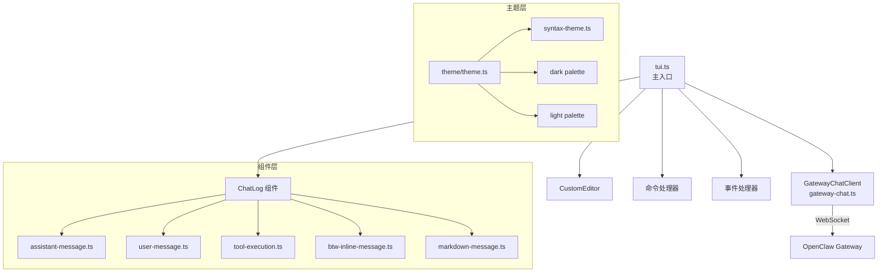
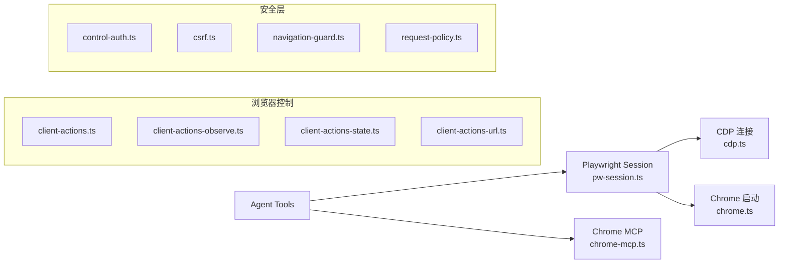
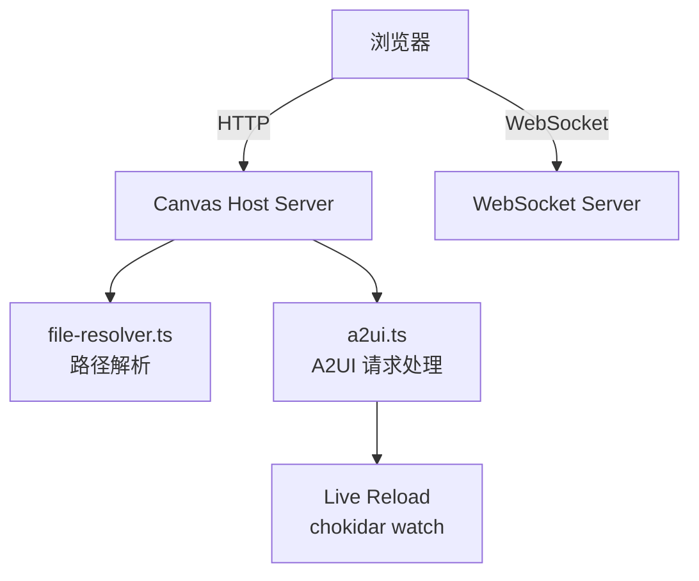

# OC-17 Terminal 与 TUI

## 概述

OpenClaw 的终端与 TUI (Text User Interface) 子系统提供了完整的命令行交互层，覆盖从底层 ANSI 处理、颜色主题、表格渲染到高级交互式聊天界面。此外还包含浏览器集成 (Playwright/CDP)、Canvas Host 静态文件服务、Node Host 远程执行等子系统。

```
src/terminal/   ── 底层终端工具（ANSI、palette、table、安全文本）
src/tui/        ── 交互式 TUI 界面（pi-tui 框架、聊天、命令）
src/browser/    ── 浏览器集成（Chrome/CDP/Playwright）
src/canvas-host/ ── Canvas 静态文件 & WebSocket 服务
src/node-host/  ── 远程 Node 执行引擎
src/interactive/ ── 交互式消息载荷 (buttons/select)
```

## Terminal 管理 (`src/terminal/`)

Terminal 层是最底层的终端输出工具集，不依赖 TUI 框架，被 CLI、日志、状态输出等多处复用。

### Lobster 调色板

所有 CLI 颜色输出必须使用共享的 Lobster Palette（`src/terminal/palette.ts`），禁止硬编码颜色值：

| Token          | Hex       | 用途          |
| -------------- | --------- | ------------- |
| `accent`       | `#FF5A2D` | 主色调        |
| `accentBright` | `#FF7A3D` | 高亮强调      |
| `accentDim`    | `#D14A22` | 低调强调      |
| `info`         | `#FF8A5B` | 信息提示      |
| `success`      | `#2FBF71` | 成功状态      |
| `warn`         | `#FFB020` | 警告          |
| `error`        | `#E23D2D` | 错误          |
| `muted`        | `#8B7F77` | 静默/次要文本 |

### 主题系统

`src/terminal/theme.ts` 基于 `chalk` 和 Lobster Palette 构建语义化的 theme 对象：

- 尊重 `NO_COLOR` 环境变量（禁用颜色输出）
- 尊重 `FORCE_COLOR` 环境变量（强制启用颜色）
- `isRich()` 判断当前终端是否支持富文本

```typescript
export const theme = {
  accent,
  accentBright,
  accentDim,
  info,
  success,
  warn,
  error,
  muted,
  heading: baseChalk.bold.hex(LOBSTER_PALETTE.accent),
  command: hex(LOBSTER_PALETTE.accentBright),
  option: hex(LOBSTER_PALETTE.warn),
};
```

### ANSI 处理 (`src/terminal/ansi.ts`)

提供三个核心能力：

1. **`stripAnsi(input)`** -- 剥离 ANSI SGR 和 OSC-8 超链接序列
2. **`visibleWidth(input)`** -- 计算文本的可视宽度（正确处理 CJK 全角、emoji、零宽组合字符）
3. **`sanitizeForLog(v)`** -- 剥离 ANSI + 控制字符，防止日志伪造攻击 (CWE-117)

使用 `Intl.Segmenter` 进行 Unicode grapheme cluster 感知的字符分割。

### 表格渲染 (`src/terminal/table.ts`)

ANSI 安全的表格渲染器，用于 `status --all` 等 CLI 输出：

- 支持 Unicode 边框（`unicode`）、ASCII 边框（`ascii`）和无边框（`none`）
- Windows 上自动检测终端能力选择边框风格
- Flex 列自动扩展/收缩适应终端宽度
- ANSI 感知的文本换行（不拆分 SGR/OSC-8 序列）
- `getTerminalTableWidth()` 自动获取终端宽度

### 安全文本 (`src/terminal/safe-text.ts`)

`sanitizeTerminalText(input)` -- 将不可信文本规范化为安全的单行终端输出：

- 剥离 ANSI 转义序列
- 将 `\r`, `\n`, `\t` 替换为可见表示
- 移除所有 C0/C1 控制字符

### 流写入器 (`src/terminal/stream-writer.ts`)

`createSafeStreamWriter()` -- 处理 EPIPE/EIO 错误的安全流写入器：

- 管道断开时静默处理而非抛异常
- 提供 `beforeWrite` / `onBrokenPipe` 回调
- `isClosed()` 检查流状态

### 终端状态恢复 (`src/terminal/restore.ts`)

`restoreTerminalState(reason?, options?)` -- 清理终端状态：

- 清除活跃的进度行
- 退出 raw mode
- 重置 SGR 样式、显示光标、禁用鼠标跟踪和 bracketed paste
- Docker TTY 注意事项：默认不恢复 stdin 以避免容器挂起

### 其他工具

| 文件                      | 功能                                    |
| ------------------------- | --------------------------------------- |
| `progress-line.ts`        | 进度行注册/清除（`\r\x1b[2K`）          |
| `links.ts`                | `formatDocsLink()` -- 文档 URL 格式化   |
| `note.ts`                 | 带自动换行的 `@clack/prompts` note 组件 |
| `prompt-style.ts`         | Prompt 消息/标题/提示样式               |
| `prompt-select-styled.ts` | 带样式的 `@clack/prompts` select 组件   |
| `health-style.ts`         | 渠道健康状态行着色                      |

## TUI 界面 (`src/tui/`)

TUI 层基于 `@mariozechner/pi-tui` 框架，提供完整的交互式聊天客户端。

### 架构概览



### 核心类型 (`src/tui/tui-types.ts`)

```typescript
type TuiOptions = {
  url?: string; // Gateway WebSocket URL
  token?: string; // 认证 token
  password?: string; // 认证密码
  session?: string; // 初始 session key
  deliver?: boolean; // 是否投递回复
  thinking?: string; // 思考级别
  message?: string; // 自动发送的消息
};

type TuiStateAccess = {
  currentAgentId: string;
  currentSessionKey: string;
  sessionInfo: SessionInfo;
  isConnected: boolean;
  connectionStatus: string;
  // ... 更多状态字段
};
```

### Gateway 聊天客户端 (`src/tui/gateway-chat.ts`)

`GatewayChatClient` 封装了与 Gateway 的 WebSocket 通信：

- 连接建立与认证（token / password / bootstrap）
- 消息发送（`chat.send` RPC）
- Session 管理（list / patch / switch）
- 事件流处理（delta / final / aborted / error）

### 主题系统 (`src/tui/theme/theme.ts`)

TUI 拥有独立于 CLI palette 的完整主题系统：

- **自动检测暗/亮背景**：通过 `OPENCLAW_THEME` 环境变量或 `COLORFGBG` 推断
- **WCAG 对比度计算**：`contrastRatio()` 确保文本可读性
- **语法高亮**：集成 `cli-highlight`，自定义语法主题
- **完整的 Markdown 主题**：heading、link、code、quote、list 等

> [!info] 暗色/亮色模式
> 设置 `OPENCLAW_THEME=light` 或 `OPENCLAW_THEME=dark` 强制指定。默认通过 `COLORFGBG` 环境变量推断，使用 WCAG 相对亮度算法判断背景色。

### 斜杠命令 (`src/tui/commands.ts`)

TUI 支持丰富的斜杠命令，通过 `getSlashCommands()` 注册：

| 命令        | 功能              | 参数补全        |
| ----------- | ----------------- | --------------- |
| `/help`     | 显示帮助          | -               |
| `/status`   | 显示 Gateway 状态 | -               |
| `/agent`    | 切换 Agent        | Agent picker    |
| `/session`  | 切换 Session      | Session picker  |
| `/model`    | 设置模型          | Model picker    |
| `/think`    | 设置思考级别      | Level 列表      |
| `/fast`     | 快速模式          | on/off/status   |
| `/verbose`  | 详细输出          | on/off          |
| `/elevated` | 提权模式          | on/off/ask/full |

命令别名映射：`elev` -> `elevated`

### 流组装器 (`src/tui/tui-stream-assembler.ts`)

处理 Gateway 流式响应的核心组件：

- 维护 `RunStreamState`（thinking、content、displayText）
- 提取文本块和非文本内容块信号
- 处理跨 delta/final 的边界文本块去重
- 组合 thinking 和 content 文本

### 等待状态动画 (`src/tui/tui-waiting.ts`)

提供趣味性的等待状态显示：

- 10 个趣味等待短语（"kerfuffling"、"bamboozling"、"noodling" 等）
- `shimmerText()` -- 6 字符宽度的高亮滑动动画
- 每 10 tick 切换一个短语

### OSC-8 超链接 (`src/tui/osc8-hyperlinks.ts`)

自动为渲染行中的 URL 添加 OSC-8 终端超链接：

- 从 Markdown 源文本提取已知 URL
- 在 ANSI 渲染后的行中定位 URL 片段
- 处理 pi-tui 换行导致的 URL 跨行拆分
- 正确保留已有的 ANSI SGR 序列

### 本地 Shell (`src/tui/tui-local-shell.ts`)

在 TUI 中执行本地 Shell 命令的可选功能：

- 需要显式用户确认（"Allow local shell commands for this session?"）
- 命令在用户本机执行，非 Gateway 侧
- 输出限制 40,000 字符
- 安全警告提示

## Browser 集成 (`src/browser/`)

> [!warning] 大型子系统
> Browser 集成包含 90+ 个文件，是一个独立的大型子模块，此处仅概述架构。

### 核心架构



### 关键组件

| 组件               | 文件                  | 功能                            |
| ------------------ | --------------------- | ------------------------------- |
| Chrome 管理        | `chrome.ts`           | Chrome 启动、检测、CDP 端口管理 |
| Playwright Session | `pw-session.ts`       | 页面管理、CDP 连接、生命周期    |
| PW Tools Core      | `pw-tools-core.ts`    | 截图、快照、交互、下载          |
| PW AI              | `pw-ai.ts`            | AI 辅助的浏览器操作             |
| Chrome MCP         | `chrome-mcp.ts`       | Chrome MCP 协议集成             |
| Profiles           | `profiles-service.ts` | 浏览器 profile 管理             |
| Bridge Server      | `bridge-server.ts`    | 本地 HTTP bridge 服务           |
| CDP Proxy          | `cdp-proxy-bypass.ts` | 代理环境下 CDP 绕行             |

### 传输模式

- **`cdp`** -- 直接 CDP (Chrome DevTools Protocol) 连接
- **`chrome-mcp`** -- 通过 Chrome MCP snapshot 协议

### 安全措施

- `control-auth.ts` -- 自动 token 认证
- `csrf.ts` -- CSRF 令牌保护
- `navigation-guard.ts` -- 导航安全守卫
- `request-policy.ts` -- 请求策略过滤

## Canvas Host (`src/canvas-host/`)

Canvas Host 是一个轻量级 HTTP + WebSocket 服务器，用于托管 A2UI (Agent-to-UI) 前端应用。

### 架构



### 关键特性

- **静态文件服务**：基于 `node:http`，带 MIME 检测
- **A2UI 集成**：`/canvas/` 路径下的 A2UI 前端
- **WebSocket**：`/canvas/ws` 路径的 WebSocket 连接
- **Live Reload**：开发模式下通过 chokidar 文件监听自动刷新
- **安全文件解析**：`resolveFileWithinRoot()` 防止路径遍历

## Node Host (`src/node-host/`)

Node Host 是远程代码执行引擎，允许 Gateway 在远程 Node.js 环境中执行任务。

### 组件

| 文件                   | 功能                             |
| ---------------------- | -------------------------------- |
| `runner.ts`            | Node Host 主运行器，连接 Gateway |
| `invoke.ts`            | 命令执行入口                     |
| `invoke-system-run.ts` | 系统命令执行                     |
| `invoke-browser.ts`    | 浏览器操作执行                   |
| `exec-policy.ts`       | 执行策略控制                     |
| `config.ts`            | Host 配置管理                    |
| `with-timeout.ts`      | 超时控制                         |

### 安全

- `invoke.sanitize-env.test.ts` -- 环境变量消毒
- `exec-policy.ts` -- 执行策略（白名单/黑名单）
- `invoke-system-run-allowlist.ts` -- 系统命令白名单

## Interactive Shell (`src/interactive/`)

`src/interactive/payload.ts` 定义了跨渠道的交互式消息载荷格式：

```typescript
type InteractiveReply = {
  blocks: InteractiveReplyBlock[];
};

type InteractiveReplyBlock =
  | { type: "text"; text: string }
  | { type: "buttons"; buttons: InteractiveReplyButton[] }
  | { type: "select"; placeholder?: string; options: InteractiveReplyOption[] };
```

按钮样式：`primary` | `secondary` | `success` | `danger`

> [!tip] 渠道适配
> `normalizeInteractiveReply()` 确保所有渠道接收到统一格式的交互式消息载荷，各渠道适配器负责将其转换为平台原生格式（如 Telegram inline keyboard、Discord components 等）。

---

**相关文档**：[[OpenClaw Gateway MOC]] | [[OC-18 Logging 日志系统]] | [[OC-20 专项子系统]]
