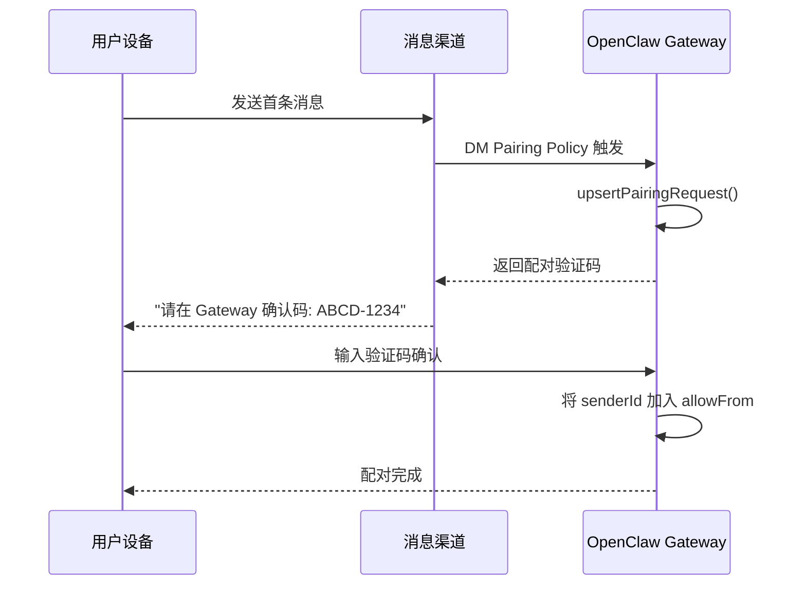
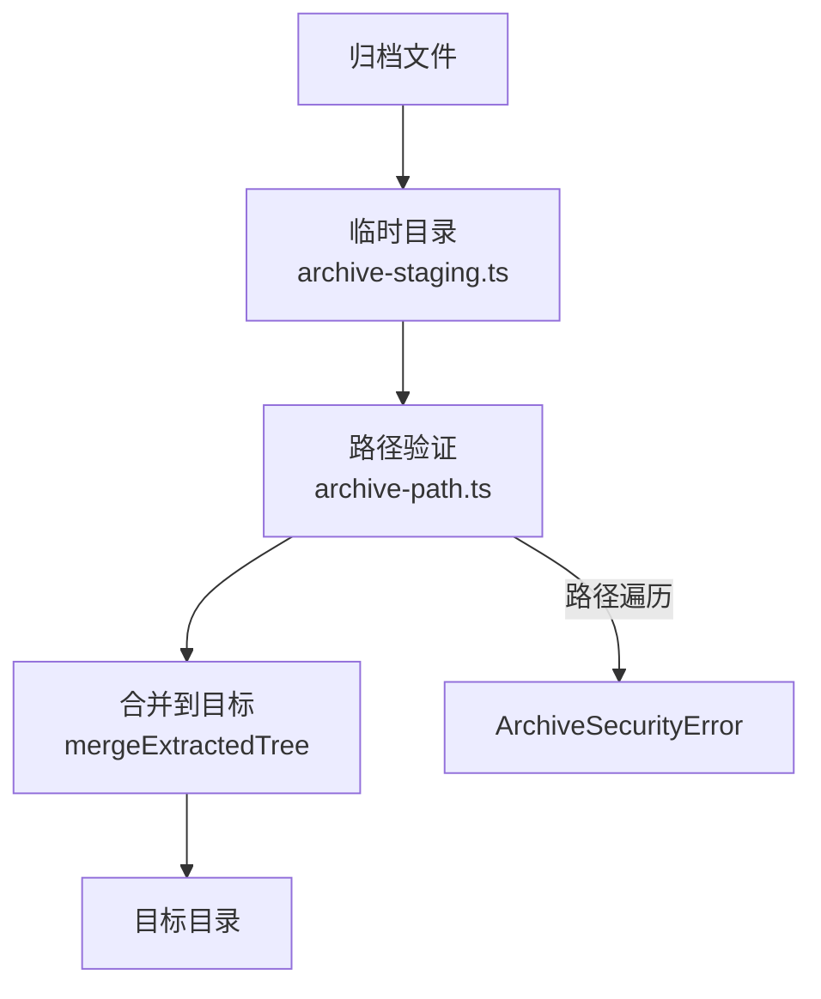

# OC-19 基础设施工具集

## 概述

`src/infra/` 是 OpenClaw 的基础设施工具层，提供跨模块复用的底层能力：设备配对、mDNS 发现、归档系统、消息投递、去重缓存、退避策略、错误处理、端口检测、环境变量管理等。`src/pairing/` 独立为设备配对子系统。

```
src/infra/           ── 基础设施工具集（80+ 文件）
src/infra/outbound/  ── 出站消息投递
src/infra/net/       ── 网络工具（hostname、SSRF 防护）
src/infra/tls/       ── TLS 指纹
src/pairing/         ── 设备配对
```

## Device Pairing 配对流程 (`src/pairing/`)

设备配对允许新的消息渠道端（手机 App、远程 Node Host）安全地与 Gateway 建立信任关系。

### 架构



### 配对验证码 (`src/pairing/setup-code.ts`)

为设备配对生成 Bootstrap Token 和连接 URL：

```typescript
type PairingSetupPayload = {
  url: string; // Gateway WebSocket URL
  bootstrapToken: string; // 一次性 bootstrap token
};
```

URL 解析优先级：

1. `plugins.entries.device-pair.config.publicUrl` -- 显式公网 URL
2. Tailscale Serve/Funnel -- MagicDNS 域名
3. `gateway.remote.url` -- 远程 URL
4. Gateway bind 地址 -- LAN IP / Tailnet IP
5. 失败 -- 仅绑定了 loopback

支持 token 和 password 两种认证模式，自动从 Secret Refs 解析凭证。

### 配对挑战 (`src/pairing/pairing-challenge.ts`)

`issuePairingChallenge()` -- 统一的配对挑战发放流程：

- 为 senderId 创建或查询配对请求（幂等）
- 生成并发送回复消息（含验证码）
- 提供 `onCreated` / `onReplyError` 回调钩子

### 配对存储 (`src/pairing/pairing-store.ts`)

持久化存储配对请求和白名单：

```typescript
type PairingRequest = {
  id: string; // senderId
  code: string; // 8 位验证码 (A-Z, 2-9, 无 I/O/0/1)
  createdAt: string;
  lastSeenAt: string;
  meta?: Record<string, string>;
};
```

| 常量                     | 值                                 | 说明                 |
| ------------------------ | ---------------------------------- | -------------------- |
| `PAIRING_CODE_LENGTH`    | 8                                  | 验证码长度           |
| `PAIRING_CODE_ALPHABET`  | `ABCDEFGHJKLMNPQRSTUVWXYZ23456789` | 排除易混淆字符       |
| `PAIRING_PENDING_TTL_MS` | 1 小时                             | 待处理请求过期时间   |
| `PAIRING_PENDING_MAX`    | 3                                  | 同时最大待处理请求数 |

使用文件锁（`proper-lockfile`）保证并发安全，锁超时 30 秒，最多重试 10 次。

白名单存储在 `allowFrom` 文件中，通过 `allowFromReadCache` 进行带 mtime 校验的读缓存。

### 配对标签 (`src/pairing/pairing-labels.ts`)

根据渠道返回对应的 ID 标签名（如 Telegram 的 "userId"），通过各渠道的 `PairingAdapter` 解析。

## mDNS/Bonjour 发现 (`src/infra/bonjour-*.ts`)

### Gateway Beacon 发现 (`src/infra/bonjour-discovery.ts`)

通过 mDNS (Bonjour) 在局域网内自动发现 OpenClaw Gateway 实例：

```typescript
type GatewayBonjourBeacon = {
  instanceName: string;
  displayName?: string;
  host?: string;
  port?: number;
  lanHost?: string;
  tailnetDns?: string;
  gatewayPort?: number;
  sshPort?: number;
  gatewayTls?: boolean;
  gatewayTlsFingerprintSha256?: string;
  transport?: string;
  txt?: Record<string, string>;
};
```

`resolveGatewayDiscoveryEndpoint()` -- 从 beacon 解析出可用的连接端点：

- 自动选择 `ws`/`wss` 协议
- 支持 TLS 指纹固定
- 支持 Tailnet IP 检测

### Ciao 集成 (`src/infra/bonjour-ciao.ts`)

处理 `ciao` mDNS 库的未处理 rejection：

- **`cancellation`** -- 正常的广播取消（安全忽略）
- **`interface-assertion`** -- IPv4 地址变化断言（安全忽略）

### 错误格式化 (`src/infra/bonjour-errors.ts`)

`formatBonjourError()` -- 统一的 Bonjour 错误格式化。

## Archive 系统 (`src/infra/archive.ts`)

支持 `tar` 和 `zip` 两种归档格式的安全解压：

### 安全限制

| 限制                | ZIP 默认值 | 说明             |
| ------------------- | ---------- | ---------------- |
| `maxArchiveBytes`   | 256 MB     | 压缩文件最大大小 |
| `maxEntries`        | 50,000     | 最大条目数       |
| `maxExtractedBytes` | 512 MB     | 解压后最大总字节 |
| `maxEntryBytes`     | -          | 单文件最大字节   |

### 安全措施

- **路径验证**：`validateArchiveEntryPath()` 防止 Zip Slip 路径遍历攻击
- **符号链接检查**：`createArchiveSymlinkTraversalError()` 防止符号链接遍历
- **原子解压**：`withStagedArchiveDestination()` 先解压到临时目录，成功后原子合并
- **文件身份检查**：`sameFileIdentity()` 防止覆盖同一文件
- **根目录内文件操作**：`openFileWithinRoot()` / `openWritableFileWithinRoot()` 限制在根目录内

### Staging 流程



## Outbound Delivery 出站投递 (`src/infra/outbound/`)

消息出站投递系统，负责将 Agent 响应路由到正确的渠道和目标。

### 核心组件

| 文件                       | 功能               |
| -------------------------- | ------------------ |
| `agent-delivery.ts`        | Agent 投递计划解析 |
| `bound-delivery-router.ts` | 会话绑定投递路由   |
| `deliver-runtime.ts`       | 投递运行时         |
| `envelope.ts`              | 出站结果封装       |
| `format.ts`                | 投递格式化         |
| `session-context.ts`       | 会话上下文         |
| `tool-payload.ts`          | 工具载荷           |
| `directory-cache.ts`       | 目录缓存           |

### Agent 投递计划 (`src/infra/outbound/agent-delivery.ts`)

`resolveAgentDeliveryPlan()` -- 解析 Agent 回复的投递目标：

```typescript
type AgentDeliveryPlan = {
  baseDelivery: SessionDeliveryTarget;
  resolvedChannel: GatewayMessageChannel;
  resolvedTo?: string;
  resolvedAccountId?: string;
  resolvedThreadId?: string | number;
  deliveryTargetMode?: ChannelOutboundTargetMode;
};
```

关键行为：

- `turnSourceChannel` 防止共享 session 中的跨渠道误路由（issue #24152）
- 支持显式指定 channel/to/threadId
- 默认回退到会话上次活跃的渠道

### 绑定投递路由 (`src/infra/outbound/bound-delivery-router.ts`)

`createBoundDeliveryRouter()` -- 基于会话绑定记录的投递路由：

- 先精确匹配 `conversationId`
- 再匹配 `channel + accountId`
- 模式：`bound`（找到绑定）或 `fallback`（未找到）

### 出站封装 (`src/infra/outbound/envelope.ts`)

`buildOutboundResultEnvelope()` -- 标准化出站消息封装：

```typescript
type OutboundResultEnvelope = {
  payloads?: OutboundPayloadJson[];
  meta?: unknown;
  delivery?: OutboundDeliveryJson;
};
```

当仅有 delivery 时自动展平（flattenDelivery），减少响应嵌套。

## 去重 (Dedup) (`src/infra/dedupe.ts`)

`createDedupeCache(options)` -- 基于 TTL 和 LRU 的通用去重缓存：

```typescript
type DedupeCache = {
  check: (key, now?) => boolean; // 检查并标记（首次 false，重复 true）
  peek: (key, now?) => boolean; // 仅检查不标记
  delete: (key) => void;
  clear: () => void;
  size: () => number;
};
```

### 工作原理

1. `check(key)` -- 首次调用返回 `false` 并记录 key+时间戳
2. TTL 内再次调用返回 `true`（重复）
3. TTL 过期后自动清理
4. 超过 `maxSize` 时修剪最老条目

### 全局单例

`resolveGlobalDedupeCache(key, options)` -- 基于 Symbol key 的全局单例去重缓存。

## 退避策略 (`src/infra/backoff.ts`)

```typescript
type BackoffPolicy = {
  initialMs: number;  // 初始延迟
  maxMs: number;      // 最大延迟
  factor: number;     // 指数因子
  jitter: number;     // 抖动系数
};

// 延迟 = min(maxMs, initialMs * factor^(attempt-1) + jitter * random)
computeBackoff(policy, attempt): number;

// 可中断的延迟
sleepWithAbort(ms, abortSignal?): Promise<void>;
```

## 错误处理与安全

### 路径安全

| 文件                    | 功能           |
| ----------------------- | -------------- |
| `path-safety.ts`        | 路径安全验证   |
| `path-alias-guards.ts`  | 路径别名守卫   |
| `boundary-path.ts`      | 边界路径检查   |
| `boundary-file-read.ts` | 边界内文件读取 |
| `hardlink-guards.ts`    | 硬链接安全守卫 |

### 执行安全

| 文件                     | 功能               |
| ------------------------ | ------------------ |
| `exec-safety.ts`         | 命令执行安全检查   |
| `exec-safe-bin-trust.ts` | 可执行文件信任检查 |

### 网络安全

| 文件                 | 功能                     |
| -------------------- | ------------------------ |
| `net/ssrf.ts`        | SSRF 防护（阻止内网 IP） |
| `net/hostname.ts`    | 主机名解析               |
| `tls/fingerprint.ts` | TLS 证书指纹固定         |

### 速率限制

`fixed-window-rate-limit.ts` -- 固定窗口速率限制器。

## 环境变量管理

### 环境工具

| 文件            | 功能               |
| --------------- | ------------------ |
| `shell-env.ts`  | Shell 环境变量解析 |
| `ssh-config.ts` | SSH 配置读取       |
| `ssh-tunnel.ts` | SSH 隧道管理       |

### 系统检测

| 文件                      | 功能           |
| ------------------------- | -------------- |
| `os-summary.ts`           | OS 概要信息    |
| `binaries.ts`             | 二进制文件检测 |
| `brew.ts`                 | Homebrew 集成  |
| `install-mode-options.ts` | 安装模式选项   |

## 版本与构建

### Build Stamp

`scripts/build-stamp.mjs` 生成 `dist/.buildstamp`，包含 git commit hash 和构建时间戳。

测试验证写入内容包含正确的 git HEAD：

```typescript
// dist/.buildstamp 内容示例
// abc123\n1700000000000
```

### 更新渠道

| 文件                       | 功能               |
| -------------------------- | ------------------ |
| `update-channels.ts`       | 更新渠道管理       |
| `update-startup.ts`        | 启动时更新检查     |
| `npm-integrity.ts`         | npm 安装完整性校验 |
| `install-from-npm-spec.ts` | npm spec 安装工具  |
| `install-source-utils.ts`  | 安装源工具         |

### 重启与进程管理

| 文件                  | 功能          |
| --------------------- | ------------- |
| `restart-sentinel.ts` | 重启哨兵文件  |
| `ports-lsof.ts`       | lsof 端口检查 |
| `ports-probe.ts`      | 端口探测      |
| `ports-inspect.ts`    | 端口使用详情  |

## 其他基础设施

### 心跳系统

| 文件                         | 功能           |
| ---------------------------- | -------------- |
| `heartbeat-active-hours.ts`  | 活跃时段计算   |
| `heartbeat-visibility.ts`    | 心跳可见性策略 |
| `heartbeat-events-filter.ts` | 心跳事件过滤   |

### 渠道活动

| 文件                        | 功能             |
| --------------------------- | ---------------- |
| `channel-activity.ts`       | 渠道活跃度追踪   |
| `channel-summary.ts`        | 渠道摘要信息     |
| `channels-status-issues.ts` | 渠道状态问题检测 |

### Provider 使用量

| 文件                             | 功能                |
| -------------------------------- | ------------------- |
| `provider-usage.ts`              | Provider 使用量统计 |
| `provider-usage.fetch.claude.ts` | Claude 使用量获取   |
| `provider-usage.fetch.gemini.ts` | Gemini 使用量获取   |
| `provider-usage.format.ts`       | 使用量格式化        |

### 剪贴板与系统

| 文件                   | 功能               |
| ---------------------- | ------------------ |
| `clipboard.ts`         | 跨平台剪贴板操作   |
| `git-root.ts`          | Git 仓库根目录检测 |
| `voicewake.ts`         | Voice Wake 转发    |
| `diagnostic-events.ts` | 诊断事件发射       |
| `diagnostic-flags.ts`  | 诊断标记           |

---

**相关文档**：[[OpenClaw Gateway MOC]] | [[OC-17 Terminal 与 TUI]] | [[OC-20 专项子系统]]
