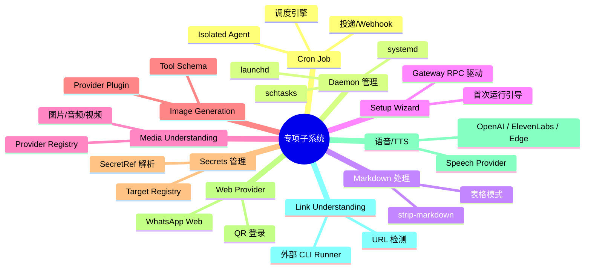
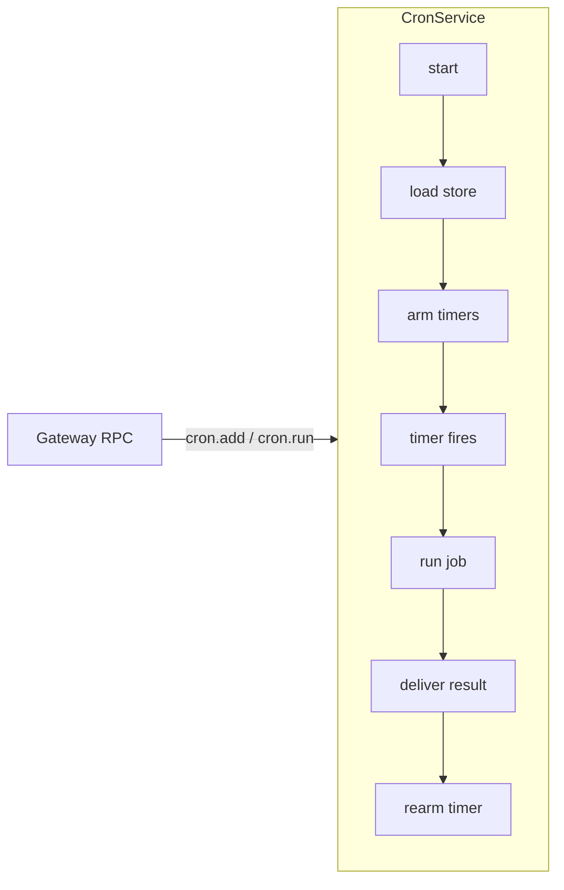
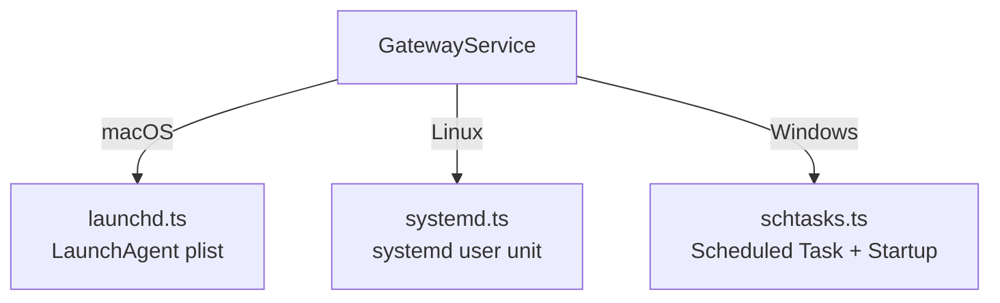
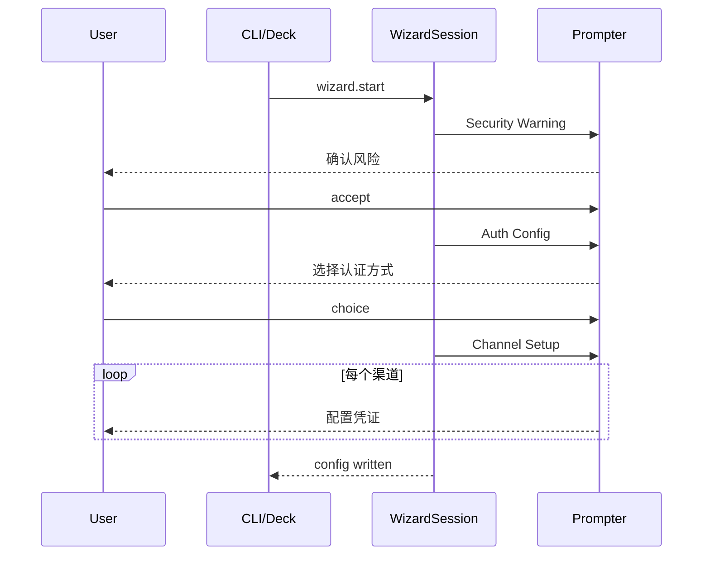
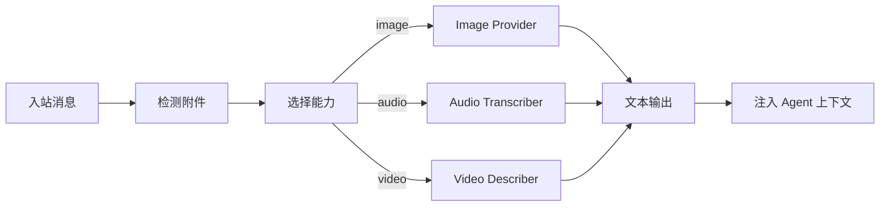
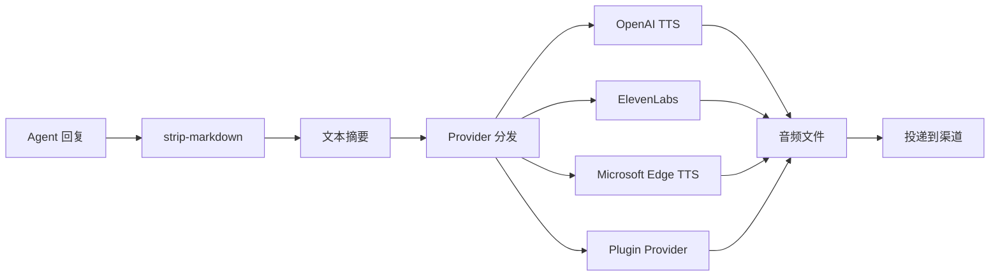

# OC-20 专项子系统

> [!info] 定位
> 本文档汇总 OpenClaw Gateway 中 **功能独立、领域专注** 的十大子系统。它们各自拥有完整的 schema/service/RPC 链路，但不属于核心 Agent 执行或 Channel 路由框架。参见 [[OpenClaw Gateway MOC]] 获取全局导航。

---

## 1 概述



这些子系统通过 Gateway RPC 对外暴露能力，同时在 Plugin SDK 层提供可扩展接口，使第三方插件能注册自定义 provider。

---

## 2 Cron Job 系统

### 2.1 调度模型

Cron 子系统位于 `src/cron/`，核心类为 `CronService`（`src/cron/service.ts`）。调度引擎使用 [croner](https://github.com/hexagon/croner) 库解析标准 cron 表达式，并支持时区感知（`Intl.DateTimeFormat` 回退）。



> [!note] 调度类型
>
> - **cron 表达式**：标准 5/6 段格式，通过 `computeNextRunAtMs()` 计算下次触发时间
> - **at 绝对时间**：单次执行后可自动删除（`deleteAfterRun`）
> - **every 间隔**：按固定间隔重复触发

### 2.2 Job 定义

`CronJobBase`（`src/cron/types-shared.ts`）是 job 的泛型基础结构：

| 字段            | 类型             | 用途                                                |
| --------------- | ---------------- | --------------------------------------------------- |
| `id`            | `string`         | 唯一标识                                            |
| `agentId`       | `string?`        | 绑定 agent                                          |
| `sessionKey`    | `string?`        | 绑定 session                                        |
| `schedule`      | `TSchedule`      | 调度配置（cron/at/every）                           |
| `sessionTarget` | `TSessionTarget` | `main` / `isolated` / `current` / `session:*`       |
| `wakeMode`      | `TWakeMode`      | `now` / `next-heartbeat`                            |
| `payload`       | `TPayload`       | `agentTurn` payload（含 model/thinking/deliver 等） |
| `delivery`      | `TDelivery?`     | 投递模式：`announce` / `webhook` / `none`           |
| `failureAlert`  | `TFailureAlert?` | 失败告警目标                                        |

### 2.3 Isolated Agent 执行

Cron job 默认以 **isolated agent** 模式运行（`src/cron/isolated-agent/run.ts`），创建独立 session 上下文。执行链路：

1. 解析 model selection（含 fallback 链）
2. 构建安全外部内容屏障（`buildSafeExternalPrompt`）
3. 调用 `runCliAgent` / `runEmbeddedPiAgent`
4. 投递结果（announce/webhook/none）

### 2.4 投递与 Webhook

`src/cron/delivery.ts` 实现 `CronDeliveryPlan` 决策：

- **announce**：通过 outbound 通道发送消息
- **webhook**：POST JSON 到配置的 URL（SSRF guard 保护，10s 超时）
- **none**：静默执行，不投递

### 2.5 RPC 方法

Gateway handler 位于 `src/gateway/server-methods/cron.ts`，暴露的 RPC：

| 方法          | 作用                               |
| ------------- | ---------------------------------- |
| `wake`        | 立即唤醒 cron heartbeat            |
| `cron.list`   | 分页列表（支持 sort/filter/query） |
| `cron.status` | 当前服务状态                       |
| `cron.add`    | 创建 job                           |
| `cron.update` | 修改 job                           |
| `cron.remove` | 删除 job                           |
| `cron.run`    | 手动触发（`due` / `force`）        |
| `cron.runs`   | 查看运行日志                       |

Protocol schema 定义在 `src/gateway/protocol/schema/cron.ts`，使用 TypeBox 声明。

### 2.6 持久化

Job 存储在 `~/.openclaw/cron/jobs.json`（`src/cron/store.ts`），格式为 `CronStoreFile { version: 1, jobs: [] }`。写入前做 backup 差异比较，runtime-only 字段变更不触发备份。运行日志通过 `src/cron/run-log.ts` 追加式记录。

---

## 3 Daemon 管理

### 3.1 进程生命周期

Daemon 子系统（`src/daemon/`）负责将 Gateway 进程注册为操作系统级常驻服务。核心抽象为 `GatewayService`（`src/daemon/service.ts`），统一封装了三个平台后端：



### 3.2 平台实现

| 平台    | 文件                     | 注册机制                           | 备注                                                 |
| ------- | ------------------------ | ---------------------------------- | ---------------------------------------------------- |
| macOS   | `src/daemon/launchd.ts`  | `~/Library/LaunchAgents/*.plist`   | 支持 restart handoff（`launchd-restart-handoff.ts`） |
| Linux   | `src/daemon/systemd.ts`  | `~/.config/systemd/user/*.service` | 自动启用 linger（`systemd-linger.ts`）               |
| Windows | `src/daemon/schtasks.ts` | Task Scheduler + Startup 目录      | schtasks 超时/权限拒绝时回退到 Startup 目录          |

### 3.3 GatewayService 接口

```typescript
type GatewayService = {
  install: (args: GatewayServiceInstallArgs) => Promise<void>;
  uninstall: (args: GatewayServiceManageArgs) => Promise<void>;
  stop: (args: GatewayServiceControlArgs) => Promise<void>;
  restart: (args: GatewayServiceControlArgs) => Promise<GatewayServiceRestartResult>;
  isLoaded: (args: GatewayServiceEnvArgs) => Promise<boolean>;
  readCommand: (env: GatewayServiceEnv) => Promise<GatewayServiceCommandConfig | null>;
  readRuntime: (env: GatewayServiceEnv) => Promise<GatewayServiceRuntime>;
};
```

### 3.4 Runtime 选择

`src/commands/daemon-runtime.ts` 定义 `GatewayDaemonRuntime`：当前默认 `node`（推荐），`bun` 可选但对 WhatsApp + Telegram 重连有内存损坏风险。

### 3.5 Install Plan

`src/commands/daemon-install-helpers.ts` 构建 `GatewayInstallPlan`，包含：

- `programArguments`：启动命令参数
- `environment`：环境变量（含 auth profile、state dir 相关变量）
- `workingDirectory`：工作目录

---

## 4 Markdown 处理

### 4.1 Strip Markdown

`src/shared/text/strip-markdown.ts` 提供 `stripMarkdown()` 函数，将 Markdown 格式文本转换为纯文本：

- 去除加粗（`**bold**`）、斜体（`*italic*`）、删除线（`~~text~~`）
- 去除标题前缀（`### heading`）、引用标记（`> quote`）
- 去除行内代码（`` `code` ``）和分隔线（`---`）
- 压缩连续空行

主要用于 TTS 文本预处理和渠道回退（不支持 Markdown 的渠道）。

### 4.2 表格模式

`src/config/markdown-tables.ts` 控制 Markdown 表格在不同渠道的渲染方式：

| 模式      | 说明                                  |
| --------- | ------------------------------------- |
| `code`    | 保持原始 Markdown 表格（默认）        |
| `bullets` | 转为列表格式（Signal、WhatsApp 默认） |
| `off`     | 完全移除表格（Mattermost 默认）       |

支持按渠道和账号粒度配置：`config.channels.<channel>.markdown.tables`。

### 4.3 Hyperlink Markdown

`src/tui/components/hyperlink-markdown.ts` 处理 TUI 中的 Markdown 超链接渲染。`src/tui/osc8-hyperlinks.ts` 实现 OSC 8 终端超链接协议。

---

## 5 Setup Wizard

### 5.1 首次运行引导

Wizard 子系统为首次配置提供交互式引导流程。入口位于 `src/wizard/setup.ts` 的 `runSetupWizard()`。



### 5.2 Wizard 类型

`src/wizard/setup.types.ts` 定义两种流程：

- **quickstart**：最小配置，快速启动
- **advanced**：完整配置（端口、bind 模式、Tailscale、认证方式）

`QuickstartGatewayDefaults` 包含 port、bind mode（loopback/lan/auto/custom/tailnet）、authMode、tailscaleMode 等。

### 5.3 Channel Setup Wizard

`src/channels/plugins/setup-wizard.ts` 为每个渠道插件提供统一的配置向导框架：

- `ChannelSetupWizardCredential`：定义凭证输入（如 API key、bot token）
- `ChannelSetupWizardNote`：上下文说明
- `ChannelSetupWizardEnvShortcut`：环境变量快捷配置
- `ChannelSetupWizardAdapter`：插件实现的适配器接口

### 5.4 Gateway RPC 驱动

`src/gateway/server-methods/wizard.ts` 将 wizard 暴露为 RPC：

| 方法            | 作用                               |
| --------------- | ---------------------------------- |
| `wizard.start`  | 启动向导 session（返回 sessionId） |
| `wizard.next`   | 推进到下一步 / 提交答案            |
| `wizard.cancel` | 取消当前向导                       |
| `wizard.status` | 查询向导状态                       |

`WizardSession`（`src/wizard/session.ts`）封装了协程式的 step-by-step 交互模型。

---

## 6 Media Understanding

### 6.1 多模态理解

Media Understanding（`src/media-understanding/`）负责将入站媒体附件（图片、音频、视频）转换为文本描述，注入 agent 上下文。



### 6.2 能力类型

`src/media-understanding/types.ts` 定义三种能力：

| 能力    | Kind                  | 典型 Provider                     |
| ------- | --------------------- | --------------------------------- |
| `image` | `image.description`   | CLI vision model / Plugin         |
| `audio` | `audio.transcription` | Groq、Deepgram、OpenAI compatible |
| `video` | `video.description`   | Google Gemini、Moonshot、Mistral  |

### 6.3 Provider Registry

`src/media-understanding/provider-registry.ts` 维护 provider 注册表：

- **内置**：Groq（音频转录）、Deepgram（音频转录）
- **插件**：通过 Plugin SDK 注册（`mediaUnderstandingProviders`）

Provider 接口 `MediaUnderstandingProvider`：

```typescript
type MediaUnderstandingProvider = {
  id: string;
  capabilities?: MediaUnderstandingCapability[];
  transcribeAudio?: (req) => Promise<AudioTranscriptionResult>;
  describeVideo?: (req) => Promise<VideoDescriptionResult>;
  describeImage?: (req) => Promise<ImageDescriptionResult>;
  describeImages?: (req) => Promise<ImagesDescriptionResult>;
};
```

### 6.4 Runner 与 Scope

`src/media-understanding/runner.ts` 实现完整执行链路：附件检测 -> scope 判断 -> model 决策 -> provider 调用 -> 输出提取。

Scope 控制（`src/media-understanding/scope.ts`）支持按 channel/chatType/sessionKey 粒度启用/禁用。

---

## 7 Image Generation

### 7.1 图片生成接口

Image Generation（`src/image-generation/`）提供文本生图和图片编辑能力。

### 7.2 Provider 类型

`src/image-generation/types.ts` 定义核心类型：

```typescript
type ImageGenerationProvider = {
  id: string;
  aliases?: string[];
  defaultModel?: string;
  models?: string[];
  capabilities: ImageGenerationProviderCapabilities;
  generateImage: (req: ImageGenerationRequest) => Promise<ImageGenerationResult>;
};
```

能力分为：

- **generate**：文生图，支持 count/size/aspectRatio/resolution
- **edit**：图片编辑，支持多输入图片（最多 5 张）

### 7.3 Provider Registry

`src/image-generation/provider-registry.ts` 通过插件机制注册 provider：

- **OpenAI**：`extensions/openai/image-generation-provider.js`（gpt-image-1）
- **Google**：`extensions/google/image-generation-provider.js`
- **Fal**：`extensions/fal/image-generation-provider.js`

### 7.4 Agent Tool

`src/agents/tools/image-generate-tool.ts` 定义 agent 工具 schema：

- `action`：`generate`（默认）或 `list`
- `prompt`：生成提示词
- `image` / `images`：参考图片（编辑模式）
- `model`：`provider/model` 格式覆盖
- `aspectRatio`：支持 1:1, 2:3, 3:2, 4:3, 16:9 等
- `resolution`：1K / 2K / 4K

### 7.5 Runtime

`src/image-generation/runtime.ts` 的 `generateImage()` 实现带 fallback 的生成链路：解析 model candidates -> 按顺序尝试 -> 返回 `GenerateImageRuntimeResult`。

---

## 8 Secrets 管理

### 8.1 SecretRef 模型

Secrets 子系统（`src/secrets/`）管理所有敏感凭证的生命周期。核心抽象为 `SecretRef`（`src/config/types.secrets.ts`）：

```typescript
type SecretRef = {
  source: "env" | "file" | "exec"; // 来源
  provider: string; // provider 别名
  id: string; // 标识符
};
type SecretInput = string | SecretRef; // 明文或引用
```

### 8.2 解析链路

`src/secrets/resolve.ts` 实现三种 source 的解析：

| Source | 机制                         | 安全措施                                 |
| ------ | ---------------------------- | ---------------------------------------- |
| `env`  | 读取环境变量                 | 变量名必须匹配 `^[A-Z][A-Z0-9_]{0,127}$` |
| `file` | 读取文件 + JSON pointer 提取 | 路径权限检查、大小限制（1MB）、超时 5s   |
| `exec` | 执行外部命令获取输出         | 命令安全性检查、输出限制（1MB）、超时 5s |

并发控制：provider 级并发限制（默认 4），每个 provider 最多 512 个 ref。

### 8.3 Target Registry

`src/secrets/target-registry-data.ts` 定义所有已知的 secret 目标位置：

- Auth profiles（API key/token）
- Channel 凭证（Discord token、Telegram bot token、WhatsApp 等）
- Gateway 认证（token/password）
- TTS API key（OpenAI/ElevenLabs）
- Memory search API key
- Web tools credentials

### 8.4 Runtime Snapshot

`src/secrets/runtime.ts` 实现 `PreparedSecretsRuntimeSnapshot`：Gateway 启动时一次性解析所有 secret ref，生成运行时快照。支持热刷新（`secrets.reload` RPC）。

### 8.5 RPC 方法

| 方法              | 作用                                       |
| ----------------- | ------------------------------------------ |
| `secrets.reload`  | 重新解析所有 secret ref                    |
| `secrets.resolve` | 按 commandName + targetIds 解析特定 secret |

### 8.6 Configure 流程

`src/secrets/configure.ts` 提供交互式 secret 配置向导：扫描当前配置 -> 生成迁移计划 -> 逐项确认 -> 原子写入。

---

## 9 Web Provider

### 9.1 WhatsApp Web 接口

Web Provider 是 OpenClaw 的 WhatsApp Web 渠道实现。核心代码通过 `src/channel-web.ts` barrel 导出，实际实现位于 `src/plugins/runtime/runtime-whatsapp-boundary.ts`。

主要能力：

- **QR 登录**：`loginWeb()` / `logoutWeb()`
- **Socket 管理**：`createWaSocket()` / `waitForWaConnection()`
- **消息收发**：`sendMessageWhatsApp()` / `sendReactionWhatsApp()`
- **心跳监控**：`monitorWebChannel()` / `monitorWebInbox()` / `runWebHeartbeatOnce()`
- **媒体处理**：通过 `src/media/web-media.ts` 加载本地/远程媒体

### 9.2 Gateway RPC

`src/gateway/server-methods/web.ts` 暴露 Web 登录 RPC：

| 方法              | 作用             |
| ----------------- | ---------------- |
| `web.login.start` | 启动 QR 登录流程 |
| `web.login.wait`  | 等待扫码结果     |

这些方法通过 channel plugin 的 `gateway.loginWithQrStart` / `loginWithQrWait` 接口代理到具体实现。

### 9.3 凭证与 Auth

Web 认证数据存储在 `~/.openclaw/credentials/` 目录。`src/gateway/credentials.ts` 处理 Gateway 级认证（token/password），支持 env-first / config-first 优先级。

---

## 10 语音/TTS 集成

### 10.1 TTS 架构

TTS 子系统（`src/tts/`）将 agent 文本回复转换为语音消息。



### 10.2 内置 Provider

`src/tts/provider-registry.ts` 注册三个内置 provider：

| Provider         | 默认模型                 | 默认语音               | 特点               |
| ---------------- | ------------------------ | ---------------------- | ------------------ |
| OpenAI           | `tts-1`                  | `alloy`                | 高质量，需 API key |
| ElevenLabs       | `eleven_multilingual_v2` | `pMsXgVXv3BLzUgSXRplE` | 多语言、情感控制   |
| Microsoft (Edge) | -                        | `en-US-MichelleNeural` | 免费，无需 API key |

> [!tip] 别名
> provider id `edge` 自动映射为 `microsoft`。

### 10.3 配置

`src/tts/tts-config.ts` 定义 TTS mode（`resolveConfiguredTtsMode`）：

- `final`：仅最终回复转语音
- `all`：所有消息转语音
- 自动模式（`tts-auto-mode.ts`）：根据渠道和偏好自动决定

`src/tts/tts.ts` 处理完整的 TTS 流程：

- 文本预处理：strip markdown -> 摘要（默认 1500 字符）
- Telegram 特殊输出格式：Opus 48kHz/64kbps
- 临时文件清理：5 分钟后自动删除

### 10.4 Speech Provider 插件接口

`src/tts/provider-types.ts` 定义 `SpeechProviderPlugin` 接口，插件可通过 Plugin SDK 注册自定义 TTS provider。

### 10.5 Voice Wake

`src/infra/voicewake.ts` 管理语音唤醒词：

- 默认触发词：`["openclaw", "claude", "computer"]`
- 持久化到 `~/.openclaw/settings/voicewake.json`
- 通过 `src/gateway/server-methods/voicewake.ts` RPC 管理

### 10.6 Voice Call 插件

`extensions/voice-call/` 提供完整的电话语音通话能力：

- **Provider**：Twilio、Telnyx、Plivo
- **STT**：OpenAI Realtime（`stt-openai-realtime.ts`）
- **TTS**：OpenAI（`tts-openai.ts`）
- **Call 管理**：入站/出站、TwiML 策略、stale call 回收
- **Webhook 安全**：签名验证（`webhook-security.ts`）

### 10.7 RPC 方法

| 方法                         | 作用                                  |
| ---------------------------- | ------------------------------------- |
| `tts.status`                 | TTS 状态（enabled/provider/fallback） |
| `tts.enable` / `tts.disable` | 开关 TTS                              |
| `tts.convert`                | 文本转语音（返回音频路径）            |
| `tts.setProvider`            | 切换 TTS provider                     |
| `tts.voices`                 | 列出可用语音                          |

---

## 11 Link Understanding

### 11.1 链接预览与元数据提取

Link Understanding（`src/link-understanding/`）自动检测入站消息中的 URL 并提取摘要信息，注入 agent 上下文。

### 11.2 URL 检测

`src/link-understanding/detect.ts` 的 `extractLinksFromMessage()`：

1. 移除 Markdown 链接语法 `[text](url)` 避免重复
2. 匹配裸 URL（`https?://...`）
3. **SSRF 防护**：通过 `isBlockedHostnameOrIp()` 过滤内网地址
4. 去重，限制最大链接数

### 11.3 Runner

`src/link-understanding/runner.ts` 执行理解链路：

1. Scope 判断（复用 media-understanding 的 scope 逻辑）
2. 按配置的 model entries 逐条执行
3. 支持 **CLI 模式**：通过外部命令处理（命令模板支持 `{{LinkUrl}}` 变量）
4. 超时控制（默认来自 `DEFAULT_LINK_TIMEOUT_SECONDS`）

### 11.4 应用与格式化

`src/link-understanding/apply.ts` 的 `applyLinkUnderstanding()` 将理解结果追加到 `MsgContext.Body`，并更新 `MsgContext.LinkUnderstanding` 数组。

`src/link-understanding/format.ts` 简单拼接输出到消息体末尾。

---

## 12 关键文件索引

### Cron Job

| 文件                                  | 角色                              |
| ------------------------------------- | --------------------------------- |
| `src/cron/service.ts`                 | CronService 主类                  |
| `src/cron/schedule.ts`                | cron 表达式解析、下次执行时间计算 |
| `src/cron/types-shared.ts`            | CronJobBase 泛型定义              |
| `src/cron/store.ts`                   | jobs.json 持久化                  |
| `src/cron/delivery.ts`                | 投递计划决策                      |
| `src/cron/isolated-agent/run.ts`      | Isolated agent 执行器             |
| `src/cron/run-log.ts`                 | 运行日志                          |
| `src/gateway/server-methods/cron.ts`  | Gateway RPC handler               |
| `src/gateway/server-cron.ts`          | Gateway cron 状态管理             |
| `src/gateway/protocol/schema/cron.ts` | TypeBox schema                    |

### Daemon

| 文件                                     | 角色                     |
| ---------------------------------------- | ------------------------ |
| `src/daemon/service.ts`                  | GatewayService 统一接口  |
| `src/daemon/launchd.ts`                  | macOS LaunchAgent 管理   |
| `src/daemon/systemd.ts`                  | Linux systemd user unit  |
| `src/daemon/schtasks.ts`                 | Windows Task Scheduler   |
| `src/daemon/constants.ts`                | 服务名称/标签常量        |
| `src/daemon/service-env.ts`              | 环境变量构建             |
| `src/commands/daemon-runtime.ts`         | Runtime 选择（node/bun） |
| `src/commands/daemon-install-helpers.ts` | Install plan 构建        |

### Markdown

| 文件                                       | 角色               |
| ------------------------------------------ | ------------------ |
| `src/shared/text/strip-markdown.ts`        | Markdown -> 纯文本 |
| `src/config/markdown-tables.ts`            | 表格渲染模式       |
| `src/tui/components/hyperlink-markdown.ts` | TUI 超链接         |
| `src/tui/components/markdown-message.ts`   | TUI Markdown 渲染  |

### Setup Wizard

| 文件                                   | 角色               |
| -------------------------------------- | ------------------ |
| `src/wizard/setup.ts`                  | 主入口             |
| `src/wizard/setup.types.ts`            | 类型定义           |
| `src/wizard/session.ts`                | WizardSession 协程 |
| `src/wizard/prompts.ts`                | Prompter 接口      |
| `src/channels/plugins/setup-wizard.ts` | 渠道配置向导框架   |
| `src/gateway/server-methods/wizard.ts` | RPC handler        |

### Media Understanding

| 文件                                           | 角色               |
| ---------------------------------------------- | ------------------ |
| `src/media-understanding/runner.ts`            | 主执行器           |
| `src/media-understanding/types.ts`             | 类型定义           |
| `src/media-understanding/provider-registry.ts` | Provider 注册表    |
| `src/media-understanding/apply.ts`             | 应用到上下文       |
| `src/media-understanding/scope.ts`             | Scope 判断         |
| `src/media-understanding/transcribe-audio.ts`  | 音频转录           |
| `src/media-understanding/defaults.ts`          | 默认 provider 配置 |

### Image Generation

| 文件                                        | 角色                 |
| ------------------------------------------- | -------------------- |
| `src/image-generation/types.ts`             | 类型定义             |
| `src/image-generation/runtime.ts`           | 带 fallback 的运行时 |
| `src/image-generation/provider-registry.ts` | Provider 注册表      |
| `src/agents/tools/image-generate-tool.ts`   | Agent tool schema    |
| `src/plugin-sdk/image-generation.ts`        | Plugin SDK 导出      |

### Secrets

| 文件                                    | 角色                       |
| --------------------------------------- | -------------------------- |
| `src/config/types.secrets.ts`           | SecretRef/SecretInput 类型 |
| `src/secrets/resolve.ts`                | 三源解析（env/file/exec）  |
| `src/secrets/runtime.ts`                | 运行时快照                 |
| `src/secrets/target-registry-data.ts`   | 全量 target 注册表         |
| `src/secrets/configure.ts`              | 交互式配置向导             |
| `src/gateway/server-methods/secrets.ts` | RPC handler                |

### Web Provider

| 文件                                               | 角色              |
| -------------------------------------------------- | ----------------- |
| `src/channel-web.ts`                               | Barrel 导出       |
| `src/plugins/runtime/runtime-whatsapp-boundary.ts` | WhatsApp Web 核心 |
| `src/media/web-media.ts`                           | 媒体加载          |
| `src/gateway/server-methods/web.ts`                | Web login RPC     |
| `src/gateway/credentials.ts`                       | Gateway 凭证管理  |

### TTS / Voice

| 文件                                | 角色                   |
| ----------------------------------- | ---------------------- |
| `src/tts/tts.ts`                    | TTS 主逻辑             |
| `src/tts/tts-core.ts`               | 核心工具函数           |
| `src/tts/provider-registry.ts`      | Speech provider 注册表 |
| `src/tts/tts-config.ts`             | TTS 配置解析           |
| `src/infra/voicewake.ts`            | 语音唤醒词管理         |
| `src/gateway/server-methods/tts.ts` | TTS RPC handler        |
| `extensions/voice-call/`            | 电话语音通话插件       |

### Link Understanding

| 文件                                 | 角色             |
| ------------------------------------ | ---------------- |
| `src/link-understanding/detect.ts`   | URL 检测与过滤   |
| `src/link-understanding/runner.ts`   | 理解执行器       |
| `src/link-understanding/apply.ts`    | 应用到消息上下文 |
| `src/link-understanding/format.ts`   | 输出格式化       |
| `src/link-understanding/defaults.ts` | 默认配置         |
