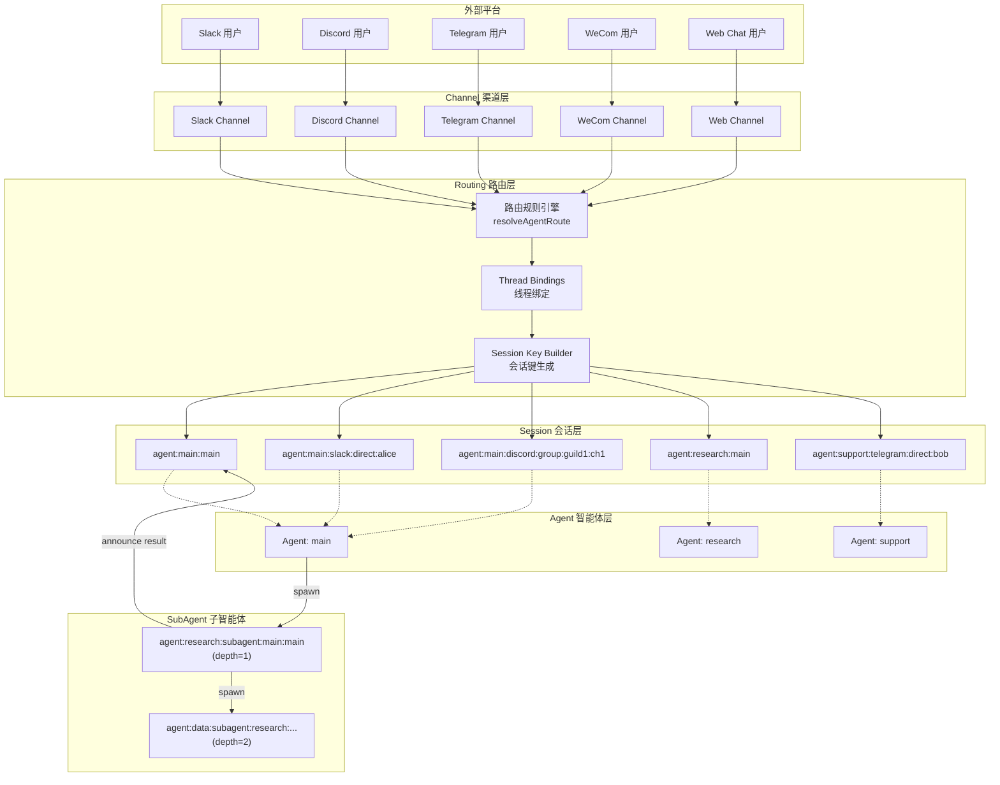
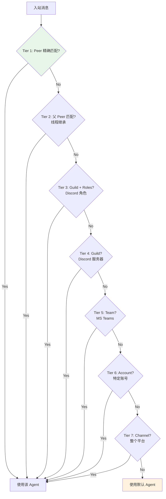
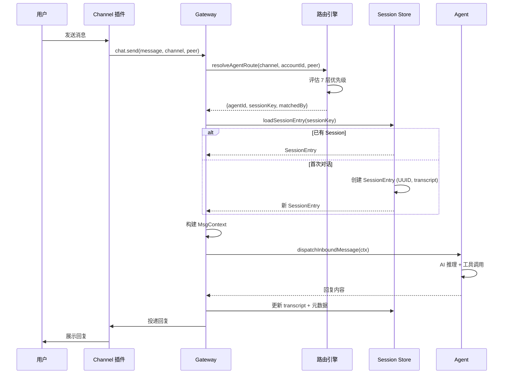
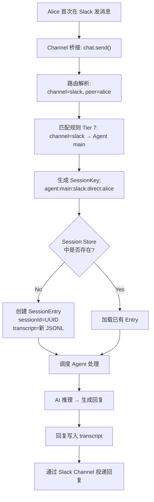
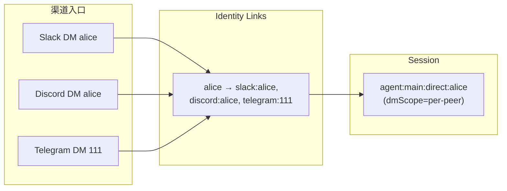
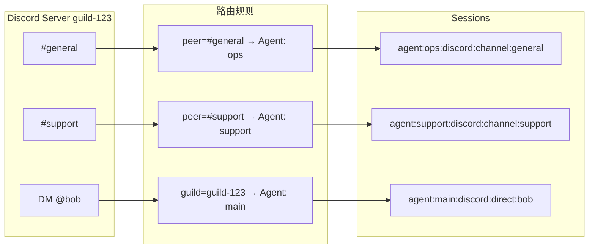
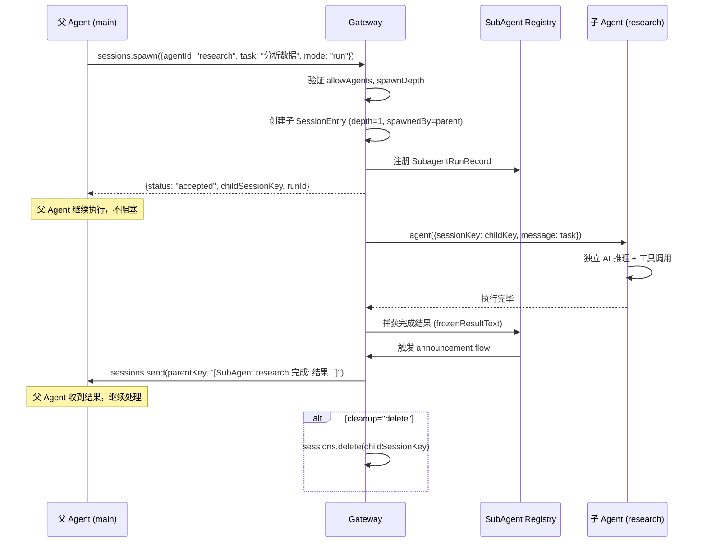
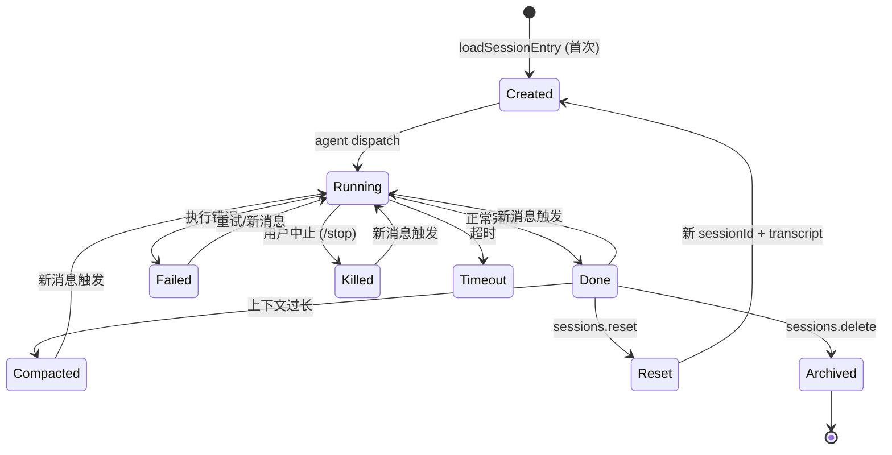
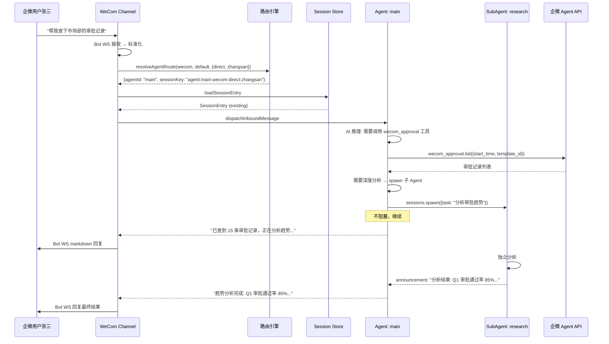
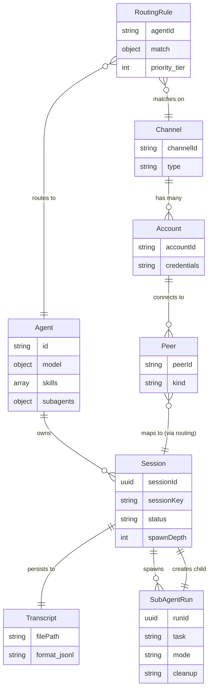

# OpenClaw 渠道-路由-Agent-Session 架构全景图

> [!abstract] 概述
> 本文档深度剖析 OpenClaw Gateway 中 **Channel（渠道）、Routing（路由规则）、Agent（智能体）、SubAgent（子智能体）、Session（会话）** 五大核心概念之间的关系、数据流和生命周期。基于源码深度分析。

---

## 一、核心概念关系图



---

## 二、五大核心概念定义

### 2.1 Channel（渠道）

> [!info] 定义
> Channel 是连接外部消息平台与 Gateway 的桥梁。每个 Channel 插件负责协议适配、消息收发和身份认证。

| 属性        | 说明                    | 示例                               |
| :---------- | :---------------------- | :--------------------------------- |
| `channelId` | 平台标识（小写）        | `"slack"`, `"discord"`, `"wecom"`  |
| `accountId` | 该平台上的 Bot/服务账号 | `"default"`, `"support-team"`      |
| `peerId`    | 对话方标识（用户/群组） | `"U123456"`, `"C789012"`           |
| `peerKind`  | 对话类型                | `"direct"`, `"group"`, `"channel"` |

**每个 Channel 可以有多个 Account**，每个 Account 独立管理凭证和连接状态。

### 2.2 Routing Rule（路由规则）

> [!info] 定义
> 路由规则决定一条入站消息应该交给哪个 Agent 处理。规则按优先级层级评估，首个匹配的规则生效。

```typescript
type AgentRouteBinding = {
  type?: "route";
  agentId: string; // 目标 Agent
  comment?: string;
  match: {
    channel: string; // 必填：平台标识
    accountId?: string; // 可选："*" 表示所有账号
    peer?: {
      kind: "direct" | "group" | "channel";
      id: string;
    };
    guildId?: string; // Discord 服务器
    teamId?: string; // Teams 团队
    roles?: string[]; // Discord 角色 (ANY 匹配)
  };
};
```

### 2.3 Agent（智能体）

> [!info] 定义
> Agent 是一个独立配置的 AI 实体，有自己的模型、工具、技能和行为设定。一个 Gateway 可运行多个 Agent。

```typescript
type AgentConfig = {
  id: string; // 唯一标识（"main", "research", "support"）
  default?: boolean; // 是否为默认 Agent
  model?: AgentModelConfig; // 主模型 + fallback
  skills?: string[]; // 技能白名单
  tools?: AgentToolsConfig; // 工具配置
  subagents?: {
    allowAgents?: string[]; // 可 spawn 的子 Agent
    model?: AgentModelConfig;
  };
  // ...identity, sandbox, workspace, heartbeat 等
};
```

**Agent 与 Session 的关系：1:N** — 每个 Agent 可拥有多个 Session。

### 2.4 Session（会话）

> [!info] 定义
> Session 是 Agent 与特定对话方之间的持久上下文容器。包含完整的对话记录（transcript）、运行状态、模型配置。

| 字段         | 说明                                                           |
| :----------- | :------------------------------------------------------------- |
| `sessionId`  | UUID，不可变的会话标识                                         |
| `sessionKey` | 层级路由键，格式 `agent:{agentId}:{scope}`                     |
| `status`     | `"running"` / `"done"` / `"failed"` / `"killed"` / `"timeout"` |
| `channel`    | 来源渠道                                                       |
| `chatType`   | `"direct"` / `"group"`                                         |
| `spawnedBy`  | 父 Session Key（若为 SubAgent 创建）                           |
| `spawnDepth` | 嵌套深度（0=主Agent, 1=子Agent, 2=孙Agent...）                 |

### 2.5 SubAgent（子智能体）

> [!info] 定义
> SubAgent 是由父 Agent 异步 spawn 的独立 Agent 实例，拥有独立 Session，通过 announcement 机制向父 Agent 回报结果。**不是嵌套函数调用，而是并行的 peer 执行**。

---

## 三、路由规则评估层级

> [!important] 评估顺序
> 从最精确到最宽泛，**首个匹配的层级生效**，同层级内按配置文件中的顺序。



**默认 Agent 选择优先级：**

1. 标记 `default: true` 的 Agent
2. 配置列表中的第一个 Agent
3. 内置 `"main"` Agent

---

## 四、Session Key 生成规则

Session Key 决定了消息如何映射到具体的会话存储。

### 4.1 格式

```
agent:{agentId}:{sessionScope}
```

### 4.2 Scope 变体

| Scope                         | 格式                                               | 说明              |
| :---------------------------- | :------------------------------------------------- | :---------------- |
| 主会话                        | `agent:main:main`                                  | Agent 的默认会话  |
| DM (per-peer)                 | `agent:main:direct:{peerId}`                       | 按对话方隔离      |
| DM (per-channel-peer)         | `agent:main:{channel}:direct:{peerId}`             | 按渠道+对话方隔离 |
| DM (per-account-channel-peer) | `agent:main:{channel}:{accountId}:direct:{peerId}` | 最细粒度          |
| 群组                          | `agent:main:{channel}:group:{groupId}`             | 群组会话          |
| 线程                          | `agent:main:main:thread:{threadId}`                | 主会话下的线程    |
| SubAgent                      | `agent:research:subagent:main:main`                | 子 Agent 会话     |

### 4.3 DM Scope 配置

> [!tip] `session.dmScope` 控制 DM 的隔离粒度

| dmScope 值                   | 效果                   | Session Key 示例                      |
| :--------------------------- | :--------------------- | :------------------------------------ |
| `"main"`                     | 所有 DM 共享主会话     | `agent:main:main`                     |
| `"per-peer"`                 | 每人独立（跨渠道合并） | `agent:main:direct:alice`             |
| `"per-channel-peer"`         | 每渠道每人独立         | `agent:main:slack:direct:alice`       |
| `"per-account-channel-peer"` | 账号+渠道+人           | `agent:main:slack:team1:direct:alice` |

### 4.4 Identity Links（身份合并）

支持跨渠道身份合并：

```yaml
identityLinks:
  alice:
    - "telegram:111"
    - "discord:222"
    - "slack:U333"
```

当 alice 从任何渠道发消息，都映射到同一个 canonical peerId `"alice"`，实现跨渠道会话连续性。

---

## 五、完整消息调度管线

### 5.1 入站全流程



### 5.2 首次用户对话流程



---

## 六、多渠道会话汇聚与分离

### 6.1 汇聚场景（多渠道 → 同一 Session）



> [!note] 条件
> 需要配置 `identityLinks` 且 `dmScope="per-peer"`，三个渠道的消息共享同一个 Session 上下文。

### 6.2 分离场景（同渠道 → 不同 Agent/Session）



---

## 七、SubAgent 架构

### 7.1 Spawn 流程



### 7.2 嵌套层级

```
agent:main:main                          (depth=0, 父 Agent)
  └─ spawn → agent:research:subagent:main:main    (depth=1)
              └─ spawn → agent:data:subagent:...    (depth=2)
                          └─ spawn → ...              (depth=3, 最大默认 4)
```

### 7.3 Spawn 模式

| 模式        | 行为                                        | 适用场景           |
| :---------- | :------------------------------------------ | :----------------- |
| `"run"`     | 创建临时 Session → 执行 → 回报结果 → 删除   | 一次性任务         |
| `"session"` | 创建持久 Session → 执行 → 保留 → 可后续交互 | 需要追问的复杂任务 |

### 7.4 结果回报机制

- **Push-based**：子 Agent 完成后主动向父 Session 发送 announcement 消息
- **非轮询**：父 Agent 不需要 poll，等待消息送达即可
- **重试**：announcement 投递失败自动指数退避重试（1s → 2s → 4s，最多 3 次）
- **结果冻结**：`frozenResultText` 从子 Agent 的 transcript 末尾提取

---

## 八、Session 生命周期



### Session 持久化

| 存储层        | 路径                                                      | 内容                              |
| :------------ | :-------------------------------------------------------- | :-------------------------------- |
| Session Store | `~/.openclaw/agents/{agentId}/sessions.json`              | 所有 Session 元数据 (Key → Entry) |
| Transcript    | `~/.openclaw/agents/{agentId}/sessions/{sessionId}.jsonl` | 完整对话记录 (JSONL)              |
| Archive       | `.archive/`                                               | 重置/删除后的旧 transcript        |

### Transcript 格式 (JSONL)

```json
{"type":"session","version":"1.0","id":"550e8400-...","timestamp":1704067200}
{"role":"user","content":"分析这个 CSV","ts":1704067201}
{"role":"assistant","content":"我来看看...","ts":1704067205}
{"type":"tool","toolName":"bash","input":"head data.csv","output":"..."}
{"role":"assistant","content":"分析结果如下...","ts":1704067210}
```

---

## 九、Thread Binding（线程绑定）

> [!info] 用途
> 在支持线程的平台（Discord/Slack/Matrix），将特定线程绑定到特定 Agent 的 Session。

### 配置

```yaml
channels:
  discord:
    threadBindings:
      enabled: true
      idleHours: 24 # 空闲 24h 自动解绑
      maxAgeHours: 0 # 无最大存活时间
      spawnSubagentSessions: true
      spawnAcpSessions: true
```

### 继承逻辑

Thread 的路由首先检查自身绑定，无匹配则 **继承父对话的 Agent 绑定**（Tier 2: Parent Peer）。

---

## 十、端到端示例：WeCom Dual 模式全链路



---

## 十一、Gateway RPC 接口速查

### 路由管理

| 方法                    | 用途                 | 权限           |
| :---------------------- | :------------------- | :------------- |
| `deck.routing.list`     | 列出所有路由规则     | operator.read  |
| `deck.routing.add`      | 添加规则（冲突检测） | operator.admin |
| `deck.routing.remove`   | 移除规则             | operator.admin |
| `deck.routing.validate` | 预检规则             | operator.read  |
| `deck.routing.simulate` | 模拟路由决策         | operator.read  |

### Session 管理

| 方法                          | 用途                               |
| :---------------------------- | :--------------------------------- |
| `sessions.create`             | 创建会话                           |
| `sessions.send`               | 发送消息                           |
| `sessions.list`               | 列出会话（支持筛选/搜索）          |
| `sessions.get`                | 获取对话记录                       |
| `sessions.patch`              | 更新元数据（label/model/thinking） |
| `sessions.reset`              | 重置会话（新 sessionId）           |
| `sessions.compact`            | 压缩上下文                         |
| `sessions.abort`              | 中止运行                           |
| `sessions.delete`             | 删除会话                           |
| `sessions.messages.subscribe` | 实时消息订阅                       |

### Agent 管理

| 方法                 | 用途                      |
| :------------------- | :------------------------ |
| `agent`              | 向 Agent 发消息并触发运行 |
| `agent.identity.get` | 获取 Agent 身份信息       |
| `agent.wait`         | 等待运行完成              |

---

## 十二、总结：数据模型关系



> [!quote] 一句话总结
> **Channel 接消息 → Routing 选 Agent → Session 存上下文 → Agent 做推理 → SubAgent 做分工 → Channel 送回复。** 五个概念各司其职，通过 SessionKey 这根主线串联起来。

---

_文档生成时间: 2026-04-06 | 基于 OpenClaw 源码深度分析（routing, agents, sessions, channels 模块）_
