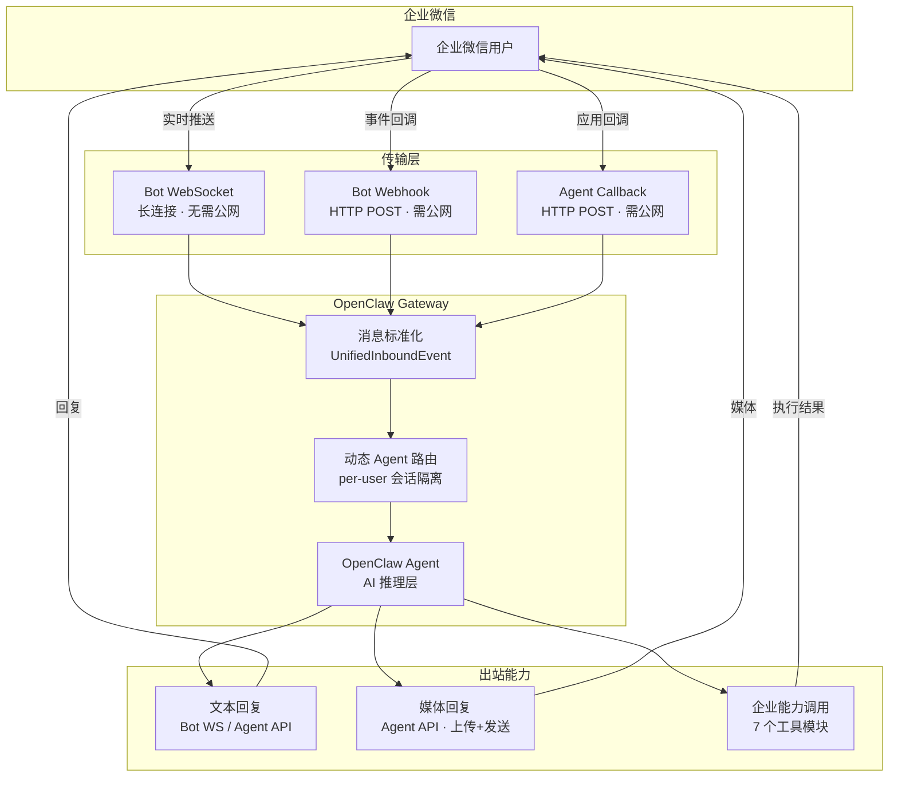
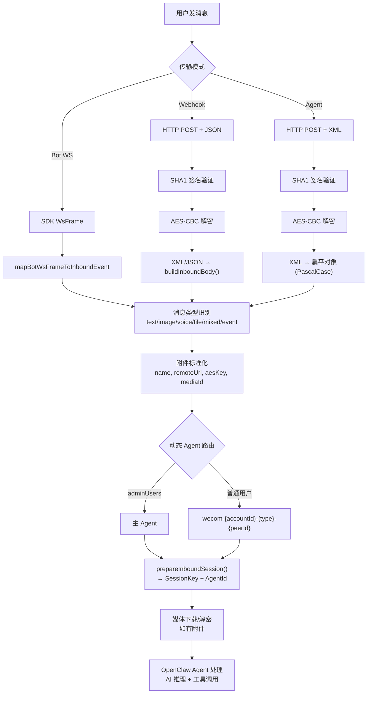
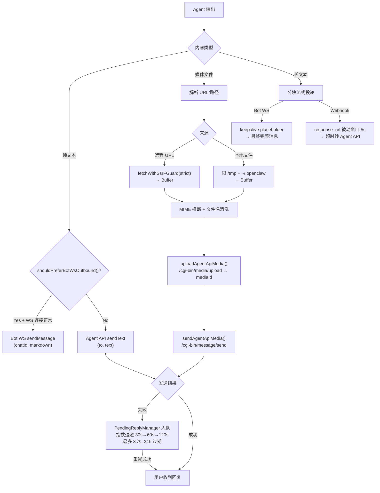
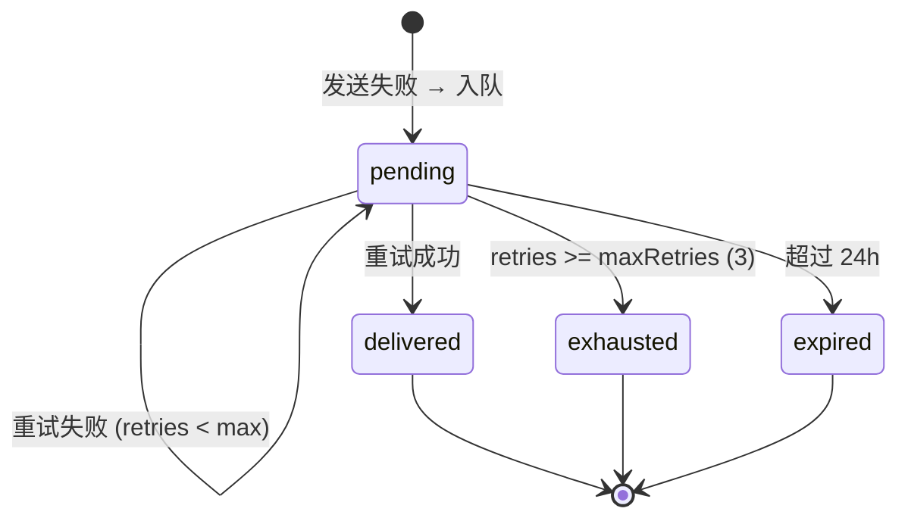

# WeCom × OpenClaw Gateway 能力全景图

> [!abstract] 概述
> 本文档完整梳理了 WeCom（企业微信）渠道插件与 OpenClaw Gateway 集成后的全部能力范围，包括消息收发、媒体处理、企业能力模块、传输模式、数据流、安全机制和场景覆盖。基于 `extensions/wecom/` 源码的深度分析。

---

## 一、架构总览



---

## 二、消息收发能力矩阵

### 入站（用户 → Bot）

| 消息类型          | Bot WS | Bot Webhook |  Agent Callback   |
| :---------------- | :----: | :---------: | :---------------: |
| 文本 text         |   ✅   |     ✅      |        ✅         |
| 图片 image        |   ✅   |     ✅      |   ✅ (MediaId)    |
| 语音 voice        |   ✅   |     ✅      | ✅ (含语音转文字) |
| 视频 video        |   —    |      —      |   ✅ (MediaId)    |
| 文件 file         |   ✅   |     ✅      |   ✅ (MediaId)    |
| 位置 location     |   —    |      —      |        ✅         |
| 链接 link         |   —    |      —      |        ✅         |
| 混合 mixed (图文) |   ✅   |     ✅      |         —         |
| 引用回复 quote    |   ✅   |     ✅      |         —         |
| 事件 event        |   ✅   |     ✅      |        ✅         |
| 流式刷新 stream   |   —    |     ✅      |         —         |

### 出站（Bot → 用户）

| 消息类型               | Bot WS |        Agent API         |
| :--------------------- | :----: | :----------------------: |
| 纯文本 text            |   ✅   |            ✅            |
| Markdown               |   ✅   |            —             |
| 图片 image             |   —    |       ✅ (需上传)        |
| 语音 voice             |   —    |       ✅ (需上传)        |
| 视频 video             |   —    | ✅ (需上传 + title/desc) |
| 文件 file              |   —    |       ✅ (需上传)        |
| 模板卡片 template_card |   —    |            ✅            |
| ==主动推送==           |   —    |            ✅            |
| ==群发广播==           |   —    |    ✅ (toParty/toTag)    |

> [!important] 核心结论
> Bot WS 只能回复 **文本/Markdown**，媒体收发和主动推送 **必须走 Agent API**。

---

## 三、支持的文件格式

| 类别   | 格式                                                                                                      |
| :----- | :-------------------------------------------------------------------------------------------------------- |
| 图片   | `jpg` `jpeg` `png` `gif` `webp` `bmp`                                                                     |
| 音频   | `mp3` `wav` `amr` `m4a` `ogg`                                                                             |
| 视频   | `mp4` `mov`                                                                                               |
| 文档   | `pdf` `doc` `docx` `xls` `xlsx` `ppt` `pptx` `txt` `csv` `tsv` `md` `json` `xml` `yaml` `yml` `rtf` `odt` |
| 压缩包 | `zip` `rar` `7z` `tar` `gz` `tgz`                                                                         |

> [!note] 上传流程
> 本地文件/远程 URL → SSRF 安全检查 → MIME 推断 → `POST /cgi-bin/media/upload` → 拿到 mediaId → 作为消息发送

> [!warning] 限制
>
> - 文本最大 **20KB** (`TEXT_MAX_BYTES: 20_480`)
> - 请求体最大 **1MB** (`MAX_REQUEST_BODY_SIZE`)
> - 媒体下载超时 **30s**
> - 每条消息分块上限 **2,048 bytes**

---

## 四、七大企业能力模块

> [!tip] 调用方式
> 所有模块通过 Agent API（需 `access_token`）调用，以 **AI 工具** 形式暴露给 Agent。用户可通过自然语言触发。

### 4.1 审批 `wecom_approval`

| 操作           | 说明                                                   | 典型场景                      |
| :------------- | :----------------------------------------------------- | :---------------------------- |
| `submit`       | 发起审批（creator, template_id, approver, apply_data） | "帮我发起一个请假审批"        |
| `list`         | 查询审批列表（时间范围、模板筛选、分页）               | "查看本周的审批记录"          |
| `get_detail`   | 获取单个审批详情（sp_no）                              | "查看审批单 202604001 的状态" |
| `get_template` | 获取审批模板结构                                       | "有哪些审批模板可用"          |

### 4.2 日历 `wecom_calendar`

| 操作                                | 说明           |
| :---------------------------------- | :------------- |
| `calendar_create/update/get/delete` | 日历 CRUD      |
| `schedule_create/update/get/delete` | 日程 CRUD      |
| `schedule_add/del_attendees`        | 管理参会人     |
| `schedule_get_by_calendar`          | 按日历查日程   |
| `schedule_get_system_calid`         | 获取系统日历   |
| `schedule_respond/sync`             | 日程回复与同步 |

> 共 **12 个日程 API** + 4 个日历 API

### 4.3 通讯录 `wecom_contact`

| 操作               | 说明                                    |
| :----------------- | :-------------------------------------- |
| `get_member`       | 查询员工详情（userid → 姓名/部门/职位） |
| `list_members`     | 部门成员列表（简略/详细模式）           |
| `list_departments` | 部门列表（可按父级筛选）                |
| `get_department`   | 单个部门详情                            |
| `list_tag_members` | 标签成员列表                            |
| `search`           | 通讯录搜索（部门+关键词）               |

> [!caution] 敏感字段限制
> 2022-06-20 后，`avatar`、`mobile`、`email` 等字段受企微隐私策略限制。

### 4.4 文档 `wecom_doc`

> [!example] 最大模块 — 30+ 操作

- **核心**: create, rename, copy, get_info, share, delete
- **权限**: get_auth, diagnose_auth, set_join_rule, set_member_auth, grant_access, add_collaborators
- **内容**: get_content, update_content, set_safety_setting
- **表单**: create_collect, modify_collect, get_form_info, get_form_answer, get_form_statistic
- **表格 Sheet**: get_sheet_properties, edit_sheet_data, get_sheet_data, modify_sheet_properties
- **智能表格 SmartSheet**: 17 个操作（add/update/delete records, sheets, views, fields, groups）

### 4.5 外部联系人 `wecom_external_contact`

| 操作               | 说明                        |
| :----------------- | :-------------------------- |
| `get`              | 获取外部联系人详情          |
| `list`             | 列出员工的外部联系人        |
| `list_groups`      | 查询客户群（状态/群主筛选） |
| `get_group_detail` | 单个客户群详情              |

### 4.6 会议 `wecom_meeting`

| 操作       | 说明                                       |
| :--------- | :----------------------------------------- |
| `create`   | 创建会议（标题、时间、参会人、密码、设置） |
| `update`   | 修改会议信息                               |
| `cancel`   | 取消会议                                   |
| `get_info` | 获取会议详情                               |

### 4.7 待办 `wecom_todo`

| 操作            | 说明                                    |
| :-------------- | :-------------------------------------- |
| `create`        | 创建待办（标题、创建者、链接、指派人）  |
| `update_status` | 标记完成 (status=1) 或未完成 (status=0) |
| `get`           | 获取单条待办详情                        |

> [!info] MCP 扩展
> 额外提供 `wecom_mcp` 工具，通过 MCP 协议支持动态企业能力扩展。

---

## 五、四种传输模式对比

| 能力维度         |  Bot WS   |   Bot Webhook   | Agent Callback  | ==Dual (WS+Agent)== |
| :--------------- | :-------: | :-------------: | :-------------: | :-----------------: |
| 需要公网域名     |    ❌     |       ✅        |       ✅        |   ✅ (Agent 部分)   |
| 实时对话         | ✅ 长连接 | ✅ 被动 5s 窗口 | ✅ 被动 5s 窗口 |         ✅          |
| 文本回复         |    ✅     |       ✅        |       ✅        |         ✅          |
| Markdown         |    ✅     |       ✅        |        —        |         ✅          |
| 媒体收发         |    ❌     |       ❌        |       ✅        |         ✅          |
| 主动推送         |    ❌     |       ❌        |       ✅        |         ✅          |
| 企业工具 (7模块) |    ❌     |       ❌        |       ✅        |         ✅          |
| 群发广播         |    ❌     |       ❌        |       ✅        |         ✅          |
| 可靠重试         |     —     |        —        |       ✅        |         ✅          |
| 配置复杂度       |    低     |       中        |       高        |        最高         |

> [!tip] 推荐
> **开发测试**用 Bot WS（无需公网），**生产环境**用 Dual 模式（全能力覆盖）。

---

## 六、完整数据流

### 6.1 入站流（用户发消息给 Bot）



### 6.2 出站流（Bot 回复用户）



---

## 七、可靠投递机制

### PendingReplyManager



| 参数             | 默认值                 | 说明             |
| :--------------- | :--------------------- | :--------------- |
| `maxRetries`     | 3                      | 最大重试次数     |
| `retryBackoffMs` | 30,000ms               | 初始退避时间     |
| 退避公式         | $30s \times 2^{(n-1)}$ | 30s → 60s → 120s |
| `expireMs`       | 86,400,000ms           | 24 小时过期      |
| `sweepInterval`  | 15s                    | 扫描间隔         |

---

## 八、动态 Agent 路由

> [!info] 会话隔离
> 每个用户/群组自动获得独立的 Agent ID，实现完全的会话隔离。

**配置项**: `channels.wecom.dynamicAgents`

| 字段            | 类型     | 说明                             |
| :-------------- | :------- | :------------------------------- |
| `enabled`       | boolean  | 是否启用动态路由                 |
| `dmCreateAgent` | boolean  | 为 DM 创建独立 Agent             |
| `groupEnabled`  | boolean  | 为群组创建独立 Agent             |
| `adminUsers`    | string[] | 管理员绕过动态路由，使用主 Agent |

**ID 生成格式**: `wecom-{accountId}-{dm|group}-{sanitizedPeerId}`

---

## 九、安全机制

| 层级       | 措施            | 详情                                               |
| :--------- | :-------------- | :------------------------------------------------- |
| 网络       | SSRF 双阶段防护 | DNS pinning + IP 黑名单，strict 模式               |
| 消息加解密 | AES-256-CBC     | EncodingAESKey (Base64 → 32 bytes)，IV = key[0:16] |
| 签名验证   | SHA1            | `SHA1(sort(token, timestamp, nonce, encrypt_msg))` |
| Token 管理 | 缓存 + 提前刷新 | 60s 提前刷新 + 并发去重                            |
| 文件访问   | 白名单路径      | 仅允许 `/tmp` 和 `~/.openclaw`                     |
| 敏感数据   | 不记录日志      | corpSecret 不出现在日志中                          |

---

## 十、关键 API 端点与常量

### 企微 API

| 用途       | 端点                                               |
| :--------- | :------------------------------------------------- |
| 获取 Token | `https://qyapi.weixin.qq.com/cgi-bin/gettoken`     |
| 发送消息   | `https://qyapi.weixin.qq.com/cgi-bin/message/send` |
| 上传媒体   | `https://qyapi.weixin.qq.com/cgi-bin/media/upload` |
| 下载媒体   | `https://qyapi.weixin.qq.com/cgi-bin/media/get`    |

### Webhook 路径

| 路径                       | 用途                |
| :------------------------- | :------------------ |
| `/wecom/bot`               | 默认 Bot webhook    |
| `/wecom/bot/{accountId}`   | 多账号 Bot          |
| `/wecom/agent`             | 默认 Agent callback |
| `/wecom/agent/{accountId}` | 多账号 Agent        |

### 超时与窗口

| 参数             | 值         | 说明                 |
| :--------------- | :--------- | :------------------- |
| 请求超时         | 15s        | API 调用默认         |
| 媒体下载         | 30s        | 远程 URL 下载        |
| Token 刷新       | 60s buffer | 提前刷新避免过期     |
| Webhook 被动窗口 | 5s         | 回调内回复           |
| WS Stream        | 6 min      | 流式回复最大时长     |
| WS 心跳          | 30s        | 保活间隔             |
| Response URL TTL | 1h         | Webhook 主动回复链接 |

---

## 十一、场景覆盖矩阵

| 场景                         | Bot WS | Dual 模式 |
| :--------------------------- | :----: | :-------: |
| 日常对话问答                 |   ✅   |    ✅     |
| 代码/技术问题解答 (Markdown) |   ✅   |    ✅     |
| 接收图片/文件并分析          |   ❌   |    ✅     |
| 发送图片/文档给用户          |   ❌   |    ✅     |
| 定时主动提醒                 |   ❌   |    ✅     |
| 审批流自动化                 |   ❌   |    ✅     |
| 会议管理                     |   ❌   |    ✅     |
| 日程安排                     |   ❌   |    ✅     |
| 通讯录查询                   |   ❌   |    ✅     |
| 文档协作 (30+ API)           |   ❌   |    ✅     |
| 客户关系管理                 |   ❌   |    ✅     |
| 待办任务管理                 |   ❌   |    ✅     |
| 群发通知/广播                |   ❌   |    ✅     |
| 多用户会话隔离               |   ✅   |    ✅     |
| 可靠投递 (自动重试)          |   —    |    ✅     |

> [!quote] 一句话总结
> Bot WS 是 ==能聊天的文本机器人==，Dual 模式是 ==能操控整个企业微信平台的 AI 助手==。

---

## 十二、配置速查

### Bot WS 最小配置

```yaml
channels:
  wecom:
    bot:
      primaryTransport: ws
      ws:
        botId: "your-bot-id"
        secret: "your-bot-secret"
      dm:
        policy: pairing
```

### Dual 模式完整配置

```yaml
channels:
  wecom:
    bot:
      primaryTransport: ws
      ws:
        botId: "your-bot-id"
        secret: "your-bot-secret"
      dm:
        policy: pairing
    agent:
      corpId: "ww1234567890"
      agentId: "1000001"
      agentSecret: "your-corp-secret"
      token: "callback-verification-token"
      encodingAESKey: "43-char-aes-key"
      dm:
        policy: pairing
```

---

_文档生成时间: 2026-04-06 | 基于 `extensions/wecom/` 源码深度分析_
