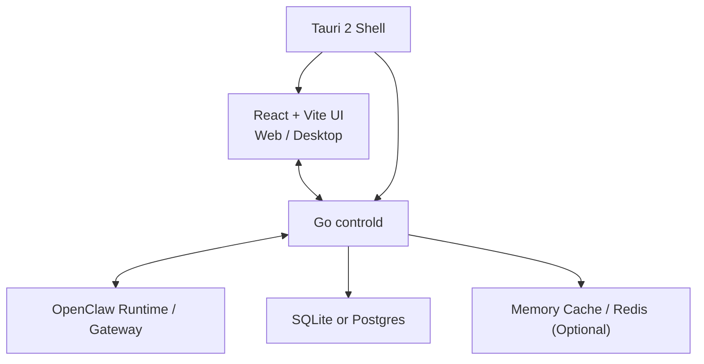
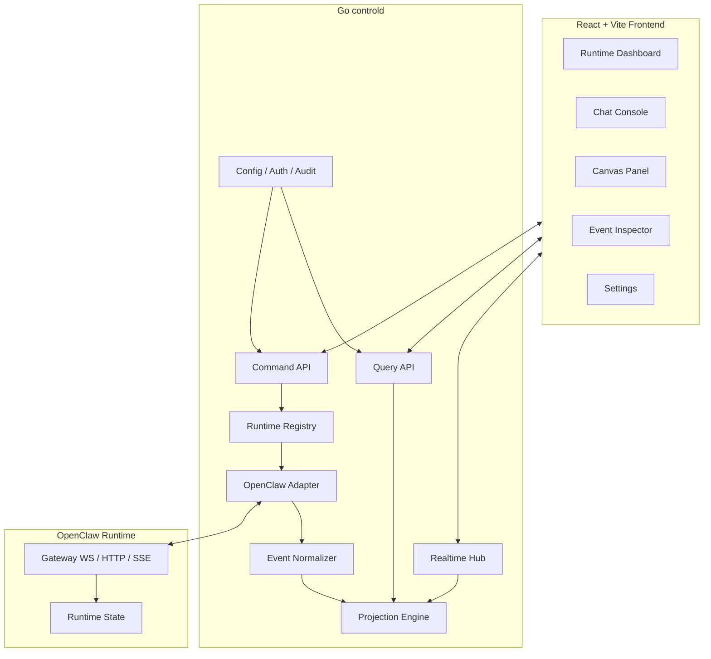

# OpenClaw Control Plane Architecture Spec

## Status

- Draft
- Date: 2026-04-21
- Scope: `openclaw-deck` target-state architecture

## Summary

This document defines the target architecture for an OpenClaw control-plane
application built with:

- Go for the control backend and runtime adapter
- React + Vite for the operator UI
- Tauri 2 as the desktop packaging layer

The product is not a replacement for OpenClaw runtime. It is a management and
interaction surface for one or more OpenClaw runtimes. In the first phase, the
system may manage a single runtime, but all contracts should preserve a
`runtimeId` field so the platform can grow into a multi-runtime enterprise
control plane later.

This target state intentionally separates:

- the OpenClaw runtime protocol
- the control-plane platform protocol
- the UI-facing query and realtime models

The frontend must not consume raw OpenClaw runtime events directly.

## Goals

- Provide a stable control UI for operating an OpenClaw runtime
- Support complex chat rendering, including streaming and tool events
- Support canvas-related rendering and future rich agent surfaces
- Support local desktop installation on Windows, macOS, and Linux
- Support both local-runtime and remote-runtime management modes
- Keep the control plane evolvable toward a future enterprise agent platform

## Non-Goals

- Re-implement OpenClaw runtime behavior in the control plane
- Expose raw gateway protocol details directly to the React frontend
- Split into microservices in the first phase
- Optimize for browser-only delivery at the expense of desktop packaging

## Product Definition

The control plane is an operator-facing application that can:

- connect to one or more OpenClaw runtimes
- inspect runtime health and capabilities
- browse sessions, agents, channels, and logs
- send chat commands and stream responses
- render runtime-derived tool events and canvas updates
- manage runtime-facing configuration and operational actions

The control plane is a platform boundary. It should translate runtime-native
events and methods into UI-native and platform-native contracts.

## Architecture Principles

1. The frontend talks only to the control-plane backend.
2. The control-plane backend is responsible for runtime protocol adaptation.
3. Runtime command, query, and realtime concerns stay logically separate.
4. The UI consumes stable projections, not raw protocol frames.
5. The first delivery unit is a modular monolith, not a distributed system.
6. Contracts are versioned from day one, even for the single-runtime phase.

## System Context



## High-Level Internal Architecture



## Deployment Modes

### 1. Web Mode

- `controld` runs as a standalone Go service
- React + Vite assets are served by Go or by a CDN/reverse proxy
- `controld` connects to a local or remote OpenClaw runtime

### 2. Desktop Mode

- Tauri packages the React frontend
- Tauri launches a local `controld` sidecar
- `controld` may connect to:
  - a runtime on the same machine
  - a runtime on another machine

### 3. Future Enterprise Mode

- multiple `runtimeId` values
- shared identity, RBAC, audit, tenancy
- central platform backend still owns the UI-facing contracts

## Backend Responsibilities

The Go backend is both the platform backend and the runtime adapter.

### Required Modules

#### `runtime/openclaw`

Responsibilities:

- connect to OpenClaw gateway
- handle connection lifecycle
- negotiate auth and capabilities
- consume runtime WS / SSE / HTTP frames
- execute runtime commands

This module owns runtime-specific transport details.

#### `runtime/events`

Responsibilities:

- decode raw runtime frames
- map runtime-native events into control-plane canonical events
- enforce schema versioning
- preserve runtime sequence metadata where available

This module is the protocol translation boundary.

#### `runtime/projection`

Responsibilities:

- maintain queryable state derived from canonical events
- aggregate chat timeline state
- aggregate tool execution state
- aggregate canvas state
- maintain runtime and session summaries

This module exists so the frontend can query stable state instead of
reconstructing it from raw event streams.

#### `runtime/registry`

Responsibilities:

- register known runtimes
- resolve connection profiles
- track runtime liveness
- expose runtime capabilities and versions

#### `api/http`

Responsibilities:

- expose query endpoints
- expose command endpoints
- expose settings endpoints
- return stable platform errors

#### `api/ws`

Responsibilities:

- push canonical realtime events to the frontend
- support reconnect and replay
- scope streams by runtime, session, and panel needs

#### `platform/auth`

Responsibilities:

- local desktop auth model in phase one
- future operator identity and RBAC
- request scoping, audit metadata, and tenant context

## Frontend Responsibilities

The React frontend is the only UI client.

### Core UI Domains

#### Runtime Dashboard

- runtime connectivity
- runtime capabilities
- channel health
- heartbeat and health checks
- version and compatibility display

#### Chat Console

- session list
- timeline rendering
- streaming token or block updates
- tool event rendering
- chat input and abort controls

#### Canvas Panel

- canvas initialization
- patch application
- reset or resync behavior
- runtime visual outputs

#### Event Inspector

- operator debugging
- raw canonical event inspection
- optional raw runtime frame inspection for engineering mode

#### Settings

- runtime endpoint
- auth token or local trust settings
- control-plane preferences
- future operator settings and environment configuration

## Why the Frontend Must Not Connect Directly to OpenClaw Runtime

Direct frontend-to-runtime access creates the wrong long-term dependency:

- runtime protocol details leak into the UI
- auth and access boundaries become harder to control
- desktop and web modes diverge
- event normalization gets duplicated in the browser
- future enterprise features must unwind early shortcuts

The control-plane backend should be the only runtime-facing adapter layer.

## Contract Strategy

The system should define its own platform contract, even when the runtime
already exposes useful methods and events.

### Contract Layers

1. OpenClaw runtime contract
2. Control-plane canonical event contract
3. Control-plane command and query contract
4. UI view-model contract

The purpose of the intermediate layers is to absorb runtime evolution without
forcing UI-wide rewrites.

## API Conventions

### Base Path

- REST base path: `/api/v1`
- Realtime base path: `/api/v1/ws`

### Naming

- JSON fields: `camelCase`
- database columns: `snake_case`
- resource names: singular in schema, plural in collection endpoints

### Time

- timestamps must be UTC ISO-8601 strings

### IDs

- use UUIDv7 or another sortable unique identifier
- every resource exposed to the UI should have a stable identifier

### Runtime Scope

- every runtime-scoped response and event must include `runtimeId`
- this remains true even in the single-runtime phase

### Error Envelope

```json
{
  "error": {
    "code": "RUNTIME_UNAVAILABLE",
    "message": "Runtime connection is unavailable.",
    "details": null
  },
  "requestId": "req_01J..."
}
```

### Command Response Model

Commands should return acknowledgment, not final UI state.

```json
{
  "accepted": true,
  "requestId": "req_01J...",
  "commandId": "cmd_01J...",
  "submittedAt": "2026-04-21T08:00:00Z"
}
```

The UI should derive post-command state from events and projections.

### Idempotency

Mutation endpoints should support an `idempotencyKey`.

This is especially important for:

- chat send
- retry actions
- session control commands
- runtime operation commands

## Realtime Event Conventions

### Canonical Event Envelope

```json
{
  "schemaVersion": "v1",
  "eventId": "evt_01J...",
  "seq": 1287,
  "type": "chat.message.delta",
  "runtimeId": "rt_local",
  "sessionId": "sess_01J...",
  "occurredAt": "2026-04-21T08:00:00Z",
  "connectionEpoch": "epoch_01J...",
  "payload": {}
}
```

### Event Requirements

- `schemaVersion` is required
- `eventId` is required
- `type` is required
- `occurredAt` is required
- `runtimeId` is required when the event comes from a runtime
- `seq` should be present when ordering is meaningful

### Canonical Event Families

- `connection.*`
- `runtime.*`
- `session.*`
- `chat.message.*`
- `chat.run.*`
- `tool.*`
- `canvas.*`
- `log.*`
- `alert.*`

### Recommended Event Meanings

#### `connection.*`

- connection established
- reconnecting
- auth rejected
- transport failure

#### `runtime.*`

- runtime registered
- runtime online or offline
- runtime capability changed
- runtime health degraded

#### `session.*`

- session created
- session updated
- session closed
- session metadata changed

#### `chat.message.*`

- message started
- message delta
- message completed
- message failed

#### `chat.run.*`

- run started
- run status changed
- run aborted
- run finished

#### `tool.*`

- tool call started
- tool output appended
- tool completed
- tool failed

#### `canvas.*`

- canvas initialized
- patch emitted
- reset requested
- snapshot available

## Query Model Strategy

The backend should expose stable read models for UI panels.

### Query Models to Materialize Early

- runtime summary
- runtime connection state
- runtime capability summary
- session list
- session timeline snapshot
- active run summary
- tool execution summary
- canvas state summary

### Important Rule

The frontend should not reconstruct these views by replaying all events on every
page load. It may incrementally update them from live events, but first-load
state should come from projection endpoints.

## Chat and Timeline Design

The chat console is one of the most complex parts of the product. It should use
three distinct state layers:

1. timeline state
2. run state
3. rendering state

### Timeline State

Represents durable messages and their stable ordering.

### Run State

Represents in-flight execution, tool usage, streaming progress, and abortability.

### Rendering State

Represents client-only concerns:

- selection
- expansion
- temporary grouping
- viewport position

Do not mix rendering-only concerns into the canonical server event model.

## Canvas Design

Canvas must be modeled as a runtime-driven stream, not a one-off blob.

Recommended structure:

- `canvas.session`
- `canvas.surface`
- `canvas.patch`
- `canvas.snapshot`

The backend should preserve enough metadata for:

- initial render
- incremental updates
- recovery after reconnect
- future persistence or export

## Storage Strategy

### Phase 1

Use SQLite when the deployment is local-first and single-operator.

Store:

- runtime profiles
- local settings
- audit records
- projection snapshots
- optional event checkpoints

### Phase 2

Move to Postgres when multi-user or enterprise concerns appear.

Store:

- users
- roles
- organizations
- runtime inventory
- audit logs
- durable projections

Redis remains optional for fan-out or transient stream assistance.

## Desktop Packaging Strategy

Tauri 2 is the preferred desktop shell.

### Tauri Responsibilities

- package the React frontend
- launch and supervise local `controld`
- store desktop-local preferences
- expose OS integration features when needed

### Tauri Should Not Own

- runtime protocol adaptation
- business logic
- canonical event mapping

Those responsibilities stay in Go.

## Repository Structure Recommendation

```text
dashboard/
  cmd/
    controld/
  internal/
    api/
      http/
      ws/
    platform/
      auth/
      audit/
      settings/
    runtime/
      openclaw/
      events/
      projection/
      registry/
  web/
    src/
      app/
      modules/
        runtime-dashboard/
        chat-console/
        canvas-panel/
        event-inspector/
        settings/
  desktop/
    src-tauri/
  docs/
    specs/
      2026-04-21-control-plane-architecture.md
      api-openapi.yaml
      events-asyncapi.yaml
      event-mapping.md
      timeline-projection.md
      capability-handshake.md
```

## Spec Artifacts to Maintain

### 1. Architecture Spec

This document captures system boundaries and design intent.

### 2. OpenAPI Spec

Defines:

- query endpoints
- command endpoints
- settings endpoints

### 3. AsyncAPI or Realtime Spec

Defines:

- websocket channels
- canonical event schemas
- replay behavior
- reconnect expectations

### 4. Event Mapping Spec

Defines:

- runtime event source
- canonical event output
- normalization and compatibility rules

### 5. Timeline Projection Spec

Defines:

- how timeline state is formed from canonical events
- how replay and recovery work

## Suggested MVP Scope

### Must Have

- connect to one runtime
- runtime health and status page
- session list
- chat console with streaming support
- event inspector
- settings page for runtime connection
- desktop packaging path

### Should Have

- tool event rendering
- basic canvas rendering
- runtime reconnect and recovery UX

### Later

- multiple runtimes
- operator identity and RBAC
- audit explorer
- multi-tenant platform features
- workflow orchestration

## Delivery Plan

### Milestone 1: Control Adapter Core

- implement Go runtime adapter
- establish canonical event model
- expose health, session list, and chat command/query APIs

### Milestone 2: Realtime UI Core

- build React shell with runtime dashboard and chat console
- add websocket subscription layer
- validate session and streaming behavior

### Milestone 3: Canvas and Inspector

- add event inspector
- add canvas projection and rendering path
- harden reconnect and replay

### Milestone 4: Desktop Packaging

- package with Tauri 2
- launch local `controld`
- validate local-runtime management flow

## Risks and Design Watchpoints

- OpenClaw runtime protocol may evolve quickly, so event mapping must be
  isolated and tested
- streaming behavior can create ordering bugs if command responses are treated
  as final state
- desktop and web modes can diverge if local-only assumptions leak into the
  backend design
- canvas state can become fragile without explicit replay and snapshot rules

## Open Questions

- Which runtime methods and events should be considered stable enough for direct
  adapter support in phase one?
- Should the first release persist canonical events, or only persist
  projections?
- Should desktop mode support launching and stopping a local OpenClaw runtime in
  phase one, or only connecting to an existing runtime?
- Which subset of tool events should be elevated into first-class UI elements?

## Decision

The recommended target-state stack for the OpenClaw control plane is:

- Go control backend with embedded runtime adapter responsibilities
- React + Vite frontend
- Tauri 2 desktop shell

This keeps the runtime-facing logic on the server side, keeps the UI contract
stable, and preserves a clear upgrade path from a single-runtime desktop control
surface to a broader enterprise agent platform.
